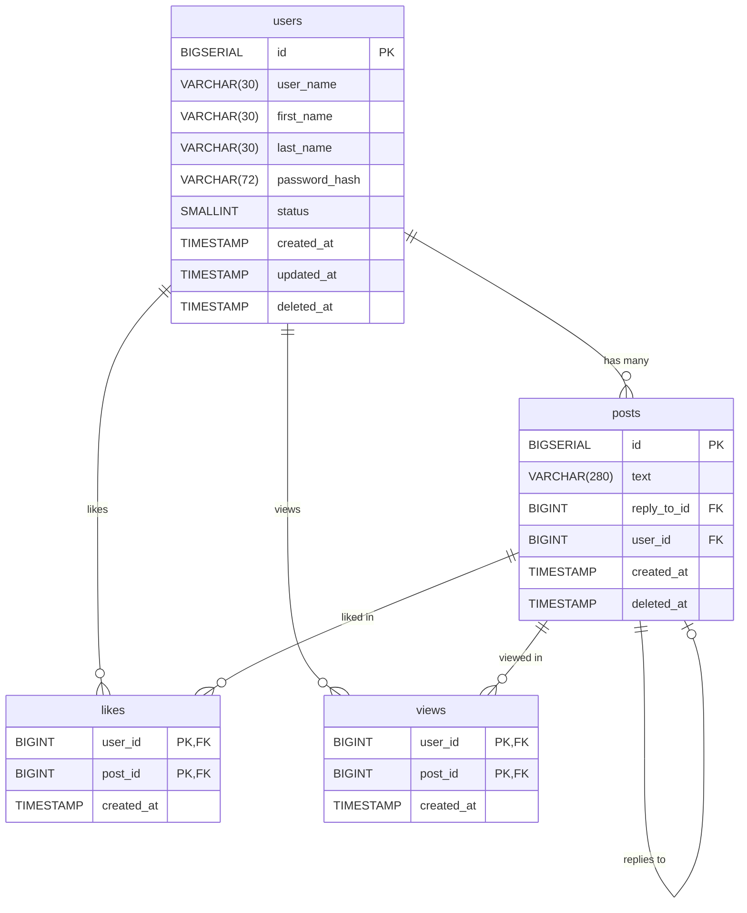

## Developing the Repository Layer of a Web Application

You need to manually create SQL tables that reflect the structure of the GopherTalk social network. Below are the tables, their fields, and the relationships between them.

1. **Table `users`** — stores user data.
2. **Table `posts`** — stores user posts. The `reply_to_id` field refers to another post if it's a reply.
3. **Table `likes`** — stores information about which users liked which posts.
4. **Table `views`** — stores information about which users viewed which posts.



### Requirements:

- Use the data types and constraints as described.
- Set up primary and foreign keys accordingly.
- Create a unique index on `user_name`, but only for users who are not deleted (`deleted_at IS NULL`).
- Make sure that the `status` field can only have values `0` or `1`.

> 💡 Tip: After creating the tables, verify the schema using an ER diagram to ensure the relationships are correct.

## Application Architecture: Controllers, Services, and Repositories

As an application grows, more business logic, validation, and database operations are added — and the code quickly turns into an unreadable mess.  
To prevent this, we use the principle of **separation of concerns** — where each component is responsible only for its specific task.

In small web applications, it's convenient to follow this architecture:

### 1. Controllers

A controller is the layer that handles an HTTP request, processes it, and returns a response. Here’s what typically happens:

- reading parameters from `req`,
- calling the appropriate service method,
- forming the response (`res.status().json(...)`).

A controller does **not** contain business logic or directly access the database — it simply **orchestrates the data flow**.  
Additionally, access control and request filtering are often handled at the controller level.

### 2. Services

A service is the layer that contains the core **business logic** of the application. It:

- processes data,
- checks conditions (e.g., "user already exists"),
- calls the repository to access the database.

A service knows nothing about `req` or `res` — it’s universal and can be reused in HTTP apps, CLI tools, or background scripts.

### 3. Repositories

A repository is the layer responsible for **data access**. This is where SQL queries usually live.  
The service says: “get me the user by id”, and the repository executes the SQL query and returns the result.

This approach allows you to:

- isolate database logic,
- write and run unit tests more easily,
- switch the data storage method (e.g., from PostgreSQL to MongoDB) with minimal changes.

### Advantages of this architecture:

- Code becomes **cleaner, clearer, and more maintainable**;
- Each layer can be **tested independently**;
- Teamwork is simplified — everyone focuses on their own area of responsibility;
- It’s easier to support and scale the application in the future.

According to the chosen architecture, we will build the development process as follows:  
first, we will implement the repository layer, then the service layer, and finally the controller layer.  
For each layer, you will be provided with unit tests to verify the correctness of your implementation.

## Developing the User Repository

At this stage, we will implement the **user repository** — the layer responsible for interacting with the database.  
This layer handles storing, retrieving, updating, and deleting user data, without involving any business logic or HTTP controllers.

The repository will include methods for:

- creating a new user,
- retrieving all users with pagination,
- finding a user by `id` and by `user_name`,
- updating user data,
- soft-deleting a user.

We will start with the simplest method — `createUser`, which inserts a new user into the `users` table.  
Then, we will implement the remaining methods and write unit tests to ensure everything works as expected.

In the src folder of the project, create a folder named repositories, and inside it, create a file called `userRepository.js`. Place the following code into that file:

```js
import { pool } from "../db/index.js";

export const UserRepository = {
  async createUser(dto) {
    const query = `
      INSERT INTO users (user_name, first_name, last_name, password_hash)
      VALUES ($1, $2, $3, $4)
      RETURNING id, user_name, password_hash, status;
    `;
    const values = [dto.user_name, dto.first_name, dto.last_name, dto.password_hash];
    const res = await pool.query(query, values);
    return res.rows[0];
  },
};
```

This code implements the createUser method in the UserRepository object, which is responsible for adding a new user to the database.

### Step-by-step Breakdown

- Importing the database connection:

  ```js
  import { pool } from "../db/index.js";
  ```

  This line imports the `pool` object, which represents a connection pool to the PostgreSQL database.  
  It is already configured in another module (`db/index.js`) and allows executing SQL queries.

- Exporting the `UserRepository` object:

  ```js
  export const UserRepository = { ... }
  ```

  This line exports the `UserRepository` object so that it can be used in other parts of the application.

- Defining the `createUser` method:

  ```js
  async createUser(dto) { ... }
  ```

  The `createUser` method is an asynchronous function that accepts a `dto` (data transfer object) containing the fields of the new user. In our case: `user_name`, `first_name`, `last_name`, `password_hash`.

- SQL INSERT query

  ```js
  const query = `
  INSERT INTO users (user_name, first_name, last_name, password_hash)
  VALUES ($1, $2, $3, $4)
  RETURNING id, user_name, password_hash, status;
  `;
  ```

  This SQL query inserts a new user into the `users` table. It uses placeholders `$1`, `$2`, `$3`, `$4` — these are positional parameters (used to prevent SQL injections). After the insertion, it immediately returns the new user's `id`, `user_name`, `password_hash`, and `status`.

  ::: details SQL Injections
  SQL injection is one of the most common types of database attacks. It occurs when user input is inserted directly into an SQL query without proper validation or escaping, allowing an attacker to alter the logic of the query.

  **Example of vulnerable code:**

  ```js
  const userInput = "' OR 1=1 --";
  const query = `SELECT * FROM users WHERE user_name = '${userInput}'`;
  ```

  A user provides the input `' OR 1=1 --`, and the code inserts it directly into the query.

  As a result, the final SQL query looks like:

  ```sql
  SELECT * FROM users WHERE user_name = '' OR 1=1 --';
  ```

  The query will:

  - `user_name = ''` — check if the username is empty;

  - `OR 1=1` — a logical expression that is always true, so the condition applies to all users;

  - `--` — begins an SQL comment; everything after it is ignored by the database;

  - `';` — this part is not executed because it is commented out.

  The query will return all users from the database, because `1=1` is always true.  
  If such a query is used for login, an attacker could log in without a password — because the query bypasses the intended logic.

  Using positional parameters solves this problem:

  ```js
  const query = "SELECT * FROM users WHERE user_name = $1";
  const values = [userInput];
  await pool.query(query, values);
  ```

  Instead of injecting the user input directly into the query string, we pass it as a separate value.  
  The PostgreSQL driver (`pg`) ensures safety by:

  - Escaping special characters,

  - Wrapping the value in quotes if necessary,

  - Ensuring that the input is treated as a plain string, not as SQL code.

  In other words, the driver safely separates SQL code from user-provided data, preventing malicious input from altering the logic of the query.

  Therefore, even a dangerous string like `' OR 1=1 --` will be passed as a simple value to the `user_name` field, not as executable SQL code.

  :::

- Preparing values for the query:

  ```js
  const values = [dto.user_name, dto.first_name, dto.last_name, dto.password_hash];
  ```

  The values are taken from the input `dto` object and passed in the same order as defined in the SQL query.

- Executing the query

  ```js
  const res = await pool.query(query, values);
  ```

  The query is executed using the `pool.query(...)` method.  
  It is asynchronous, so `await` is used.  
  The result is stored in the `res` variable.

- Returning the result:

  ```js
  return res.rows[0];
  ```

  After executing the query, the first (and only) row from the result is returned — that is, the data of the newly created user.

We have implemented user creation. We also need to implement the following methods:

- `getAllUsers` – retrieve a list of all users with pagination,

- `getUserById` – retrieve a user by their ID,

- `getUserByUserName` – retrieve a user by their username,

- `updateUser` – update user data,

- `deleteUser` – delete a user

Let's implement the `getAllUsers` method.

```js
import { pool } from "../db/index.js";

export const UserRepository = {
  async createUser(dto) {
    const query = `
      INSERT INTO users (user_name, first_name, last_name, password_hash)
      VALUES ($1, $2, $3, $4)
      RETURNING id, user_name, password_hash, status;
    `;
    const values = [dto.user_name, dto.first_name, dto.last_name, dto.password_hash];
    const res = await pool.query(query, values);
    return res.rows[0];
  },

  async getAllUsers(limit, offset) {
    const query = `
      SELECT id, user_name, first_name, last_name, status, created_at, updated_at
      FROM users
      WHERE deleted_at IS NULL
      OFFSET $1 LIMIT $2;
    `;
    const res = await pool.query(query, [offset, limit]);
    return res.rows;
  },
};
```

Note that the method takes two parameters — `offset` and `limit`. These are required to implement pagination, meaning users will be returned in parts using a sliding window, rather than all at once.

Let's move on to the `getUserById` and `getUserByUserName` methods.

```js
import { pool } from "../db/index.js";

export const UserRepository = {
  async createUser(dto) {
    const query = `
      INSERT INTO users (user_name, first_name, last_name, password_hash)
      VALUES ($1, $2, $3, $4)
      RETURNING id, user_name, password_hash, status;
    `;
    const values = [dto.user_name, dto.first_name, dto.last_name, dto.password_hash];
    const res = await pool.query(query, values);
    return res.rows[0];
  },

  async getAllUsers(limit, offset) {
    const query = `
      SELECT id, user_name, first_name, last_name, status, created_at, updated_at
      FROM users
      WHERE deleted_at IS NULL
      OFFSET $1 LIMIT $2;
    `;
    const res = await pool.query(query, [offset, limit]);
    return res.rows;
  },

  async getUserById(id) {
    const query = `...`;
    const res = await pool.query(query, [id]);
    if (res.rowCount === 0) {
      throw new Error("User not found");
    }
    return res.rows[0];
  },

  async getUserByUserName(user_name) {
    const query = `... `;
    const res = await pool.query(query, [user_name]);
    if (res.rowCount === 0) {
      throw new Error("User not found");
    }
    return res.rows[0];
  },
};
```

> [!IMPORTANT] Task  
> Write the SQL queries for the `getUserById` and `getUserByUserName` methods yourself. For the `getUserById` method, you should return the fields: `user_name`, `first_name`, `last_name`, `status`, `created_at`, `updated_at`. For the `getUserByUserName` method, return: `user_name`, `password_hash`, `status`.

Let's look at the `updateUser` method

```js
async updateUser(id, dto) {
    const fields = [];
    const args = [];
    let index = 1;

    if (dto.password_hash) {
      fields.push(`password_hash = $${index++}`);
      args.push(dto.password_hash);
    }
    if (dto.user_name) {
      fields.push(`user_name = $${index++}`);
      args.push(dto.user_name);
    }
    if (dto.first_name) {
      fields.push(`first_name = $${index++}`);
      args.push(dto.first_name);
    }
    if (dto.last_name) {
      fields.push(`last_name = $${index++}`);
      args.push(dto.last_name);
    }

    if (fields.length === 0) {
      throw new Error("No fields to update");
    }

    fields.push(`updated_at = NOW()`);
    const query = `
      UPDATE users SET ${fields.join(", ")}
      WHERE id = $${index} AND deleted_at IS NULL
      RETURNING id, user_name, first_name, last_name, status, created_at, updated_at;
    `;
    args.push(id);

    const res = await pool.query(query, args);
    if (res.rowCount === 0) {
      throw new Error("User not found");
    }
    return res.rows[0];
  }
```

This asynchronous method is designed to update user data in the database. It accepts two arguments:

- `id`: The ID of the user to update.
- `dto`: An object containing the data to update.

### Operation Logic:

1.  **Initialization**:

    - Two arrays are created: `fields` to store strings with field updates (`field = $index`) and `args` to store the values that will be substituted into the query.
    - `index` is initialized to `1`. This variable is used to generate placeholders `$1`, `$2`, etc., in the SQL query.

2.  **Checking Fields for Updates**:

    - A sequential check is performed for the presence of fields in the `dto` object, and the corresponding data is added to the `fields` and `args` arrays:
      - `password_hash`: If present, `password_hash = $index` is added to `fields` and the value `dto.password_hash` to `args`.
      - `user_name`: Similarly for the username.
      - `first_name`: Similarly for the first name.
      - `last_name`: Similarly for the last name.
    - With each field added, `index` is incremented.

3.  **Checking for the Presence of Fields to Update**:

    - If the `fields` array is empty (i.e., there were no fields to update in `dto`), an exception `Error("No fields to update")` is thrown.

4.  **Adding the `updated_at` Field**:

    - The string `updated_at = NOW()` is added to the `fields` array, which will update the `updated_at` field with the current time.

5.  **Forming the SQL Query**:

    - An SQL query is formed to update the user data.
    - The construction `UPDATE users SET ${fields.join(", ")}` is used, where `fields.join(", ")` combines the strings with field updates into one string separated by commas.
    - The condition `WHERE id = $index AND deleted_at IS NULL` specifies that you need to update the user with the specified `id` who is not marked as deleted (`deleted_at IS NULL`).
    - The construction `RETURNING id, user_name, first_name, last_name, status, created_at, updated_at` returns the updated user data.

6.  **Adding the User's `id` to the Query Arguments**:

    - The user's `id` is added to the `args` array, which will be used in the `WHERE id = $index` condition.

7.  **Executing the Query**:

    - The SQL query is executed using `pool.query(query, args)`. The query result is saved in the `res` variable.

8.  **Handling the Query Result**:
    - If `res.rowCount === 0`, that is, no users were found to update, an exception `Error("User not found")` is thrown.
    - Otherwise, the first row of the query result (`res.rows[0]`), containing the updated user data, is returned.

The last method we will implement in this repository is the `deleteUser` method to delete a user.

```js
async deleteUser(id) {
    const query = `...`;
    const res = await pool.query(query, [id]);
    if (res.rowCount === 0) {
      throw new Error("User not found");
    }
  }
```

This asynchronous method is designed to "delete" a user from the database. In fact, this could be a soft delete, where the record is not physically deleted, but only marked as deleted. Or it could be a complete deletion of the record from the table.

### Operation Logic:

1.  **Forming the SQL Query**

2.  **Executing the Query**:

    - The SQL query is executed using `pool.query(query, [id])`. The query result is saved in the `res` variable.

3.  **Handling the Query Result**:
    - If `res.rowCount === 0`, this means that no user with the specified `id` was found to delete. In this case, an `Error("User not found")` exception is thrown.

> [!IMPORTANT] Задание
> Write an SQL query that performs a soft delete of a user, setting the `deleted_at` value to the current time for the user with the specified `id`. Also, write an SQL query that completely deletes the user with the specified `id` from the table.

## Testing the User Repository

In the root of the project, create a `__tests__` folder, and in it a `repositories` folder. In the `repositories` folder, create a `userRepository.test.js` file and place the code with unit tests in it:

```js
import { expect, jest } from "@jest/globals";
import { pool } from "../../src/config/db.js";
import { UserRepository } from "../../src/repositories/userRepository.js";

function normalizeSQL(sql) {
  return sql.toLowerCase().replace(/\s+/g, " ").trim();
}

describe("UserRepository", () => {
  afterEach(() => {
    jest.clearAllMocks();
  });

  describe("createUser", () => {
    it("successfully creates new user", async () => {
      const mock = jest.spyOn(pool, "query");

      const dto = {
        user_name: "john",
        first_name: "John",
        last_name: "Doe",
        password_hash: "password",
      };

      const expected = {
        id: 1,
        user_name: "john",
        password_hash: "password",
        status: 1,
      };

      mock.mockResolvedValueOnce({ rows: [expected], rowCount: 1 });

      const result = await UserRepository.createUser(dto);

      expect(result).toEqual(expected);
      const [sql, params] = mock.mock.calls[0];
      const normalizedSQL = normalizeSQL(sql);
      expect(normalizedSQL).toContain("insert into users (user_name, first_name, last_name, password_hash)");
      expect(normalizedSQL).toContain("returning id, user_name, password_hash, status");
      expect(params).toEqual([dto.user_name, dto.first_name, dto.last_name, dto.password_hash]);
    });

    it("error on user insert", async () => {
      const mock = jest.spyOn(pool, "query");

      const dto = {
        user_name: "john",
        first_name: "John",
        last_name: "Doe",
        password_hash: "password",
      };

      const fakeError = new Error("insert failed");
      mock.mockRejectedValueOnce(fakeError);

      await expect(UserRepository.createUser(dto)).rejects.toThrow("insert failed");

      const [sql, params] = mock.mock.calls[0];
      const normalizedSQL = normalizeSQL(sql);
      expect(normalizedSQL).toContain("insert into users (user_name, first_name, last_name, password_hash)");
      expect(params).toEqual([dto.user_name, dto.first_name, dto.last_name, dto.password_hash]);
    });
  });

  describe("getAllUsers", () => {
    it("successfully gets all users", async () => {
      const mock = jest.spyOn(pool, "query");

      const now = new Date();

      const expectedUsers = [
        {
          id: 1,
          user_name: "john",
          first_name: "John",
          last_name: "Doe",
          status: 1,
          created_at: now,
          updated_at: now,
        },
        {
          id: 2,
          user_name: "jane",
          first_name: "Jane",
          last_name: "Smith",
          status: 1,
          created_at: now,
          updated_at: now,
        },
      ];

      mock.mockResolvedValueOnce({ rows: expectedUsers, rowCount: expectedUsers.length });

      const result = await UserRepository.getAllUsers(100, 0);

      expect(result).toEqual(expectedUsers);

      const [sql, params] = mock.mock.calls[0];
      const normalizedSQL = normalizeSQL(sql);
      expect(normalizedSQL).toContain(
        "select id, user_name, first_name, last_name, status, created_at, updated_at from users where deleted_at is null"
      );
      expect(params).toEqual([0, 100]);
    });

    it("returns error", async () => {
      const mock = jest.spyOn(pool, "query");
      mock.mockRejectedValueOnce(new Error("SQL error"));

      await expect(UserRepository.getAllUsers(100, 0)).rejects.toThrow("SQL error");

      const [sql, params] = mock.mock.calls[0];
      const normalizedSQL = normalizeSQL(sql);
      expect(normalizedSQL).toContain("from users where deleted_at is null");
      expect(params).toEqual([0, 100]);
    });
  });

  describe("getUserById", () => {
    it("successfully gets user by id", async () => {
      const mock = jest.spyOn(pool, "query");
      const now = new Date();

      const expected = {
        id: 1,
        user_name: "john",
        first_name: "John",
        last_name: "Doe",
        status: 1,
        created_at: now,
        updated_at: now,
      };

      mock.mockResolvedValueOnce({ rows: [expected], rowCount: 1 });

      const result = await UserRepository.getUserById(1);

      expect(result).toEqual(expected);

      const [sql, params] = mock.mock.calls[0];
      const normalizedSQL = normalizeSQL(sql);
      expect(normalizedSQL).toContain("from users where id = $1 and deleted_at is null");
      expect(params).toEqual([1]);
    });

    it("returns error if user not found", async () => {
      const mock = jest.spyOn(pool, "query");
      mock.mockResolvedValueOnce({ rows: [], rowCount: 0 });

      await expect(UserRepository.getUserById(2)).rejects.toThrow("User not found");

      const [sql, params] = mock.mock.calls[0];
      const normalizedSQL = normalizeSQL(sql);
      expect(normalizedSQL).toContain("from users where id = $1 and deleted_at is null");
      expect(params).toEqual([2]);
    });
  });

  describe("getUserByUserName", () => {
    it("successfully gets user by username", async () => {
      const mock = jest.spyOn(pool, "query");

      const expected = {
        id: 1,
        user_name: "john",
        password_hash: "password",
        status: 1,
      };

      mock.mockResolvedValueOnce({ rows: [expected], rowCount: 1 });

      const result = await UserRepository.getUserByUserName("john");

      expect(result).toEqual(expected);

      const [sql, params] = mock.mock.calls[0];
      const normalizedSQL = normalizeSQL(sql);
      expect(normalizedSQL).toContain("from users where user_name = $1 and deleted_at is null");
      expect(params).toEqual(["john"]);
    });

    it("returns error if user not found", async () => {
      const mock = jest.spyOn(pool, "query");
      mock.mockResolvedValueOnce({ rows: [], rowCount: 0 });

      await expect(UserRepository.getUserByUserName("notfound")).rejects.toThrow("User not found");

      const [sql, params] = mock.mock.calls[0];
      const normalizedSQL = normalizeSQL(sql);
      expect(normalizedSQL).toContain("from users where user_name = $1 and deleted_at is null");
      expect(params).toEqual(["notfound"]);
    });
  });

  describe("updateUser", () => {
    it("successfully updates user", async () => {
      const mock = jest.spyOn(pool, "query");
      const now = new Date();
      const oneHourAgo = new Date(now.getTime() - 60 * 60 * 1000);

      const id = 1;
      const dto = {
        user_name: "john_updated",
        first_name: "John",
        last_name: "Doe",
        password_hash: "password",
      };

      const expected = {
        id,
        user_name: dto.user_name,
        first_name: dto.first_name,
        last_name: dto.last_name,
        status: 1,
        created_at: oneHourAgo,
        updated_at: now,
      };

      mock.mockResolvedValueOnce({ rows: [expected], rowCount: 1 });

      const result = await UserRepository.updateUser(id, dto);

      expect(result).toEqual(expected);

      const [sql, params] = mock.mock.calls[0];
      const normalizedSQL = normalizeSQL(sql);
      expect(normalizedSQL).toContain("update users set");
      expect(normalizedSQL).toContain("where id = $");
      expect(normalizedSQL).toContain("returning id, user_name, first_name, last_name, status");
      expect(params).toContain(dto.user_name);
      expect(params).toContain(dto.password_hash);
      expect(params).toContain(dto.first_name);
      expect(params).toContain(dto.last_name);
      expect(params).toContain(id);
    });

    it("returns error if no fields to update", async () => {
      await expect(UserRepository.updateUser(1, {})).rejects.toThrow("No fields to update");
    });

    it("returns error if user not found", async () => {
      const mock = jest.spyOn(pool, "query");

      const dto = {
        user_name: "ghost",
      };

      mock.mockResolvedValueOnce({ rows: [], rowCount: 0 });

      await expect(UserRepository.updateUser(999, dto)).rejects.toThrow("User not found");

      const [sql, params] = mock.mock.calls[0];
      const normalizedSQL = normalizeSQL(sql);
      expect(normalizedSQL).toContain("update users set");
      expect(normalizedSQL).toContain("where id = $");
      expect(params).toEqual(["ghost", 999]);
    });
  });

  describe("deleteUser", () => {
    it("successfully deletes user", async () => {
      const mock = jest.spyOn(pool, "query");

      mock.mockResolvedValueOnce({ rowCount: 1 });

      await expect(UserRepository.deleteUser(1)).resolves.toBeUndefined();

      const [sql, params] = mock.mock.calls[0];
      const normalizedSQL = normalizeSQL(sql);
      expect(normalizedSQL).toContain("update users set deleted_at = now()");
      expect(normalizedSQL).toContain("where id = $1 and deleted_at is null");
      expect(params).toEqual([1]);
    });

    it("returns error if user not found", async () => {
      const mock = jest.spyOn(pool, "query");

      mock.mockResolvedValueOnce({ rowCount: 0 });

      await expect(UserRepository.deleteUser(2)).rejects.toThrow("User not found");

      const [sql, params] = mock.mock.calls[0];
      const normalizedSQL = normalizeSQL(sql);
      expect(normalizedSQL).toContain("update users set deleted_at = now()");
      expect(params).toEqual([2]);
    });
  });
});
```

After that run the command

```bash
npm run test
```

If you did everything correctly, all tests will pass.

```bash
> gophertalk-backend-express@0.1.0 test
> node --experimental-vm-modules node_modules/jest/bin/jest.js

(node:50607) ExperimentalWarning: VM Modules is an experimental feature and might change at any time
(Use `node --trace-warnings ...` to show where the warning was created)
 PASS  __tests__/repositories/userRepository.test.js
  UserRepository
    createUser
      ✓ successfully creates new user (2 ms)
      ✓ error on user insert (2 ms)
    getAllUsers
      ✓ successfully gets all users (1 ms)
      ✓ returns error
    getUserById
      ✓ successfully gets user by id (1 ms)
      ✓ returns error if user not found
    getUserByUserName
      ✓ successfully gets user by username
      ✓ returns error if user not found (1 ms)
    updateUser
      ✓ successfully updates user
      ✓ returns error if no fields to update (1 ms)
      ✓ returns error if user not found
    deleteUser
      ✓ successfully deletes user
      ✓ returns error if user not found

Test Suites: 1 passed, 1 total
Tests:       13 passed, 13 total
Snapshots:   0 total
Time:        0.138 s
Ran all test suites.
```

## Post Repository Development

At this stage, we will implement the **post repository** — the layer responsible for interacting with the `posts` table and its related tables: `likes`, `views`, and replies (nested posts).

The post repository will include the following methods:

- creating a new post (`createPost`);
- retrieving a list of posts with filters and pagination (`getAllPosts`);
- retrieving a single post by `id`, including author info, like/view/reply counts (`getPostByID`);
- deleting a post by its owner (`deletePost`);
- marking a post as viewed by a user (`viewPost`);
- liking/disliking a post (`likePost`, `dislikePost`).

We’ll start with the implementation of the `createPost` method, then move on to the others.  
All methods interact with the database using SQL queries with parameterized inputs to prevent SQL injection, and return data in DTO format.

Create a file `src/repositories/postRepository.js` and put the following code in it:

```js
import { pool } from "../db/index.js";

export const PostRepository = {
  async createPost(dto) {
    const query = `...`;
    const values = [dto.text, dto.userId, dto.replyToId];
    const res = await pool.query(query, values);
    return res.rows[0];
  },
};
```

Explanation

- `dto` is an object containing the new post's data (`text`, `user_id`, `reply_to_id`);

- The SQL query inserts the data into the posts table;

- After the insertion, the newly created post’s fields (`id`, `text`, `created_at`, `reply_to_id`) are immediately returned.

> [!IMPORTANT] Task
> According to the explanation, write a SQL query to add a new post. Do not forget to use positional parameters `$1`, `$2`, `$3` - to prevent SQL injection

The `getAllPosts` method returns a list of posts with extended information: number of likes, views, replies, as well as user information and likes and views from the current user.

```js
async getAllPosts(dto) {
    const params = [dto.user_id];
    let query = `
      WITH likes_count AS (
        SELECT post_id, COUNT(*) AS likes_count
        FROM likes GROUP BY post_id
      ),
      views_count AS (
        SELECT post_id, COUNT(*) AS views_count
        FROM views GROUP BY post_id
      ),
      replies_count AS (
        SELECT reply_to_id, COUNT(*) AS replies_count
        FROM posts WHERE reply_to_id IS NOT NULL GROUP BY reply_to_id
      )
      SELECT
        p.id, p.text, p.reply_to_id, p.created_at,
        u.id AS user_id, u.user_name, u.first_name, u.last_name,
        COALESCE(lc.likes_count, 0) AS likes_count,
        COALESCE(vc.views_count, 0) AS views_count,
        COALESCE(rc.replies_count, 0) AS replies_count,
        CASE WHEN l.user_id IS NOT NULL THEN true ELSE false END AS user_liked,
        CASE WHEN v.user_id IS NOT NULL THEN true ELSE false END AS user_viewed
      FROM posts p
      JOIN users u ON p.user_id = u.id
      LEFT JOIN likes_count lc ON p.id = lc.post_id
      LEFT JOIN views_count vc ON p.id = vc.post_id
      LEFT JOIN replies_count rc ON p.id = rc.reply_to_id
      LEFT JOIN likes l ON l.post_id = p.id AND l.user_id = $1
      LEFT JOIN views v ON v.post_id = p.id AND v.user_id = $1
      WHERE p.deleted_at IS NULL
    `;

    if (dto.search) {
      query += ` AND p.text ILIKE $${params.length + 1}`;
      params.push(`%${dto.search}%`);
    }

    if (dto.owner_id) {
      query += ` AND p.user_id = $${params.length + 1}`;
      params.push(dto.owner_id);
    }

    if (dto.reply_to_id) {
      query += ` AND p.reply_to_id = $${params.length + 1} ORDER BY p.created_at ASC`;
      params.push(dto.reply_to_id);
    } else {
      query += ` AND p.reply_to_id IS NULL ORDER BY p.created_at DESC`;
    }

    query += ` OFFSET $${params.length + 1} LIMIT $${params.length + 2}`;
    params.push(dto.offset, dto.limit);

    const res = await pool.query(query, params);

    return res.rows.map((row) => ({
      id: row.id,
      text: row.text,
      reply_to_id: row.reply_to_id,
      created_at: row.created_at,
      likes_count: row.likes_count,
      views_count: row.views_count,
      replies_count: row.replies_count,
      user_liked: row.user_liked,
      user_viewed: row.user_viewed,
      user: {
        id: row.user_id,
        user_name: row.user_name,
        first_name: row.first_name,
        last_name: row.last_name,
      },
    }));
  }
```

The `getAllPosts` method is designed to get a list of posts with extended information:

- post author;

- number of likes, views, replies;

- flags, whether the current user liked and/or viewed this post.

#### SQL query structure

The query is built using CTE (Common Table Expressions) and looks like this:

```sql
WITH likes_count AS (...),
     views_count AS (...),
     replies_count AS (...)
SELECT ...
FROM posts ...
```

Let's look at all the parts in order.

#### 1. Calculating the number of likes for each post

```sql
likes_count AS (
  SELECT post_id, COUNT(*) AS likes_count
  FROM likes
  GROUP BY post_id
)
```

Here, the number of likes for each post is collected from the `likes` table. `GROUP BY post_id` is used to group the likes by post.

#### 2. Counting the number of views

```sql
views_count AS (
  SELECT post_id, COUNT(*) AS views_count
  FROM views
  GROUP BY post_id
)
```

Similar to the first CTE, but now views from the `views` table are counted.

#### 3. Counting the number of replies to each post

```sql
replies_count AS (
  SELECT reply_to_id, COUNT(*) AS replies_count
  FROM posts
  WHERE reply_to_id IS NOT NULL
  GROUP BY reply_to_id
)
```

Here, from the `posts` table itself, those rows are selected where `reply_to_id IS NOT NULL`, that is, these are replies to other posts. It is calculated how many such replies each parent post has.

#### 4. Main query

```sql
SELECT
  p.id, p.text, p.reply_to_id, p.created_at,
  u.id AS user_id, u.user_name, u.first_name, u.last_name,
  COALESCE(lc.likes_count, 0) AS likes_count,
  COALESCE(vc.views_count, 0) AS views_count,
  COALESCE(rc.replies_count, 0) AS replies_count,
  CASE WHEN l.user_id IS NOT NULL THEN true ELSE false END AS user_liked,
  CASE WHEN v.user_id IS NOT NULL THEN true ELSE false END AS user_viewed
FROM posts p
JOIN users u ON p.user_id = u.id
LEFT JOIN likes_count lc ON p.id = lc.post_id
LEFT JOIN views_count vc ON p.id = vc.post_id
LEFT JOIN replies_count rc ON p.id = rc.reply_to_id
LEFT JOIN likes l ON l.post_id = p.id AND l.user_id = $1
LEFT JOIN views v ON v.post_id = p.id AND v.user_id = $1
WHERE p.deleted_at IS NULL
...
```

What's going on here:

- `JOIN users` — join a post with its author by `user_id`;

- `LEFT JOIN` with `likes_count`, `views_count`, `replies_count` - data from CTE about the number of likes, views and replies is added;

- `LEFT JOIN likes l` and `views v` - checks if the current user (`$1` is his id) has liked or viewed something. These fields are used in the logical expressions below;

- `CASE WHEN ... THEN true ELSE false` - defines `user_liked` and `user_viewed`;

- `COALESCE(..., 0)` — if there is no data on likes/views/responses (for example, no one liked), `0` is substituted;

- `WHERE p.deleted_at IS NULL` — filtering: only non-deleted posts are taken.

#### 5. Additional filters

**By text:**

```sql
if (dto.search) {
  query += ` AND p.text ILIKE $${params.length + 1}`;
  params.push(`%${dto.search}%`);
}
```

If the string `search` is passed, posts with a match in the text are searched.

**By user (author):**

```sql
if (dto.owner_id) {
  query += ` AND p.user_id = $${params.length + 1}`;
  params.push(dto.owner_id);
}
```

If `owner_id` is passed, posts of a specific user are selected.

**By replies:**

```sql
if (dto.reply_to_id) {
  query += ` AND p.reply_to_id = $${params.length + 1} ORDER BY p.created_at ASC`;
} else {
  query += ` AND p.reply_to_id IS NULL ORDER BY p.created_at DESC`;
}
```

Checks if posts are replies to another post (`reply_to_id`) or root posts.

#### 6. Pagination

```js
query += ` OFFSET $${params.length + 1} LIMIT $${params.length + 2}`;
params.push(dto.offset, dto.limit);
```

The "sliding window" mechanics are implemented - a certain range of posts is selected.

#### 7. Returned result

The result is collected as an array of posts. Each post contains:

- data of the post itself,

- data of the author (`user`),

- number of likes, views, replies,

- flags `user_liked`, `user_viewed`.

Next, let's look at the implementation of the `getPostById` method.

```js
import { pool } from "../db/index.js";

export const PostRepository = {
  async getPostById(postId, userId) {
    const query = `
      WITH likes_count AS (
        SELECT post_id, COUNT(*) AS likes_count
        FROM likes
        GROUP BY post_id
      ),
      views_count AS (
        SELECT post_id, COUNT(*) AS views_count
        FROM views
        GROUP BY post_id
      ),
      replies_count AS (
        SELECT reply_to_id, COUNT(*) AS replies_count
        FROM posts
        WHERE reply_to_id IS NOT NULL
        GROUP BY reply_to_id
      )
      SELECT 
        p.id AS post_id,
        p.text,
        p.reply_to_id,
        p.created_at,
        u.id AS user_id,
        u.user_name,
        u.first_name,
        u.last_name,
        COALESCE(lc.likes_count, 0) AS likes_count,
        COALESCE(vc.views_count, 0) AS views_count,
        COALESCE(rc.replies_count, 0) AS replies_count,
        CASE WHEN l.user_id IS NOT NULL THEN true ELSE false END AS user_liked,
        CASE WHEN v.user_id IS NOT NULL THEN true ELSE false END AS user_viewed
      FROM posts p
      JOIN users u ON p.user_id = u.id
      LEFT JOIN likes_count lc ON p.id = lc.post_id
      LEFT JOIN views_count vc ON p.id = vc.post_id
      LEFT JOIN replies_count rc ON p.id = rc.reply_to_id
      LEFT JOIN likes l ON l.post_id = p.id AND l.user_id = $1
      LEFT JOIN views v ON v.post_id = p.id AND v.user_id = $1
      WHERE p.id = $2 AND p.deleted_at IS NULL;
    `;

    const res = await pool.query(query, [userId, postId]);
    if (res.rowCount === 0) {
      throw new Error("Post not found");
    }

    const row = res.rows[0];
    return {
      id: row.post_id,
      text: row.text,
      reply_to_id: row.reply_to_id,
      created_at: row.created_at,
      likes_count: row.likes_count,
      views_count: row.views_count,
      replies_count: row.replies_count,
      user_liked: row.user_liked,
      user_viewed: row.user_viewed,
      user: {
        id: row.user_id,
        user_name: row.user_name,
        first_name: row.first_name,
        last_name: row.last_name,
      },
    };
  },
};
```

The `getPostById` method is used to retrieve a single specific post by its ID. It returns detailed information about the post, including likes, views, replies, and author information. The method is similar to `getAllPosts`, except for a few differences.

**Filtering by Post ID**

Instead of fetching multiple posts, the query is limited to a single post:

```sql
WHERE p.id = $2 AND p.deleted_at IS NULL
```

The first parameter (`$1`) is `user_id` (needed to determine whether the user liked/viewed the post),
the second (`$2`) is the ID of the post itself that is being searched.

**No pagination**

The method returns only one post, so there is no `OFFSET` and `LIMIT`.

**Return Value**

`getPostById` returns a single post object, while `getAllPosts` returns an array.

**Edge Case Handling**

If no post is found, `getPostById` throws a "Post not found" exception, while `getAllPosts` returns an empty array.

Let's move on to implementing the `deletePost` method in the `PostRepository` repository.

```js
async deletePost(id, ownerId) {
  const query = `...`;
  const res = await pool.query(query, [id, ownerId]);
  if (res.rowCount === 0) {
    throw new Error("Post not found or already deleted");
  }
}
```

> [!IMPORTANT] Task
> Implement the `deletePost` method, which marks a post as deleted. The SQL query should update the `deleted_at` field with the current time, work only with posts owned by the author, and exclude already deleted posts.

Now we implement a method that records the fact that a user has viewed a post. Each user can view a post only once - repeated views are not recorded.

```js
async function viewPost(postId, userId) {
  const query = `...`;

  try {
    const res = await pool.query(query, [postId, userId]);
    if (res.rowCount === 0) {
      throw new Error("Post not found");
    }
  } catch (err) {
    if (err.message.includes("pk__views")) {
      throw new Error("Post already viewed");
    }
    throw err;
  }
}
```

> [!CAUTION] Warning
> Pay attention to the line `err.message.includes("pk__views")`. Here `pk__views` is the name of the primary key of the table `views`. Substitute yours if it is different.

> [!IMPORTANT] Task
> Implement the `viewPost` method, which adds a new record to the `views` table.

Now we implement a method that allows a user to like a post. One user can only like a post once - repeated attempts should cause an error.

```js
async function likePost(postId, userId) {
  const query = `...`;

  try {
    const res = await pool.query(query, [postId, userId]);
    if (res.rowCount === 0) {
      throw new Error("Post not found");
    }
  } catch (err) {
    if (err.message.includes("pk__likes")) {
      throw new Error("Post already liked");
    }
    throw err;
  }
}
```

> [!CAUTION] Warning
> Pay attention to the line `err.message.includes("pk__likes")`. Here `pk__likes` is the name of the primary key of the table `likes`. Substitute yours if it is different.

> [!IMPORTANT] Task
> Implement the `likePost` method, which adds a new record to the `likes` table.

The `dislikePost` method allows the user to remove a like from a post if they have previously given it.

```js
async function dislikePost(postId, userId) {
  const query = `...`;

  const res = await pool.query(query, [postId, userId]);

  if (res.rowCount === 0) {
    throw new Error("Post not found");
  }
}
```

> [!IMPORTANT] Task
> Implement the `dislikePost` method, which deletes a record from the `likes` table.

## Testing the Post Repository

In the `__tests__/repositories` folder, create a `postRepository.test.js` file and place the code with unit tests in it:

::: details postRepository unit tests

```js
import { describe, expect, jest } from "@jest/globals";
import { pool } from "../../src/config/db.js";
import { PostRepository } from "../../src/repositories/postRepository.js";

function normalizeSQL(sql) {
  return sql.toLowerCase().replace(/\s+/g, " ").trim();
}

describe("PostRepository", () => {
  afterEach(() => {
    jest.clearAllMocks();
  });

  describe("createPost", () => {
    it("should successfully create a post", async () => {
      const mock = jest.spyOn(pool, "query");

      const dto = {
        text: "Lorem ipsum dolor sit amet, consectetur adipiscing",
        user_id: 1,
        reply_to_id: null,
      };

      const expected = {
        id: 1,
        text: dto.text,
        created_at: new Date(),
        reply_to_id: null,
      };

      mock.mockResolvedValueOnce({ rows: [expected], rowCount: 1 });

      const result = await PostRepository.createPost(dto);

      expect(result).toEqual(expected);

      const [sql, params] = mock.mock.calls[0];
      const normalizedSQL = normalizeSQL(sql);
      expect(normalizedSQL).toContain("insert into posts");
      expect(params).toEqual([dto.text, dto.user_id, dto.reply_to_id]);
    });

    it("should return error on insert failure", async () => {
      const mock = jest.spyOn(pool, "query");

      const dto = {
        text: "Lorem ipsum dolor sit amet, consectetur adipiscing",
        user_id: 1,
        reply_to_id: null,
      };

      const fakeError = new Error("insert failed");
      mock.mockRejectedValueOnce(fakeError);

      await expect(PostRepository.createPost(dto)).rejects.toThrow("insert failed");

      const [sql, params] = mock.mock.calls[0];
      const normalizedSQL = normalizeSQL(sql);
      expect(normalizedSQL).toContain("insert into posts");
      expect(params).toEqual([dto.text, dto.user_id, dto.reply_to_id]);
    });
  });

  describe("getAllPosts", () => {
    it("should successfully return all posts", async () => {
      const mock = jest.spyOn(pool, "query");

      const now = new Date("2025-04-24T20:55:53.021Z");

      const dto = {
        user_id: 1,
        owner_id: 0,
        limit: 100,
        offset: 0,
        reply_to_id: 1,
        search: "test",
      };

      const rows = [
        {
          id: 1,
          text: "Post 1",
          reply_to_id: null,
          created_at: now,
          likes_count: 10,
          views_count: 100,
          replies_count: 0,
          user_liked: true,
          user_viewed: true,
          user_id: 1,
          user_name: "username",
          first_name: "first",
          last_name: "last",
        },
        {
          id: 2,
          text: "Post 2",
          reply_to_id: null,
          created_at: now,
          likes_count: 5,
          views_count: 50,
          replies_count: 2,
          user_liked: false,
          user_viewed: true,
          user_id: 1,
          user_name: "username",
          first_name: "first",
          last_name: "last",
        },
      ];

      mock.mockResolvedValueOnce({ rows, rowCount: rows.length });

      const result = await PostRepository.getAllPosts(dto);

      expect(result).toHaveLength(2);
      expect(result[0].id).toBe(1);
      expect(result[1].likes_count).toBe(5);

      const [sql, params] = mock.mock.calls[0];
      const normalized = normalizeSQL(sql);
      expect(normalized).toContain("select");
      expect(params[0]).toBe(dto.user_id);
    });

    it("should return error on SQL failure", async () => {
      const mock = jest.spyOn(pool, "query");

      const dto = {
        user_id: 1,
        owner_id: 0,
        limit: 100,
        offset: 0,
        reply_to_id: 1,
        search: "test",
      };

      mock.mockRejectedValueOnce(new Error("query failed"));

      await expect(PostRepository.getAllPosts(dto)).rejects.toThrow("query failed");

      const [sql, params] = mock.mock.calls[0];
      const normalized = normalizeSQL(sql);
      expect(normalized).toContain("select");
      expect(params[0]).toBe(dto.user_id);
    });
  });

  describe("getPostById", () => {
    it("should successfully get post by ID", async () => {
      const userId = 1;
      const postId = 1;
      const now = new Date();

      const row = {
        post_id: postId,
        text: "Lorem ipsum dolor sit amet, consectetur adipiscing",
        reply_to_id: null,
        created_at: now,
        user_id: userId,
        user_name: "username",
        first_name: "first_name",
        last_name: "last_name",
        likes_count: 10,
        views_count: 100,
        replies_count: 0,
        user_liked: true,
        user_viewed: true,
      };

      const mock = jest.spyOn(pool, "query");
      mock.mockResolvedValueOnce({ rows: [row], rowCount: 1 });

      const result = await PostRepository.getPostById(postId, userId);

      expect(result).toEqual({
        id: row.post_id,
        text: row.text,
        reply_to_id: row.reply_to_id,
        created_at: row.created_at,
        likes_count: row.likes_count,
        views_count: row.views_count,
        replies_count: row.replies_count,
        user_liked: row.user_liked,
        user_viewed: row.user_viewed,
        user: {
          id: row.user_id,
          user_name: row.user_name,
          first_name: row.first_name,
          last_name: row.last_name,
        },
      });

      const [sql, params] = mock.mock.calls[0];
      expect(normalizeSQL(sql)).toContain("select");
      expect(params).toEqual([userId, postId]);
    });

    it("should throw error if post not found", async () => {
      const mock = jest.spyOn(pool, "query");
      mock.mockResolvedValueOnce({ rows: [], rowCount: 0 });

      await expect(PostRepository.getPostById(999, 1)).rejects.toThrow("Post not found");

      const [sql, params] = mock.mock.calls[0];
      expect(normalizeSQL(sql)).toContain("select");
      expect(params).toEqual([1, 999]);
    });
  });

  describe("deletePost", () => {
    it("should successfully delete post", async () => {
      const postId = 1;
      const ownerId = 1;

      const mock = jest.spyOn(pool, "query");
      mock.mockResolvedValueOnce({ rowCount: 1 });

      await expect(PostRepository.deletePost(postId, ownerId)).resolves.toBeUndefined();

      const [sql, params] = mock.mock.calls[0];
      const normalizedSQL = normalizeSQL(sql);
      expect(normalizedSQL).toContain("update posts set deleted_at = now()");
      expect(normalizedSQL).toContain("where id = $1 and user_id = $2");
      expect(params).toEqual([postId, ownerId]);
    });

    it("should return error if post not found", async () => {
      const postId = 2;
      const ownerId = 1;

      const mock = jest.spyOn(pool, "query");
      mock.mockResolvedValueOnce({ rowCount: 0 });

      await expect(PostRepository.deletePost(postId, ownerId)).rejects.toThrow("Post not found or already deleted");

      const [sql, params] = mock.mock.calls[0];
      const normalizedSQL = normalizeSQL(sql);
      expect(normalizedSQL).toContain("update posts set deleted_at = now()");
      expect(params).toEqual([postId, ownerId]);
    });
  });

  describe("viewPost", () => {
    it("should successfully register a view", async () => {
      const postId = 1;
      const userId = 1;

      const mock = jest.spyOn(pool, "query");
      mock.mockResolvedValueOnce({ rowCount: 1 });

      await expect(PostRepository.viewPost(postId, userId)).resolves.toBeUndefined();

      const [sql, params] = mock.mock.calls[0];
      const normalizedSQL = normalizeSQL(sql);
      expect(normalizedSQL).toContain("insert into views (post_id, user_id)");
      expect(params).toEqual([postId, userId]);
    });

    it("should throw error on SQL failure", async () => {
      const postId = 2;
      const userId = 1;

      const mock = jest.spyOn(pool, "query");
      mock.mockRejectedValueOnce(new Error("insert failed"));

      await expect(PostRepository.viewPost(postId, userId)).rejects.toThrow("insert failed");

      const [sql, params] = mock.mock.calls[0];
      const normalizedSQL = normalizeSQL(sql);
      expect(normalizedSQL).toContain("insert into views (post_id, user_id)");
      expect(params).toEqual([postId, userId]);
    });

    it("should throw already viewed error on unique constraint", async () => {
      const postId = 3;
      const userId = 1;

      const mock = jest.spyOn(pool, "query");
      mock.mockRejectedValueOnce(new Error('duplicate key value violates unique constraint "pk__views"'));

      await expect(PostRepository.viewPost(postId, userId)).rejects.toThrow("Post already viewed");
    });
  });

  describe("likePost", () => {
    it("should successfully like a post", async () => {
      const postId = 1;
      const userId = 1;

      const mock = jest.spyOn(pool, "query");
      mock.mockResolvedValueOnce({ rowCount: 1 });

      await expect(PostRepository.likePost(postId, userId)).resolves.toBeUndefined();

      const [sql, params] = mock.mock.calls[0];
      const normalizedSQL = normalizeSQL(sql);
      expect(normalizedSQL).toContain("insert into likes (post_id, user_id)");
      expect(params).toEqual([postId, userId]);
    });

    it("should return error if like fails", async () => {
      const postId = 2;
      const userId = 1;

      const mock = jest.spyOn(pool, "query");
      mock.mockRejectedValueOnce(new Error("insert failed"));

      await expect(PostRepository.likePost(postId, userId)).rejects.toThrow("insert failed");

      const [sql, params] = mock.mock.calls[0];
      const normalizedSQL = normalizeSQL(sql);
      expect(normalizedSQL).toContain("insert into likes (post_id, user_id)");
      expect(params).toEqual([postId, userId]);
    });

    it("should return 'already liked' error if constraint is violated", async () => {
      const postId = 3;
      const userId = 1;

      const mock = jest.spyOn(pool, "query");
      mock.mockRejectedValueOnce(new Error('duplicate key value violates unique constraint "pk__likes"'));

      await expect(PostRepository.likePost(postId, userId)).rejects.toThrow("Post already liked");
    });
  });

  describe("dislikePost", () => {
    it("should successfully remove a like from a post", async () => {
      const postId = 1;
      const userId = 1;

      const mock = jest.spyOn(pool, "query");
      mock.mockResolvedValueOnce({ rowCount: 1 });

      await expect(PostRepository.dislikePost(postId, userId)).resolves.toBeUndefined();

      const [sql, params] = mock.mock.calls[0];
      const normalizedSQL = normalizeSQL(sql);
      expect(normalizedSQL).toContain("delete from likes where post_id = $1 and user_id = $2");
      expect(params).toEqual([postId, userId]);
    });

    it("should return error if dislike fails", async () => {
      const postId = 2;
      const userId = 1;

      const mock = jest.spyOn(pool, "query");
      mock.mockRejectedValueOnce(new Error("delete failed"));

      await expect(PostRepository.dislikePost(postId, userId)).rejects.toThrow("delete failed");

      const [sql, params] = mock.mock.calls[0];
      const normalizedSQL = normalizeSQL(sql);
      expect(normalizedSQL).toContain("delete from likes where post_id = $1 and user_id = $2");
      expect(params).toEqual([postId, userId]);
    });

    it("should return error if like does not exist", async () => {
      const postId = 3;
      const userId = 1;

      const mock = jest.spyOn(pool, "query");
      mock.mockResolvedValueOnce({ rowCount: 0 });

      await expect(PostRepository.dislikePost(postId, userId)).rejects.toThrow("Post not found");

      const [sql, params] = mock.mock.calls[0];
      const normalizedSQL = normalizeSQL(sql);
      expect(normalizedSQL).toContain("delete from likes where post_id = $1 and user_id = $2");
      expect(params).toEqual([postId, userId]);
    });
  });
});
```

:::

Run the tests. If you did everything correctly, all tests will pass.

```bash
npm run test

> gophertalk-backend-express@0.1.0 test
> node --experimental-vm-modules node_modules/jest/bin/jest.js

(node:26001) ExperimentalWarning: VM Modules is an experimental feature and might change at any time
(Use `node --trace-warnings ...` to show where the warning was created)
 PASS  __tests__/repositories/postRepository.test.js
 PASS  __tests__/repositories/userRepository.test.js

Test Suites: 2 passed, 2 total
Tests:       30 passed, 30 total
Snapshots:   0 total
Time:        0.196 s, estimated 1 s
Ran all test suites.
```

## Section Summary

In this section, we have consistently developed two data access layers — the User Repository and the Post Repository, following the architectural principle of separation of concerns. We have:

- Implemented functions for basic database operations (create, read, update, delete).

- Used positional parameters in SQL queries to protect against SQL injection attacks.

- Supported flexible filters, pagination, and conditional queries (e.g., by `user_id`, `reply_to_id`, `text`).

- Handled all possible error cases, including "not found" scenarios and conflicts (e.g., duplicate likes).

- Wrote unit tests to ensure correctness of each repository method.

This approach makes the code clean, maintainable, and extensible. Now we are ready to move on to the next layer — the functional layer (services), where we will implement the application logic and data validation before passing it to the repositories.

## Developing the Functional Layer of a Web Application

In the previous section, we implemented the repository layer — direct access to the database. Now it's time to move on to the next architectural layer — the logic layer, also known as the service layer. This layer contains "services" — modules that implement the core behavior of the application.

**Why do we need a logic layer?**

The logic layer separates application logic from the specifics of data storage (repositories) and transport (such as HTTP). This approach allows us to:

- Increase code reusability — a service can be used from a controller or from a background task;

- Simplify testing — services can be tested independently from HTTP and the database;

- Improve code readability — each module has a clear responsibility;

- Simplify team collaboration — developers can work on services and controllers separately.

**Which services will we implement?**

In our GopherTalk application, we will implement three main services:

- `AuthService` — handles user registration, login, and token generation.

- `UserService` — manages users (search, update, delete).

- `PostService` — handles posts (create, retrieve, like, view, delete).

Each service will use the corresponding repository and, if needed, helper functions such as password hashing or token generation.

## Authorization service development

This service is responsible for user registration, login, and token pair generation. It interacts with the user repository and auxiliary utilities for working with passwords and JWT.

::: details What is JWT?

JSON Web Token (JWT) is an open standard (RFC 7519) that provides a compact and self-contained way to securely transfer information between parties in the form of a JSON object. The token is digitally signed, which allows you to verify the authenticity and integrity of the data. JWT consists of three parts: a header, a payload, and a signature, each of which is encoded in Base64Url and separated by dots.

JWT is a string that contains encoded user information and other data, signed with a secret key or a public/private key pair. This verifies that the token has not been tampered with and that the sender is who they claim to be.

**Advantages of JWT**

- **Self-sufficiency**: JWT contains all the necessary information inside itself, which allows you to verify the token locally without accessing a database or centralized session storage, improving performance and scalability.
- **Cross-platform**: JWT can be used in different programming languages ​​and environments, which is convenient for distributed systems.
- **Flexibility**: The token can store additional information, such as user roles, token expiration time, and other user data.
- **Single Sign-On (SSO) Friendly**: Due to its compact size and ability to be used across different domains, JWT is widely used for single sign-on.
- **Signature Security**: The digital signature ensures the integrity and authenticity of the data, preventing the token from being tampered with.

**JWT Disadvantages**

- **Lack of built-in revocation mechanism**: JWT does not support token revocation by default, which can be a problem if you need to revoke access immediately.
- **Leakage risk**: If the secret key or private signing key is compromised, an attacker can create fake tokens.
- **Complexity of session management**: Unlike classic session cookies, JWT requires additional logic to manage the session lifecycle and secure storage on the client.
- **Not always easier to use**: Despite its popularity, JWT is not always easier to implement and operate, especially for novice developers.

**Usage of JWT**

- **Authentication**: The most common scenario is when a user logs in and the server issues a JWT, which the client sends with each request to access protected resources.
- **Inter-service information exchange**: JWT is used to securely transfer information between different systems where it is important to verify the authenticity of the sender and the integrity of the data.
- **Single Sign-On (SSO)**: Due to its compactness and independence from a specific server, JWT is suitable for implementing single sign-on across multiple applications or domains.
- **Microservice architecture**: In distributed systems, JWT allows each service to independently verify user rights without a centralized session store.

**JWT consists of three parts, separated by dots (`.`):**

- **Header**
  Contains metadata about the token: the token type (usually "JWT") and the signature algorithm used (e.g. HS256, RS256). This is a JSON object encoded in Base64Url.

- **Payload**
  Contains claims - data that is passed in the token, such as user ID, roles, token lifetime, and other user data. Also a JSON object encoded in Base64Url.

- **Signature**
  A cryptographic signature that is created from the header and payload using a secret key or key pair. Allows you to verify the integrity and authenticity of the token.
  :::

In the `src` folder of the project, create a `services` folder, and in it a file `authService.js`, and place the following code there:

```js
import bcrypt from "bcrypt";
import jwt from "jsonwebtoken";
import { UserRepository } from "../repositories/userRepository.js";

export const AuthService = {
  async login(dto, config) {
    const user = await UserRepository.getUserByUserName(dto.user_name);
    if (!user) {
      throw new Error("User not found");
    }
    const valid = await bcrypt.compare(dto.password, user.password_hash);
    if (!valid) {
      throw new Error("Wrong password");
    }
    return this.generateTokenPair(user, config);
  },

  async register(dto, config) {
    const hashedPassword = await bcrypt.hash(dto.password, 10);
    const newUserDTO = {
      user_name: dto.user_name,
      password_hash: hashedPassword,
      first_name: dto.first_name,
      last_name: dto.last_name,
    };
    const user = await UserRepository.createUser(newUserDTO);
    return this.generateTokenPair(user, config);
  },

  generateTokenPair(user, config) {
    const id = user.id.toString();
    const accessToken = jwt.sign({ sub: id }, config.ACCESS_TOKEN_SECRET, { expiresIn: config.ACCESS_TOKEN_EXPIRES });
    const refreshToken = jwt.sign({ sub: id }, config.REFRESH_TOKEN_SECRET, {
      expiresIn: config.REFRESH_TOKEN_EXPIRES,
    });
    return {
      access_token: accessToken,
      refresh_token: refreshToken,
    };
  },
};
```

#### Method Description

**`login(dto, config)`**

- Searches for a user by name.

- Checks if the password is correct.

- Returns tokens if everything is correct.

**`register(dto, config)`**

- Hashes the password.

- Creates a new user.

- Returns tokens for the new user.

**`generateTokenPair(user, config)`**

- Generates two tokens:

  - access token — for quick authentication;

  - refresh token — to refresh the access token without re-login.

- Uses secrets and token lifetime from the configuration.

## Testing the authorization service

Let's write tests for `authService` right away to check its operation. To do this, create a `services` folder in the `__tests__` folder, and in it a file `authService.test.js`. Place the code below in it.

::: details Unit tests authService

```js
import { describe, expect, jest } from "@jest/globals";
import bcrypt from "bcrypt";
import jwt from "jsonwebtoken";
import { UserRepository } from "../../src/repositories/userRepository.js";
import { AuthService } from "../../src/services/authService.js";

describe("AuthService", () => {
  afterEach(() => {
    jest.clearAllMocks();
  });

  describe("login", () => {
    it("successfully logs in a user", async () => {
      const password = "password123";
      const hashedPassword = await bcrypt.hash(password, 10);

      const user = {
        id: 1,
        user_name: "testuser",
        password_hash: hashedPassword,
      };

      const dto = {
        user_name: "testuser",
        password: "password123",
      };

      jest.spyOn(UserRepository, "getUserByUserName").mockResolvedValue(user);
      jest.spyOn(bcrypt, "compare").mockResolvedValue(true);
      jest.spyOn(jwt, "sign").mockReturnValue("mocked_token");

      const config = {
        ACCESS_TOKEN_SECRET: "access_secret",
        ACCESS_TOKEN_EXPIRES: "1h",
        REFRESH_TOKEN_SECRET: "refresh_secret",
        REFRESH_TOKEN_EXPIRES: "7d",
      };

      const result = await AuthService.login(dto, config);

      expect(result).toEqual({
        access_token: "mocked_token",
        refresh_token: "mocked_token",
      });

      expect(bcrypt.compare).toHaveBeenCalledWith(dto.password, user.password_hash);
    });

    it("throws error if user not found", async () => {
      const dto = {
        user_name: "nonexistent",
        password: "password123",
      };

      jest.spyOn(UserRepository, "getUserByUserName").mockResolvedValue(null);

      await expect(AuthService.login(dto, {})).rejects.toThrow("User not found");
    });

    it("throws error if password is wrong", async () => {
      const user = {
        id: 1,
        user_name: "testuser",
        password_hash: await bcrypt.hash("password123", 10),
      };

      const dto = {
        user_name: "testuser",
        password: "wrongpassword",
      };

      jest.spyOn(UserRepository, "getUserByUserName").mockResolvedValue(user);
      jest.spyOn(bcrypt, "compare").mockResolvedValue(false);

      await expect(AuthService.login(dto, {})).rejects.toThrow("Wrong password");
    });
  });

  describe("register", () => {
    it("successfully registers a user", async () => {
      const dto = {
        user_name: "newuser",
        password: "password123",
        first_name: "New",
        last_name: "User",
      };

      const user = {
        id: 1,
        user_name: "newuser",
        password_hash: "hashed_password",
        first_name: "New",
        last_name: "User",
      };

      jest.spyOn(bcrypt, "hash").mockResolvedValue("hashed_password");
      jest.spyOn(UserRepository, "createUser").mockResolvedValue(user);
      jest.spyOn(jwt, "sign").mockReturnValue("mocked_token");

      const config = {
        ACCESS_TOKEN_SECRET: "access_secret",
        ACCESS_TOKEN_EXPIRES: "1h",
        REFRESH_TOKEN_SECRET: "refresh_secret",
        REFRESH_TOKEN_EXPIRES: "7d",
      };

      const result = await AuthService.register(dto, config);

      expect(result).toEqual({
        access_token: "mocked_token",
        refresh_token: "mocked_token",
      });

      expect(bcrypt.hash).toHaveBeenCalledWith(dto.password, 10);
      expect(UserRepository.createUser).toHaveBeenCalled();
    });
  });
});
```

:::

Run the tests. If everything is done correctly, there will be no errors in the tests.

```bash
npm run test

> gophertalk-backend-express@0.1.0 test
> node --experimental-vm-modules node_modules/jest/bin/jest.js

(node:82199) ExperimentalWarning: VM Modules is an experimental feature and might change at any time
(Use `node --trace-warnings ...` to show where the warning was created)
 PASS  __tests__/services/authService.test.js
 PASS  __tests__/repositories/postRepository.test.js
 PASS  __tests__/repositories/userRepository.test.js

Test Suites: 3 passed, 3 total
Tests:       34 passed, 34 total
Snapshots:   0 total
Time:        0.405 s, estimated 1 s
Ran all test suites.
```

## User service development

The user service (`UserService`) is responsible for working with user data via the repository. Its tasks include getting a list of users, searching for a specific user by ID, updating user information (including password encryption), and deleting a user.

To implement it, create a file `src/userService.js` in the `services` directory and place the code there:

```js
import { UserRepository } from "../repositories/userRepository.js";
import bcrypt from "bcrypt";

export const UserService = {
  async getAllUsers(limit, offset) {
    return await UserRepository.getAllUsers(limit, offset);
  },

  async getUserById(id) {
    return await UserRepository.getUserById(id);
  },

  async updateUser(id, userDto) {
    const updateFields = { ...userDto };
    if (updateFields.password) {
      const saltRounds = 10;
      updateFields.password_hash = await bcrypt.hash(updateFields.password, saltRounds);
      delete updateFields.password;
    }
    return await UserRepository.updateUser(id, updateFields);
  },

  async deleteUser(id) {
    return await UserRepository.deleteUser(id);
  },
};
```

**getAllUsers(limit, offset)**

- Gets all users with pagination.

- Makes a request to the repository with the offset (`offset`) and limit (`limit`) parameters.

**getUserById(id)**

- Finds a user by their unique identifier.

**updateUser(id, userDto)**

- Updates the user data.

- If a new password is passed, it is hashed with `bcrypt` before being stored.

- The original password is removed from the object before being updated.

**deleteUser(id)**

- Deletes a user by their ID. Soft deletion is usually implemented at the repository level by setting the `deleted_at` field.

## User service testing

Also, let's write tests for `userService` right away to check its operation. To do this, create a file `userService.test.js` in the `__tests__/services` folder. Put the code below in it.

::: details Unit tests userService

```js
import { expect, jest } from "@jest/globals";
import { UserRepository } from "../../src/repositories/userRepository.js";
import { UserService } from "../../src/services/userService.js";

describe("UserService", () => {
  afterEach(() => {
    jest.clearAllMocks();
  });

  describe("getAllUsers", () => {
    it("successfully gets all users", async () => {
      const mock = jest.spyOn(UserRepository, "getAllUsers");
      const now = new Date();

      const expectedUsers = [
        {
          id: 1,
          user_name: "john",
          first_name: "John",
          last_name: "Doe",
          status: 1,
          created_at: now,
          updated_at: now,
        },
        {
          id: 2,
          user_name: "jane",
          first_name: "Jane",
          last_name: "Smith",
          status: 1,
          created_at: now,
          updated_at: now,
        },
      ];

      mock.mockResolvedValueOnce(expectedUsers);

      const result = await UserService.getAllUsers(100, 0);

      expect(result).toEqual(expectedUsers);
      expect(mock).toHaveBeenCalledWith(100, 0);
    });

    it("returns error on getAllUsers failure", async () => {
      const mock = jest.spyOn(UserRepository, "getAllUsers");

      mock.mockRejectedValueOnce(new Error("SQL error"));

      await expect(UserService.getAllUsers(100, 0)).rejects.toThrow("SQL error");
      expect(mock).toHaveBeenCalledWith(100, 0);
    });
  });

  describe("getUserById", () => {
    it("successfully gets user by id", async () => {
      const mock = jest.spyOn(UserRepository, "getUserById");
      const now = new Date();

      const expectedUser = {
        id: 1,
        user_name: "john",
        first_name: "John",
        last_name: "Doe",
        status: 1,
        created_at: now,
        updated_at: now,
      };

      mock.mockResolvedValueOnce(expectedUser);

      const result = await UserService.getUserById(1);

      expect(result).toEqual(expectedUser);
      expect(mock).toHaveBeenCalledWith(1);
    });

    it("returns error if user not found", async () => {
      const mock = jest.spyOn(UserRepository, "getUserById");

      mock.mockRejectedValueOnce(new Error("User not found"));

      await expect(UserService.getUserById(2)).rejects.toThrow("User not found");
      expect(mock).toHaveBeenCalledWith(2);
    });
  });

  describe("updateUser", () => {
    it("successfully updates user", async () => {
      const mockUpdate = jest.spyOn(UserRepository, "updateUser");
      const now = new Date();

      const updateDTO = {
        user_name: "john_updated",
        first_name: "John",
        last_name: "Doe",
        password: "newpassword",
      };

      const expectedUpdatedUser = {
        id: 1,
        user_name: "john_updated",
        first_name: "John",
        last_name: "Doe",
        status: 1,
        created_at: new Date(now.getTime() - 3600000),
        updated_at: now,
      };

      mockUpdate.mockResolvedValueOnce(expectedUpdatedUser);

      const result = await UserService.updateUser(1, { ...updateDTO });

      expect(result).toEqual(expectedUpdatedUser);
      expect(mockUpdate).toHaveBeenCalled();
      expect(mockUpdate.mock.calls[0][1].password_hash).toBeDefined();
    });

    it("returns error if update fails", async () => {
      const mockUpdate = jest.spyOn(UserRepository, "updateUser");

      mockUpdate.mockRejectedValueOnce(new Error("Update failed"));

      await expect(UserService.updateUser(2, { user_name: "ghost" })).rejects.toThrow("Update failed");
    });
  });

  describe("deleteUser", () => {
    it("successfully deletes user", async () => {
      const mockDelete = jest.spyOn(UserRepository, "deleteUser");

      mockDelete.mockResolvedValueOnce(undefined);

      await expect(UserService.deleteUser(1)).resolves.toBeUndefined();
      expect(mockDelete).toHaveBeenCalledWith(1);
    });

    it("returns error if delete fails", async () => {
      const mockDelete = jest.spyOn(UserRepository, "deleteUser");

      mockDelete.mockRejectedValueOnce(new Error("Delete error"));

      await expect(UserService.deleteUser(2)).rejects.toThrow("Delete error");
      expect(mockDelete).toHaveBeenCalledWith(2);
    });
  });
});
```

:::

Run the tests. If everything is done correctly, there will be no errors in the tests.

```bash
npm run test

> gophertalk-backend-express@0.1.0 test
> node --experimental-vm-modules node_modules/jest/bin/jest.js

(node:89149) ExperimentalWarning: VM Modules is an experimental feature and might change at any time
(Use `node --trace-warnings ...` to show where the warning was created)
 PASS  __tests__/services/authService.test.js
 PASS  __tests__/repositories/postRepository.test.js
 PASS  __tests__/repositories/userRepository.test.js
 PASS  __tests__/services/userService.test.js

Test Suites: 4 passed, 4 total
Tests:       42 passed, 42 total
Snapshots:   0 total
Time:        0.525 s, estimated 1 s
Ran all test suites.
```

## Developing a post service

This service implements business logic for working with posts in the GopherTalk social network. The service serves as an intermediate layer between controllers and the repository, providing a convenient interface for working with publications.

```js
import { PostRepository } from "../repositories/postRepository.js";

export const PostService = {
  async getAllPosts(filterDTO) {
    return await PostRepository.getAllPosts(filterDTO);
  },

  async createPost(createDTO) {
    return await PostRepository.createPost(createDTO);
  },

  async deletePost(postId, ownerId) {
    return await PostRepository.deletePost(postId, ownerId);
  },

  async viewPost(postId, userId) {
    return await PostRepository.viewPost(postId, userId);
  },

  async likePost(postId, userId) {
    return await PostRepository.likePost(postId, userId);
  },

  async dislikePost(postId, userId) {
    return await PostRepository.dislikePost(postId, userId);
  },
};
```

**`getAllPosts(filterDTO)`**

- Gets a list of posts with support for filtering by author, post text, or parent post (`reply_to_id`). Delegates query execution to `PostRepository.getAllPosts`.

**`createPost(createDTO)`**

- Creates a new post in the system. Receives a DTO with the post data and calls `PostRepository.createPost` to save the record to the database.

**`deletePost(postId, ownerId)`**

- Deletes a user's post. Passes the post ID and owner to `PostRepository.deletePost`, where a soft delete occurs (setting `deleted_at`).

**`viewPost(postId, userId)`**

- Records the fact that a post has been viewed by a user. Calls `PostRepository.viewPost` to add a new record to the `views` table.

**`likePost(postId, userId)`**

- Allows the user to like a post. Calls `PostRepository.likePost` to save the like to the database.

**`dislikePost(postId, userId)`**

- Allows a user to remove their like from a post. Calls `PostRepository.dislikePost` to remove the like record.

## Testing a post service

## Тестирование сервиса постов

Similarly, here we will immediately write tests for `userService` to check its operation. To do this, create a file `userService.test.js` in the `__tests__/services` folder. Place the code below in it.
::: details Unit-тесты userService

```js
import { describe, expect, jest } from "@jest/globals";
import { PostRepository } from "../../src/repositories/postRepository.js";
import { PostService } from "../../src/services/postService.js";

describe("PostService", () => {
  afterEach(() => {
    jest.clearAllMocks();
  });

  describe("getAllPosts", () => {
    it("successfully gets all posts", async () => {
      const posts = [
        { id: 1, text: "post1" },
        { id: 2, text: "post2" },
      ];
      const mock = jest.spyOn(PostRepository, "getAllPosts").mockResolvedValue(posts);

      const result = await PostService.getAllPosts({ user_id: 1, limit: 100, offset: 0 });
      expect(result).toEqual(posts);
      expect(mock).toHaveBeenCalledTimes(1);
    });

    it("throws error on failure", async () => {
      const mock = jest.spyOn(PostRepository, "getAllPosts").mockRejectedValue(new Error("DB error"));

      await expect(PostService.getAllPosts({ user_id: 1, limit: 100, offset: 0 })).rejects.toThrow("DB error");
      expect(mock).toHaveBeenCalledTimes(1);
    });
  });

  describe("createPost", () => {
    it("successfully creates a post", async () => {
      const post = { id: 1, text: "new post" };
      const mock = jest.spyOn(PostRepository, "createPost").mockResolvedValue(post);

      const result = await PostService.createPost({ text: "new post", user_id: 1 });
      expect(result).toEqual(post);
      expect(mock).toHaveBeenCalledTimes(1);
    });

    it("throws error on insert failure", async () => {
      const mock = jest.spyOn(PostRepository, "createPost").mockRejectedValue(new Error("Insert error"));

      await expect(PostService.createPost({ text: "new post", user_id: 1 })).rejects.toThrow("Insert error");
      expect(mock).toHaveBeenCalledTimes(1);
    });
  });

  describe("deletePost", () => {
    it("successfully deletes a post", async () => {
      const mock = jest.spyOn(PostRepository, "deletePost").mockResolvedValue();

      await expect(PostService.deletePost(1, 0)).resolves.toBeUndefined();
      expect(mock).toHaveBeenCalledWith(1, 0);
    });

    it("throws error on delete failure", async () => {
      const mock = jest.spyOn(PostRepository, "deletePost").mockRejectedValue(new Error("Delete error"));

      await expect(PostService.deletePost(2, 0)).rejects.toThrow("Delete error");
      expect(mock).toHaveBeenCalledWith(2, 0);
    });
  });

  describe("viewPost", () => {
    it("successfully views a post", async () => {
      const mock = jest.spyOn(PostRepository, "viewPost").mockResolvedValue();

      await expect(PostService.viewPost(1, 0)).resolves.toBeUndefined();
      expect(mock).toHaveBeenCalledWith(1, 0);
    });

    it("throws error on view failure", async () => {
      const mock = jest.spyOn(PostRepository, "viewPost").mockRejectedValue(new Error("View error"));

      await expect(PostService.viewPost(2, 0)).rejects.toThrow("View error");
      expect(mock).toHaveBeenCalledWith(2, 0);
    });
  });

  describe("likePost", () => {
    it("successfully likes a post", async () => {
      const mock = jest.spyOn(PostRepository, "likePost").mockResolvedValue();

      await expect(PostService.likePost(1, 0)).resolves.toBeUndefined();
      expect(mock).toHaveBeenCalledWith(1, 0);
    });

    it("throws error on like failure", async () => {
      const mock = jest.spyOn(PostRepository, "likePost").mockRejectedValue(new Error("Like error"));

      await expect(PostService.likePost(2, 0)).rejects.toThrow("Like error");
      expect(mock).toHaveBeenCalledWith(2, 0);
    });
  });

  describe("dislikePost", () => {
    it("successfully dislikes a post", async () => {
      const mock = jest.spyOn(PostRepository, "dislikePost").mockResolvedValue();

      await expect(PostService.dislikePost(1, 0)).resolves.toBeUndefined();
      expect(mock).toHaveBeenCalledWith(1, 0);
    });

    it("throws error on dislike failure", async () => {
      const mock = jest.spyOn(PostRepository, "dislikePost").mockRejectedValue(new Error("Dislike error"));

      await expect(PostService.dislikePost(2, 0)).rejects.toThrow("Dislike error");
      expect(mock).toHaveBeenCalledWith(2, 0);
    });
  });
});
```

:::

Run the tests. If everything is done correctly, there will be no errors in the tests.

```bash
npm run test

> gophertalk-backend-express@0.1.0 test
> node --experimental-vm-modules node_modules/jest/bin/jest.js

(node:95533) ExperimentalWarning: VM Modules is an experimental feature and might change at any time
(Use `node --trace-warnings ...` to show where the warning was created)
 PASS  __tests__/services/postService.test.js
 PASS  __tests__/services/authService.test.js
 PASS  __tests__/services/userService.test.js
 PASS  __tests__/repositories/userRepository.test.js
 PASS  __tests__/repositories/postRepository.test.js

Test Suites: 5 passed, 5 total
Tests:       54 passed, 54 total
Snapshots:   0 total
Time:        0.568 s, estimated 1 s
Ran all test suites.
```

## Section Summary

In this study question, we developed a business logic layer for three main entities: users, posts, and authentication.
Each service was implemented through a corresponding repository and performed its tasks without direct interaction with the database.

- `AuthService` is responsible for registering and authenticating users, creating a pair of tokens (access and refresh), and checking the password.

- `UserService` provides work with users: getting a list of all users, getting a user by ID, updating data and deleting users.

- `PostService` manages the creation, deletion, viewing of posts and user actions (like, dislike).

A clean architecture was followed:

- Repositories encapsulate work with the database.

- Services execute business logic and validate data.

- Interaction between layers occurs through interfaces and DTO structures.

Also, for each service, Jest tests were developed and adapted, which check both positive and negative scenarios for executing methods. This made it possible to verify the correctness of the business logic before the stage of integration with the real database.

Thus, the implemented structure lays a reliable foundation for further scaling and expansion of the project.

# Developing the Controller Layer of a Web Application
