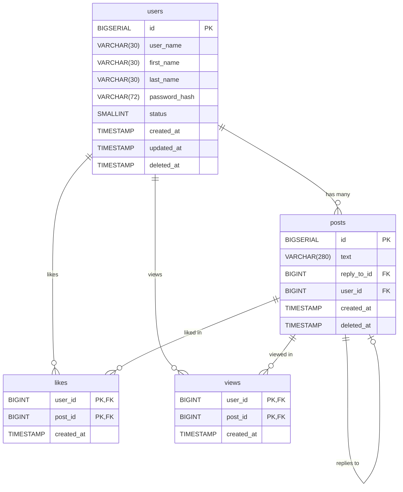

# Developing the Repository Layer of a Web Application

## Database Initialization

You need to manually create SQL tables that reflect the structure of the GopherTalk social network. Below are the tables, their fields, and the relationships between them.

1. **Table `users`** — stores user data.
2. **Table `posts`** — stores user posts. The `reply_to_id` field refers to another post if it's a reply.
3. **Table `likes`** — stores information about which users liked which posts.
4. **Table `views`** — stores information about which users viewed which posts.



### Requirements:

- Use the data types and constraints as described.
- Set up primary and foreign keys accordingly.
- Create a unique index on `user_name`, but only for users who are not deleted (`deleted_at IS NULL`).
- Make sure that the `status` field can only have values `0` or `1`.

> 💡 Tip: After creating the tables, verify the schema using an ER diagram to ensure the relationships are correct.

## Application Architecture: Controllers, Services, and Repositories

As an application grows, more business logic, validation, and database operations are added — and the code quickly turns into an unreadable mess.  
To prevent this, we use the principle of **separation of concerns** — where each component is responsible only for its specific task.

In small web applications, it's convenient to follow this architecture:

### 1. Controllers

A controller is the layer that handles an HTTP request, processes it, and returns a response. Here’s what typically happens:

- reading parameters from `req`,
- calling the appropriate service method,
- forming the response (`res.status().json(...)`).

A controller does **not** contain business logic or directly access the database — it simply **orchestrates the data flow**.  
Additionally, access control and request filtering are often handled at the controller level.

### 2. Services

A service is the layer that contains the core **business logic** of the application. It:

- processes data,
- checks conditions (e.g., "user already exists"),
- calls the repository to access the database.

A service knows nothing about `req` or `res` — it’s universal and can be reused in HTTP apps, CLI tools, or background scripts.

### 3. Repositories

A repository is the layer responsible for **data access**. This is where SQL queries usually live.  
The service says: “get me the user by id”, and the repository executes the SQL query and returns the result.

This approach allows you to:

- isolate database logic,
- write and run unit tests more easily,
- switch the data storage method (e.g., from PostgreSQL to MongoDB) with minimal changes.

### Advantages of this architecture:

- Code becomes **cleaner, clearer, and more maintainable**;
- Each layer can be **tested independently**;
- Teamwork is simplified — everyone focuses on their own area of responsibility;
- It’s easier to support and scale the application in the future.

According to the chosen architecture, we will build the development process as follows:  
first, we will implement the repository layer, then the service layer, and finally the controller layer.  
For each layer, you will be provided with unit tests to verify the correctness of your implementation.

## Developing the User Repository

In the src folder of the project, create a folder named repositories, and inside it, create a file called `userRepository.js`. Place the following code into that file:

```js
import { pool } from "../db/index.js";

export const UserRepository = {
  async createUser(dto) {
    const query = `
      INSERT INTO users (user_name, first_name, last_name, password_hash)
      VALUES ($1, $2, $3, $4)
      RETURNING id, user_name, password_hash, status;
    `;
    const values = [dto.user_name, dto.first_name, dto.last_name, dto.password_hash];
    const res = await pool.query(query, values);
    return res.rows[0];
  },
};
```

This code implements the createUser method in the UserRepository object, which is responsible for adding a new user to the database.

### Step-by-step Breakdown

- Importing the database connection:

  ```js
  import { pool } from "../db/index.js";
  ```

  This line imports the `pool` object, which represents a connection pool to the PostgreSQL database.  
  It is already configured in another module (`db/index.js`) and allows executing SQL queries.

- Exporting the `UserRepository` object:

  ```js
  export const UserRepository = { ... }
  ```

  This line exports the `UserRepository` object so that it can be used in other parts of the application.

- Defining the `createUser` method:

  ```js
  async createUser(dto) { ... }
  ```

  The `createUser` method is an asynchronous function that accepts a `dto` (data transfer object) containing the fields of the new user. In our case: `user_name`, `first_name`, `last_name`, `password_hash`.

- SQL INSERT query

  ```js
  const query = `
  INSERT INTO users (user_name, first_name, last_name, password_hash)
  VALUES ($1, $2, $3, $4)
  RETURNING id, user_name, password_hash, status;
  `;
  ```

  This SQL query inserts a new user into the `users` table. It uses placeholders `$1`, `$2`, `$3`, `$4` — these are positional parameters (used to prevent SQL injections). After the insertion, it immediately returns the new user's `id`, `user_name`, `password_hash`, and `status`.

  ::: details SQL Injections
  SQL injection is one of the most common types of database attacks. It occurs when user input is inserted directly into an SQL query without proper validation or escaping, allowing an attacker to alter the logic of the query.

  **Example of vulnerable code:**

  ```js
  const userInput = "' OR 1=1 --";
  const query = `SELECT * FROM users WHERE user_name = '${userInput}'`;
  ```

  A user provides the input `' OR 1=1 --`, and the code inserts it directly into the query.

  As a result, the final SQL query looks like:

  ```sql
  SELECT * FROM users WHERE user_name = '' OR 1=1 --';
  ```

  The query will:

  - `user_name = ''` — check if the username is empty;

  - `OR 1=1` — a logical expression that is always true, so the condition applies to all users;

  - `--` — begins an SQL comment; everything after it is ignored by the database;

  - `';` — this part is not executed because it is commented out.

  The query will return all users from the database, because `1=1` is always true.  
  If such a query is used for login, an attacker could log in without a password — because the query bypasses the intended logic.

  Using positional parameters solves this problem:

  ```js
  const query = "SELECT * FROM users WHERE user_name = $1";
  const values = [userInput];
  await pool.query(query, values);
  ```

  Instead of injecting the user input directly into the query string, we pass it as a separate value.  
  The PostgreSQL driver (`pg`) ensures safety by:

  - Escaping special characters,

  - Wrapping the value in quotes if necessary,

  - Ensuring that the input is treated as a plain string, not as SQL code.

  In other words, the driver safely separates SQL code from user-provided data, preventing malicious input from altering the logic of the query.

  Therefore, even a dangerous string like `' OR 1=1 --` will be passed as a simple value to the `user_name` field, not as executable SQL code.

  :::

- Preparing values for the query:

  ```js
  const values = [dto.user_name, dto.first_name, dto.last_name, dto.password_hash];
  ```

  The values are taken from the input `dto` object and passed in the same order as defined in the SQL query.

- Executing the query

  ```js
  const res = await pool.query(query, values);
  ```

  The query is executed using the `pool.query(...)` method.  
  It is asynchronous, so `await` is used.  
  The result is stored in the `res` variable.

- Returning the result:

  ```js
  return res.rows[0];
  ```

  After executing the query, the first (and only) row from the result is returned — that is, the data of the newly created user.

We have implemented user creation. We also need to implement the following methods:

- `getAllUsers` – retrieve a list of all users with pagination,

- `getUserById` – retrieve a user by their ID,

- `getUserByUserName` – retrieve a user by their username,

- `updateUser` – update user data,

- `deleteUser` – delete a user

Let's implement the `getAllUsers` method.

```js
import { pool } from "../db/index.js";

export const UserRepository = {
  async createUser(dto) {
    const query = `
      INSERT INTO users (user_name, first_name, last_name, password_hash)
      VALUES ($1, $2, $3, $4)
      RETURNING id, user_name, password_hash, status;
    `;
    const values = [dto.user_name, dto.first_name, dto.last_name, dto.password_hash];
    const res = await pool.query(query, values);
    return res.rows[0];
  },

  async getAllUsers(limit, offset) {
    const query = `
      SELECT id, user_name, first_name, last_name, status, created_at, updated_at
      FROM users
      WHERE deleted_at IS NULL
      OFFSET $1 LIMIT $2;
    `;
    const res = await pool.query(query, [offset, limit]);
    return res.rows;
  },
};
```

Note that the method takes two parameters — `offset` and `limit`. These are required to implement pagination, meaning users will be returned in parts using a sliding window, rather than all at once.

Let's move on to the `getUserById` and `getUserByUserName` methods.

```js
import { pool } from "../db/index.js";

export const UserRepository = {
  async createUser(dto) {
    const query = `
      INSERT INTO users (user_name, first_name, last_name, password_hash)
      VALUES ($1, $2, $3, $4)
      RETURNING id, user_name, password_hash, status;
    `;
    const values = [dto.user_name, dto.first_name, dto.last_name, dto.password_hash];
    const res = await pool.query(query, values);
    return res.rows[0];
  },

  async getAllUsers(limit, offset) {
    const query = `
      SELECT id, user_name, first_name, last_name, status, created_at, updated_at
      FROM users
      WHERE deleted_at IS NULL
      OFFSET $1 LIMIT $2;
    `;
    const res = await pool.query(query, [offset, limit]);
    return res.rows;
  },

  async getUserById(id) {
    const query = `...`;
    const res = await pool.query(query, [id]);
    if (res.rowCount === 0) {
      throw new Error("User not found");
    }
    return res.rows[0];
  },

  async getUserByUserName(user_name) {
    const query = `... `;
    const res = await pool.query(query, [user_name]);
    if (res.rowCount === 0) {
      throw new Error("User not found");
    }
    return res.rows[0];
  },
};
```

> [!IMPORTANT] Task  
> Write the SQL queries for the `getUserById` and `getUserByUserName` methods yourself. For the `getUserById` method, you should return the fields: `user_name`, `first_name`, `last_name`, `status`, `created_at`, `updated_at`. For the `getUserByUserName` method, return: `user_name`, `password_hash`, `status`.

Let's look at the `updateUser` method

```js
async updateUser(id, dto) {
    const fields = [];
    const args = [];
    let index = 1;

    if (dto.password_hash) {
      fields.push(`password_hash = $${index++}`);
      args.push(dto.password_hash);
    }
    if (dto.user_name) {
      fields.push(`user_name = $${index++}`);
      args.push(dto.user_name);
    }
    if (dto.first_name) {
      fields.push(`first_name = $${index++}`);
      args.push(dto.first_name);
    }
    if (dto.last_name) {
      fields.push(`last_name = $${index++}`);
      args.push(dto.last_name);
    }

    if (fields.length === 0) {
      throw new Error("No fields to update");
    }

    fields.push(`updated_at = NOW()`);
    const query = `
      UPDATE users SET ${fields.join(", ")}
      WHERE id = $${index} AND deleted_at IS NULL
      RETURNING id, user_name, first_name, last_name, status, created_at, updated_at;
    `;
    args.push(id);

    const res = await pool.query(query, args);
    if (res.rowCount === 0) {
      throw new Error("User not found");
    }
    return res.rows[0];
  }
```

This asynchronous method is designed to update user data in the database. It accepts two arguments:

- `id`: The ID of the user to update.
- `dto`: An object containing the data to update.

### Operation Logic:

1.  **Initialization**:

    - Two arrays are created: `fields` to store strings with field updates (`field = $index`) and `args` to store the values that will be substituted into the query.
    - `index` is initialized to `1`. This variable is used to generate placeholders `$1`, `$2`, etc., in the SQL query.

2.  **Checking Fields for Updates**:

    - A sequential check is performed for the presence of fields in the `dto` object, and the corresponding data is added to the `fields` and `args` arrays:
      - `password_hash`: If present, `password_hash = $index` is added to `fields` and the value `dto.password_hash` to `args`.
      - `user_name`: Similarly for the username.
      - `first_name`: Similarly for the first name.
      - `last_name`: Similarly for the last name.
    - With each field added, `index` is incremented.

3.  **Checking for the Presence of Fields to Update**:

    - If the `fields` array is empty (i.e., there were no fields to update in `dto`), an exception `Error("No fields to update")` is thrown.

4.  **Adding the `updated_at` Field**:

    - The string `updated_at = NOW()` is added to the `fields` array, which will update the `updated_at` field with the current time.

5.  **Forming the SQL Query**:

    - An SQL query is formed to update the user data.
    - The construction `UPDATE users SET ${fields.join(", ")}` is used, where `fields.join(", ")` combines the strings with field updates into one string separated by commas.
    - The condition `WHERE id = $index AND deleted_at IS NULL` specifies that you need to update the user with the specified `id` who is not marked as deleted (`deleted_at IS NULL`).
    - The construction `RETURNING id, user_name, first_name, last_name, status, created_at, updated_at` returns the updated user data.

6.  **Adding the User's `id` to the Query Arguments**:

    - The user's `id` is added to the `args` array, which will be used in the `WHERE id = $index` condition.

7.  **Executing the Query**:

    - The SQL query is executed using `pool.query(query, args)`. The query result is saved in the `res` variable.

8.  **Handling the Query Result**:
    - If `res.rowCount === 0`, that is, no users were found to update, an exception `Error("User not found")` is thrown.
    - Otherwise, the first row of the query result (`res.rows[0]`), containing the updated user data, is returned.

The last method we will implement in this repository is the `deleteUser` method to delete a user.

```js
async deleteUser(id) {
    const query = `...`;
    const res = await pool.query(query, [id]);
    if (res.rowCount === 0) {
      throw new Error("User not found");
    }
  }
```

This asynchronous method is designed to "delete" a user from the database. In fact, this could be a soft delete, where the record is not physically deleted, but only marked as deleted. Or it could be a complete deletion of the record from the table.

### Operation Logic:

1.  **Forming the SQL Query**

2.  **Executing the Query**:

    - The SQL query is executed using `pool.query(query, [id])`. The query result is saved in the `res` variable.

3.  **Handling the Query Result**:
    - If `res.rowCount === 0`, this means that no user with the specified `id` was found to delete. In this case, an `Error("User not found")` exception is thrown.

> [!IMPORTANT] Задание
> Write an SQL query that performs a soft delete of a user, setting the `deleted_at` value to the current time for the user with the specified `id`. Also, write an SQL query that completely deletes the user with the specified `id` from the table.

## Testing the User Repository

In the root of the project, create a `__tests__` folder, and in it a `repositories` folder. In the `repositories` folder, create a `userRepository.test.js` file and place the code with unit tests in it:

```js
import { expect, jest } from "@jest/globals";
import { pool } from "../../src/config/db.js";
import { UserRepository } from "../../src/repositories/userRepository.js";

function normalizeSQL(sql) {
  return sql.toLowerCase().replace(/\s+/g, " ").trim();
}

describe("UserRepository", () => {
  afterEach(() => {
    jest.clearAllMocks();
  });

  describe("createUser", () => {
    it("successfully creates new user", async () => {
      const mock = jest.spyOn(pool, "query");

      const dto = {
        user_name: "john",
        first_name: "John",
        last_name: "Doe",
        password_hash: "password",
      };

      const expected = {
        id: 1,
        user_name: "john",
        password_hash: "password",
        status: 1,
      };

      mock.mockResolvedValueOnce({ rows: [expected], rowCount: 1 });

      const result = await UserRepository.createUser(dto);

      expect(result).toEqual(expected);
      const [sql, params] = mock.mock.calls[0];
      const normalizedSQL = normalizeSQL(sql);
      expect(normalizedSQL).toContain("insert into users (user_name, first_name, last_name, password_hash)");
      expect(normalizedSQL).toContain("returning id, user_name, password_hash, status");
      expect(params).toEqual([dto.user_name, dto.first_name, dto.last_name, dto.password_hash]);
    });

    it("error on user insert", async () => {
      const mock = jest.spyOn(pool, "query");

      const dto = {
        user_name: "john",
        first_name: "John",
        last_name: "Doe",
        password_hash: "password",
      };

      const fakeError = new Error("insert failed");
      mock.mockRejectedValueOnce(fakeError);

      await expect(UserRepository.createUser(dto)).rejects.toThrow("insert failed");

      const [sql, params] = mock.mock.calls[0];
      const normalizedSQL = normalizeSQL(sql);
      expect(normalizedSQL).toContain("insert into users (user_name, first_name, last_name, password_hash)");
      expect(params).toEqual([dto.user_name, dto.first_name, dto.last_name, dto.password_hash]);
    });
  });

  describe("getAllUsers", () => {
    it("successfully gets all users", async () => {
      const mock = jest.spyOn(pool, "query");

      const now = new Date();

      const expectedUsers = [
        {
          id: 1,
          user_name: "john",
          first_name: "John",
          last_name: "Doe",
          status: 1,
          created_at: now,
          updated_at: now,
        },
        {
          id: 2,
          user_name: "jane",
          first_name: "Jane",
          last_name: "Smith",
          status: 1,
          created_at: now,
          updated_at: now,
        },
      ];

      mock.mockResolvedValueOnce({ rows: expectedUsers, rowCount: expectedUsers.length });

      const result = await UserRepository.getAllUsers(100, 0);

      expect(result).toEqual(expectedUsers);

      const [sql, params] = mock.mock.calls[0];
      const normalizedSQL = normalizeSQL(sql);
      expect(normalizedSQL).toContain(
        "select id, user_name, first_name, last_name, status, created_at, updated_at from users where deleted_at is null"
      );
      expect(params).toEqual([0, 100]);
    });

    it("returns error", async () => {
      const mock = jest.spyOn(pool, "query");
      mock.mockRejectedValueOnce(new Error("SQL error"));

      await expect(UserRepository.getAllUsers(100, 0)).rejects.toThrow("SQL error");

      const [sql, params] = mock.mock.calls[0];
      const normalizedSQL = normalizeSQL(sql);
      expect(normalizedSQL).toContain("from users where deleted_at is null");
      expect(params).toEqual([0, 100]);
    });
  });

  describe("getUserById", () => {
    it("successfully gets user by id", async () => {
      const mock = jest.spyOn(pool, "query");
      const now = new Date();

      const expected = {
        id: 1,
        user_name: "john",
        first_name: "John",
        last_name: "Doe",
        status: 1,
        created_at: now,
        updated_at: now,
      };

      mock.mockResolvedValueOnce({ rows: [expected], rowCount: 1 });

      const result = await UserRepository.getUserById(1);

      expect(result).toEqual(expected);

      const [sql, params] = mock.mock.calls[0];
      const normalizedSQL = normalizeSQL(sql);
      expect(normalizedSQL).toContain("from users where id = $1 and deleted_at is null");
      expect(params).toEqual([1]);
    });

    it("returns error if user not found", async () => {
      const mock = jest.spyOn(pool, "query");
      mock.mockResolvedValueOnce({ rows: [], rowCount: 0 });

      await expect(UserRepository.getUserById(2)).rejects.toThrow("User not found");

      const [sql, params] = mock.mock.calls[0];
      const normalizedSQL = normalizeSQL(sql);
      expect(normalizedSQL).toContain("from users where id = $1 and deleted_at is null");
      expect(params).toEqual([2]);
    });
  });

  describe("getUserByUserName", () => {
    it("successfully gets user by username", async () => {
      const mock = jest.spyOn(pool, "query");

      const expected = {
        id: 1,
        user_name: "john",
        password_hash: "password",
        status: 1,
      };

      mock.mockResolvedValueOnce({ rows: [expected], rowCount: 1 });

      const result = await UserRepository.getUserByUserName("john");

      expect(result).toEqual(expected);

      const [sql, params] = mock.mock.calls[0];
      const normalizedSQL = normalizeSQL(sql);
      expect(normalizedSQL).toContain("from users where user_name = $1 and deleted_at is null");
      expect(params).toEqual(["john"]);
    });

    it("returns error if user not found", async () => {
      const mock = jest.spyOn(pool, "query");
      mock.mockResolvedValueOnce({ rows: [], rowCount: 0 });

      await expect(UserRepository.getUserByUserName("notfound")).rejects.toThrow("User not found");

      const [sql, params] = mock.mock.calls[0];
      const normalizedSQL = normalizeSQL(sql);
      expect(normalizedSQL).toContain("from users where user_name = $1 and deleted_at is null");
      expect(params).toEqual(["notfound"]);
    });
  });

  describe("updateUser", () => {
    it("successfully updates user", async () => {
      const mock = jest.spyOn(pool, "query");
      const now = new Date();
      const oneHourAgo = new Date(now.getTime() - 60 * 60 * 1000);

      const id = 1;
      const dto = {
        user_name: "john_updated",
        first_name: "John",
        last_name: "Doe",
        password_hash: "password",
      };

      const expected = {
        id,
        user_name: dto.user_name,
        first_name: dto.first_name,
        last_name: dto.last_name,
        status: 1,
        created_at: oneHourAgo,
        updated_at: now,
      };

      mock.mockResolvedValueOnce({ rows: [expected], rowCount: 1 });

      const result = await UserRepository.updateUser(id, dto);

      expect(result).toEqual(expected);

      const [sql, params] = mock.mock.calls[0];
      const normalizedSQL = normalizeSQL(sql);
      expect(normalizedSQL).toContain("update users set");
      expect(normalizedSQL).toContain("where id = $");
      expect(normalizedSQL).toContain("returning id, user_name, first_name, last_name, status");
      expect(params).toContain(dto.user_name);
      expect(params).toContain(dto.password_hash);
      expect(params).toContain(dto.first_name);
      expect(params).toContain(dto.last_name);
      expect(params).toContain(id);
    });

    it("returns error if no fields to update", async () => {
      await expect(UserRepository.updateUser(1, {})).rejects.toThrow("No fields to update");
    });

    it("returns error if user not found", async () => {
      const mock = jest.spyOn(pool, "query");

      const dto = {
        user_name: "ghost",
      };

      mock.mockResolvedValueOnce({ rows: [], rowCount: 0 });

      await expect(UserRepository.updateUser(999, dto)).rejects.toThrow("User not found");

      const [sql, params] = mock.mock.calls[0];
      const normalizedSQL = normalizeSQL(sql);
      expect(normalizedSQL).toContain("update users set");
      expect(normalizedSQL).toContain("where id = $");
      expect(params).toEqual(["ghost", 999]);
    });
  });

  describe("deleteUser", () => {
    it("successfully deletes user", async () => {
      const mock = jest.spyOn(pool, "query");

      mock.mockResolvedValueOnce({ rowCount: 1 });

      await expect(UserRepository.deleteUser(1)).resolves.toBeUndefined();

      const [sql, params] = mock.mock.calls[0];
      const normalizedSQL = normalizeSQL(sql);
      expect(normalizedSQL).toContain("update users set deleted_at = now()");
      expect(normalizedSQL).toContain("where id = $1 and deleted_at is null");
      expect(params).toEqual([1]);
    });

    it("returns error if user not found", async () => {
      const mock = jest.spyOn(pool, "query");

      mock.mockResolvedValueOnce({ rowCount: 0 });

      await expect(UserRepository.deleteUser(2)).rejects.toThrow("User not found");

      const [sql, params] = mock.mock.calls[0];
      const normalizedSQL = normalizeSQL(sql);
      expect(normalizedSQL).toContain("update users set deleted_at = now()");
      expect(params).toEqual([2]);
    });
  });
});
```

After that run the command

```bash
npm run test
```

If you did everything correctly, all tests will pass.

```bash
> gophertalk-backend-express@0.1.0 test
> node --experimental-vm-modules node_modules/jest/bin/jest.js

(node:50607) ExperimentalWarning: VM Modules is an experimental feature and might change at any time
(Use `node --trace-warnings ...` to show where the warning was created)
 PASS  __tests__/repositories/userRepository.test.js
  UserRepository
    createUser
      ✓ successfully creates new user (2 ms)
      ✓ error on user insert (2 ms)
    getAllUsers
      ✓ successfully gets all users (1 ms)
      ✓ returns error
    getUserById
      ✓ successfully gets user by id (1 ms)
      ✓ returns error if user not found
    getUserByUserName
      ✓ successfully gets user by username
      ✓ returns error if user not found (1 ms)
    updateUser
      ✓ successfully updates user
      ✓ returns error if no fields to update (1 ms)
      ✓ returns error if user not found
    deleteUser
      ✓ successfully deletes user
      ✓ returns error if user not found

Test Suites: 1 passed, 1 total
Tests:       13 passed, 13 total
Snapshots:   0 total
Time:        0.138 s
Ran all test suites.
```

# Developing the Functional Layer of a Web Application

# Developing the Controller Layer of a Web Application
