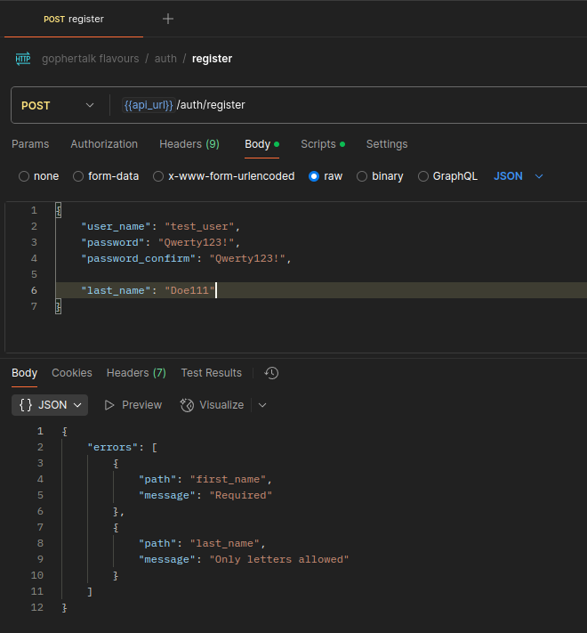
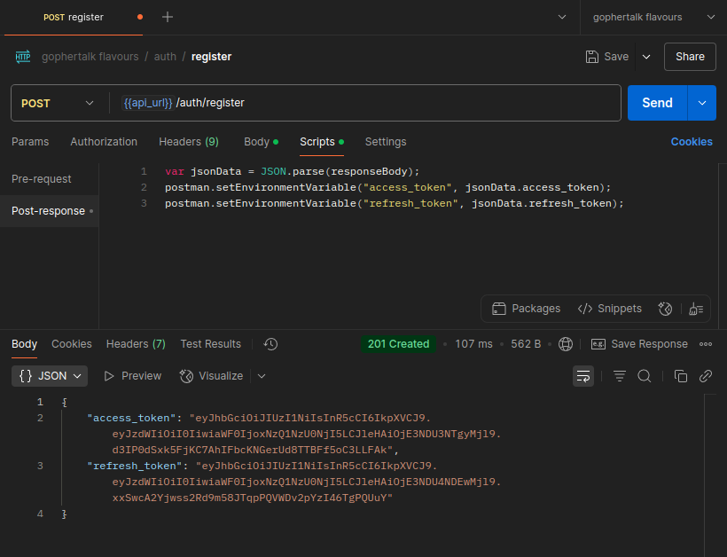
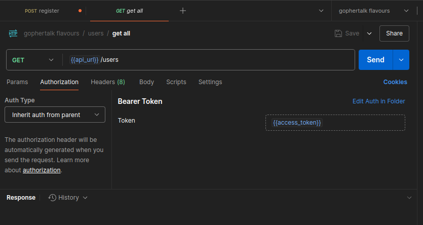

# Разработка слоя контроллеров web-приложения

Перед тем как переходить к определению маршрутов в FastAPI-приложении, нам нужно подготовить зависимости (dependencies) для обработки авторизации пользователей.
В FastAPI принято использовать механизм зависимостей (Depends).

Создайте в папке `src` папку `dependencies`, а в ней файл `auth.py`, и поместите в него следующий код:

```python
from fastapi import Depends, HTTPException, Request
from jose import jwt, JWTError
from pydantic import BaseModel
from os import getenv

JWT_SECRET = getenv("ACCESS_TOKEN_SECRET")
ALGORITHM = "HS256"

class TokenPayload(BaseModel):
    sub: str  # ID пользователя
    exp: int  # время жизни токена

def get_current_user(request: Request) -> TokenPayload:
    auth_header = request.headers.get("Authorization")
    if not auth_header or not auth_header.startswith("Bearer "):
        raise HTTPException(status_code=401, detail="Missing token")

    token = auth_header[7:]  # убираем "Bearer "

    try:
        payload = jwt.decode(token, JWT_SECRET, algorithms=[ALGORITHM])
        user = TokenPayload(**payload)
        request.state.user = user
        return user
    except JWTError:
        raise HTTPException(status_code=401, detail="Invalid token")

def verify_same_user(user_id: int, token: TokenPayload = Depends(get_current_user)):
    if int(token.sub) != int(user_id):
        raise HTTPException(status_code=401, detail="Forbidden")
    return token

```

Здесь определены две зависимости:

- `get_current_user` — проверяет наличие и корректность JWT-токена в заголовке Authorization. Если всё в порядке, возвращает объект `TokenPayload`, содержащий ID пользователя (`sub`).
- `verify_same_user` — дополнительно проверяет, что ID в URL совпадает с ID пользователя, извлечённым из токена. Это предотвращает изменение чужих данных.


Такая реализация делает код FastAPI-приложения:

- централизованным — авторизация обрабатывается в одном месте;
- расширяемым — можно легко заменить JWT на другую схему;
- безопасным — исключает доступ к чужим данным;
- декларативным — зависимости описываются явно и видны в сигнатуре функций.

## Разаботка контроллера авторизации

Контроллер авторизации отвечает за обработку запросов пользователей, связанных с входом в систему (`Login`) и регистрацией новых пользователей (`Register`).
На этом этапе контроллер принимает HTTP-запросы, проводит валидацию входных данных и делегирует бизнес-логику в сервис аутентификации.

Этот подход помогает соблюдать разделение ответственности между уровнями приложения: контроллеры отвечают только за прием и возврат данных, а логика обработки сосредоточена в сервисах.

В папке `src` создайте папку `controllers`, а в ней файл `authController.js`, и поместите туда следующий код:

```python
import { AuthService } from "../services/authService.js";

export class AuthController {
  static async login(req, res) {
    try {
      const dto = req.body;
      const tokens = await AuthService.login(dto);
      res.status(200).json(tokens);
    } catch (err) {
      res.status(401).json({ message: err.message });
    }
  }

  static async register(req, res) {
    try {
      const dto = req.body;
      const tokens = await AuthService.register(dto);
      res.status(201).json(tokens);
    } catch (err) {
      res.status(401).json({ message: err.message });
    }
  }
}
```

**`login(req, res)`**

- Принимает данные пользователя: `user_name` и `password`.

- Если данные валидны, вызывает метод `login` в сервисе аутентификации.

- При успешной аутентификации возвращает пользователю пару токенов (`access_token` и `refresh_token`).

- В случае ошибки возвращает соответствующий HTTP-статус и сообщение об ошибке.

**`register(req, res)`**

- Принимает регистрационные данные: `user_name`, `password`, `password_confirm`, `first_name`, `last_name`.

- Если данные валидны, вызывает метод `register` в сервисе аутентификации.

- При успешной регистрации возвращает пару токенов для нового пользователя.

- Если регистрация не удалась, отправляет сообщение об ошибке и соответствующий HTTP-статус.

Сейчас входные данные никаки не валидируются. Чтобы это исправить, необходимо добавить валидаторы - специальные объекты, которые будут следить за правильностью тех данных, которые приходят на сервер.

Создайте в каталоге `src` папку `validators`, а в ней файл `authValidators.js`. Поместите в него следующий код:

```python
import { z } from "zod";

const usernameSchema = z
  .string()
  .min(5)
  .max(30)
  .regex(/^[a-zA-Z0-9_]+$/, "Must be alphanumeric or underscore")
  .regex(/^[^0-9]/, "Must start with a letter");

const passwordSchema = z
  .string()
  .min(5)
  .max(30)
  .regex(/^(?=.*[a-zA-Z])(?=.*\d)(?=.*[@$!%*?&])/, "Must contain letter, number and special character");

export const loginValidator = z.object({
  user_name: usernameSchema,
  password: passwordSchema,
});

export const registerValidator = z
  .object({
    user_name: usernameSchema,
    password: passwordSchema,
    password_confirm: passwordSchema,
    first_name: z
      .string()
      .min(1)
      .max(30)
      .regex(/^[\p{L}]+$/u, "Only letters allowed"),
    last_name: z
      .string()
      .min(1)
      .max(30)
      .regex(/^[\p{L}]+$/u, "Only letters allowed"),
  })
  .refine(data => data.password === data.password_confirm, {
    message: "Passwords must match",
    path: ["password_confirm"],
  });
```

Этот файл содержит схемы валидации для тела запроса (`req.body`) при авторизации пользователей.

Всё построено на библиотеке `zod` — это современный и мощный инструмент для валидации данных в JavaScript и TypeScript.

```python
const usernameSchema = z
  .string()
  .min(5)
  .max(30)
  .regex(/^[a-zA-Z0-9_]+$/, "Must be alphanumeric or underscore")
  .regex(/^[^0-9]/, "Must start with a letter");
```

- Строка длиной от `5` до `30` символов.

- Только буквы, цифры и подчёркивание (`_`).

- Первая буква должна быть символом, не цифрой.

```python
const passwordSchema = z
  .string()
  .min(5)
  .max(30)
  .regex(/^(?=.*[a-zA-Z])(?=.*\d)(?=.*[@$!%*?&])/, "Must contain letter, number and special character");
```

- Строка длиной от `5` до `30` символов.

- Обязательно должна содержать:

  - хотя бы одну букву,

  - хотя бы одну цифру,

  - хотя бы один спецсимвол (`@`, `$`, `!`, `%`, `*`, `?`, `&`).

```python
export const loginValidator = z.object({
  user_name: usernameSchema,
  password: passwordSchema,
});
```

- Проверяет `user_name` и `password` при логине.

```python
export const registerValidator = z
  .object({
    user_name: usernameSchema,
    password: passwordSchema,
    password_confirm: passwordSchema,
    first_name: z
      .string()
      .min(1)
      .max(30)
      .regex(/^[\p{L}]+$/u, "Only letters allowed"),
    last_name: z
      .string()
      .min(1)
      .max(30)
      .regex(/^[\p{L}]+$/u, "Only letters allowed"),
  })
  .refine(data => data.password === data.password_confirm, {
    message: "Passwords must match",
    path: ["password_confirm"],
  });
```

Проверяет:

- `user_name`, `password`, `password_confirm` (по тем же схемам).

- `first_name` и `last_name` — строки длиной от 1 до 30 символов, только буквы, поддерживает любые алфавиты (`\p{L}` — буквенные символы Unicode).

Дополнительная проверка через `.refine()`:

- `password` и `password_confirm` должны совпадать, иначе выдаётся ошибка "Passwords must match".

Этот валидатор будет запускаться через middleware. В папке `src/middleware` создайте файл `validate.js` и поместите в него код:

```python
export const validate = schema => (req, res, next) => {
  try {
    schema.parse(req.body);
    next();
  } catch (err) {
    return res.status(422).json({
      errors: err.errors.map(e => ({
        path: e.path.join("."),
        message: e.message,
      })),
    });
  }
};
```

Мы добавили второй middleware. Посмотрим, как теперь будет обрабатываться входящий HTTP-запрос:


Если же для запроса не требуется авторизация (например при авторизации или регистрации), то схема обработки запроса будет выглядеть так:


Как же все это соединить? Как сервер express поймет, что клиент хочет авторизоваться и нужно провалидировать входные данные? В прошлом уроке в файле `app.js` мы указали наш первый эндпоинт для проверки соединения с БД:

```python
...
app.get("/api/health-check", async (req, res) => {
  try {
    await pool.query("SELECT 1");
    res.status(200).send("OK");
  } catch (err) {
    res.status(500).send("DB connection failed");
  }
});
...
```

Можно пойти тем же путем и в `app.js` прописать остальные маршруты. Однако, если приложение разрастется, будет бардак. ПОэтому хорошей практикой считается выносить определение маршрутов в отдельный файл, что мы и сделаем.

В каталоге `src` создайте папку `routes`, а в ней файл `authRoutes.js`, и поместите туда следующий код:

```python
import express from "express";
import { AuthController } from "../controllers/authController.js";
import { validate } from "../middleware/validate.js";
import { loginValidator, registerValidator } from "../validators/authValidators.js";

const router = express.Router();

router.post("/login", validate(loginValidator), AuthController.login);
router.post("/register", validate(registerValidator), AuthController.register);

export default router;
```

Далее необходимо обновить `app.js`, добавив две строки (выделены зеленым цветом):

```python
import dotenv from "dotenv";
import express from "express";
import { pool } from "./config/db.js";
import authRoutes from "./routes/authRoutes.js"; // [!code ++]

dotenv.config();

const app = express();
const PORT = process.env.PORT || 3000;

app.use(express.json());

app.use("/api/auth", authRoutes); // [!code ++]

app.get("/api/health-check", async (req, res) => {
  try {
    await pool.query("SELECT 1");
    res.status(200).send("OK");
  } catch (err) {
    res.status(500).send("DB connection failed");
  }
});

app.listen(PORT, () => {
  console.log(`Server is running on port ${PORT}`);
});
```

После этого нужно запустить сервер. Если все сделано правильно, он запустится без ошибок:

```bash
npm run dev

> gophertalk-backend-express@0.1.0 dev
> nodemon src/app.js

[nodemon] 3.1.9
[nodemon] to restart at any time, enter `rs`
[nodemon] watching path(s): *.*
[nodemon] watching extensions: js,mjs,cjs,json
[nodemon] starting `node src/app.js`
Server is running on port 3000
```

Чтобы убедится, что все работает, давайте попробуем зарегистрировать пользователя и затем авторизоваться.


В Postman откройте запрос `register` в каталоге `auth`. Для начала можно проверить валидацию. Давайте удалим поле `first_name` и добавим в поле `last_name` цифры.



Если же мы отправим корректный запрос, то в ответ получим пару `access_token` и `refresh_token`.


Откройте вкладку `Scripts` на панели запроса в Postman.



Этот скрипт читает ответ от сервера и устанавливает переменные из окружения Postman. То есть Postman "запоминает" токены, и может их использовать в других запросах.
Это можно увидеть, еслди открыть любой запрос, требующий авторизации, и перейти на вкладку `Authorizaton`.



Тут указано, что Postman будет подставлять в заголовок `Authorization` строку с нашим `Bearer <access_token>`. Обратите внимание, что в файле `src/middleware/auth` как раз проверяется наличие заголовка `Authorization` со значением `Bearer <access_token>`.

Попробуйте самостоятельно авторизоваться в системе - через Postman выполнить запрос `/login`.

## Тестирование контроллера авторизации

В каталоге `__tests__` создайте каталог `controllers`, а в нем файл `authController.test.js`, и поместите туда код:

::: details Unit тесты authController

```python
import { expect, jest } from "@jest/globals";
import express from "express";
import request from "supertest";
import { AuthController } from "../../src/controllers/authController.js";
import { AuthService } from "../../src/services/authService.js";

const app = express();
app.use(express.json());
app.post("/api/auth/login", AuthController.login);
app.post("/api/auth/register", AuthController.register);

describe("AuthController", () => {
  afterEach(() => {
    jest.clearAllMocks();
  });

  describe("POST /api/auth/login", () => {
    it("should successfully login", async () => {
      const tokens = { access_token: "access", refresh_token: "refresh" };
      const loginDTO = { user_name: "test_user", password: "test123!" };

      jest.spyOn(AuthService, "login").mockResolvedValueOnce(tokens);

      const res = await request(app).post("/api/auth/login").send(loginDTO);

      expect(res.status).toBe(200);
      expect(res.body).toEqual(tokens);
      expect(AuthService.login).toHaveBeenCalledWith(loginDTO);
    });

    it("should return 401 if login fails", async () => {
      const loginDTO = { user_name: "test_user", password: "wrongpassword" };

      jest.spyOn(AuthService, "login").mockRejectedValueOnce(new Error("Wrong password"));

      const res = await request(app).post("/api/auth/login").send(loginDTO);

      expect(res.status).toBe(401);
      expect(res.body.message).toBe("Wrong password");
      expect(AuthService.login).toHaveBeenCalledWith(loginDTO);
    });
  });

  describe("POST /api/auth/register", () => {
    it("should successfully register", async () => {
      const tokens = { access_token: "access", refresh_token: "refresh" };
      const registerDTO = {
        user_name: "test_user",
        password: "test123!",
        password_confirm: "test123!",
        first_name: "John",
        last_name: "Doe",
      };

      jest.spyOn(AuthService, "register").mockResolvedValueOnce(tokens);

      const res = await request(app).post("/api/auth/register").send(registerDTO);

      expect(res.status).toBe(201);
      expect(res.body).toEqual(tokens);
      expect(AuthService.register).toHaveBeenCalledWith(registerDTO);
    });

    it("should return 401 if registration fails", async () => {
      const registerDTO = {
        user_name: "test_user",
        password: "test123!",
        password_confirm: "test123!",
        first_name: "John",
        last_name: "Doe",
      };

      jest.spyOn(AuthService, "register").mockRejectedValueOnce(new Error("User already exists"));

      const res = await request(app).post("/api/auth/register").send(registerDTO);

      expect(res.status).toBe(401);
      expect(res.body.message).toBe("User already exists");
      expect(AuthService.register).toHaveBeenCalledWith(registerDTO);
    });
  });
});
```

:::

Если все сделано правильно, тесты выполнятся успешно:

```bash
npm run test

> gophertalk-backend-express@0.1.0 test
> node --experimental-vm-modules node_modules/jest/bin/jest.js

(node:90459) ExperimentalWarning: VM Modules is an experimental feature and might change at any time
(Use `node --trace-warnings ...` to show where the warning was created)
 PASS  __tests__/services/authService.test.js
 PASS  __tests__/controllers/authController.test.js
 PASS  __tests__/services/userService.test.js
 PASS  __tests__/repositories/postRepository.test.js
 PASS  __tests__/repositories/userRepository.test.js
 PASS  __tests__/services/postService.test.js

Test Suites: 6 passed, 6 total
Tests:       58 passed, 58 total
Snapshots:   0 total
Time:        1.141 s
Ran all test suites.
```

## Разработка контроллера пользователей

Полностью аналогично `authController` выполним все действия.

В каталоге `src/controllers` создадим файл в `userController.js` и поместим в него следующий код:

```python
import { UserService } from "../services/userService.js";

export class UserController {
  static async getAllUsers(req, res) {
    try {
      const limit = parseInt(req.query.limit, 10) || 10;
      const offset = parseInt(req.query.offset, 10) || 0;
      const users = await UserService.getAllUsers(limit, offset);
      res.status(200).json(users);
    } catch (err) {
      res.status(400).json({ message: err.message });
    }
  }

  static async getUserById(req, res) {
    try {
      const id = parseInt(req.params.id, 10);
      if (isNaN(id)) {
        return res.status(404).json({ message: "Invalid ID" });
      }
      const user = await UserService.getUserById(id);
      res.status(200).json(user);
    } catch (err) {
      res.status(404).json({ message: err.message });
    }
  }

  static async updateUser(req, res) {
    try {
      const id = parseInt(req.params.id, 10);
      if (isNaN(id)) {
        return res.status(404).json({ message: "Invalid ID" });
      }
      const dto = req.body;
      const updatedUser = await UserService.updateUser(id, dto);
      res.status(200).json(updatedUser);
    } catch (err) {
      res.status(400).json({ message: err.message });
    }
  }

  static async deleteUserById(req, res) {
    try {
      const id = parseInt(req.params.id, 10);
      if (isNaN(id)) {
        return res.status(404).json({ message: "Invalid ID" });
      }
      await UserService.deleteUser(id);
      res.status(204).send();
    } catch (err) {
      res.status(404).json({ message: err.message });
    }
  }
}
```

В каталоге `src/validators` создайте файл `userValidators.js` и поместите туда код:

```python
import { z } from "zod";

const usernameSchema = z
  .string()
  .min(5)
  .max(30)
  .regex(/^[a-zA-Z0-9_]+$/, "Must be alphanumeric or underscore")
  .regex(/^[^0-9]/, "Must start with a letter");

const passwordSchema = z
  .string()
  .min(5)
  .max(30)
  .regex(/^(?=.*[a-zA-Z])(?=.*\d)(?=.*[@$!%*?&])/, "Must contain letter, number and special character");

export const updateUserValidator = z
  .object({
    user_name: usernameSchema.optional(),
    password: passwordSchema.optional(),
    password_confirm: passwordSchema.optional(),
    first_name: z
      .string()
      .min(1)
      .max(30)
      .regex(/^[\p{L}]+$/u, "Only letters allowed")
      .optional(),
    last_name: z
      .string()
      .min(1)
      .max(30)
      .regex(/^[\p{L}]+$/u, "Only letters allowed")
      .optional(),
  })
  .refine(
    data => {
      if (data.password || data.password_confirm) {
        return data.password === data.password_confirm;
      }
      return true;
    },
    {
      message: "Passwords must match",
      path: ["password_confirm"],
    }
  );
```

Далее добавим маршруты. В каталоге `src/routes` создайте файл `userRoutes.js` и поместите туда код:

```python
import express from "express";
import { UserController } from "../controllers/userController.js";
import { validate } from "../middleware/validate.js";
import { updateUserValidator } from "../validators/userValidators.js";
import { requestAuth, requestAuthSameId } from "../middleware/auth.js";

const router = express.Router();

// Только авторизованные пользователи
router.get("/", requestAuth(process.env.ACCESS_TOKEN_SECRET), UserController.getAllUsers);
router.get("/:id", requestAuth(process.env.ACCESS_TOKEN_SECRET), UserController.getUserById);

// Обновить или удалить пользователь может только себя
router.put(
  "/:id",
  requestAuthSameId(process.env.ACCESS_TOKEN_SECRET),
  validate(updateUserValidator),
  UserController.updateUser
);
router.delete("/:id", requestAuthSameId(process.env.ACCESS_TOKEN_SECRET), UserController.deleteUserById);

export default router;
```

Далее необходимо обновить `app.js`, добавив две строки (выделены зеленым цветом):

```python
import dotenv from "dotenv";
import express from "express";
import { pool } from "./config/db.js";
import authRoutes from "./routes/authRoutes.js";
import userRoutes from "./routes/userRoutes.js"; // [!code ++]

dotenv.config();

const app = express();
const PORT = process.env.PORT || 3000;

app.use(express.json());

app.use("/api/auth", authRoutes);
app.use("/api/users", userRoutes); // [!code ++]

app.get("/api/health-check", async (req, res) => {
  try {
    await pool.query("SELECT 1");
    res.status(200).send("OK");
  } catch (err) {
    res.status(500).send("DB connection failed");
  }
});

app.listen(PORT, () => {
  console.log(`Server is running on port ${PORT}`);
});
```

После этого нужно запустить сервер. Если все сделано правильно, он запустится без ошибок:

```bash
npm run dev

> gophertalk-backend-express@0.1.0 dev
> nodemon src/app.js

[nodemon] 3.1.9
[nodemon] to restart at any time, enter `rs`
[nodemon] watching path(s): *.*
[nodemon] watching extensions: js,mjs,cjs,json
[nodemon] starting `node src/app.js`
Server is running on port 3000
```

Самостоятельно проверьте эндпоинты из папки `users` в Postman:

- `get all` - получить всех пользователей
- `get by id` - получить информацию о пользователе по `id`
- `delete` - удалить пользователя (можно удалить только себя; проверьте, что произойдет с записью пользователя в базе данных)
- `update` - обновить данные пользователя (можно обновить только свои данные)

## Тестирование контроллера пользователей

В каталоге `__tests__/controllers` создайте файл `userController.test.js` и поместите в него следующий код:

::: details Unit тесты userController

```python
import { expect, jest } from "@jest/globals";
import express from "express";
import request from "supertest";
import { UserController } from "../../src/controllers/userController.js";
import { validate } from "../../src/middleware/validate.js";
import { UserService } from "../../src/services/userService.js";
import { updateUserValidator } from "../../src/validators/userValidators.js";

const app = express();
app.use(express.json());

app.get("/api/users", UserController.getAllUsers);
app.get("/api/users/:id", UserController.getUserById);
app.put("/api/users/:id", validate(updateUserValidator), UserController.updateUser);
app.delete("/api/users/:id", UserController.deleteUserById);

describe("UserController", () => {
  afterEach(() => {
    jest.clearAllMocks();
  });

  describe("GET /api/users", () => {
    it("should return 200 and list of users", async () => {
      const users = [{ id: 1, user_name: "test_user" }];
      jest.spyOn(UserService, "getAllUsers").mockResolvedValueOnce(users);

      const res = await request(app).get("/api/users?limit=10&offset=0").set("Authorization", "Bearer mockToken");

      expect(res.status).toBe(200);
      expect(res.body).toEqual(users);
      expect(UserService.getAllUsers).toHaveBeenCalled();
    });

    it("should return 400 if service fails", async () => {
      jest.spyOn(UserService, "getAllUsers").mockRejectedValueOnce(new Error("Service error"));

      const res = await request(app).get("/api/users?limit=10&offset=0").set("Authorization", "Bearer mockToken");

      expect(res.status).toBe(400);
    });
  });

  describe("GET /api/users/:id", () => {
    it("should return 200 and a user", async () => {
      const user = { id: 1, user_name: "test_user" };
      jest.spyOn(UserService, "getUserById").mockResolvedValueOnce(user);

      const res = await request(app).get("/api/users/1").set("Authorization", "Bearer mockToken");

      expect(res.status).toBe(200);
      expect(res.body).toEqual(user);
      expect(UserService.getUserById).toHaveBeenCalledWith(1);
    });

    it("should return 404 if id is invalid", async () => {
      const res = await request(app).get("/api/users/abc").set("Authorization", "Bearer mockToken");

      expect(res.status).toBe(404);
    });

    it("should return 404 if user not found", async () => {
      jest.spyOn(UserService, "getUserById").mockRejectedValueOnce(new Error("Not found"));

      const res = await request(app).get("/api/users/2").set("Authorization", "Bearer mockToken");

      expect(res.status).toBe(404);
    });
  });

  describe("PUT /api/users/:id", () => {
    it("should return 200 and updated user", async () => {
      const updateDto = { first_name: "Updated", last_name: "User" };
      const updatedUser = { id: 1, user_name: "updated_user" };
      jest.spyOn(UserService, "updateUser").mockResolvedValueOnce(updatedUser);

      const res = await request(app).put("/api/users/1").set("Authorization", "Bearer mockToken").send(updateDto);

      expect(res.status).toBe(200);
      expect(res.body).toEqual(updatedUser);
      expect(UserService.updateUser).toHaveBeenCalledWith(1, updateDto);
    });

    it("should return 404 if id is invalid", async () => {
      const res = await request(app).put("/api/users/abc").set("Authorization", "Bearer mockToken").send({});

      expect(res.status).toBe(404);
    });

    it("should return 422 if validation fails", async () => {
      const invalidDto = { user_name: "test" };

      const res = await request(app).put("/api/users/1").set("Authorization", "Bearer mockToken").send(invalidDto);

      expect(res.status).toBe(422);
    });

    it("should return 400 on service error", async () => {
      const updateDto = { first_name: "Updated", last_name: "User" };
      jest.spyOn(UserService, "updateUser").mockRejectedValueOnce(new Error("Service error"));

      const res = await request(app).put("/api/users/1").set("Authorization", "Bearer mockToken").send(updateDto);

      expect(res.status).toBe(400);
    });
  });

  describe("DELETE /api/users/:id", () => {
    it("should return 204 if user deleted", async () => {
      jest.spyOn(UserService, "deleteUser").mockResolvedValueOnce();

      const res = await request(app).delete("/api/users/1").set("Authorization", "Bearer mockToken");

      expect(res.status).toBe(204);
      expect(UserService.deleteUser).toHaveBeenCalledWith(1);
    });

    it("should return 404 if id is invalid", async () => {
      const res = await request(app).delete("/api/users/abc").set("Authorization", "Bearer mockToken");

      expect(res.status).toBe(404);
    });

    it("should return 404 if user not found", async () => {
      jest.spyOn(UserService, "deleteUser").mockRejectedValueOnce(new Error("Not found"));

      const res = await request(app).delete("/api/users/2").set("Authorization", "Bearer mockToken");

      expect(res.status).toBe(404);
    });
  });
});
```

:::

Если все сделано правильно, тесты выполнятся успешно:

```bash
npm run test

> gophertalk-backend-express@0.1.0 test
> node --experimental-vm-modules node_modules/jest/bin/jest.js

(node:109419) ExperimentalWarning: VM Modules is an experimental feature and might change at any time
(Use `node --trace-warnings ...` to show where the warning was created)
 PASS  __tests__/controllers/authController.test.js
 PASS  __tests__/controllers/userController.test.js
 PASS  __tests__/services/authService.test.js
 PASS  __tests__/services/userService.test.js
 PASS  __tests__/repositories/userRepository.test.js
 PASS  __tests__/repositories/postRepository.test.js
 PASS  __tests__/services/postService.test.js

Test Suites: 7 passed, 7 total
Tests:       70 passed, 70 total
Snapshots:   0 total
Time:        1.367 s
Ran all test suites.
```

## Разработка контроллера постов

Осталось разработать последний контроллер - `postController`.

В каталоге `src/controllers` создадим файл в `postController.js` и поместим в него следующий код:

```python
import { PostService } from "../services/postService.js";

export class PostController {
  static async getAllPosts(req, res) {
    try {
      const userId = req.user.sub;
      const { limit = 10, offset = 0, reply_to_id = 0, owner_id = 0, search = "" } = req.query;

      const filterDTO = {
        user_id: Number(userId),
        limit: Number(limit),
        offset: Number(offset),
        reply_to_id: Number(reply_to_id),
        owner_id: Number(owner_id),
        search,
      };

      const posts = await PostService.getAllPosts(filterDTO);
      res.status(200).json(posts);
    } catch (err) {
      res.status(400).json({ message: err.message });
    }
  }

  static async createPost(req, res) {
    try {
      const userId = req.user.sub;
      const dto = req.body;
      dto.user_id = Number(userId);

      const post = await PostService.createPost(dto);
      res.status(201).json(post);
    } catch (err) {
      res.status(400).json({ message: err.message });
    }
  }

  static async deletePost(req, res) {
    try {
      const postId = Number(req.params.id);
      const userId = Number(req.user.sub);

      await PostService.deletePost(postId, userId);
      res.status(204).send();
    } catch (err) {
      res.status(404).json({ message: err.message });
    }
  }

  static async viewPost(req, res) {
    try {
      const postId = Number(req.params.id);
      const userId = Number(req.user.sub);

      await PostService.viewPost(postId, userId);
      res.status(201).send();
    } catch (err) {
      res.status(404).json({ message: err.message });
    }
  }

  static async likePost(req, res) {
    try {
      const postId = Number(req.params.id);
      const userId = Number(req.user.sub);

      await PostService.likePost(postId, userId);
      res.status(201).send();
    } catch (err) {
      res.status(404).json({ message: err.message });
    }
  }

  static async dislikePost(req, res) {
    try {
      const postId = Number(req.params.id);
      const userId = Number(req.user.sub);

      await PostService.dislikePost(postId, userId);
      res.status(204).send();
    } catch (err) {
      res.status(404).json({ message: err.message });
    }
  }
}
```

В каталоге `src/validators` создайте файл `postValidators.js` и поместите туда код:

```python
import { z } from "zod";

export const createPostValidator = z.object({
  text: z.string().min(1).max(280),
  reply_to_id: z
    .number()
    .optional()
    .nullable()
    .refine(val => val === undefined || val > 0, {
      message: "ReplyToID must be greater than 0",
    }),
});

export const filterPostValidator = z.object({
  search: z.string().optional(),
  owner_id: z.string().regex(/^\d+$/).optional(),
  user_id: z.string().regex(/^\d+$/).optional(),
  reply_to_id: z.string().regex(/^\d+$/).optional(),
  limit: z.string().regex(/^\d+$/).optional(),
  offset: z.string().regex(/^\d+$/).optional(),
});
```

Далее добавим маршруты. В каталоге `src/routes` создайте файл `postRoutes.js` и поместите туда код:

```python
import express from "express";
import { PostController } from "../controllers/postController.js";
import { validate } from "../middleware/validate.js";
import { requestAuth, requestAuthSameId } from "../middleware/auth.js";
import { createPostValidator } from "../validators/postValidators.js";

const router = express.Router();

router.get("/", requestAuth(process.env.ACCESS_TOKEN_SECRET), PostController.getAllPosts);

router.post(
  "/",
  requestAuth(process.env.ACCESS_TOKEN_SECRET),
  validate(createPostValidator),
  PostController.createPost
);

router.delete("/:id", requestAuthSameId(process.env.ACCESS_TOKEN_SECRET), PostController.deletePost);

router.post("/:id/view", requestAuth(process.env.ACCESS_TOKEN_SECRET), PostController.viewPost);

router.post("/:id/like", requestAuth(process.env.ACCESS_TOKEN_SECRET), PostController.likePost);

router.post("/:id/dislike", requestAuth(process.env.ACCESS_TOKEN_SECRET), PostController.dislikePost);

export default router;
```

Далее необходимо обновить `app.js`, добавив две строки (выделены зеленым цветом):

```python
import dotenv from "dotenv";
import express from "express";
import { pool } from "./config/db.js";
import authRoutes from "./routes/authRoutes.js";
import postRoutes from "./routes/postRoutes.js"; // [!code ++]
import userRoutes from "./routes/userRoutes.js";

dotenv.config();

const app = express();
const PORT = process.env.PORT || 3000;

app.use(express.json());

app.use("/api/auth", authRoutes);
app.use("/api/posts", postRoutes); // [!code ++]
app.use("/api/users", userRoutes);

app.get("/api/health-check", async (req, res) => {
  try {
    await pool.query("SELECT 1");
    res.status(200).send("OK");
  } catch (err) {
    res.status(500).send("DB connection failed");
  }
});

app.listen(PORT, () => {
  console.log(`Server is running on port ${PORT}`);
});
```

После этого нужно запустить сервер. Если все сделано правильно, он запустится без ошибок:

```bash
npm run dev

> gophertalk-backend-express@0.1.0 dev
> nodemon src/app.js

[nodemon] 3.1.9
[nodemon] to restart at any time, enter `rs`
[nodemon] watching path(s): *.*
[nodemon] watching extensions: js,mjs,cjs,json
[nodemon] starting `node src/app.js`
Server is running on port 3000
```

Самостоятельно проверьте эндпоинты из папки `users` в Postman:

- `get all` - получить все посты
- `delete` - удалить пост (можно удалить только свой пост; проверьте, что произойдет с записью поста в базе данных)
- `create` - создать пост
- `like` - поставить лайк
- `dislike` - удалить лайк
- `view` - просмотреть пост

## Тестирование контроллера постов

В каталоге `__tests__/controllers` создайте файл `postController.test.js` и поместите в него следующий код:

::: details Unit тесты postController

```python
import { expect, jest } from "@jest/globals";
import dotenv from "dotenv";
import express from "express";
import jwt from "jsonwebtoken";
import request from "supertest";
import { PostController } from "../../src/controllers/postController.js";
import { requestAuth } from "../../src/middleware/auth.js";
import { validate } from "../../src/middleware/validate.js";
import { PostService } from "../../src/services/postService.js";
import { createPostValidator } from "../../src/validators/postValidators.js";

dotenv.config();

const app = express();
app.use(express.json());

app.use((req, res, next) => {
  const token = jwt.sign({ sub: "1" }, process.env.ACCESS_TOKEN_SECRET);
  req.headers.authorization = `Bearer ${token}`;
  requestAuth(process.env.ACCESS_TOKEN_SECRET)(req, res, next);
});

app.get("/api/posts", PostController.getAllPosts);
app.post("/api/posts", validate(createPostValidator), PostController.createPost);
app.delete("/api/posts/:id", PostController.deletePost);
app.post("/api/posts/:id/view", PostController.viewPost);
app.post("/api/posts/:id/like", PostController.likePost);
app.delete("/api/posts/:id/like", PostController.dislikePost);

describe("PostController", () => {
  afterEach(() => {
    jest.clearAllMocks();
  });

  describe("GET /api/posts", () => {
    it("should fetch posts successfully", async () => {
      const posts = [{ id: 1, text: "Test post" }];
      jest.spyOn(PostService, "getAllPosts").mockResolvedValueOnce(posts);

      const res = await request(app).get("/api/posts?limit=10&offset=0");

      expect(res.status).toBe(200);
      expect(res.body).toEqual(posts);
      expect(PostService.getAllPosts).toHaveBeenCalled();
    });

    it("should handle service error", async () => {
      jest.spyOn(PostService, "getAllPosts").mockRejectedValueOnce(new Error("Service error"));

      const res = await request(app).get("/api/posts?limit=10&offset=0");

      expect(res.status).toBe(400);
      expect(PostService.getAllPosts).toHaveBeenCalled();
    });
  });

  describe("POST /api/posts", () => {
    it("should create a post successfully", async () => {
      const post = { id: 1, text: "New post" };
      jest.spyOn(PostService, "createPost").mockResolvedValueOnce(post);

      const res = await request(app).post("/api/posts").send({ text: "New post" });

      expect(res.status).toBe(201);
      expect(res.body).toEqual(post);
      expect(PostService.createPost).toHaveBeenCalled();
    });

    it("should handle validation error", async () => {
      const res = await request(app).post("/api/posts").send({});

      expect(res.status).toBe(422);
    });

    it("should handle service error", async () => {
      jest.spyOn(PostService, "createPost").mockRejectedValueOnce(new Error("Service error"));

      const res = await request(app).post("/api/posts").send({ text: "New post" });

      expect(res.status).toBe(400);
      expect(PostService.createPost).toHaveBeenCalled();
    });
  });

  describe("DELETE /api/posts/:id", () => {
    it("should delete post successfully", async () => {
      jest.spyOn(PostService, "deletePost").mockResolvedValueOnce();

      const res = await request(app).delete("/api/posts/1");

      expect(res.status).toBe(204);
      expect(PostService.deletePost).toHaveBeenCalled();
    });

    it("should handle invalid id", async () => {
      const res = await request(app).delete("/api/posts/abc");

      expect(res.status).toBe(404);
    });
  });

  describe("POST /api/posts/:id/view", () => {
    it("should view post successfully", async () => {
      jest.spyOn(PostService, "viewPost").mockResolvedValueOnce();

      const res = await request(app).post("/api/posts/1/view");

      expect(res.status).toBe(201);
      expect(PostService.viewPost).toHaveBeenCalled();
    });

    it("should handle invalid id", async () => {
      const res = await request(app).post("/api/posts/abc/view");

      expect(res.status).toBe(404);
    });
  });

  describe("POST /api/posts/:id/like", () => {
    it("should like post successfully", async () => {
      jest.spyOn(PostService, "likePost").mockResolvedValueOnce();

      const res = await request(app).post("/api/posts/1/like");

      expect(res.status).toBe(201);
      expect(PostService.likePost).toHaveBeenCalled();
    });

    it("should handle invalid id", async () => {
      const res = await request(app).post("/api/posts/abc/like");

      expect(res.status).toBe(404);
    });
  });

  describe("DELETE /api/posts/:id/like", () => {
    it("should dislike post successfully", async () => {
      jest.spyOn(PostService, "dislikePost").mockResolvedValueOnce();

      const res = await request(app).delete("/api/posts/1/like");

      expect(res.status).toBe(204);
      expect(PostService.dislikePost).toHaveBeenCalled();
    });

    it("should handle invalid id", async () => {
      const res = await request(app).delete("/api/posts/abc/like");

      expect(res.status).toBe(404);
    });
  });
});
```

:::

Если все сделано правильно, тесты выполнятся успешно:

```bash
npm run test

> gophertalk-backend-express@0.1.0 test
> node --experimental-vm-modules node_modules/jest/bin/jest.js

(node:47799) ExperimentalWarning: VM Modules is an experimental feature and might change at any time
(Use `node --trace-warnings ...` to show where the warning was created)
 PASS  __tests__/controllers/postController.test.js
 PASS  __tests__/services/authService.test.js
 PASS  __tests__/controllers/userController.test.js
 PASS  __tests__/services/userService.test.js
 PASS  __tests__/controllers/authController.test.js
 PASS  __tests__/repositories/postRepository.test.js
 PASS  __tests__/repositories/userRepository.test.js
 PASS  __tests__/services/postService.test.js

Test Suites: 8 passed, 8 total
Tests:       83 passed, 83 total
Snapshots:   0 total
Time:        0.967 s, estimated 1 s
Ran all test suites.
```

## Итог

В рамках занятия была разработана прикладная программа — серверное приложение на Express, моделирующее работу социальной сети GopherTalk. В процессе работы особое внимание уделялось прикладному применению баз данных: создание, использование, чтение и изменение данных происходили через сервисы, а взаимодействие с базой осуществлялось через продуманную структуру контроллеров, сервисов и репозиториев. Благодаря этому стало наглядно понятно, какое место занимают базы данных в архитектуре информационных систем и как строится взаимодействие между различными слоями приложения.

Разработанная архитектура получилась корректной, логичной и легко расширяемой: добавление новых сущностей, новых маршрутов или правил валидации не требует существенных изменений в уже существующем коде. Проект разделён на слои: контроллеры отвечают за обработку HTTP-запросов, сервисы — за бизнес-логику, репозитории — за доступ к данным. Валидация данных перед выполнением бизнес-операций осуществляется через middleware, что делает API надёжным и устойчивым к ошибкам на уровне входных данных.

Пути дальнейшего развития приложения включают:

- Оптимизацию SQL-запросов для повышения производительности, особенно при работе с большим объёмом данных (например, добавление индексов, пересмотр фильтраций и джойнов).
- Реализацию кеширования часто запрашиваемых данных (например, через Redis) для разгрузки базы данных.
- Введение асинхронных задач для фоновой обработки событий (например, обработка лайков или просмотров).
- Улучшение логирования запросов и ошибок для удобства сопровождения системы.
- Развитие тестовой инфраструктуры: добавление интеграционных тестов с реальной базой данных в Docker-контейнерах.

Таким образом, выполненная работа не только углубила понимание баз данных, но и дала практический опыт построения реальных, масштабируемых серверных приложений.
