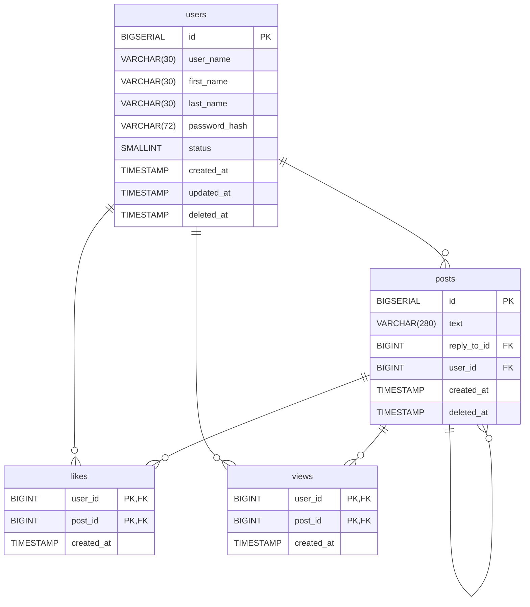

# Разработка слоя репозиториев web-приложения

Вам необходимо вручную создать SQL-таблицы, отражающие структуру социальной сети GopherTalk. Ниже описаны таблицы, их поля и связи между ними.

1. **Таблица `users`** — хранит данные пользователей.
2. **Таблица `posts`** — хранит публикации пользователей. Поле `reply_to_id` указывает на другой пост, если это ответ.
3. **Таблица `likes`** — отображает лайки пользователей к постам.
4. **Таблица `views`** — отображает просмотры постов пользователями.



### Требования:

- Используйте типы данных и ограничения согласно описанию.
- Настройте первичные и внешние ключи.
- Создайте уникальный индекс по `user_name`, но только для не удалённых пользователей (`deleted_at IS NULL`).
- Убедитесь, что `status` может быть только `0` или `1`.

> Подсказка: после создания таблиц, проверьте схему с помощью ER-диаграммы, чтобы убедиться в корректности связей.

## Архитектура приложения: контроллеры, сервисы и репозитории

Когда приложение начинает расти, добавляется всё больше бизнес-логики, валидации, работы с базой данных — и код быстро превращается в нечитаемую "кашу". Чтобы этого избежать, используется **разделение ответственности** — принцип, при котором каждый компонент отвечает только за свою задачу.

В небольших веб-приложениях удобно придерживаться следующей архитектуры:

### 1. Контроллеры (controllers)

Контроллер — это слой, который принимает HTTP-запрос, обрабатывает его и возвращает ответ. Здесь происходит:

- чтение параметров из объектов `Request`, `Path`, `Query`, `Body` или `Depends` FastAPI;,
- вызов нужного метода сервиса,
- формирование ответа (через `Response`, `JSONResponse` или возврат словаря).

Контроллер не содержит бизнес-логики и не обращается напрямую к базе данных — он просто **управляет потоком данных**. Кроме того, на уровне контроллера решаются вопросы по разграничению доступа к ресурсам и фильтрации запросов.

### 2. Сервисы (services)

Сервис — это слой, где находится основная **бизнес-логика приложения**. Он:

- обрабатывает данные,
- проверяет условия (например, "пользователь уже существует"),
- вызывает репозиторий для доступа к базе.

Сервис ничего не знает про HTTP или FastAPI — он универсален и может использоваться как в HTTP-приложении, так и, например, в CLI-утилите или фоновом скрипте.

### 3. Репозитории (repositories)

Репозиторий — это слой, отвечающий за **доступ к данным**. Обычно здесь хранятся SQL-запросы.  
Сервис говорит: "дай мне пользователя по id", а репозиторий выполняет конкретный SQL-запрос и возвращает результат.

Такой подход позволяет:

- изолировать работу с базой,
- легче писать и запускать юнит-тесты,
- менять способ хранения данных (например, заменить PostgreSQL на MongoDB) с минимальными изменениями.

### Преимущества архитектуры:

- Код становится **чище, понятнее и масштабируемее**;
- Каждый слой можно **тестировать отдельно**;
- Упрощается командная разработка — каждый работает в своей зоне ответственности;
- Легче поддерживать и расширять приложение в будущем.

В соответсвии с архитектурой мы построим разработку следующим образом: сначала разработаем слой репозитория, затем слой сервисов и в конце слой контроллеров. Для каждого слоя напишем Вам будут предоставлены unit-тесты для проверки корректности разработки конкретного слоя.

## Разработка репозитория пользователей

На этом этапе мы реализуем слой работы с базой данных — **репозиторий пользователей**.  
Задача этого слоя — обеспечивать сохранение, получение, обновление и удаление данных пользователей без участия бизнес-логики или HTTP-контроллеров.

Репозиторий будет включать методы:

- добавления нового пользователя,
- получения всех пользователей с пагинацией,
- поиска пользователя по `id` и по `user_name`,
- обновления данных пользователя,
- мягкого удаления пользователя.

Мы начнем с самого простого метода — `create_user`, который сохраняет нового пользователя в таблице `users`.  
Затем реализуем остальные методы и подключим unit-тесты для проверки корректности.

В папке `src` проекта создайте папку `repositories`, а в ней файл `user_repository.py`. Поместите в него следующий код:

```python
from config.db import pool
from psycopg.rows import dict_row


def create_user(dto: dict) -> dict:
    query = """
        INSERT INTO users (user_name, first_name, last_name, password_hash)
        VALUES (%s, %s, %s, %s)
        RETURNING id, user_name, password_hash, status;
    """
    values = (
        dto["user_name"],
        dto["first_name"],
        dto["last_name"],
        dto["password_hash"],
    )

    with pool.connection() as conn:
        with conn.cursor(row_factory=dict_row) as cur:
            cur.execute(query, values)
            return cur.fetchone()
```

Этот код реализует метод `create_user`, который отвечает за добавление нового пользователя в базу данных.

### Пошаговый разбор

- Импорт подключения к базе данных:

  ```python
  from config.db import pool
  ```

  Здесь мы импортируем заранее настроенный пул соединений с PostgreSQL, созданный с помощью `psycopg_pool.ConnectionPool` в модуле `config.db`. Через этот пул мы получаем подключения к базе и повторно их используем — без лишнего overhead'а на открытие новых TCP-сессий.

- Импорт `dict_row` для словарной формы результата:

  ```python
  from psycopg.rows import dict_row
  ```

  `dict_row` — это специальный row factory, который говорит `psycopg` возвращать строки не в виде кортежей, а в виде словарей (`dict`). Это удобно и читабельно: вместо `row[0]` можно писать `row["user_name"]`.

- Определение функции `create_user`:

  ```python
  def create_user(dto: dict) -> dict:
  ```

  Функция принимает словарь `dto`, содержащий данные нового пользователя: `user_name`, `first_name`, `last_name`, `password_hash`.
  Тип возвращаемого значения — `dict`, то есть мы возвращаем строку из базы в виде словаря.

- SQL-запрос на вставку

  ```python
  query = """
    INSERT INTO users (user_name, first_name, last_name, password_hash)
    VALUES (%s, %s, %s, %s)
    RETURNING id, user_name, password_hash, status;
  """
  ```

  Это SQL-запрос, который вставляет нового пользователя в таблицу `users`, использует позиционные параметры `%s` — безопасный способ подстановки значений и сразу возвращает `id`, `user_name`, `password_hash`, `status` — это нужно, чтобы после создания пользователя отдать его данные в API.

  ::: details SQL-инъекции
  SQL-инъекция — это один из самых распространённых видов атак на базу данных.
  Она возникает, когда ввод пользователя напрямую вставляется в SQL-запрос без проверки и экранирования, что позволяет злоумышленнику изменить логику запроса.

  **Пример уязвимого кода:**

  ```python
  cur.execute(f"SELECT * FROM users WHERE user_name = '{user_input}'")
  ```

  Вместо ожидаемого безопасного значения, пользователь ввёл строку `' OR 1=1 --`.

  В результате итоговый SQL-запрос будет выглядеть так:

  ```sql
  SELECT * FROM users WHERE user_name = '' OR 1=1 --';
  ```

  Что здесь происходит:

  - `user_name = ''` — первое условие, оно просто проверяет, что имя пользователя пустое;

  - `OR 1=1` — логическое выражение, которое всегда истинно, то есть условие выполняется для всех пользователей;

  - `--` — начало SQL-комментария, всё, что идёт после него, игнорируется СУБД;

  - `';` — эта часть уже не исполняется, так как закомментирована.

  Этот запрос вернёт всех пользователей из базы, потому что `1=1` всегда истинно. Если такой запрос используется при входе в систему, злоумышленник может войти без пароля, просто потому что запрос "обманывает" проверку логина.

  Используя позиционные параметры, мы избегаем этой проблемы:

  ```python
  cur.execute("SELECT * FROM users WHERE user_name = %s", (user_input,))
  ```

  В случае использования позиционных параметров, даже если пользователь введёт `' OR 1=1 --`, это не приведёт к SQL-инъекции, потому что ввод не вставляется напрямую в текст SQL-запроса. Вместо этого он передаётся отдельно в виде значения, а не как часть кода, а на уровне драйвера PostgreSQL (`psycopg`) реализован механизм, который:

  - экранирует специальные символы,

  - оборачивает значение в кавычки при необходимости,

  - и гарантирует, что ввод будет интерпретироваться именно как строка, а не как SQL-операторы.

  Проще говоря, драйвер сам "разделяет" SQL-код и пользовательские данные, не давая последним повлиять на логику выполнения запроса.

  Поэтому даже вредоносная строка будет просто передана как обычное значение поля `user_name`, а не как часть SQL-запроса.

  :::

- Подготовка значений для запроса:

  ```python
  values = (
    dto["user_name"],
    dto["first_name"],
    dto["last_name"],
    dto["password_hash"],
  )
  ```

  Значения берутся из входного объекта `dto` и передаются в том порядке, в котором указаны в SQL-запросе.

- Выполнение запроса

  ```python
  with pool.connection() as conn:
    with conn.cursor(row_factory=dict_row) as cur:
        cur.execute(query, values)
        return cur.fetchone()
  ```

  `pool.connection()` берёт соединение из пула, `conn.cursor(row_factory=dict_row)` создаёт курсор, возвращающий строки как словари, `cur.execute(...)` выполняет SQL-запрос, а `cur.fetchone()` возвращает первую строку результата, то есть только что созданного пользователя.

  После выполнения запроса возвращается первая (и единственная) строка результата — то есть данные только что созданного пользователя.

Мы реализовали создание пользователя. Далее необходимо реализовать следующие функции работы с пользователями:

- `get_all_users` — получение списка всех пользователей с пагинацией;
- `get_user_by_id` — получение пользователя по его `id`;
- `get_user_by_username` — получение пользователя по его имени пользователя (`user_name`);
- `update_user` — обновление данных пользователя;
- `delete_user` — мягкое удаление пользователя.

Начнём с функции `get_all_users`.

```python
from config.db import pool
from psycopg.rows import dict_row

def create_user(dto: dict) -> dict:
    query = """
        INSERT INTO users (user_name, first_name, last_name, password_hash)
        VALUES (%s, %s, %s, %s)
        RETURNING id, user_name, password_hash, status;
    """
    values = (
        dto["user_name"],
        dto["first_name"],
        dto["last_name"],
        dto["password_hash"],
    )

    with pool.connection() as conn:
        with conn.cursor(row_factory=dict_row) as cur:
            cur.execute(query, values)
            return cur.fetchone()


def get_all_users(limit: int, offset: int) -> list[dict]:
    query = """
        SELECT id, user_name, first_name, last_name, status, created_at, updated_at
        FROM users
        WHERE deleted_at IS NULL
        OFFSET %s LIMIT %s;
    """
    params = (offset, limit)

    with pool.connection() as conn:
        with conn.cursor(row_factory=dict_row) as cur:
            cur.execute(query, params)
            return cur.fetchall()
```

Обратите внимание, что метод принимает два параметра - `offset` и `limit`. Они необходимы для того, чтобы сделать пагинацию, то есть отдавать не всех пользователей сразу, а частями в рамках скользящего окна.

Перейдем к функциям `get_user_by_id` и `get_user_by_user_name`.

```python
from config.db import pool
from psycopg.rows import dict_row

def create_user(dto: dict) -> dict:
    query = """
        INSERT INTO users (user_name, first_name, last_name, password_hash)
        VALUES (%s, %s, %s, %s)
        RETURNING id, user_name, password_hash, status;
    """
    values = (
        dto["user_name"],
        dto["first_name"],
        dto["last_name"],
        dto["password_hash"],
    )

    with pool.connection() as conn:
        with conn.cursor(row_factory=dict_row) as cur:
            cur.execute(query, values)
            return cur.fetchone()


def get_all_users(limit: int, offset: int) -> list[dict]:
    query = """
        SELECT id, user_name, first_name, last_name, status, created_at, updated_at
        FROM users
        WHERE deleted_at IS NULL
        OFFSET %s LIMIT %s;
    """
    params = (offset, limit)

    with pool.connection() as conn:
        with conn.cursor(row_factory=dict_row) as cur:
            cur.execute(query, params)
            return cur.fetchall()

def get_user_by_id(user_id: int) -> dict:
    query = """
        ...
    """
    with pool.connection() as conn:
        with conn.cursor(row_factory=dict_row) as cur:
            cur.execute(query, (user_id,))
            result = cur.fetchone()

            if result is None:
                raise ValueError("User not found")

            return result

def get_user_by_username(user_name: str) -> dict:
  query = """
      ...
  """
  with pool.connection() as conn:
      with conn.cursor(row_factory=dict_row) as cur:
          cur.execute(query, (user_name,))
          result = cur.fetchone()

          if result is None:
              raise ValueError("User not found")
          return result

```

> [!IMPORTANT] Задание
> Напишите самостоятельно SQL запросы для функций `get_user_by_id` и `get_user_by_user_name`. Для метода `get_user_by_id` необходимо вернуть поля `user_name`, `first_name`, `last_name`, `status`, `created_at`, `updated_at`, а для метода `get_user_by_user_name` - `user_name`, `password_hash`, `status`.

Рассмотрим функцию `update_user`

```python
def update_user(user_id: int, dto: dict) -> dict:
    fields = []
    values = []

    if "password_hash" in dto:
        fields.append("password_hash = %s")
        values.append(dto["password_hash"])
    if "user_name" in dto:
        fields.append("user_name = %s")
        values.append(dto["user_name"])
    if "first_name" in dto:
        fields.append("first_name = %s")
        values.append(dto["first_name"])
    if "last_name" in dto:
        fields.append("last_name = %s")
        values.append(dto["last_name"])

    if not fields:
        raise ValueError("No fields to update")

    fields.append("updated_at = NOW()")
    values.append(user_id)

    query = f"""
        UPDATE users
        SET {", ".join(fields)}
        WHERE id = %s AND deleted_at IS NULL
        RETURNING id, user_name, first_name, last_name, status, created_at, updated_at;
    """

    with pool.connection() as conn:
        with conn.cursor(row_factory=dict_row) as cur:
            cur.execute(query, values)
            result = cur.fetchone()

            if result is None:
                raise ValueError("User not found")

            return result
```

Эта функция предназначена для обновления данных пользователя в базе данных. Она принимает два аргумента:

- `id`: Идентификатор пользователя, которого необходимо обновить.
- `dto`: Объект, содержащий данные для обновления.

### Логика работы функции `update_user`

1. **Инициализация**:

   - Создаются два списка:
     - `fields` — содержит SQL-строки вида `column_name = %s`;
     - `values` — содержит значения, которые будут подставлены в SQL-запрос.
   - Переменная `user_id` передаётся отдельно в конце, для подстановки в `WHERE`.

2. **Проверка и сбор полей для обновления**:

   - Функция последовательно проверяет наличие полей в словаре `dto`.
   - Если поле присутствует, оно добавляется в `fields`, а его значение — в `values`.
   - Поддерживаются следующие поля:
     - `password_hash`
     - `user_name`
     - `first_name`
     - `last_name`

3. **Проверка на пустое обновление**:

   - Если в `dto` не оказалось ни одного обновляемого поля, выбрасывается исключение `ValueError("No fields to update")`.

4. **Добавление метки времени**:

   - В `fields` добавляется `updated_at = NOW()` — это системное поле, не требующее подстановки.

5. **Формирование SQL-запроса**:

   - Поля в `fields` объединяются через запятую.
   - Генерируется SQL-запрос вида:
     ```sql
     UPDATE users SET field1 = %s, field2 = %s, ..., updated_at = NOW()
     WHERE id = %s AND deleted_at IS NULL
     RETURNING id, user_name, first_name, last_name, status, created_at, updated_at;
     ```

6. **Добавление ID в параметры запроса**:

   - В `values` добавляется `user_id` как последний аргумент, который используется в `WHERE id = %s`.

7. **Выполнение запроса**:

   - Открывается соединение с базой данных из пула.
   - Выполняется SQL-запрос через `cursor.execute(...)` с подставленными значениями.
   - Используется `row_factory=dict_row` для возврата результата в виде словаря.

8. **Обработка результата**:

   - Если пользователь не найден (`fetchone()` вернул `None`), выбрасывается `ValueError("User not found")`.
   - В противном случае возвращается результат — обновлённый пользователь в виде словаря.

Последняя функция, которую мы реализуем в этом репозитории - это функция удаления пользователя `delete_user`.

```python
def delete_user(user_id: int) -> None:
    query = """
        ...
    """

    with pool.connection() as conn:
        with conn.cursor() as cur:
            cur.execute(query, (user_id,))
            if cur.rowcount == 0:
                raise ValueError("User not found")
```

Эта функция предназначена для "удаления" пользователя из базы данных. Фактически, это мягкое удаление (soft delete), когда запись не удаляется физически, а лишь помечается как удалённая.

> [!IMPORTANT] Задание
> Напишите SQL-запрос, который выполняет мягкое удаление пользователя, устанавливая значение `deleted_at` в текущее время для пользователя с указанным `id`.

## Тестирование репозитория пользователей

В корне проекта создайте файл `pytest.ini` со следующим содержимым:

```text
[pytest]
pythonpath = ./src
```

Также в корне проекта создайте папку `__tests__`, а в ней папку `repositories`. В папке `repositories` создайте файл `test_user_repository.py` и поместите в него код с unit-тестами:

::: details Unit-тесты user_repository

```python
import pytest
from unittest.mock import patch, MagicMock
from datetime import datetime, timedelta

from repositories.user_repository import (
    create_user,
    get_all_users,
    get_user_by_id,
    get_user_by_username,
    update_user,
    delete_user,
)

def normalize_sql(sql: str) -> str:
    return " ".join(sql.lower().split())

@pytest.fixture
def mock_conn():
    with patch("config.db.pool.connection") as mock_conn_context:
        yield mock_conn_context


def test_create_user_success(mock_conn):
    dto = {
        "user_name": "john",
        "first_name": "John",
        "last_name": "Doe",
        "password_hash": "password",
    }
    expected = {
        "id": 1,
        "user_name": "john",
        "password_hash": "password",
        "status": 1,
    }

    mock_cursor = MagicMock()
    mock_cursor.fetchone.return_value = expected
    mock_conn.return_value.__enter__.return_value.cursor.return_value.__enter__.return_value = mock_cursor

    result = create_user(dto)

    assert result == expected

def test_create_user_error(mock_conn):
    dto = {
        "user_name": "john",
        "first_name": "John",
        "last_name": "Doe",
        "password_hash": "password",
    }

    fake_error = Exception("insert failed")

    mock_cursor = MagicMock()
    mock_cursor.execute.side_effect = fake_error
    mock_conn.return_value.__enter__.return_value.cursor.return_value.__enter__.return_value = mock_cursor

    with pytest.raises(Exception, match="insert failed"):
        create_user(dto)

    sql_called = mock_cursor.execute.call_args[0][0].lower()
    assert "insert into users" in sql_called
    assert "user_name" in sql_called
    assert "password_hash" in sql_called

    params = mock_cursor.execute.call_args[0][1]
    assert params == (
        dto["user_name"],
        dto["first_name"],
        dto["last_name"],
        dto["password_hash"],
    )

def test_get_all_users_success(mock_conn):
    now = datetime.utcnow()
    expected = [{
        "id": 1,
        "user_name": "john",
        "first_name": "John",
        "last_name": "Doe",
        "status": 1,
        "created_at": now,
        "updated_at": now,
    }]

    mock_cursor = MagicMock()
    mock_cursor.fetchall.return_value = expected
    mock_conn.return_value.__enter__.return_value.cursor.return_value.__enter__.return_value = mock_cursor

    result = get_all_users(limit=10, offset=0)
    assert result == expected


def test_get_all_users_error(mock_conn):
    mock_cursor = MagicMock()
    mock_cursor.execute.side_effect = Exception("SQL error")
    mock_conn.return_value.__enter__.return_value.cursor.return_value.__enter__.return_value = mock_cursor

    with pytest.raises(Exception, match="SQL error"):
        get_all_users(limit=100, offset=0)

    sql_called = mock_cursor.execute.call_args[0][0].lower()

    normalized_sql = normalize_sql(sql_called)
    assert "from users where deleted_at is null" in normalized_sql

    params = mock_cursor.execute.call_args[0][1]
    assert params == (0, 100)


def test_get_user_by_id_success(mock_conn):
    now = datetime.utcnow()
    expected = {
        "user_name": "john",
        "first_name": "John",
        "last_name": "Doe",
        "status": 1,
        "created_at": now,
        "updated_at": now,
    }

    mock_cursor = MagicMock()
    mock_cursor.fetchone.return_value = expected
    mock_conn.return_value.__enter__.return_value.cursor.return_value.__enter__.return_value = mock_cursor

    result = get_user_by_id(1)
    assert result == expected


def test_get_user_by_id_not_found(mock_conn):
    mock_cursor = MagicMock()
    mock_cursor.fetchone.return_value = None
    mock_conn.return_value.__enter__.return_value.cursor.return_value.__enter__.return_value = mock_cursor

    with pytest.raises(ValueError, match="User not found"):
        get_user_by_id(999)


def test_get_user_by_username_success(mock_conn):
    expected = {
        "user_name": "john",
        "password_hash": "password",
        "status": 1,
    }

    mock_cursor = MagicMock()
    mock_cursor.fetchone.return_value = expected
    mock_conn.return_value.__enter__.return_value.cursor.return_value.__enter__.return_value = mock_cursor

    result = get_user_by_username("john")
    assert result == expected


def test_get_user_by_username_not_found(mock_conn):
    mock_cursor = MagicMock()
    mock_cursor.fetchone.return_value = None
    mock_conn.return_value.__enter__.return_value.cursor.return_value.__enter__.return_value = mock_cursor

    with pytest.raises(ValueError, match="User not found"):
        get_user_by_username("notfound")


def test_update_user_success(mock_conn):
    now = datetime.utcnow()
    earlier = now - timedelta(hours=1)

    dto = {
        "user_name": "john_updated",
        "first_name": "John",
        "last_name": "Doe",
        "password_hash": "password",
    }

    expected = {
        "id": 1,
        "user_name": "john_updated",
        "first_name": "John",
        "last_name": "Doe",
        "status": 1,
        "created_at": earlier,
        "updated_at": now,
    }

    mock_cursor = MagicMock()
    mock_cursor.fetchone.return_value = expected
    mock_conn.return_value.__enter__.return_value.cursor.return_value.__enter__.return_value = mock_cursor

    result = update_user(1, dto)
    assert result == expected


def test_update_user_no_fields(mock_conn):
    with pytest.raises(ValueError, match="No fields to update"):
        update_user(1, {})


def test_update_user_not_found(mock_conn):
    dto = {"user_name": "ghost"}

    mock_cursor = MagicMock()
    mock_cursor.fetchone.return_value = None
    mock_conn.return_value.__enter__.return_value.cursor.return_value.__enter__.return_value = mock_cursor

    with pytest.raises(ValueError, match="User not found"):
        update_user(999, dto)


def test_delete_user_success(mock_conn):
    mock_cursor = MagicMock()
    mock_cursor.rowcount = 1
    mock_conn.return_value.__enter__.return_value.cursor.return_value.__enter__.return_value = mock_cursor

    assert delete_user(1) is None


def test_delete_user_not_found(mock_conn):
    mock_cursor = MagicMock()
    mock_cursor.rowcount = 0
    mock_conn.return_value.__enter__.return_value.cursor.return_value.__enter__.return_value = mock_cursor

    with pytest.raises(ValueError, match="User not found"):
        delete_user(2)

```

:::

После этого выполните команду

```bash
pytest-v
```

Если вы все сделали правильно, все тесты пройдены.

```bash
tests/repositories/test_user_repository.py::test_create_user_success PASSED                                                                         [  7%]
tests/repositories/test_user_repository.py::test_create_user_error PASSED                                                                           [ 15%]
tests/repositories/test_user_repository.py::test_get_all_users_success PASSED                                                                       [ 23%]
tests/repositories/test_user_repository.py::test_get_all_users_error PASSED                                                                         [ 30%]
tests/repositories/test_user_repository.py::test_get_user_by_id_success PASSED                                                                      [ 38%]
tests/repositories/test_user_repository.py::test_get_user_by_id_not_found PASSED                                                                    [ 46%]
tests/repositories/test_user_repository.py::test_get_user_by_username_success PASSED                                                                [ 53%]
tests/repositories/test_user_repository.py::test_get_user_by_username_not_found PASSED                                                              [ 61%]
tests/repositories/test_user_repository.py::test_update_user_success PASSED                                                                         [ 69%]
tests/repositories/test_user_repository.py::test_update_user_no_fields PASSED                                                                       [ 76%]
tests/repositories/test_user_repository.py::test_update_user_not_found PASSED                                                                       [ 84%]
tests/repositories/test_user_repository.py::test_delete_user_success PASSED                                                                         [ 92%]
tests/repositories/test_user_repository.py::test_delete_user_not_found PASSED                                                                       [100%]

=================================================================== 13 passed in 0.12s ====================================================================
```

## Разработка репозитория постов

На этом этапе мы реализуем **репозиторий постов** — слой, отвечающий за взаимодействие с таблицей `posts`, а также связанными с ней таблицами `likes`, `views` и вложенными ответами (реплаями).

Репозиторий постов будет включать следующие методы:

- создание нового поста (`createPost`);
- получение списка постов с фильтрацией и пагинацией (`getAllPosts`);
- получение одного поста по `id`, включая автора, количество лайков, просмотров и ответов (`getPostByID`);
- удаление поста владельцем (`deletePost`);
- отметка, что пользователь просмотрел пост (`viewPost`);
- лайк/дизлайк поста (`likePost`, `dislikePost`).

Мы начнем с реализации метода `createPost`, затем последовательно опишем остальные. Все методы взаимодействуют с базой через SQL-запросы, используют подстановки для защиты от SQL-инъекций и возвращают данные в формате DTO.

Создайте файл `src/repositories/postRepository.js`, в него поместите следующий код:

```python
import { pool } from "../db/index.js";

export const PostRepository = {
  async createPost(dto) {
    const query = `...`;
    const values = [dto.text, dto.user_id, dto.reply_to_id];
    const res = await pool.query(query, values);
    return res.rows[0];
  },
};
```

Пояснение:

- `dto` — объект, содержащий данные нового поста (`text`, `user_id`, `reply_to_id`);

- SQL-запрос вставляет данные в таблицу posts;

- После вставки сразу возвращаются поля нового поста: `id`, `text`, `created_at`, `reply_to_id`.

> [!IMPORTANT] Задание
> В соответствии с пояснением напишите SQL запрос для добавления нового поста. Не забудьте использовать позиционные параметры `$1`, `$2`, `$3` — для предотвращения SQL-инъекций

Метод `getAllPosts` возвращает список постов с расширенной информацией: количество лайков, просмотров, ответов, а также информацию о пользователе и отметках "нравится" и "просмотрено" от текущего пользователя.

```python
async getAllPosts(dto) {
    const params = [dto.user_id];
    let query = `
      WITH likes_count AS (
        SELECT post_id, COUNT(*) AS likes_count
        FROM likes GROUP BY post_id
      ),
      views_count AS (
        SELECT post_id, COUNT(*) AS views_count
        FROM views GROUP BY post_id
      ),
      replies_count AS (
        SELECT reply_to_id, COUNT(*) AS replies_count
        FROM posts WHERE reply_to_id IS NOT NULL GROUP BY reply_to_id
      )
      SELECT
        p.id, p.text, p.reply_to_id, p.created_at,
        u.id AS user_id, u.user_name, u.first_name, u.last_name,
        COALESCE(lc.likes_count, 0) AS likes_count,
        COALESCE(vc.views_count, 0) AS views_count,
        COALESCE(rc.replies_count, 0) AS replies_count,
        CASE WHEN l.user_id IS NOT NULL THEN true ELSE false END AS user_liked,
        CASE WHEN v.user_id IS NOT NULL THEN true ELSE false END AS user_viewed
      FROM posts p
      JOIN users u ON p.user_id = u.id
      LEFT JOIN likes_count lc ON p.id = lc.post_id
      LEFT JOIN views_count vc ON p.id = vc.post_id
      LEFT JOIN replies_count rc ON p.id = rc.reply_to_id
      LEFT JOIN likes l ON l.post_id = p.id AND l.user_id = $1
      LEFT JOIN views v ON v.post_id = p.id AND v.user_id = $1
      WHERE p.deleted_at IS NULL
    `;

    if (dto.search) {
      query += ` AND p.text ILIKE $${params.length + 1}`;
      params.push(`%${dto.search}%`);
    }

    if (dto.owner_id) {
      query += ` AND p.user_id = $${params.length + 1}`;
      params.push(dto.owner_id);
    }

    if (dto.reply_to_id) {
      query += ` AND p.reply_to_id = $${params.length + 1} ORDER BY p.created_at ASC`;
      params.push(dto.reply_to_id);
    } else {
      query += ` AND p.reply_to_id IS NULL ORDER BY p.created_at DESC`;
    }

    query += ` OFFSET $${params.length + 1} LIMIT $${params.length + 2}`;
    params.push(dto.offset, dto.limit);

    const res = await pool.query(query, params);

    return res.rows.map((row) => ({
      id: row.id,
      text: row.text,
      reply_to_id: row.reply_to_id,
      created_at: row.created_at,
      likes_count: row.likes_count,
      views_count: row.views_count,
      replies_count: row.replies_count,
      user_liked: row.user_liked,
      user_viewed: row.user_viewed,
      user: {
        id: row.user_id,
        user_name: row.user_name,
        first_name: row.first_name,
        last_name: row.last_name,
      },
    }));
  }
```

Метод `getAllPosts` предназначен для получения списка публикаций с расширенной информацией:

- автор поста;

- количество лайков, просмотров, ответов;

- флаги, лайкнул и/или просматривал ли текущий пользователь этот пост.

#### Структура SQL-запроса

Запрос построен с использованием CTE (Common Table Expressions) и выглядит следующим образом:

```sql
WITH likes_count AS (...),
     views_count AS (...),
     replies_count AS (...)
SELECT ...
FROM posts ...
```

Рассмотрим все части по порядку.

#### 1. Подсчёт количества лайков к каждому посту

```sql
likes_count AS (
  SELECT post_id, COUNT(*) AS likes_count
  FROM likes
  GROUP BY post_id
)
```

Здесь из таблицы `likes` собирается информация о количестве лайков для каждого поста. Используется `GROUP BY post_id`, чтобы сгруппировать лайки по постам.

#### 2. Подсчёт количества просмотров

```sql
views_count AS (
  SELECT post_id, COUNT(*) AS views_count
  FROM views
  GROUP BY post_id
)
```

Аналогично первой CTE, но теперь считаются просмотры из таблицы `views`.

#### 3. Подсчёт количества ответов на каждый пост

```sql
replies_count AS (
  SELECT reply_to_id, COUNT(*) AS replies_count
  FROM posts
  WHERE reply_to_id IS NOT NULL
  GROUP BY reply_to_id
)
```

Здесь из самой таблицы `posts` выбираются те строки, где `reply_to_id IS NOT NULL`, то есть это ответы на другие посты. Считается, сколько таких ответов у каждого родительского поста.

#### 4. Основной запрос

```sql
SELECT
  p.id, p.text, p.reply_to_id, p.created_at,
  u.id AS user_id, u.user_name, u.first_name, u.last_name,
  COALESCE(lc.likes_count, 0) AS likes_count,
  COALESCE(vc.views_count, 0) AS views_count,
  COALESCE(rc.replies_count, 0) AS replies_count,
  CASE WHEN l.user_id IS NOT NULL THEN true ELSE false END AS user_liked,
  CASE WHEN v.user_id IS NOT NULL THEN true ELSE false END AS user_viewed
FROM posts p
JOIN users u ON p.user_id = u.id
LEFT JOIN likes_count lc ON p.id = lc.post_id
LEFT JOIN views_count vc ON p.id = vc.post_id
LEFT JOIN replies_count rc ON p.id = rc.reply_to_id
LEFT JOIN likes l ON l.post_id = p.id AND l.user_id = $1
LEFT JOIN views v ON v.post_id = p.id AND v.user_id = $1
WHERE p.deleted_at IS NULL
...
```

Что здесь происходит:

- `JOIN users` — соединение поста с его автором по `user_id`;

- `LEFT JOIN` с `likes_count`, `views_count`, `replies_count` — добавляются данные из CTE о количестве лайков, просмотров и ответов;

- `LEFT JOIN likes l` и `views v` — проверяется, поставил ли лайк или просмотр текущий пользователь (`$1` — его id). Эти поля используются в логических выражениях ниже;

- `CASE WHEN ... THEN true ELSE false` — определяет `user_liked` и `user_viewed`;

- `COALESCE(..., 0)` — если данных о лайках/просмотрах/ответах нет (например, никто не лайкал), подставляется `0`;

- `WHERE p.deleted_at IS NULL` — фильтрация: берутся только не удалённые посты.

#### 5. Дополнительные фильтры

**По тексту:**

```sql
if (dto.search) {
  query += ` AND p.text ILIKE $${params.length + 1}`;
  params.push(`%${dto.search}%`);
}
```

Если передана строка `search`, ищутся посты, в тексте которых есть соответствие.

**По пользователю (автору):**

```sql
if (dto.owner_id) {
  query += ` AND p.user_id = $${params.length + 1}`;
  params.push(dto.owner_id);
}
```

Если передан `owner_id`, отбираются посты конкретного пользователя.

**По ответам:**

```sql
if (dto.reply_to_id) {
  query += ` AND p.reply_to_id = $${params.length + 1} ORDER BY p.created_at ASC`;
} else {
  query += ` AND p.reply_to_id IS NULL ORDER BY p.created_at DESC`;
}
```

Проверяется, являются ли посты ответами на другой пост (`reply_to_id`) или это корневые посты.

#### 6. Пагинация

```python
query += ` OFFSET $${params.length + 1} LIMIT $${params.length + 2}`;
params.push(dto.offset, dto.limit);
```

Реализуется механика "скользящего окна" — выбирается определённый диапазон постов.

#### 7. Возвращаемый результат

Результат собирается в виде массива постов. Каждый пост содержит:

- данные самого поста,

- данные автора (`user`),

- количество лайков, просмотров, ответов,

- флаги `user_liked`, `user_viewed`.

Далее рассмотрим реализацию метода `getPostById`.

```python
import { pool } from "../db/index.js";

export const PostRepository = {
  async getPostById(postId, userId) {
    const query = `
      WITH likes_count AS (
        SELECT post_id, COUNT(*) AS likes_count
        FROM likes
        GROUP BY post_id
      ),
      views_count AS (
        SELECT post_id, COUNT(*) AS views_count
        FROM views
        GROUP BY post_id
      ),
      replies_count AS (
        SELECT reply_to_id, COUNT(*) AS replies_count
        FROM posts
        WHERE reply_to_id IS NOT NULL
        GROUP BY reply_to_id
      )
      SELECT
        p.id AS post_id,
        p.text,
        p.reply_to_id,
        p.created_at,
        u.id AS user_id,
        u.user_name,
        u.first_name,
        u.last_name,
        COALESCE(lc.likes_count, 0) AS likes_count,
        COALESCE(vc.views_count, 0) AS views_count,
        COALESCE(rc.replies_count, 0) AS replies_count,
        CASE WHEN l.user_id IS NOT NULL THEN true ELSE false END AS user_liked,
        CASE WHEN v.user_id IS NOT NULL THEN true ELSE false END AS user_viewed
      FROM posts p
      JOIN users u ON p.user_id = u.id
      LEFT JOIN likes_count lc ON p.id = lc.post_id
      LEFT JOIN views_count vc ON p.id = vc.post_id
      LEFT JOIN replies_count rc ON p.id = rc.reply_to_id
      LEFT JOIN likes l ON l.post_id = p.id AND l.user_id = $1
      LEFT JOIN views v ON v.post_id = p.id AND v.user_id = $1
      WHERE p.id = $2 AND p.deleted_at IS NULL;
    `;

    const res = await pool.query(query, [userId, postId]);
    if (res.rowCount === 0) {
      throw new Error("Post not found");
    }

    const row = res.rows[0];
    return {
      id: row.post_id,
      text: row.text,
      reply_to_id: row.reply_to_id,
      created_at: row.created_at,
      likes_count: row.likes_count,
      views_count: row.views_count,
      replies_count: row.replies_count,
      user_liked: row.user_liked,
      user_viewed: row.user_viewed,
      user: {
        id: row.user_id,
        user_name: row.user_name,
        first_name: row.first_name,
        last_name: row.last_name,
      },
    };
  },
};
```

Метод `getPostById` используется для получения одного конкретного поста по его идентификатору. Он возвращает расширенную информацию по посту, включая лайки, просмотры, количество ответов и данные об авторе. Метод похож на `getAllPosts`, за исключением некоторых отличий.

**Фильтрация по ID поста**

Вместо выборки множества записей, запрос ограничивается одним постом:

```sql
WHERE p.id = $2 AND p.deleted_at IS NULL
```

Первый параметр (`$1`) — это `user_id` (нужен для определения, лайкнул ли/просматривал ли пользователь пост),
второй (`$2`) — это ID самого поста, который ищется.

**Отсутствует пагинация**

Метод возвращает только один пост, поэтому нет `OFFSET` и `LIMIT`.

**Возвращаемое значение**

`getPostById` возвращает один объект поста, а `getAllPosts` - массив.

**Обработка крайних случаев**

Если пост не найден, `getPostById` выбрасывает исключение "Post not found", а `getAllPosts` возвращает пустой массив.

Перейдем к реализации метода `deletePost` в репозитории `PostRepository`

```python
async deletePost(id, ownerId) {
  const query = `...`;
  const res = await pool.query(query, [id, ownerId]);
  if (res.rowCount === 0) {
    throw new Error("Post not found or already deleted");
  }
}
```

> [!IMPORTANT] Задание
> Реализуйте метод `deletePost`, который помечает пост как удалённый. SQL-запрос должен обновлять поле `deleted_at` текущим временем, работать только с постами, принадлежащими автору и исключать уже удалённые посты.

Теперь реализуем метод, который регистрирует факт просмотра поста пользователем. Каждый пользователь может просмотреть пост только один раз — повторные просмотры не записываются.

```python
async function viewPost(postId, userId) {
  const query = `...`;

  try {
    const res = await pool.query(query, [postId, userId]);
    if (res.rowCount === 0) {
      throw new Error("Post not found");
    }
  } catch (err) {
    if (err.message.includes("pk__views")) {
      throw new Error("Post already viewed");
    }
    throw err;
  }
}
```

> [!CAUTION] Внимание
> Обратите внимание на строку `err.message.includes("pk__views")`. Здесь `pk__views` - это имя первичного ключа у таблицы `views`. Подставьте свое, если у вас отличается.

> [!IMPORTANT] Задание
> Реализуйте метод `viewPost`, который добавляет новую запись в таблицу `views`.

Теперь реализуем метод, который позволяет пользователю поставить лайк посту. Один пользователь может поставить лайк одному посту только один раз — повторные попытки должны вызывать ошибку.

```python
async function likePost(postId, userId) {
  const query = `...`;

  try {
    const res = await pool.query(query, [postId, userId]);
    if (res.rowCount === 0) {
      throw new Error("Post not found");
    }
  } catch (err) {
    if (err.message.includes("pk__likes")) {
      throw new Error("Post already liked");
    }
    throw err;
  }
}
```

> [!CAUTION] Внимание
> Обратите внимание на строку `err.message.includes("pk__likes")`. Здесь `pk__likes` - это имя первичного ключа у таблицы `likes`. Подставьте свое, если у вас отличается.

> [!IMPORTANT] Задание
> Реализуйте метод `likePost`, который добавляет новую запись в таблицу `likes`.

Метод `dislikePost` позволяет пользователю убрать лайк с поста, если он его ранее поставил.

```python
async function dislikePost(postId, userId) {
  const query = `...`;

  const res = await pool.query(query, [postId, userId]);

  if (res.rowCount === 0) {
    throw new Error("Post not found");
  }
}
```

> [!IMPORTANT] Задание
> Реализуйте метод `dislikePost`, который удаляет запись из таблицы `likes`.

## Тестирование репозитория постов

В папке `__tests__/repositories` создайте файл `postRepository.test.js` и поместите в него код с unit-тестами:

::: details Unit-тесты postRepository

```python
import { describe, expect, jest } from "@jest/globals";
import { pool } from "../../src/config/db.js";
import { PostRepository } from "../../src/repositories/postRepository.js";

function normalizeSQL(sql) {
  return sql.toLowerCase().replace(/\s+/g, " ").trim();
}

describe("PostRepository", () => {
  afterEach(() => {
    jest.clearAllMocks();
  });

  describe("createPost", () => {
    it("should successfully create a post", async () => {
      const mock = jest.spyOn(pool, "query");

      const dto = {
        text: "Lorem ipsum dolor sit amet, consectetur adipiscing",
        user_id: 1,
        reply_to_id: null,
      };

      const expected = {
        id: 1,
        text: dto.text,
        created_at: new Date(),
        reply_to_id: null,
      };

      mock.mockResolvedValueOnce({ rows: [expected], rowCount: 1 });

      const result = await PostRepository.createPost(dto);

      expect(result).toEqual(expected);

      const [sql, params] = mock.mock.calls[0];
      const normalizedSQL = normalizeSQL(sql);
      expect(normalizedSQL).toContain("insert into posts");
      expect(params).toEqual([dto.text, dto.user_id, dto.reply_to_id]);
    });

    it("should return error on insert failure", async () => {
      const mock = jest.spyOn(pool, "query");

      const dto = {
        text: "Lorem ipsum dolor sit amet, consectetur adipiscing",
        user_id: 1,
        reply_to_id: null,
      };

      const fakeError = new Error("insert failed");
      mock.mockRejectedValueOnce(fakeError);

      await expect(PostRepository.createPost(dto)).rejects.toThrow(
        "insert failed"
      );

      const [sql, params] = mock.mock.calls[0];
      const normalizedSQL = normalizeSQL(sql);
      expect(normalizedSQL).toContain("insert into posts");
      expect(params).toEqual([dto.text, dto.user_id, dto.reply_to_id]);
    });
  });

  describe("getAllPosts", () => {
    it("should successfully return all posts", async () => {
      const mock = jest.spyOn(pool, "query");

      const now = new Date("2025-04-24T20:55:53.021Z");

      const dto = {
        user_id: 1,
        owner_id: 0,
        limit: 100,
        offset: 0,
        reply_to_id: 1,
        search: "test",
      };

      const rows = [
        {
          id: 1,
          text: "Post 1",
          reply_to_id: null,
          created_at: now,
          likes_count: 10,
          views_count: 100,
          replies_count: 0,
          user_liked: true,
          user_viewed: true,
          user_id: 1,
          user_name: "username",
          first_name: "first",
          last_name: "last",
        },
        {
          id: 2,
          text: "Post 2",
          reply_to_id: null,
          created_at: now,
          likes_count: 5,
          views_count: 50,
          replies_count: 2,
          user_liked: false,
          user_viewed: true,
          user_id: 1,
          user_name: "username",
          first_name: "first",
          last_name: "last",
        },
      ];

      mock.mockResolvedValueOnce({ rows, rowCount: rows.length });

      const result = await PostRepository.getAllPosts(dto);

      expect(result).toHaveLength(2);
      expect(result[0].id).toBe(1);
      expect(result[1].likes_count).toBe(5);

      const [sql, params] = mock.mock.calls[0];
      const normalized = normalizeSQL(sql);
      expect(normalized).toContain("select");
      expect(params[0]).toBe(dto.user_id);
    });

    it("should return error on SQL failure", async () => {
      const mock = jest.spyOn(pool, "query");

      const dto = {
        user_id: 1,
        owner_id: 0,
        limit: 100,
        offset: 0,
        reply_to_id: 1,
        search: "test",
      };

      mock.mockRejectedValueOnce(new Error("query failed"));

      await expect(PostRepository.getAllPosts(dto)).rejects.toThrow(
        "query failed"
      );

      const [sql, params] = mock.mock.calls[0];
      const normalized = normalizeSQL(sql);
      expect(normalized).toContain("select");
      expect(params[0]).toBe(dto.user_id);
    });
  });

  describe("getPostById", () => {
    it("should successfully get post by ID", async () => {
      const userId = 1;
      const postId = 1;
      const now = new Date();

      const row = {
        post_id: postId,
        text: "Lorem ipsum dolor sit amet, consectetur adipiscing",
        reply_to_id: null,
        created_at: now,
        user_id: userId,
        user_name: "username",
        first_name: "first_name",
        last_name: "last_name",
        likes_count: 10,
        views_count: 100,
        replies_count: 0,
        user_liked: true,
        user_viewed: true,
      };

      const mock = jest.spyOn(pool, "query");
      mock.mockResolvedValueOnce({ rows: [row], rowCount: 1 });

      const result = await PostRepository.getPostById(postId, userId);

      expect(result).toEqual({
        id: row.post_id,
        text: row.text,
        reply_to_id: row.reply_to_id,
        created_at: row.created_at,
        likes_count: row.likes_count,
        views_count: row.views_count,
        replies_count: row.replies_count,
        user_liked: row.user_liked,
        user_viewed: row.user_viewed,
        user: {
          id: row.user_id,
          user_name: row.user_name,
          first_name: row.first_name,
          last_name: row.last_name,
        },
      });

      const [sql, params] = mock.mock.calls[0];
      expect(normalizeSQL(sql)).toContain("select");
      expect(params).toEqual([userId, postId]);
    });

    it("should throw error if post not found", async () => {
      const mock = jest.spyOn(pool, "query");
      mock.mockResolvedValueOnce({ rows: [], rowCount: 0 });

      await expect(PostRepository.getPostById(999, 1)).rejects.toThrow(
        "Post not found"
      );

      const [sql, params] = mock.mock.calls[0];
      expect(normalizeSQL(sql)).toContain("select");
      expect(params).toEqual([1, 999]);
    });
  });

  describe("deletePost", () => {
    it("should successfully delete post", async () => {
      const postId = 1;
      const ownerId = 1;

      const mock = jest.spyOn(pool, "query");
      mock.mockResolvedValueOnce({ rowCount: 1 });

      await expect(
        PostRepository.deletePost(postId, ownerId)
      ).resolves.toBeUndefined();

      const [sql, params] = mock.mock.calls[0];
      const normalizedSQL = normalizeSQL(sql);
      expect(normalizedSQL).toContain("update posts set deleted_at = now()");
      expect(normalizedSQL).toContain("where id = $1 and user_id = $2");
      expect(params).toEqual([postId, ownerId]);
    });

    it("should return error if post not found", async () => {
      const postId = 2;
      const ownerId = 1;

      const mock = jest.spyOn(pool, "query");
      mock.mockResolvedValueOnce({ rowCount: 0 });

      await expect(PostRepository.deletePost(postId, ownerId)).rejects.toThrow(
        "Post not found or already deleted"
      );

      const [sql, params] = mock.mock.calls[0];
      const normalizedSQL = normalizeSQL(sql);
      expect(normalizedSQL).toContain("update posts set deleted_at = now()");
      expect(params).toEqual([postId, ownerId]);
    });
  });

  describe("viewPost", () => {
    it("should successfully register a view", async () => {
      const postId = 1;
      const userId = 1;

      const mock = jest.spyOn(pool, "query");
      mock.mockResolvedValueOnce({ rowCount: 1 });

      await expect(
        PostRepository.viewPost(postId, userId)
      ).resolves.toBeUndefined();

      const [sql, params] = mock.mock.calls[0];
      const normalizedSQL = normalizeSQL(sql);
      expect(normalizedSQL).toContain("insert into views (post_id, user_id)");
      expect(params).toEqual([postId, userId]);
    });

    it("should throw error on SQL failure", async () => {
      const postId = 2;
      const userId = 1;

      const mock = jest.spyOn(pool, "query");
      mock.mockRejectedValueOnce(new Error("insert failed"));

      await expect(PostRepository.viewPost(postId, userId)).rejects.toThrow(
        "insert failed"
      );

      const [sql, params] = mock.mock.calls[0];
      const normalizedSQL = normalizeSQL(sql);
      expect(normalizedSQL).toContain("insert into views (post_id, user_id)");
      expect(params).toEqual([postId, userId]);
    });

    it("should throw already viewed error on unique constraint", async () => {
      const postId = 3;
      const userId = 1;

      const mock = jest.spyOn(pool, "query");
      mock.mockRejectedValueOnce(
        new Error('duplicate key value violates unique constraint "pk__views"')
      );

      await expect(PostRepository.viewPost(postId, userId)).rejects.toThrow(
        "Post already viewed"
      );
    });
  });

  describe("likePost", () => {
    it("should successfully like a post", async () => {
      const postId = 1;
      const userId = 1;

      const mock = jest.spyOn(pool, "query");
      mock.mockResolvedValueOnce({ rowCount: 1 });

      await expect(
        PostRepository.likePost(postId, userId)
      ).resolves.toBeUndefined();

      const [sql, params] = mock.mock.calls[0];
      const normalizedSQL = normalizeSQL(sql);
      expect(normalizedSQL).toContain("insert into likes (post_id, user_id)");
      expect(params).toEqual([postId, userId]);
    });

    it("should return error if like fails", async () => {
      const postId = 2;
      const userId = 1;

      const mock = jest.spyOn(pool, "query");
      mock.mockRejectedValueOnce(new Error("insert failed"));

      await expect(PostRepository.likePost(postId, userId)).rejects.toThrow(
        "insert failed"
      );

      const [sql, params] = mock.mock.calls[0];
      const normalizedSQL = normalizeSQL(sql);
      expect(normalizedSQL).toContain("insert into likes (post_id, user_id)");
      expect(params).toEqual([postId, userId]);
    });

    it("should return 'already liked' error if constraint is violated", async () => {
      const postId = 3;
      const userId = 1;

      const mock = jest.spyOn(pool, "query");
      mock.mockRejectedValueOnce(
        new Error('duplicate key value violates unique constraint "pk__likes"')
      );

      await expect(PostRepository.likePost(postId, userId)).rejects.toThrow(
        "Post already liked"
      );
    });
  });

  describe("dislikePost", () => {
    it("should successfully remove a like from a post", async () => {
      const postId = 1;
      const userId = 1;

      const mock = jest.spyOn(pool, "query");
      mock.mockResolvedValueOnce({ rowCount: 1 });

      await expect(
        PostRepository.dislikePost(postId, userId)
      ).resolves.toBeUndefined();

      const [sql, params] = mock.mock.calls[0];
      const normalizedSQL = normalizeSQL(sql);
      expect(normalizedSQL).toContain(
        "delete from likes where post_id = $1 and user_id = $2"
      );
      expect(params).toEqual([postId, userId]);
    });

    it("should return error if dislike fails", async () => {
      const postId = 2;
      const userId = 1;

      const mock = jest.spyOn(pool, "query");
      mock.mockRejectedValueOnce(new Error("delete failed"));

      await expect(PostRepository.dislikePost(postId, userId)).rejects.toThrow(
        "delete failed"
      );

      const [sql, params] = mock.mock.calls[0];
      const normalizedSQL = normalizeSQL(sql);
      expect(normalizedSQL).toContain(
        "delete from likes where post_id = $1 and user_id = $2"
      );
      expect(params).toEqual([postId, userId]);
    });

    it("should return error if like does not exist", async () => {
      const postId = 3;
      const userId = 1;

      const mock = jest.spyOn(pool, "query");
      mock.mockResolvedValueOnce({ rowCount: 0 });

      await expect(PostRepository.dislikePost(postId, userId)).rejects.toThrow(
        "Post not found"
      );

      const [sql, params] = mock.mock.calls[0];
      const normalizedSQL = normalizeSQL(sql);
      expect(normalizedSQL).toContain(
        "delete from likes where post_id = $1 and user_id = $2"
      );
      expect(params).toEqual([postId, userId]);
    });
  });
});
```

:::

Запустите тесты. Если вы все сделали правильно, все тесты пройдены.

```bash
npm run test

> gophertalk-backend-express@0.1.0 test
> node --experimental-vm-modules node_modules/jest/bin/jest.js

(node:26001) ExperimentalWarning: VM Modules is an experimental feature and might change at any time
(Use `node --trace-warnings ...` to show where the warning was created)
 PASS  __tests__/repositories/postRepository.test.js
 PASS  __tests__/repositories/userRepository.test.js

Test Suites: 2 passed, 2 total
Tests:       30 passed, 30 total
Snapshots:   0 total
Time:        0.196 s, estimated 1 s
Ran all test suites.
```

## Итог

Мы последовательно разработали два слоя доступа к данным — репозиторий пользователей и репозиторий постов, следуя архитектурному принципу разделения ответственности. Мы:

- Создали функции для основных операций с базой данных (создание, чтение, обновление, удаление).

- Реализовали SQL-запросы с использованием позиционных параметров, обеспечивающих защиту от SQL-инъекций.

- Поддержали гибкие фильтры, пагинацию и условия отбора данных (например, по `user_id`, `reply_to_id`, `text`).

- Обработали все возможные ошибки, включая ситуации "не найдено" и конфликты при повторных действиях (например, повторный лайк).

- Написали юнит-тесты, чтобы убедиться в корректности реализации всех функций.

Такой подход делает код читаемым, легко поддерживаемым и расширяемым. Теперь мы готовы перейти к разработке следующего слоя — функционального (сервисов), где будет реализована логика обработки данных и проверок перед их отправкой в репозитории.
