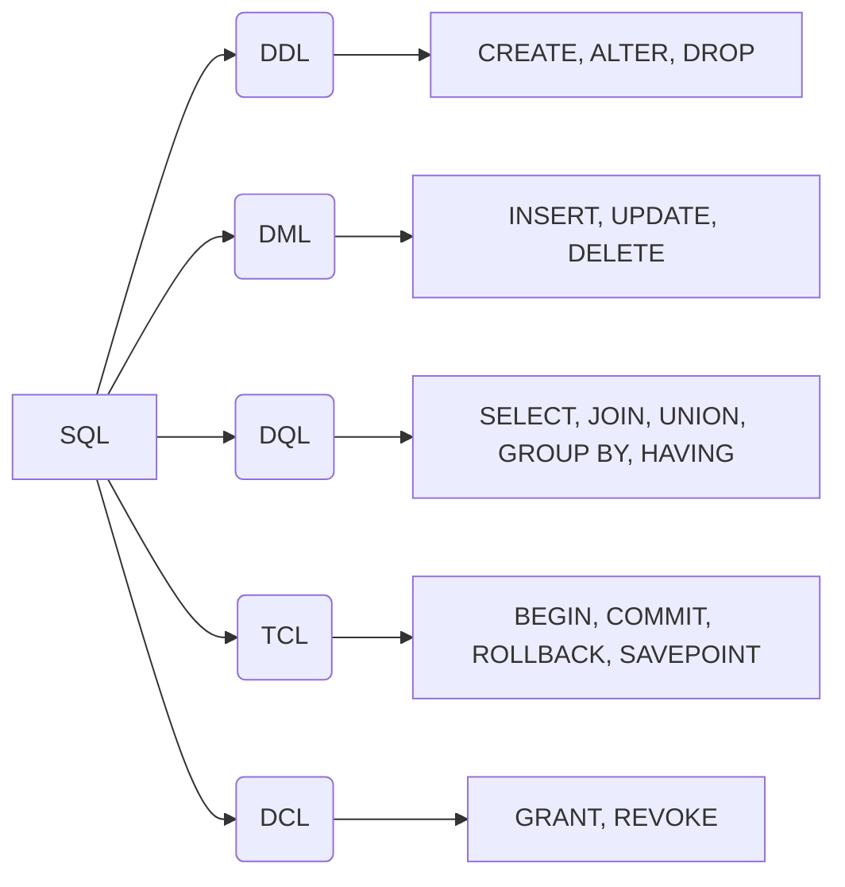

<script setup>
import Conversation from "../../../../components/Conversation.vue";
import alexey from "../../../assets/databases/heroes/clerk_alexey.png";
import ivan from "../../../assets/databases/heroes/clerk_ivan.png";
import petr from "../../../assets/databases/heroes/petr.png";
import { defineAsyncComponent } from "vue";

const Repl = defineAsyncComponent(() => import("../../../../components/Repl.vue"))

</script>

# Простой запрос. Использование выражений в запросе

## Введение

1682 год. В России скончался царь Фёдор III Алексеевич, старший сын царя Алексея Михайловича. Его смерть вызвала серьёзный политический кризис и борьбу за власть между двумя влиятельными родами — Милославскими и Нарышкиными.

Милославские поддерживали старшего брата Фёдора — Ивана Алексеевича, а Нарышкины — младшего, Петра Алексеевича. В Москве вспыхнул Стрелецкий бунт, в ходе которого стрельцы открыто поддержали Ивана, выступая против усиления влияния Петра и Нарышкиных.

В итоге была достигнута политическая компромиссная договорённость: власть была разделена между двумя царями — Иваном V и Петром I, при этом фактически сосредоточилась в руках их сестры Софьи Алексеевны, которая стала регентшей при малолетних царях.

В это время молодой Пётр жил в царской резиденции в селе Преображенском под Москвой. Там он начал формировать свои первые воинские части — Потешные полки, появившиеся примерно в 1683 году. Эти полки стали основой будущих реформ в армии и военной организации России.

Пётр увлекался европейскими военными новшествами и, вместе с друзьями, проводил военные учения, закладывая фундамент военной мощи будущей России.

1686 год. В нашей истории рядом с Петром находятся два дьяка (герои вымышленные).


- Дьяк Алексей — опытный государственный служащий, помощник Петра в административных делах.
- Дьяк Иван — молодой помощник Алексея, которому поручают вести учёт и составлять отчёты.
  Они оба работают в царской администрации, где ведётся учёт воинских подразделений и других данных.

<Conversation :phrases="[
    {
        name: 'Петр',
        position: 'left',
        text: 'Алексей, надобно мне ведомость полков Потешных — кто командует, где стоят, сколь воинов в каждом. Пусть Иван составит полную таблицу',
        photo: petr
    },
    {
        name: 'Алексей',
        position: 'right',
        text: 'Будет исполнено, государь. Иван, приготовь список полков с полной информацией.',
        photo: alexey
    },
    {
        name: 'Иван',
        position: 'left',
        text: 'Господин мой, как выбрать все данные из таблицы?',
        photo: ivan
    }
]"/>

## Немного про SQL

**SQL (Structured Query Language)** — это язык программирования, предназначенный для управления и работы с реляционными базами данных. Он позволяет создавать, изменять и получать данные из таблиц, которые хранят информацию в виде строк и столбцов.

SQL, являясь языком для управления базами данных, позволяет создавать настоящие программы, состоящие из последовательности SQL-команд (запросов), разделённых точкой с запятой. Эти команды определяют, какие данные необходимо извлечь или какие действия следует выполнить с информацией: добавить, изменить или удалить.

SQL — это декларативный язык. Используя SQL-запросы, пользователь указывает базе данных, что именно он хочет получить. Запрос направляется в СУБД, которая отвечает за его выполнение.

Запросы могут быть разными: создание или изменение структуры данных, модификация данных, выборка информации и многое другое. В зависимости от цели, каждый запрос относится к определенному разделу языка.

Все SQL-запросы делятся на категории по типу взаимодействия с данными. Понимание этой классификации полезно при разработке и администрировании баз данных. Классификация помогает структурировать знания об SQL, а общая терминология упрощает взаимодействие между разработчиками и другими специалистами.

SQL широко используется в бизнесе, науке, веб-разработке, аналитике и многих других областях, где необходима работа с большими объёмами данных.

## Подмножества SQL



### DDL — Data Definition Language (Язык определения данных)

DDL — язык описания данных. Команды DDL позволяют создавать, изменять и удалять объекты баз данных.

Основные операторы DDL:

- `CREATE` — создаёт новые базы данных, схемы, таблицы и другие объекты базы данных.
- `ALTER` — изменяет объекты БД. Например, в таблицах этот оператор может добавлять и удалять столбцы, а также изменять их тип.
- `DROP` — удаляет любые объекты БД, в том числе саму базу. **Осторожнее с этим оператором:** если у вас нет резервной копии, восстановить данные после удаления не получится.

### DML — Data Manipulation Language (Язык манипулирования данными)

DML — язык манипулирования данными. Команды DML позволяют изменять данные, хранящиеся в таблицах.

Основные операторы DML:

- `INSERT` — вставляет новые строки данных в таблицу.
- `UPDATE` — обновляет существующие данные в таблице.
- `DELETE` — удаляет строки данных из таблицы.

### DQL — Data Query Language (Язык запроса данных)

DQL — язык запроса данных. Команды DQL позволяют извлекать данные из базы. В некоторых версиях классификации SQL этот раздел объединяют с DML, но мы выделим его в отдельную категорию. Потому что команды DQL лишь извлекают данные и позволяют по-разному их отображать, но не изменяют данные.

Основные операторы DQL:

- `SELECT` — извлекает данные из базы.
- `JOIN`, `UNION`, `GROUP BY`, `HAVING` и другие — выполняют сложные запросы.

### TCL — Transaction Control Language (Язык управления транзакциями)

TCL — язык управления транзакциями.

Основные операторы TCL:

- `COMMIT` — подтверждает текущую транзакцию и сохраняет изменения в базе данных.
- `ROLLBACK` — откатывает текущую транзакцию и отменяет все несохранённые изменения.
- `SAVEPOINT` — создаёт точку сохранения в текущей транзакции для возможности частичного отката.

### DCL — Data Control Language (Язык управления доступом к данным)

DCL — язык управления доступа к данным.

Основные операторы DCL:

- `GRANT` — предоставляет права доступа к БД и её объектам.
- `REVOKE` — отзывает права доступа.

## Структура и стиль SQL-запросов

SQL-запрос состоит из нескольких ключевых элементов:

- **Ключевые слова**: Зарезервированные слова с определенным функционалом (например, `SELECT`, `WHERE`, `UPDATE`, `SET`). Разные диалекты SQL могут иметь свои уникальные ключевые слова.
- **Идентификаторы**: Имена объектов базы данных, таких как таблицы и столбцы (например, `name`, `surname`, `birth_date`).
- **Константы**: Числовые или строковые значения (например, оценка `5`, фамилия `Исаев`).
- **Специальные символы**: Символы, используемые в запросах, такие как `*`, `(`, `)`, `,`, `;`.

Ключевые слова иногда называют операторами (например, `SELECT`, `UPDATE`), в то время как `SET` чаще называют инструкцией или выражением. Операторы также включают символы или слова, определяющие действия над выражениями (например, `>`, `<`, `=`, `OR`, `AND`).

В данном курсе мы будем преимущественно использовать термин "ключевое слово" для большей ясности.

Состав необходимой структуры запроса определяется его синтаксисом. Например, запрос `UPDATE` требует наличия инструкции `SET`, а для `INSERT` существует несколько вариантов написания.

Регистр символов в большинстве диалектов SQL, включая PostgreSQL, обычно не имеет значения (например, `uPDaTE sOme_TaBle SeT coluMN = 2;` будет работать). Однако, рекомендуется писать ключевые слова заглавными буквами, а идентификаторы - строчными, для улучшения читаемости кода.

::: details Когда важен регистр символов в SQL

В общем случае, SQL не чувствителен к регистру символов. Однако, существуют ситуации, когда регистр необходимо учитывать. Если в базе данных имена столбцов или таблиц содержат заглавные буквы (что не рекомендуется), то в SQL-запросе эти имена необходимо заключать в двойные кавычки и строго соблюдать регистр.

Например, в PostgreSQL `Name` и `name` — это два разных идентификатора. Можно создать таблицу с двумя такими столбцами и хранить в них разные данные. В этом случае запрос `SELECT Name FROM table;` вернёт данные из столбца `name`, так как по умолчанию SQL не учитывает регистр. Чтобы обратиться к столбцу `Name`, необходимо указать его имя в двойных кавычках: `SELECT "Name" FROM table;`.
:::

## Комментарии в SQL

Программисты часто комментируют свой код для пояснения логики или временного исключения участков кода (хотя и не все!). SQL также предоставляет такую возможность.

### Однострочные комментарии

Для добавления однострочного комментария в SQL используются два минуса (`--`). Всё, что следует после `--` в той же строке, будет проигнорировано при выполнении запроса. Например:

```sql
SELECT * FROM users; -- Получить всех пользователей
```

### Многострочные комментарии

Для добавления многострочного комментария используются символы `/*` в начале комментария и символы `*/` в конце. Всё, что находится между `/*` и `*/`, будет проигнорировано. Например:

```sql
/*
Этот запрос выбирает все данные из таблицы users.
Он используется для получения списка всех зарегистрированных пользователей.
*/
SELECT * FROM users;
```

## Команда `SELECT`

<Conversation :phrases="[
      {
          name: 'Иван',
          position: 'left',
          text: 'Алексей, как же выбрать все данные из таблицы?',
          photo: ivan
      },
      {
          name: 'Алексей',
          position: 'right',
          text: 'Просто, Иван! Сейчас расскажу',
          photo: alexey
      }
  ]"/>

В рамках текущего занятия мы будем работать с таблицей, содержащей информацию о Потешных полках — воинских формированиях эпохи Петра I. Эта таблица поможет нам освоить основные приемы выборки данных с помощью SQL.

| id  | name      | surname    | birth_date | location        | soldiers_count | is_historical |
| --- | --------- | ---------- | ---------- | --------------- | -------------- | ------------- |
| 1   | Сергей    | Бухвостов  | 1659-01-01 | Преображенское  | 1200           | true          |
| 2   | Александр | Меншиков   | 1673-11-16 | Семёновское     | 1100           | true          |
| 3   | Патрик    | Гордон     | 1635-03-31 | Измайлово       | 900            | true          |
| 4   | Фёдор     | Матвеевич  | 1661-12-07 | Москва          | 800            | true          |
| 5   | Иван      | Кантемир   | 1668-01-05 | Новгород        | 700            | false         |
| 6   | Иван      | Шереметев  | 1670-07-22 | Санкт-Петербург | 650            | false         |
| 7   | Михаил    | Голицын    | 1675-04-30 | Москва          | 600            | false         |
| 8   | Василий   | Долгорукий | 1662-12-12 | NULL            | 550            | false         |
| 9   | Дмитрий   | Трубецкой  | 1678-05-18 | Ярославль       | 500            | false         |
| 10  | Андрей    | Воронцов   | 1672-10-25 | Санкт-Петербург | 450            | false         |
| 11  | Николай   | Репнин     | 1676-08-14 | Москва          | 400            | false         |
| 12  | Иван      | Романов    | 1669-03-03 | Санкт-Петербург | 380            | false         |
| 13  | Алексей   | Орлов      | 1674-11-21 | Новгород        | 360            | false         |
| 14  | Дмитрий   | Волконский | 1667-06-11 | NULL            | 340            | false         |
| 15  | Сергей    | Романов    | 1671-02-28 | Москва          | 320            | false         |
| 16  | Пётр      | Козлов     | 1679-09-07 | Санкт-Петербург | 300            | false         |
| 17  | Иван      | Ширинский  | 1673-05-15 | Ярославль       | 280            | false         |
| 18  | Михаил    | Кутузов    | 1670-12-01 | Москва          | 260            | false         |
| 19  | Алексей   | Лопухин    | 1666-07-19 | NULL            | 240            | false         |
| 20  | Василий   | Трубецкой  | 1677-04-22 | Санкт-Петербург | 220            | false         |

Таблица состоит из 20 строк и следующих столбцов:

- `id` — уникальный идентификатор записи (первичный ключ).

- `name` — имя командира полка.

- `surname` — фамилия командира полка.

- `birth_date` — дата рождения командира в формате ГГГГ-ММ-ДД.

- `location` — место расположения соответствующего Потешного полка.

- `soldiers_count` — численность солдат в полку.

- `is_historical` — признак, указывающий, является ли полк реальным историческим подразделением («Да») или вымышленным для учебных целей («Вымышленный»).

Используя эту таблицу, мы будем практиковаться в составлении SQL-запросов для выборки и преобразования данных.

<Repl :initial-queries="[
`CREATE TABLE poteshnye_polki (
    id SERIAL PRIMARY KEY,
    name VARCHAR(255),
    surname VARCHAR(255),
    birth_date DATE,
    location VARCHAR(255),
    soldiers_count INTEGER,
    is_historical BOOLEAN
);`,
`INSERT INTO poteshnye_polki (name, surname, birth_date, location, soldiers_count, is_historical) VALUES
('Сергей', 'Бухвостов', '1659-01-01', 'Преображенское', 1200, TRUE),
('Александр', 'Меншиков', '1673-11-16', 'Семёновское', 1100, TRUE),
('Патрик', 'Гордон', '1635-03-31', 'Измайлово', 900, TRUE),
('Фёдор', 'Матвеевич', '1661-12-07', 'Москва', 800, TRUE),
('Иван', 'Кантемир', '1668-01-05', 'Новгород', 700, FALSE),
('Иван', 'Шереметев', '1670-07-22', 'Санкт-Петербург', 650, FALSE),
('Михаил', 'Голицын', '1675-04-30', 'Москва', 600, FALSE),
('Василий', 'Долгорукий', '1662-12-12', NULL, 550, FALSE),
('Дмитрий', 'Трубецкой', '1678-05-18', 'Ярославль', 500, FALSE),
('Андрей', 'Воронцов', '1672-10-25', 'Санкт-Петербург', 450, FALSE),
('Николай', 'Репнин', '1676-08-14', 'Москва', 400, FALSE),
('Иван', 'Романов', '1669-03-03', 'Санкт-Петербург', 380, FALSE),
('Алексей', 'Орлов', '1674-11-21', 'Новгород', 360, FALSE),
('Дмитрий', 'Волконский', '1667-06-11', NULL, 340, FALSE),
('Сергей', 'Романов', '1671-02-28', 'Москва', 320, FALSE),
('Пётр', 'Козлов', '1679-09-07', 'Санкт-Петербург', 300, FALSE),
('Иван', 'Ширинский', '1673-05-15', 'Ярославль', 280, FALSE),
('Михаил', 'Кутузов', '1670-12-01', 'Москва', 260, FALSE),
('Алексей', 'Лопухин', '1666-07-19', NULL, 240, FALSE),
('Василий', 'Трубецкой', '1677-04-22', 'Санкт-Петербург', 220, FALSE);`
]"/>

Начнем с базового синтаксиса.

```sql
SELECT <столбцы или *> FROM <таблица>;
```

После ключевого слова `SELECT` нужно указать либо столбцы, либо символ `*`. Например:

```sql
SELECT * FROM poteshnye_polki;
```

Этот запрос выбирает все строки и все столбцы из таблицы. Это удобно, когда нужно быстро получить полную информацию.
Однако при больших таблицах это может привести к избыточному объёму данных и нагрузке на систему.

::: details Важность указания столбцов в запросах (Best Practices)
При работе с SQL, особенно в составе программ, рекомендуется придерживаться хорошей практики — явно указывать список столбцов в запросах `SELECT`.

```sql
SELECT column1, column2, column3 FROM table_name;
```

Почему это важно?

- Производительность: Запрос `SELECT *` возвращает все столбцы таблицы, даже если вам нужны только некоторые из них. Это увеличивает объем передаваемых данных, что может замедлить работу приложения, особенно при работе с большими таблицами или по сети. Явное указание нужных столбцов снижает нагрузку на сервер базы данных и сеть.

- Явность и читаемость: Запрос с перечислением столбцов более понятен. Читая код, сразу видно, какие именно данные запрашиваются.

- Устойчивость к изменениям схемы: Если в таблицу добавят новые столбцы, запрос `SELECT *` начнет возвращать и их. Это может нарушить логику приложения, если оно не рассчитано на новые данные. Явное указание столбцов гарантирует, что будут получены только ожидаемые данные.

Однако, в некоторых ситуациях использование `SELECT *` оправдано:

- Быстрые прототипы и эксперименты: При разработке или анализе данных может быть удобно быстро просмотреть все столбцы таблицы, чтобы понять ее структуру и содержимое.

- Одноразовые запросы: Если запрос выполняется вручную для получения какой-то информации, нет смысла тратить время на перечисление столбцов.

- Инструменты для анализа данных: Некоторые инструменты для работы с данными автоматически обрабатывают все столбцы таблицы, и в этом случае `SELECT *` может быть оптимальным решением.

Выбор между `SELECT *` и явным перечислением столбцов зависит от конкретной ситуации. В программном коде, который должен быть производительным и устойчивым к изменениям, лучше указывать столбцы явно. При быстрых исследованиях и одноразовых запросах `SELECT *` может быть удобнее.

:::

```sql
SELECT name, surname FROM poteshnye_polki;
```

Так мы выберем все строки из таблицы `poteshnye_polki`, но только столбцы `name` и `surname`.

<Conversation :phrases="[
    {
        name: 'Петр',
        position: 'left',
        text: 'Иван, мне достаточно знать имя и фамилию командира в одном столбце и сколько воинов в полку, но с прибавкой 100 новых рекрутов.',
        photo: petr
    },
    {
        name: 'Иван',
        position: 'right',
        text: 'Значит, нужно выбрать имя и фамилию вместе и прибавить 100 к числу солдат?',
        photo: ivan
    },
    {
        name: 'Алексей',
        position: 'left',
        text: 'Верно, Иван. SQL умеет делать арифметику и объединять строки.',
        photo: alexey
    }
]"/>

В SQL можно создавать вычисляемые столбцы, используя арифметические операции: `+`, `-`, `*`, `/` и пр.

```sql
SELECT name, surname, soldiers_count, soldiers_count + 100
FROM poteshnye_polki;
```

Здесь прибавляем 100 рекрутов к числу солдат.

В PostgreSQL строки объединяются оператором ||:

```sql
SELECT name || ' ' || surname, location FROM poteshnye_polki;
```

Можно также и комбинировать:

```sql
SELECT name || ' ' || surname, soldiers_count + 100 FROM poteshnye_polki;
```

<Conversation :phrases="[
    {
        name: 'Иван',
        position: 'right',
        text: 'Алексей, а если в таблице несколько одинаковых записей, как убрать повторы?',
        photo: ivan
    },
    {
        name: 'Алексей',
        position: 'left',
        text: 'Для этого есть ключевое слово DISTINCT. Оно удаляет дубликаты.',
        photo: alexey
    }
]"/>

`DISTINCT` — оператор, который возвращает только уникальные строки по выбранным столбцам.

В теории реляционной алгебры операция, аналогичная `SELECT`, называется проекцией. Она выбирает из таблицы только указанные столбцы и удаляет дубликаты — то есть в результате остаются только уникальные строки.

В SQL по умолчанию дубликаты не удаляются. Чтобы получить уникальные строки, нужно использовать ключевое слово `DISTINCT`.

Так можно выбрать все уникальные имена из таблицы:

```sql
SELECT DISTINCT name, location FROM poteshnye_polki;
```

А вот пример выбора уникальных сочетаний имени и места:

```sql
SELECT DISTINCT name, location FROM poteshnye_polki;
```

PostgreSQL расширяет стандарт SQL и позволяет выбирать уникальные строки по одному или нескольким столбцам с помощью `DISTINCT ON`. Это полезно, когда нужно получить по одной записи на каждое уникальное значение, сохраняя остальные столбцы.

Допустим, нужно получить по одной записи для каждого уникального значения в столбце `is_historical` (то есть выбрать по одному полку для исторических и вымышленных):

```sql
SELECT DISTINCT ON (is_historical) id, name, surname, location, is_historical
FROM poteshnye_polki;
```

Здесь мы берем по одной записи для каждого значения колонки is_historical. Поскольку сортировка не задана, выборка может быть произвольной записи для каждой группы. Запросы с `DISTINCT ON` чаще делают совместно с сортировкой.

## Оператор `CASE WHEN`

В SQL часто требуется не просто получить данные, но и представить их в удобном для анализа виде. Для этого используют условный оператор `CASE WHEN`.

С помощью `CASE WHEN` можно создавать вычисляемые столбцы, значения которых зависят от заданных условий. Это позволяет категоризировать данные, преобразовывать значения и делать выборки более информативными.

```sql
CASE
    WHEN <условие 1> THEN <результат в случае, если условие 1 верно>
    WHEN <условие 2> THEN <результат в случае, если условие 2 верно>
--  ...
    WHEN <условие n> THEN <результат в случае, если условие n верно>
--  опционально
    ELSE <результат в случае, если ни одно из условий не верно>
END;
```

В операторе `CASE WHEN` условия проверяются последовательно, в том порядке, в котором они указаны. Как только одно из условий оказывается истинным, оператор возвращает соответствующее этому условию значение, и дальнейшие условия уже не проверяются.

Использование ключевого слова `ELSE` в операторе `CASE WHEN` необязательно. Если ни одно из условий `WHEN` не выполнено и при этом отсутствует блок `ELSE`, то результатом оператора будет значение `NULL`.

<Conversation :phrases="[
    {
        name: 'Иван',
        position: 'left',
        text: 'Алексей, а можно в запросе добавить условие, чтобы, например, если солдат больше 1000, писать «Большой полк», а иначе — «Малый»?',
        photo: ivan
    },
    {
        name: 'Алексей',
        position: 'right',
        text: 'Конечно! Для этого есть конструкция CASE WHEN.',
        photo: alexey
    }
]"/>

```sql
SELECT name || ' ' || surname,
       soldiers_count,
       CASE
         WHEN soldiers_count > 1000 THEN 'Большой полк'
         ELSE 'Малый полк'
       END
FROM poteshnye_polki;
```

В этом примере создаётся столбец, который принимает значение `Большой полк`, если численность солдат превышает `1000`, и `Малый полк` в противном случае.

## Псевдонимы

Псевдоним — это альтернативное имя, которое можно присвоить столбцу данных, выбранному из таблицы или сформированному в результате вычисления. Для назначения псевдонима используется ключевое слово `AS` либо просто указывается новое имя после названия столбца или выражения через пробел. Это помогает сделать вывод более понятным и удобочитаемым.

<Conversation :phrases="[
    {
        name: 'Петр',
        position: 'left',
        text: 'Алексей, ведомость давайте с названиями столбцов на русском, чтобы легче было читать.',
        photo: petr
    }
]"/>

```sql
SELECT name || ' ' || surname AS "ФИО командира", soldiers_count + 100 AS "Число воинов"
FROM poteshnye_polki;
```

В этом примере колонка, которая получилась путем конкатенации `name` и `surname` получила название `"ФИО командира"`, а колонка арифметической операцией - `"Число воинов"`.

В SQL псевдонимы можно присваивать не только столбцам, но и таблицам. Синтаксис остается тем же: используется ключевое слово `AS` или просто добавляется псевдоним после названия таблицы через пробел.

```sql
SELECT name, location FROM poteshnye_polki pp;

-- псевдоним таблицы можно использовать как префикс к имени столбца
SELECT pp.name, pp.location FROM poteshnye_polki pp;
```

Псевдонимы для таблиц часто используются для сокращения длинных имен, но особенно полезны в сложных запросах, которые обращаются к нескольким таблицам. Такие запросы будут рассмотрены в следующих уроках.

В приведенном примере `pp` — это псевдоним для таблицы `poteshnye_polki`. После присвоения псевдонима, можно использовать `pp.name` вместо `poteshnye_polki.name` для обращения к столбцу name.

## Использование SELECT для вычислений

Как вы уже знаете, команда `SELECT ... FROM ...;` позволяет извлекать данные из таблиц. Но возможности `SELECT` этим не ограничиваются.

В PostgreSQL (и некоторых других СУБД) команду `SELECT` можно использовать как простой калькулятор. Ключевое слово `FROM` при этом не является обязательным. Это не самый эффективный способ использования базы данных, но полезно знать о такой возможности. Также с помощью `SELECT` вызываются функции.

```sql
SELECT 2 + 2; -- Вычисляет 2 + 2
SELECT sqrt(16); -- Вычисляет квадратный корень из 16
SELECT now(); -- Возвращает текущую дату и время
SELECT upper('hello'); -- Преобразует строку в верхний регистр
```

## Преобразование типов данных (`CAST`)


При использовании команды `SELECT` ранее, возможно, вы не задумывались о типах данных в столбцах результирующей выборки. Если внутри запроса `SELECT` не выполнять никаких преобразований, то тип данных в результирующем наборе совпадет с типом данных столбца, из которого были выбраны данные. Это естественно, и чаще всего это именно то, что нам и нужно.

Однако, иногда возникает необходимость изменить тип выгружаемых данных, используя числовые выражения.

<Conversation :phrases="[
  {
    name: 'Петр',
    position: 'left',
    text: 'Алексей, хочу знать, насколько хорошо укомплектован каждый полк! Сделай мне ведомость.',
    photo: petr,
  },
  {
    name: 'Алексей',
    position: 'right',
    text: 'Будет исполнено, государь! Но как быть, если максимальная численность полка нам известна, а количество солдат — целое число?',
    photo: alexey,
  },
  {
    name: 'Иван',
    position: 'left',
    text: 'Я знаю! Надо что-то с типами данных сделать, чтобы доля получилась!',
    photo: ivan,
  },
]"/>

Рассмотрим пример с нашими потешными полками. У нас есть столбец `soldiers_count` — количество солдат в полку. Допустим, мы хотим вычислить коэффициент, показывающий, насколько заполнен полк, зная, что максимальная численность полка — `1500` человек. Мы могли бы попытаться сделать это следующим образом:

```sql
SELECT
    name,
    soldiers_count,
    (soldiers_count / 1500) AS fill_rate
FROM
    poteshnye_polki;
```

Но результат может быть не совсем тем, как ожидалось: `fill_rate` будет равен `0`.

Почему так получилось? Дело в том, что столбец `soldiers_count` имеет тип `integer` (целое число). Когда PostgreSQL выполняет деление двух целых чисел, результат автоматически округляется до целого числа. В нашем случае, если количество солдат меньше `1500`, то доля будет меньше `1`, и результат округлится до `0`.

Чтобы получить более точный результат, необходимо привести хотя бы одно из чисел к типу `real` (число с плавающей точкой, либо любому другому типу чисел с плавающей точкой).

### Приведение типов с помощью `CAST`

Для преобразования значений одного типа в другой в PostgreSQL есть функция `CAST`. Её синтаксис:

```sql
CAST(<значение> AS <новый тип>)
```

Чтобы получить долю солдат в виде числа с плавающей точкой, мы можем изменить запрос следующим образом:

```sql
SELECT
    name,
    soldiers_count,
    (CAST(soldiers_count AS real) / 1500) AS fill_rate
FROM
    poteshnye_polki;
```

Приведение типов с помощью оператора `::` (двойное двоеточие):

В PostgreSQL вместо `CAST` можно использовать более короткий оператор `::`. Его синтаксис:

```sql
<значение>::<новый тип>
```

Запрос на вычисление коэффициента заполненности полка с использованием этого оператора будет выглядеть так:

```sql
SELECT
    name,
    soldiers_count,
    (soldiers_count::real / 1500) AS fill_rate
FROM
    poteshnye_polki;
```

Оба этих запроса возвращают результат в виде длинной дроби. Чтобы получить округленный результат, можно преобразовать данные к типу `numeric` — числу с заданной точностью. Например, `numeric(3, 2)` означает три цифры, две из которых находятся после десятичной точки:

```sql
SELECT
    name,
    soldiers_count,
    ((soldiers_count::real / 1500)::numeric(3, 2)) AS fill_rate
FROM
    poteshnye_polki;
```

Преобразование типов данных — важный инструмент в SQL, который позволяет получать более точные и удобные для анализа результаты. Используйте `CAST` или оператор `::`, когда необходимо изменить тип данных в запросе.

# Фильтрация данных. Поиск по шаблону

Мы научились выбирать данные из таблицы, создавать вычисляемые столбцы и использовать условный оператор `CASE WHEN` для категоризации данных. Мы узнали, как получить всю информацию из таблицы или только определенные столбцы, как убрать дубликаты и как переименовать столбцы для удобства.

Но что, если нам нужны не все данные, а только те, которые соответствуют определенным критериям? Например, мы хотим получить список только тех полков, которые находятся в Москве, или список командиров, родившихся после определенной даты.

В реляционной алгебре операция, позволяющая выбирать строки, удовлетворяющие заданному условию, называется **выборкой (selection)**. В SQL для реализации этой операции используется оператор `WHERE`. Он позволяет фильтровать данные, выбирая только те строки, которые соответствуют заданному условию.

<Conversation :phrases="[ 
    {
        name: 'Петр', 
        position: 'left', 
        text: 'Алексей, хочу ведомость только по полкам, которые в Москве стоят. Остальные не интересны!', 
        photo: petr, 
    }, 
    { 
        name: 'Алексей', 
        position: 'right', 
        text: 'Будет исполнено, государь. Иван, подготовь список, но только для московских полков.', 
        photo: alexey, 
    }, 
    { 
        name: 'Иван', 
        position: 'left',
        text: 'Алексей, а как это сделать? Мы же только выбирали все данные или уникальные...', 
        photo: ivan, 
    }, 
]" />

## Фильтрация выборки — `WHERE`

Выборку всех строк из таблицы применяют достаточно редко и, как правило, для небольших таблиц. Чаще всего запрос составляют так, чтобы получить определённые строки таблицы, соответствующие заданным условиям. Для этого в запросе используют ключевое слово `WHERE`.

Вот общий синтаксис запроса с `WHERE`:

```sql
SELECT <столбец 1>, <столбец 2>, … <столбец n>
FROM <имя таблицы>
WHERE <условие>;
```

Конструкция `WHERE`, как правило, сравнивает значения в столбце с заранее известным значением, а в выборку попадают только те строки, где сравнение верно.

Например, запрос для поиска командиров из Москвы будет выглядеть так:

```sql
SELECT name, surname
FROM poteshnye_polki
WHERE location = 'Москва';
```

Результатом такого запроса станет выборка из нескольких строк, потому что в Москве расположены не все полки.

## Операторы сравнения

Для сравнения значений в PostgreSQL используют операторы:

- `=` равно
- `<>`, `!=` не равно
- `>` больше
- `<` меньше
- `>=` больше или равно
- `<=` меньше или равно

Эти операторы применяют для сравнения чисел, строк, дат, значений времени и временных меток (`timestamp`).

Ещё есть операторы для сравнения с `NULL`:

- `IS NULL` — значение отсутствует.
- `IS NOT NULL` — присутствует любое значение.

Стандартные операторы сравнения не используют с `NULL`, поэтому выражения типа `field = NULL` или `field <> NULL` некорректны — их результатом будет `NULL`, а не `true` или `false`.

Вот несколько примеров с операторами сравнения, адаптированные под нашу таблицу `poteshnye_polki`:

**`=` (равно):**

```sql
-- Командиры, чье имя "Иван"
SELECT name, surname FROM poteshnye_polki WHERE name = 'Иван';
```

**`<>` или `!=` (не равно):**

```sql
-- Командиры не из Москвы
SELECT name, surname, location FROM poteshnye_polki WHERE location <> 'Москва';
```

**`>` (больше):**

```sql
-- Полки, в которых больше 700 солдат
SELECT name, surname, soldiers_count FROM poteshnye_polki WHERE soldiers_count > 700;
```

**`<` (меньше):**

```sql
-- Полки, в которых меньше 400 солдат
SELECT name, surname, soldiers_count FROM poteshnye_polki WHERE soldiers_count < 400;
```

**`>=` (больше или равно):**

```sql
-- Полки, в которых 500 и более солдат
SELECT name, surname, soldiers_count FROM poteshnye_polki WHERE soldiers_count >= 500;
```

**`<=` (меньше или равно):**

```sql
-- Полки, в которых 300 или менее солдат
SELECT name, surname, soldiers_count FROM poteshnye_polki WHERE soldiers_count <= 300;
```

**`IS NULL` (значение отсутствует):**

```sql
-- Командиры, у которых не указано местоположение
SELECT name, surname FROM poteshnye_polki WHERE location IS NULL;
```

**`IS NOT NULL` (значение присутствует):**

```sql
-- Командиры, у которых обязательно указано местоположение
SELECT name, surname FROM poteshnye_polki WHERE location IS NOT NULL;
```

## Операторы `AND`, `OR`, `NOT`

Чем сложнее задача, тем сложнее будут условия для выборки. Например, вам нужно выбрать все исторические полки, расположенные в Москве или Новгороде. В этом случае одним условием в `WHERE` не обойтись, придётся скомбинировать несколько условий с помощью логических операторов. Этими операторами можно объединять условия или выбирать всё, что этим условиям не соответствует. В SQL таких операторов три: `AND`, `OR` и `NOT`.

Эти операторы объединяют или исключают условия:

- `AND` — вернёт истинное значение (`true`), если **все** условия, которые объединяет этот оператор, истинны. То есть выгружаемые данные должны соответствовать всем перечисленным условиям.
- `OR` — вернёт истинное значение (`true`), если **хотя бы одно** из условий, которые объединяет этот оператор, истинно. Выгружаемые данные должны соответствовать хотя бы одному из перечисленных условий.
- `NOT` — меняет значение логического выражения с истинного (`true`) на ложное (`false`) и наоборот. Выгружаемые данные должны **не соответствовать** заданному условию.

Вот как выглядит синтаксис запросов с логическими операторами:

```sql
-- Командиры из Москвы или Санкт-Петербурга
SELECT name, surname, location FROM poteshnye_polki WHERE location = 'Москва' OR location = 'Санкт-Петербург';

-- Командиры, родившиеся после 1670 года и с количеством солдат больше 300
SELECT name, surname, birth_date, soldiers_count
FROM poteshnye_polki
WHERE birth_date >= '1670-01-01' AND soldiers_count > 300;

-- Все полки, которые НЕ являются историческими
SELECT name, surname, is_historical FROM poteshnye_polki WHERE NOT is_historical;

-- Все полки, которые НЕ являются историческими, и в которых больше 500 солдат
SELECT name, surname, is_historical FROM poteshnye_polki WHERE NOT is_historical AND soldiers_count > 500;
```

Когда условий много, используют скобки. Например, вам нужно выбрать имена и количество солдат в исторических полках, расположенных в Москве или Санкт-Петербурге. В таком запросе без скобок в условии не обойтись, потому что без скобок запрос выполнится не так, как вам нужно, или не выполнится вовсе.

В логических выражениях приоритет скобок выше приоритета операторов — как в математике. Это значит, что сначала выполняются действия в скобках, а затем остальные операторы в таком порядке:

1.  сначала `NOT`,
2.  затем `AND`,
3.  и в конце `OR`.

Вот как используют скобки:

```sql
SELECT name, soldiers_count
FROM poteshnye_polki
WHERE
(location = 'Москва' OR location = 'Санкт-Петербург')
AND
is_historical = TRUE;
```

## Операторы `IN`, `BETWEEN`

В некоторых случаях условия можно записать короче, применив операторы `IN` и `BETWEEN`:

- `IN (v1, v2, … vN)` — выбирает значение из списка. Значения, по которым нужно фильтровать данные, перечисляют в скобках.
- `NOT IN (v1, v2, … vN)` — выбирает значение, которое **не** соответствует списку. Список значений также перечисляют в скобках.
- `BETWEEN x AND y` — выбирает значение, которое равно `x` или `y` или находится в промежутке между ними (включая `x` и `y`).

Вот как выглядит синтаксис запросов с этими операторами, адаптированные под нашу таблицу `poteshnye_polki`:

**`IN` (выбор из списка):**

```sql
-- Командиры из Москвы, Санкт-Петербурга или Новгорода
SELECT name, surname, location
FROM poteshnye_polki
WHERE location IN ('Москва', 'Санкт-Петербург', 'Новгород');
```

**`NOT IN` (исключение из списка):**

```sql
-- Командиры не из Москвы и не из Санкт-Петербурга
SELECT name, surname, location
FROM poteshnye_polki
WHERE location NOT IN ('Москва', 'Санкт-Петербург');
```

**`BETWEEN` (диапазон):**

```sql
-- Командиры, родившиеся в период с 1670 по 1675 год (включительно)
SELECT name, surname, birth_date
FROM poteshnye_polki
WHERE birth_date BETWEEN '1670-01-01' AND '1675-12-31';

-- Полки, в которых численность солдат между 300 и 500 (включительно)
SELECT name, surname, soldiers_count
FROM poteshnye_polki
WHERE soldiers_count BETWEEN 300 AND 500;
```

## Операторы `LIKE`, `ILIKE`

<Conversation
:phrases="[
{
name: 'Иван',
position: 'left',
text: 'Алексей, хочу найти всех командиров, у которых имя начинается на «И», но когда пишу `WHERE name = И` ничего не находится! Что я делаю не так?',
photo: ivan,
},
{
name: 'Алексей',
position: 'right',
text: 'Иван, оператор `=` предназначен для точного соответствия. Чтобы найти всех командиров, чье имя начинается на «И», нужно использовать оператор `LIKE` или `ILIKE`.',
photo: alexey,
},
]"
/>

## Операторы LIKE и ILIKE

Кроме операторов для сравнения строк, широко используют оператор поиска по шаблону `LIKE`. Он позволяет находить строки, которые соответствуют определённому шаблону. Чтобы задать шаблон, используют специальные символы.

- Знак процента `%` — показывает, что на этой позиции в строке может быть любое количество символов (включая их отсутствие).

  - Шаблон `'%SQL%'` — найдёт строки, которые содержат слово “SQL” где угодно внутри строки: «мы изучаем SQL», «знание SQL востребовано на рынке труда» или “SQL — Structured Query Language”.
  - Шаблон `'SQL%'` — найдёт строки, которые начинаются с подстроки “SQL”.
  - Шаблон `'%SQL'` — найдёт строки, которые заканчиваются подстрокой “SQL”.

- Знак подчеркивания `_` — показывает, что на этой позиции в строке должен быть ровно один символ.
  - Например, шаблон `c_t` найдёт строки, в которых между символами "c" и "t" находится ровно один символ, например, "cat" или "cut". Строка "curt" не попадёт в выборку, так как одно подчёркивание соответствует одному знаку.

Общий синтаксис запросов с этими операторами такой:

```sql
<строка> LIKE <шаблон>;
<строка> NOT LIKE <шаблон>;
```

Выражение `NOT LIKE` возвращает ложь (`false`), когда `LIKE` возвращает `true`, и наоборот. Это выражение равносильно выражению `NOT (строка LIKE шаблон)`.

Например:

```sql
-- Найти все полки, расположенные в местах, названия которых начинаются с "П"
SELECT name, surname, location FROM poteshnye_polki WHERE location LIKE 'П%';

-- Найти все полки, расположенные в местах, названия которых заканчиваются на "о"
SELECT name, surname, location FROM poteshnye_polki WHERE location LIKE '%о';

-- Найти все полки, где имя командира состоит из 4 букв, а вторая буква - "в"
SELECT name, surname FROM poteshnye_polki WHERE name LIKE '_в__';

```

Типичная рабочая задача, когда применяют оператор `LIKE` — поиск по таблице. Допустим, нужно выбрать определённые полки, в которых в фамилии командира есть "ов". Запрос, который выведет все подходящие для него полки, выглядит так:

```sql
SELECT name, surname, location
FROM poteshnye_polki
WHERE surname LIKE '%ов%';
```

Обратите внимание на регистр. Составленный вами запрос будет искать только записи, где подстрока «ов» написана строчными буквами.

Для таких случаев в PostgreSQL есть оператор `ILIKE`. Он также ищет по шаблону, но в отличие от `LIKE` не учитывает прописные и строчные буквы.

```sql
SELECT name, surname, location
FROM poteshnye_polki
WHERE surname ILIKE '%Ов%';
```

Такой запрос найдёт все строки, в фамилии которых встречается подстрока "ов", написанная в любом регистре.

## Регулярные выражения `SIMILAR TO`

<Conversation
:phrases="[
{
name: 'Иван',
position: 'left',
text: 'Алексей, я научился искать командиров по имени, но могу только точно указать имя. А как найти всех, у кого в имени есть, например, \'ан\'? А если еще что-то сложнее появится?',
photo: ivan,
},
{
name: 'Алексей',
position: 'right',
text: 'Иван, для простых шаблонов подходит `LIKE`, а если нужны более сложные правила поиска, нужно использовать регулярные выражения и оператор `SIMILAR TO`.',
photo: alexey,
},
]"
/>

Оператор `SIMILAR TO` возвращает `true` или `false` в зависимости от того, соответствует ли данная строка шаблону или нет. Он работает подобно оператору `LIKE`, только его шаблоны соответствуют определению регулярных выражений в стандарте SQL. Регулярные выражения SQL представляют собой гибрид синтаксиса `LIKE` с синтаксисом обычных регулярных выражений (POSIX).

```sql
строка SIMILAR TO шаблон [ESCAPE спецсимвол]
строка NOT SIMILAR TO шаблон [ESCAPE спецсимвол]
```

Как и `LIKE`, условие `SIMILAR TO` истинно, только если шаблон соответствует **всей** строке; это отличается от условий с регулярными выражениями, в которых шаблон может соответствовать любой части строки. Также подобно `LIKE`, `SIMILAR TO` воспринимает символы `_` и `%` как знаки подстановки, подменяющие любой один символ или любую подстроку, соответственно (в регулярных выражениях POSIX им аналогичны символы `.` и `.*`).

Помимо средств описания шаблонов, позаимствованных от `LIKE`, `SIMILAR TO` поддерживает следующие метасимволы, унаследованные от регулярных выражений POSIX:

- `|` означает выбор (одного из двух вариантов).
- `*` означает повторение предыдущего элемента 0 и более раз.
- `+` означает повторение предыдущего элемента 1 и более раз.
- `?` означает вхождение предыдущего элемента 0 или 1 раз.
- `{m}` означает повторение предыдущего элемента ровно `m` раз.
- `{m,}` означает повторение предыдущего элемента `m` или более раз.
- `{m,n}` означает повторение предыдущего элемента не менее чем `m` и не более чем `n` раз.
- Скобки `()` объединяют несколько элементов в одну логическую группу.
- Квадратные скобки `[...]` обозначают класс символов так же, как и в регулярных выражениях POSIX.

**Обратите внимание:** точка `(.)` не является метасимволом для оператора `SIMILAR TO`.

Как и с `LIKE`, обратная косая черта отменяет специальное значение любого из этих метасимволов. Предложение `ESCAPE` позволяет выбрать другой спецсимвол, а запись `ESCAPE ''` — отказаться от использования спецсимвола.

Несколько примеров с нашей таблицей `poteshnye_polki`:

```sql
-- Найти всех командиров, у которых имя начинается с "А" или "И"
SELECT name, surname FROM poteshnye_polki WHERE name SIMILAR TO '(А|И)%';

-- Найти всех командиров, у которых в фамилии есть последовательность из двух букв "о"
SELECT name, surname FROM poteshnye_polki WHERE surname SIMILAR TO '%о{2}%';

-- Найти всех командиров, у которых имя начинается с гласной буквы
SELECT name, surname FROM poteshnye_polki WHERE name SIMILAR TO '[АЕЁИОУЫЭЮЯ]%';

--Найти всех командиров, у которых имя начинается на одну из букв "А", "В" или "Д", а затем идет любой символ
SELECT name, surname FROM poteshnye_polki WHERE name SIMILAR TO '(А|В|Д)_%';
```

## Регулярные выражения POSIX

Регулярные выражения POSIX предоставляют более мощные средства поиска по шаблонам, чем операторы `LIKE` и `SIMILAR TO`. Во многих командах Unix, таких как `egrep`, `sed` и `awk` используется язык шаблонов, похожий на описанный здесь.

Регулярное выражение — это последовательность символов, представляющая собой краткое определение набора строк (регулярное множество). Строка считается соответствующей регулярному выражению, если она является членом регулярного множества, описываемого регулярным выражением. Как и для `LIKE`, символы шаблона непосредственно соответствуют символам строки, за исключением специальных символов языка регулярных выражений. При этом спецсимволы регулярных выражений отличаются от спецсимволов `LIKE`. В отличие от шаблонов `LIKE`, регулярное выражение может совпадать с любой частью строки, если только оно не привязано явно к началу и/или концу строки.

В PostgreSQL есть следующие операторы для работы с регулярными выражениями POSIX:

- `text ~ text` → `boolean` - Проверка соответствия строки регулярному выражению с учётом регистра.
- `text ~* text` → `boolean` - Проверка соответствия строки регулярному выражению без учёта регистра.
- `text !~ text` → `boolean` - Проверка несоответствия строки регулярному выражению с учётом регистра.
- `text !~* text` → `boolean` - Проверка несоответствия строки регулярному выражению без учёта регистра.

Примеры:

```sql
-- Найти всех командиров, в имени которых содержится подстрока "ан" (с учетом регистра)
SELECT name, surname FROM poteshnye_polki WHERE name ~ 'ан';

-- Найти всех командиров, в имени которых содержится подстрока "Ан" (без учета регистра)
SELECT name, surname FROM poteshnye_polki WHERE name ~* 'Ан';

-- Найти всех командиров, в имени которых НЕ содержится подстрока "ан" (с учетом регистра)
SELECT name, surname FROM poteshnye_polki WHERE name !~ 'ан';

-- Найти всех командиров, в имени которых НЕ содержится подстрока "Ан" (без учета регистра)
SELECT name, surname FROM poteshnye_polki WHERE name !~* 'Ан';

-- Найти всех командиров, у которых имя начинается с буквы "А" (с учетом регистра)
SELECT name, surname FROM poteshnye_polki WHERE name ~ '^А';

-- Найти всех командиров, у которых имя заканчивается на "й" (с учетом регистра)
SELECT name, surname FROM poteshnye_polki WHERE name ~ 'й$';

-- Найти все полки, в названиях мест расположения которых есть две буквы "о" подряд (с учетом регистра)
SELECT name, surname, location FROM poteshnye_polki WHERE location ~ 'о{2}';
```

## `LIKE`, `ILIKE`, `SIMILAR TO` и Regular Expression Operators: Краткое руководство по поиску в строках

Поскольку в SQL существует несколько операторов для поиска подстрок и соответствия шаблонам, выбор подходящего оператора зависит от сложности задачи, требований к регистрозависимости и производительности.

- `LIKE`/`ILIKE`: Эти операторы обычно используют индекс (если он есть) только для поиска строк, начинающихся с определенного префикса (например, `LIKE 'abc%'`). Если шаблон начинается с `%` или `_`, индекс, скорее всего, не будет использоваться, и СУБД выполнит полное сканирование таблицы (full table scan), что означает чтение каждой строки и проверку соответствия шаблону. Внутренне, `LIKE` и `ILIKE` обычно используют простые алгоритмы сопоставления символов.

- `SIMILAR TO`: Этот оператор транслирует шаблон в регулярное выражение SQL и использует движок регулярных выражений для сопоставления. Он обычно медленнее, чем `LIKE`, поскольку требует более сложной обработки шаблона. Индексы обычно не используются.

- Regular Expression Operators (`~`, `!~`): Эти операторы используют полноценный движок регулярных выражений POSIX. Движок регулярных выражений компилирует регулярное выражение в байт-код или внутреннее представление и затем использует его для сопоставления шаблону. Это наиболее гибкий, но и самый медленный вариант. Индексы обычно не используются.

Производительность (от самого быстрого к самому медленному):

- `LIKE` (с префиксом): `WHERE column LIKE 'abc%'` - самый быстрый, если может использовать индекс.

- `ILIKE` (с префиксом): `WHERE column ILIKE 'abc%'` - немного медленнее, чем LIKE, из-за преобразования регистра.

- `LIKE/ILIKE` (без префикса): `WHERE column LIKE '%abc%'` - значительно медленнее, так как требуется полное сканирование таблицы.

- `SIMILAR TO`: `WHERE column SIMILAR TO 'pattern'` - медленнее, чем `LIKE`, из-за более сложной логики сопоставления.

- Regular Expression Operators: `WHERE column ~ 'pattern'` - самый медленный, особенно для сложных регулярных выражений.

# Сортировка и группировка данных
