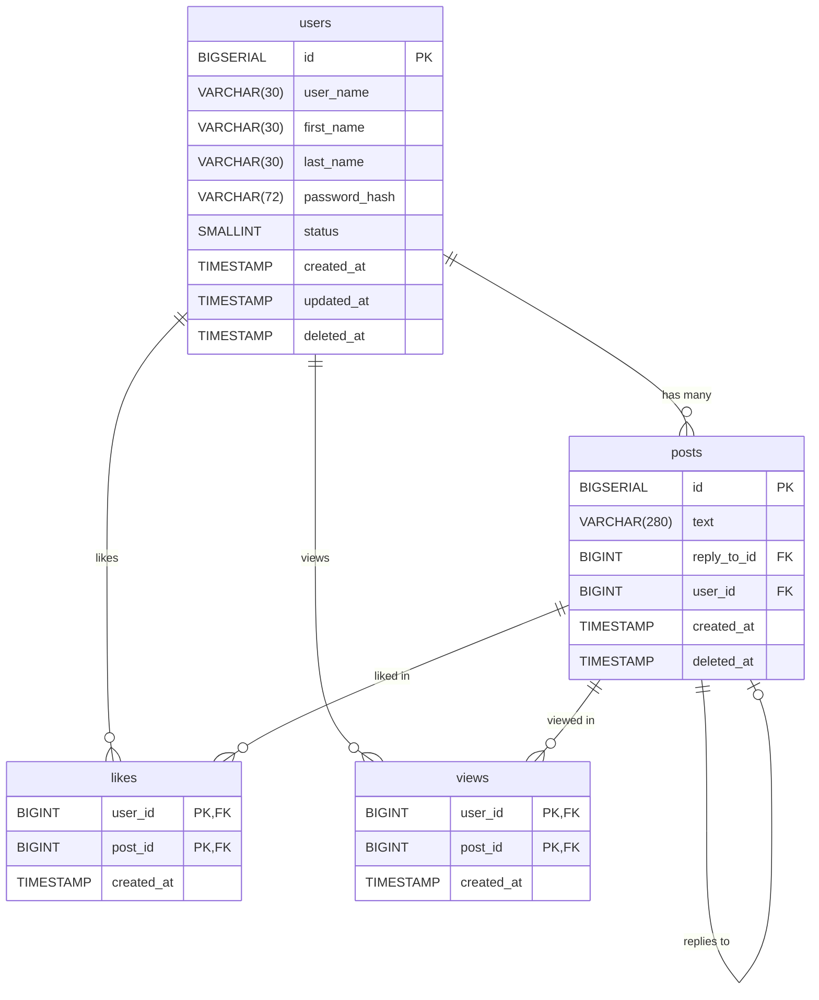

# Разработка слоя репозиториев web-приложения

## Инициализация базы данных

Вам необходимо вручную создать SQL-таблицы, отражающие структуру социальной сети GopherTalk. Ниже описаны таблицы, их поля и связи между ними.

1. **Таблица `users`** — хранит данные пользователей.
2. **Таблица `posts`** — хранит публикации пользователей. Поле `reply_to_id` указывает на другой пост, если это ответ.
3. **Таблица `likes`** — отображает лайки пользователей к постам.
4. **Таблица `views`** — отображает просмотры постов пользователями.



### Требования:

- Используйте типы данных и ограничения согласно описанию.
- Настройте первичные и внешние ключи.
- Создайте уникальный индекс по `user_name`, но только для не удалённых пользователей (`deleted_at IS NULL`).
- Убедитесь, что `status` может быть только `0` или `1`.

> Подсказка: после создания таблиц, проверьте схему с помощью ER-диаграммы, чтобы убедиться в корректности связей.

## Архитектура приложения: контроллеры, сервисы и репозитории

Когда приложение начинает расти, добавляется всё больше бизнес-логики, валидации, работы с базой данных — и код быстро превращается в нечитаемую "кашу". Чтобы этого избежать, используется **разделение ответственности** — принцип, при котором каждый компонент отвечает только за свою задачу.

В небольших веб-приложениях удобно придерживаться следующей архитектуры:

### 1. Контроллеры (controllers)

Контроллер — это слой, который принимает HTTP-запрос, обрабатывает его и возвращает ответ. Здесь происходит:

- чтение параметров из `req`,
- вызов нужного метода сервиса,
- формирование ответа (`res.status().json(...)`).

Контроллер не содержит бизнес-логики и не обращается напрямую к базе данных — он просто **управляет потоком данных**. Кроме того, на уровне контроллера решаются вопросы по разграничению доступа к ресурсам и фильтрации запросов.

### 2. Сервисы (services)

Сервис — это слой, где находится основная **бизнес-логика приложения**. Он:

- обрабатывает данные,
- проверяет условия (например, "пользователь уже существует"),
- вызывает репозиторий для доступа к базе.

Сервис ничего не знает про `req` и `res` — он универсален и может использоваться как в HTTP-приложении, так и, например, в CLI-утилите или фоновом скрипте.

### 3. Репозитории (repositories)

Репозиторий — это слой, отвечающий за **доступ к данным**. Обычно здесь хранятся SQL-запросы.  
Сервис говорит: "дай мне пользователя по id", а репозиторий выполняет конкретный SQL-запрос и возвращает результат.

Такой подход позволяет:

- изолировать работу с базой,
- легче писать и запускать юнит-тесты,
- менять способ хранения данных (например, заменить PostgreSQL на MongoDB) с минимальными изменениями.

### Преимущества архитектуры:

- Код становится **чище, понятнее и масштабируемее**;
- Каждый слой можно **тестировать отдельно**;
- Упрощается командная разработка — каждый работает в своей зоне ответственности;
- Легче поддерживать и расширять приложение в будущем.

В соответсвии с архитектурой мы построим разработку следующим образом: сначала разработаем слой репозитория, затем слой сервисов и в конце слой контроллеров. Для каждого слоя напишем Вам будут предоставлены unit-тесты для проверки корректности разработки конкретного слоя.

## Разработка репозитория пользователей

На этом этапе мы реализуем слой работы с базой данных — **репозиторий пользователей**.  
Задача этого слоя — обеспечивать сохранение, получение, обновление и удаление данных пользователей без участия бизнес-логики или HTTP-контроллеров.

Репозиторий будет включать методы:

- добавления нового пользователя,
- получения всех пользователей с пагинацией,
- поиска пользователя по `id` и по `user_name`,
- обновления данных пользователя,
- мягкого удаления пользователя.

Мы начнем с самого простого метода — `createUser`, который сохраняет нового пользователя в таблице `users`.  
Затем реализуем остальные методы и подключим unit-тесты для проверки корректности.

В папке `src` проекта создайте папку `repositories`, а в ней файл `userRepository.js`. Поместите в него следующий код:

```js
import { pool } from "../db/index.js";

export const UserRepository = {
  async createUser(dto) {
    const query = `
      INSERT INTO users (user_name, first_name, last_name, password_hash)
      VALUES ($1, $2, $3, $4)
      RETURNING id, user_name, password_hash, status;
    `;
    const values = [dto.user_name, dto.first_name, dto.last_name, dto.password_hash];
    const res = await pool.query(query, values);
    return res.rows[0];
  },
};
```

Этот код реализует метод `createUser` в объекте `UserRepository`, который отвечает за добавление нового пользователя в базу данных.

### Пошаговый разбор

- Импорт подключения к базе данных:

  ```js
  import { pool } from "../db/index.js";
  ```

  Здесь импортируется объект `pool`, который представляет пул подключений к базе данных PostgreSQL. Он уже настроен в другом модуле (`db/index.js`) и позволяет выполнять SQL-запросы.

- Экспорт объекта `UserRepository`:

  ```js
  export const UserRepository = { ... }
  ```

- Определение метода `createUser`:

  ```js
  async createUser(dto) { ... }
  ```

  Метод `createUser` — асинхронная функция, которая принимает объект `dto` (data transfer object) с полями нового пользователя. В нашем случае это `user_name`, `first_name`, `last_name`, `password_hash`.

- SQL-запрос на вставку

  ```js
  const query = `
  INSERT INTO users (user_name, first_name, last_name, password_hash)
  VALUES ($1, $2, $3, $4)
  RETURNING id, user_name, password_hash, status;
  `;
  ```

  Это SQL-запрос, который вставляет нового пользователя в таблицу `users`. Используются подстановки `$1`, `$2`, `$3`, `$4` — это позиционные параметры (предотвращают SQL-инъекции). После вставки сразу возвращаются данные нового пользователя: его `id`, `user_name`, `password_hash` и `status`.

  ::: details SQL-инъекции
  SQL-инъекция — это один из самых распространённых видов атак на базу данных.
  Она возникает, когда ввод пользователя напрямую вставляется в SQL-запрос без проверки и экранирования, что позволяет злоумышленнику изменить логику запроса.

  **Пример уязвимого кода:**

  ```js
  const userInput = "' OR 1=1 --";
  const query = `SELECT * FROM users WHERE user_name = '${userInput}'`;
  ```

  Вместо ожидаемого безопасного значения, пользователь ввёл строку `' OR 1=1 --`.

  В результате итоговый SQL-запрос будет выглядеть так:

  ```sql
  SELECT * FROM users WHERE user_name = '' OR 1=1 --';
  ```

  Что здесь происходит:

  - `user_name = ''` — первое условие, оно просто проверяет, что имя пользователя пустое;

  - `OR 1=1` — логическое выражение, которое всегда истинно, то есть условие выполняется для всех пользователей;

  - `--` — начало SQL-комментария, всё, что идёт после него, игнорируется СУБД;

  - `';` — эта часть уже не исполняется, так как закомментирована.

  Этот запрос вернёт всех пользователей из базы, потому что `1=1` всегда истинно. Если такой запрос используется при входе в систему, злоумышленник может войти без пароля, просто потому что запрос "обманывает" проверку логина.

  Используя позиционные параметры, мы избегаем этой проблемы:

  ```js
  const query = "SELECT * FROM users WHERE user_name = $1";
  const values = [userInput];
  await pool.query(query, values);
  ```

  В случае использования позиционных параметров, даже если пользователь введёт `' OR 1=1 --`, это не приведёт к SQL-инъекции, потому что ввод не вставляется напрямую в текст SQL-запроса. Вместо этого он передаётся отдельно в виде значения, а не как часть кода, а на уровне драйвера PostgreSQL (`pg`) реализован механизм, который:

  - экранирует специальные символы,

  - оборачивает значение в кавычки при необходимости,

  - и гарантирует, что ввод будет интерпретироваться именно как строка, а не как SQL-операторы.

  Проще говоря, драйвер сам "разделяет" SQL-код и пользовательские данные, не давая последним повлиять на логику выполнения запроса.

  Поэтому даже вредоносная строка будет просто передана как обычное значение поля `user_name`, а не как часть SQL-запроса.

  :::

- Подготовка значений для запроса:

  ```js
  const values = [dto.user_name, dto.first_name, dto.last_name, dto.password_hash];
  ```

  Значения берутся из входного объекта `dto` и передаются в том порядке, в котором указаны в SQL-запросе.

- Выполнение запроса

  ```js
  const res = await pool.query(query, values);
  ```

  Запрос выполняется с помощью метода `pool.query(...)`. Он асинхронный, поэтому используется `await`. Результат сохраняется в переменной `res`.

- Возврат результата:

  ```js
  return res.rows[0];
  ```

  После выполнения запроса возвращается первая (и единственная) строка результата — то есть данные только что созданного пользователя.

Мы сделали создание пользователя. Также необходимо реализовать методы:

- `getAllUsers` - получение списка всех пользователей с пагинацией,

- `getUserById` - получение пользователя по его id,

- `getUserByUserName` - получение пользователя по его имени пользователя,

- `updateUser` - обновление данных пользователя,

- `deleteUser` - удаление пользователя

Реализуем метод `getAllUsers`.

```js
import { pool } from "../db/index.js";

export const UserRepository = {
  async createUser(dto) {
    const query = `
      INSERT INTO users (user_name, first_name, last_name, password_hash)
      VALUES ($1, $2, $3, $4)
      RETURNING id, user_name, password_hash, status;
    `;
    const values = [dto.user_name, dto.first_name, dto.last_name, dto.password_hash];
    const res = await pool.query(query, values);
    return res.rows[0];
  },

  async getAllUsers(limit, offset) {
    const query = `
      SELECT id, user_name, first_name, last_name, status, created_at, updated_at
      FROM users
      WHERE deleted_at IS NULL
      OFFSET $1 LIMIT $2;
    `;
    const res = await pool.query(query, [offset, limit]);
    return res.rows;
  },
};
```

Обратите внимание, что метод принимает два параметра - `offset` и `limit`. Они необходимы для того, чтобы сделать пагинацию, то есть отдавать не всех пользователей сразу, а частями в рамках скользящего окна.

Перейдем к методам `getUserById` и `getUserByUserName`.

```js
import { pool } from "../db/index.js";

export const UserRepository = {
  async createUser(dto) {
    const query = `
      INSERT INTO users (user_name, first_name, last_name, password_hash)
      VALUES ($1, $2, $3, $4)
      RETURNING id, user_name, password_hash, status;
    `;
    const values = [dto.user_name, dto.first_name, dto.last_name, dto.password_hash];
    const res = await pool.query(query, values);
    return res.rows[0];
  },

  async getAllUsers(limit, offset) {
    const query = `
      SELECT id, user_name, first_name, last_name, status, created_at, updated_at
      FROM users
      WHERE deleted_at IS NULL
      OFFSET $1 LIMIT $2;
    `;
    const res = await pool.query(query, [offset, limit]);
    return res.rows;
  },

  async getUserById(id) {
    const query = `...`;
    const res = await pool.query(query, [id]);
    if (res.rowCount === 0) {
      throw new Error("User not found");
    }
    return res.rows[0];
  },

  async getUserByUserName(user_name) {
    const query = `... `;
    const res = await pool.query(query, [user_name]);
    if (res.rowCount === 0) {
      throw new Error("User not found");
    }
    return res.rows[0];
  },
};
```

> [!IMPORTANT] Задание
> Напишите самостоятельно SQL запросы для методов `getUserById` и `getUserByUserName`. Для метода `getUserById` необходимо вернуть поля `user_name`, `first_name`, `last_name`, `status`, `created_at`, `updated_at`, а для метода `getUserByUserName` - `user_name`, `password_hash`, `status`.

Рассмотрим метод `updateUser`

```js
async updateUser(id, dto) {
    const fields = [];
    const args = [];
    let index = 1;

    if (dto.password_hash) {
      fields.push(`password_hash = $${index++}`);
      args.push(dto.password_hash);
    }
    if (dto.user_name) {
      fields.push(`user_name = $${index++}`);
      args.push(dto.user_name);
    }
    if (dto.first_name) {
      fields.push(`first_name = $${index++}`);
      args.push(dto.first_name);
    }
    if (dto.last_name) {
      fields.push(`last_name = $${index++}`);
      args.push(dto.last_name);
    }

    if (fields.length === 0) {
      throw new Error("No fields to update");
    }

    fields.push(`updated_at = NOW()`);
    const query = `
      UPDATE users SET ${fields.join(", ")}
      WHERE id = $${index} AND deleted_at IS NULL
      RETURNING id, user_name, first_name, last_name, status, created_at, updated_at;
    `;
    args.push(id);

    const res = await pool.query(query, args);
    if (res.rowCount === 0) {
      throw new Error("User not found");
    }
    return res.rows[0];
  }
```

Этот асинхронный метод предназначен для обновления данных пользователя в базе данных. Он принимает два аргумента:

- `id`: Идентификатор пользователя, которого необходимо обновить.
- `dto`: Объект, содержащий данные для обновления.

### Логика работы:

1.  **Инициализация**:

    - Создаются два массива: `fields` для хранения строк с обновлениями полей (`field = $index`) и `args` для хранения значений, которые будут подставлены в запрос.
    - `index` инициализируется значением `1`. Эта переменная используется для генерации плейсхолдеров `$1`, `$2` и т.д. в SQL-запросе.

2.  **Проверка полей для обновления**:

    - Выполняется последовательная проверка наличия полей в объекте `dto` и добавление соответствующих данных в массивы `fields` и `args`:
      - `password_hash`: Если присутствует, добавляется `password_hash = $index` в `fields` и значение `dto.password_hash` в `args`.
      - `user_name`: Аналогично для имени пользователя.
      - `first_name`: Аналогично для имени.
      - `last_name`: Аналогично для фамилии.
    - При каждом добавлении поля `index` увеличивается.

3.  **Проверка наличия полей для обновления**:

    - Если массив `fields` пуст (то есть в `dto` не было полей для обновления), выбрасывается исключение `Error("No fields to update")`.

4.  **Добавление поля `updated_at`**:

    - В массив `fields` добавляется строка `updated_at = NOW()`, которая обновит поле `updated_at` текущим временем.

5.  **Формирование SQL-запроса**:

    - Формируется SQL-запрос для обновления данных пользователя.
    - Используется конструкция `UPDATE users SET ${fields.join(", ")}`, где `fields.join(", ")` объединяет строки с обновлениями полей в одну строку, разделенную запятыми.
    - Условие `WHERE id = $index AND deleted_at IS NULL` указывает, что обновлять нужно пользователя с заданным `id`, который не помечен как удаленный (`deleted_at IS NULL`).
    - Конструкция `RETURNING id, user_name, first_name, last_name, status, created_at, updated_at` возвращает данные обновленного пользователя.

6.  **Добавление `id` пользователя в аргументы запроса**:

    - В массив `args` добавляется `id` пользователя, который будет использоваться в условии `WHERE id = $index`.

7.  **Выполнение запроса**:

    - Выполняется SQL-запрос с использованием `pool.query(query, args)`. Результат запроса сохраняется в переменной `res`.

8.  **Обработка результата запроса**:
    - Если `res.rowCount === 0`, то есть не было найдено ни одного пользователя для обновления, выбрасывается исключение `Error("User not found")`.
    - В противном случае возвращается первая строка результата запроса (`res.rows[0]`), содержащая данные обновленного пользователя.

Последний метод, который мы реализуем в этом репозитории - это метод удаления пользователя `deleteUser`.

```js
async deleteUser(id) {
    const query = `...`;
    const res = await pool.query(query, [id]);
    if (res.rowCount === 0) {
      throw new Error("User not found");
    }
  }
```

Этот асинхронный метод предназначен для "удаления" пользователя из базы данных. Фактически, это может быть мягкое удаление (soft delete), когда запись не удаляется физически, а лишь помечается как удалённая. Либо это может быть полное удаление записи из таблицы.

### Логика работы:

1.  **Формирование SQL-запроса**

2.  **Выполнение запроса**:

    - Выполняется SQL-запрос с использованием `pool.query(query, [id])`. Результат запроса сохраняется в переменной `res`.

3.  **Обработка результата запроса**:
    - Если `res.rowCount === 0`, это значит, что не было найдено пользователя с указанным `id` для удаления. В этом случае выбрасывается исключение `Error("User not found")`.

> [!IMPORTANT] Задание
> Напишите SQL-запрос, который выполняет мягкое удаление пользователя, устанавливая значение `deleted_at` в текущее время для пользователя с указанным `id`. Также напишите SQL-запрос, который полностью удаляет пользователя с указанным `id` из таблицы.

## Тестирование репозитория пользователей

В корне проекта создайте папку `__tests__`, а в ней папку `repositories`. В папке `repositories` создайте файл `userRepository.test.js` и поместите в него код с unit-тестами:

```js
import { expect, jest } from "@jest/globals";
import { pool } from "../../src/config/db.js";
import { UserRepository } from "../../src/repositories/userRepository.js";

function normalizeSQL(sql) {
  return sql.toLowerCase().replace(/\s+/g, " ").trim();
}

describe("UserRepository", () => {
  afterEach(() => {
    jest.clearAllMocks();
  });

  describe("createUser", () => {
    it("successfully creates new user", async () => {
      const mock = jest.spyOn(pool, "query");

      const dto = {
        user_name: "john",
        first_name: "John",
        last_name: "Doe",
        password_hash: "password",
      };

      const expected = {
        id: 1,
        user_name: "john",
        password_hash: "password",
        status: 1,
      };

      mock.mockResolvedValueOnce({ rows: [expected], rowCount: 1 });

      const result = await UserRepository.createUser(dto);

      expect(result).toEqual(expected);
      const [sql, params] = mock.mock.calls[0];
      const normalizedSQL = normalizeSQL(sql);
      expect(normalizedSQL).toContain("insert into users (user_name, first_name, last_name, password_hash)");
      expect(normalizedSQL).toContain("returning id, user_name, password_hash, status");
      expect(params).toEqual([dto.user_name, dto.first_name, dto.last_name, dto.password_hash]);
    });

    it("error on user insert", async () => {
      const mock = jest.spyOn(pool, "query");

      const dto = {
        user_name: "john",
        first_name: "John",
        last_name: "Doe",
        password_hash: "password",
      };

      const fakeError = new Error("insert failed");
      mock.mockRejectedValueOnce(fakeError);

      await expect(UserRepository.createUser(dto)).rejects.toThrow("insert failed");

      const [sql, params] = mock.mock.calls[0];
      const normalizedSQL = normalizeSQL(sql);
      expect(normalizedSQL).toContain("insert into users (user_name, first_name, last_name, password_hash)");
      expect(params).toEqual([dto.user_name, dto.first_name, dto.last_name, dto.password_hash]);
    });
  });

  describe("getAllUsers", () => {
    it("successfully gets all users", async () => {
      const mock = jest.spyOn(pool, "query");

      const now = new Date();

      const expectedUsers = [
        {
          id: 1,
          user_name: "john",
          first_name: "John",
          last_name: "Doe",
          status: 1,
          created_at: now,
          updated_at: now,
        },
        {
          id: 2,
          user_name: "jane",
          first_name: "Jane",
          last_name: "Smith",
          status: 1,
          created_at: now,
          updated_at: now,
        },
      ];

      mock.mockResolvedValueOnce({ rows: expectedUsers, rowCount: expectedUsers.length });

      const result = await UserRepository.getAllUsers(100, 0);

      expect(result).toEqual(expectedUsers);

      const [sql, params] = mock.mock.calls[0];
      const normalizedSQL = normalizeSQL(sql);
      expect(normalizedSQL).toContain(
        "select id, user_name, first_name, last_name, status, created_at, updated_at from users where deleted_at is null"
      );
      expect(params).toEqual([0, 100]);
    });

    it("returns error", async () => {
      const mock = jest.spyOn(pool, "query");
      mock.mockRejectedValueOnce(new Error("SQL error"));

      await expect(UserRepository.getAllUsers(100, 0)).rejects.toThrow("SQL error");

      const [sql, params] = mock.mock.calls[0];
      const normalizedSQL = normalizeSQL(sql);
      expect(normalizedSQL).toContain("from users where deleted_at is null");
      expect(params).toEqual([0, 100]);
    });
  });

  describe("getUserById", () => {
    it("successfully gets user by id", async () => {
      const mock = jest.spyOn(pool, "query");
      const now = new Date();

      const expected = {
        id: 1,
        user_name: "john",
        first_name: "John",
        last_name: "Doe",
        status: 1,
        created_at: now,
        updated_at: now,
      };

      mock.mockResolvedValueOnce({ rows: [expected], rowCount: 1 });

      const result = await UserRepository.getUserById(1);

      expect(result).toEqual(expected);

      const [sql, params] = mock.mock.calls[0];
      const normalizedSQL = normalizeSQL(sql);
      expect(normalizedSQL).toContain("from users where id = $1 and deleted_at is null");
      expect(params).toEqual([1]);
    });

    it("returns error if user not found", async () => {
      const mock = jest.spyOn(pool, "query");
      mock.mockResolvedValueOnce({ rows: [], rowCount: 0 });

      await expect(UserRepository.getUserById(2)).rejects.toThrow("User not found");

      const [sql, params] = mock.mock.calls[0];
      const normalizedSQL = normalizeSQL(sql);
      expect(normalizedSQL).toContain("from users where id = $1 and deleted_at is null");
      expect(params).toEqual([2]);
    });
  });

  describe("getUserByUserName", () => {
    it("successfully gets user by username", async () => {
      const mock = jest.spyOn(pool, "query");

      const expected = {
        id: 1,
        user_name: "john",
        password_hash: "password",
        status: 1,
      };

      mock.mockResolvedValueOnce({ rows: [expected], rowCount: 1 });

      const result = await UserRepository.getUserByUserName("john");

      expect(result).toEqual(expected);

      const [sql, params] = mock.mock.calls[0];
      const normalizedSQL = normalizeSQL(sql);
      expect(normalizedSQL).toContain("from users where user_name = $1 and deleted_at is null");
      expect(params).toEqual(["john"]);
    });

    it("returns error if user not found", async () => {
      const mock = jest.spyOn(pool, "query");
      mock.mockResolvedValueOnce({ rows: [], rowCount: 0 });

      await expect(UserRepository.getUserByUserName("notfound")).rejects.toThrow("User not found");

      const [sql, params] = mock.mock.calls[0];
      const normalizedSQL = normalizeSQL(sql);
      expect(normalizedSQL).toContain("from users where user_name = $1 and deleted_at is null");
      expect(params).toEqual(["notfound"]);
    });
  });

  describe("updateUser", () => {
    it("successfully updates user", async () => {
      const mock = jest.spyOn(pool, "query");
      const now = new Date();
      const oneHourAgo = new Date(now.getTime() - 60 * 60 * 1000);

      const id = 1;
      const dto = {
        user_name: "john_updated",
        first_name: "John",
        last_name: "Doe",
        password_hash: "password",
      };

      const expected = {
        id,
        user_name: dto.user_name,
        first_name: dto.first_name,
        last_name: dto.last_name,
        status: 1,
        created_at: oneHourAgo,
        updated_at: now,
      };

      mock.mockResolvedValueOnce({ rows: [expected], rowCount: 1 });

      const result = await UserRepository.updateUser(id, dto);

      expect(result).toEqual(expected);

      const [sql, params] = mock.mock.calls[0];
      const normalizedSQL = normalizeSQL(sql);
      expect(normalizedSQL).toContain("update users set");
      expect(normalizedSQL).toContain("where id = $");
      expect(normalizedSQL).toContain("returning id, user_name, first_name, last_name, status");
      expect(params).toContain(dto.user_name);
      expect(params).toContain(dto.password_hash);
      expect(params).toContain(dto.first_name);
      expect(params).toContain(dto.last_name);
      expect(params).toContain(id);
    });

    it("returns error if no fields to update", async () => {
      await expect(UserRepository.updateUser(1, {})).rejects.toThrow("No fields to update");
    });

    it("returns error if user not found", async () => {
      const mock = jest.spyOn(pool, "query");

      const dto = {
        user_name: "ghost",
      };

      mock.mockResolvedValueOnce({ rows: [], rowCount: 0 });

      await expect(UserRepository.updateUser(999, dto)).rejects.toThrow("User not found");

      const [sql, params] = mock.mock.calls[0];
      const normalizedSQL = normalizeSQL(sql);
      expect(normalizedSQL).toContain("update users set");
      expect(normalizedSQL).toContain("where id = $");
      expect(params).toEqual(["ghost", 999]);
    });
  });

  describe("deleteUser", () => {
    it("successfully deletes user", async () => {
      const mock = jest.spyOn(pool, "query");

      mock.mockResolvedValueOnce({ rowCount: 1 });

      await expect(UserRepository.deleteUser(1)).resolves.toBeUndefined();

      const [sql, params] = mock.mock.calls[0];
      const normalizedSQL = normalizeSQL(sql);
      expect(normalizedSQL).toContain("update users set deleted_at = now()");
      expect(normalizedSQL).toContain("where id = $1 and deleted_at is null");
      expect(params).toEqual([1]);
    });

    it("returns error if user not found", async () => {
      const mock = jest.spyOn(pool, "query");

      mock.mockResolvedValueOnce({ rowCount: 0 });

      await expect(UserRepository.deleteUser(2)).rejects.toThrow("User not found");

      const [sql, params] = mock.mock.calls[0];
      const normalizedSQL = normalizeSQL(sql);
      expect(normalizedSQL).toContain("update users set deleted_at = now()");
      expect(params).toEqual([2]);
    });
  });
});
```

После этого выполните команду

```bash
npm run test
```

Если вы все сделали правильно, все тесты пройдены.

```bash
> gophertalk-backend-express@0.1.0 test
> node --experimental-vm-modules node_modules/jest/bin/jest.js

(node:50607) ExperimentalWarning: VM Modules is an experimental feature and might change at any time
(Use `node --trace-warnings ...` to show where the warning was created)
 PASS  __tests__/repositories/userRepository.test.js
  UserRepository
    createUser
      ✓ successfully creates new user (2 ms)
      ✓ error on user insert (2 ms)
    getAllUsers
      ✓ successfully gets all users (1 ms)
      ✓ returns error
    getUserById
      ✓ successfully gets user by id (1 ms)
      ✓ returns error if user not found
    getUserByUserName
      ✓ successfully gets user by username
      ✓ returns error if user not found (1 ms)
    updateUser
      ✓ successfully updates user
      ✓ returns error if no fields to update (1 ms)
      ✓ returns error if user not found
    deleteUser
      ✓ successfully deletes user
      ✓ returns error if user not found

Test Suites: 1 passed, 1 total
Tests:       13 passed, 13 total
Snapshots:   0 total
Time:        0.138 s
Ran all test suites.
```

## Разработка репозитория постов

На этом этапе мы реализуем **репозиторий постов** — слой, отвечающий за взаимодействие с таблицей `posts`, а также связанными с ней таблицами `likes`, `views` и вложенными ответами (реплаями).

Репозиторий постов будет включать следующие методы:

- создание нового поста (`createPost`);
- получение списка постов с фильтрацией и пагинацией (`getAllPosts`);
- получение одного поста по `id`, включая автора, количество лайков, просмотров и ответов (`getPostByID`);
- удаление поста владельцем (`deletePost`);
- отметка, что пользователь просмотрел пост (`viewPost`);
- лайк/дизлайк поста (`likePost`, `dislikePost`).

Мы начнем с реализации метода `createPost`, затем последовательно опишем остальные. Все методы взаимодействуют с базой через SQL-запросы, используют подстановки для защиты от SQL-инъекций и возвращают данные в формате DTO.

Создайте файл `src/repositories/postRepository.js`, в него поместите следующий код:

```js
import { pool } from "../db/index.js";

export const PostRepository = {
  async createPost(dto) {
    const query = `...`;
    const values = [dto.text, dto.user_id, dto.reply_to_id];
    const res = await pool.query(query, values);
    return res.rows[0];
  },
};
```

Пояснение:

- `dto` — объект, содержащий данные нового поста (`text`, `user_id`, `reply_to_id`);

- SQL-запрос вставляет данные в таблицу posts;

- После вставки сразу возвращаются поля нового поста: `id`, `text`, `created_at`, `reply_to_id`.

> [!IMPORTANT] Задание
> В соответствии с пояснением напишите SQL запрос для добавления нового поста. Не забудьте использовать позиционные параметры `$1`, `$2`, `$3` — для предотвращения SQL-инъекций

Метод `getAllPosts` возвращает список постов с расширенной информацией: количество лайков, просмотров, ответов, а также информацию о пользователе и отметках "нравится" и "просмотрено" от текущего пользователя.

```js
async getAllPosts(dto) {
    const params = [dto.user_id];
    let query = `
      WITH likes_count AS (
        SELECT post_id, COUNT(*) AS likes_count
        FROM likes GROUP BY post_id
      ),
      views_count AS (
        SELECT post_id, COUNT(*) AS views_count
        FROM views GROUP BY post_id
      ),
      replies_count AS (
        SELECT reply_to_id, COUNT(*) AS replies_count
        FROM posts WHERE reply_to_id IS NOT NULL GROUP BY reply_to_id
      )
      SELECT
        p.id, p.text, p.reply_to_id, p.created_at,
        u.id AS user_id, u.user_name, u.first_name, u.last_name,
        COALESCE(lc.likes_count, 0) AS likes_count,
        COALESCE(vc.views_count, 0) AS views_count,
        COALESCE(rc.replies_count, 0) AS replies_count,
        CASE WHEN l.user_id IS NOT NULL THEN true ELSE false END AS user_liked,
        CASE WHEN v.user_id IS NOT NULL THEN true ELSE false END AS user_viewed
      FROM posts p
      JOIN users u ON p.user_id = u.id
      LEFT JOIN likes_count lc ON p.id = lc.post_id
      LEFT JOIN views_count vc ON p.id = vc.post_id
      LEFT JOIN replies_count rc ON p.id = rc.reply_to_id
      LEFT JOIN likes l ON l.post_id = p.id AND l.user_id = $1
      LEFT JOIN views v ON v.post_id = p.id AND v.user_id = $1
      WHERE p.deleted_at IS NULL
    `;

    if (dto.search) {
      query += ` AND p.text ILIKE $${params.length + 1}`;
      params.push(`%${dto.search}%`);
    }

    if (dto.owner_id) {
      query += ` AND p.user_id = $${params.length + 1}`;
      params.push(dto.owner_id);
    }

    if (dto.reply_to_id) {
      query += ` AND p.reply_to_id = $${params.length + 1} ORDER BY p.created_at ASC`;
      params.push(dto.reply_to_id);
    } else {
      query += ` AND p.reply_to_id IS NULL ORDER BY p.created_at DESC`;
    }

    query += ` OFFSET $${params.length + 1} LIMIT $${params.length + 2}`;
    params.push(dto.offset, dto.limit);

    const res = await pool.query(query, params);

    return res.rows.map((row) => ({
      id: row.id,
      text: row.text,
      reply_to_id: row.reply_to_id,
      created_at: row.created_at,
      likes_count: row.likes_count,
      views_count: row.views_count,
      replies_count: row.replies_count,
      user_liked: row.user_liked,
      user_viewed: row.user_viewed,
      user: {
        id: row.user_id,
        user_name: row.user_name,
        first_name: row.first_name,
        last_name: row.last_name,
      },
    }));
  }
```

Метод `getAllPosts` предназначен для получения списка публикаций с расширенной информацией:

- автор поста;

- количество лайков, просмотров, ответов;

- флаги, лайкнул и/или просматривал ли текущий пользователь этот пост.

#### Структура SQL-запроса

Запрос построен с использованием CTE (Common Table Expressions) и выглядит следующим образом:

```sql
WITH likes_count AS (...),
     views_count AS (...),
     replies_count AS (...)
SELECT ...
FROM posts ...
```

Рассмотрим все части по порядку.

#### 1. Подсчёт количества лайков к каждому посту

```sql
likes_count AS (
  SELECT post_id, COUNT(*) AS likes_count
  FROM likes
  GROUP BY post_id
)
```

Здесь из таблицы `likes` собирается информация о количестве лайков для каждого поста. Используется `GROUP BY post_id`, чтобы сгруппировать лайки по постам.

#### 2. Подсчёт количества просмотров

```sql
views_count AS (
  SELECT post_id, COUNT(*) AS views_count
  FROM views
  GROUP BY post_id
)
```

Аналогично первой CTE, но теперь считаются просмотры из таблицы `views`.

#### 3. Подсчёт количества ответов на каждый пост

```sql
replies_count AS (
  SELECT reply_to_id, COUNT(*) AS replies_count
  FROM posts
  WHERE reply_to_id IS NOT NULL
  GROUP BY reply_to_id
)
```

Здесь из самой таблицы `posts` выбираются те строки, где `reply_to_id IS NOT NULL`, то есть это ответы на другие посты. Считается, сколько таких ответов у каждого родительского поста.

#### 4. Основной запрос

```sql
SELECT
  p.id, p.text, p.reply_to_id, p.created_at,
  u.id AS user_id, u.user_name, u.first_name, u.last_name,
  COALESCE(lc.likes_count, 0) AS likes_count,
  COALESCE(vc.views_count, 0) AS views_count,
  COALESCE(rc.replies_count, 0) AS replies_count,
  CASE WHEN l.user_id IS NOT NULL THEN true ELSE false END AS user_liked,
  CASE WHEN v.user_id IS NOT NULL THEN true ELSE false END AS user_viewed
FROM posts p
JOIN users u ON p.user_id = u.id
LEFT JOIN likes_count lc ON p.id = lc.post_id
LEFT JOIN views_count vc ON p.id = vc.post_id
LEFT JOIN replies_count rc ON p.id = rc.reply_to_id
LEFT JOIN likes l ON l.post_id = p.id AND l.user_id = $1
LEFT JOIN views v ON v.post_id = p.id AND v.user_id = $1
WHERE p.deleted_at IS NULL
...
```

Что здесь происходит:

- `JOIN users` — соединение поста с его автором по `user_id`;

- `LEFT JOIN` с `likes_count`, `views_count`, `replies_count` — добавляются данные из CTE о количестве лайков, просмотров и ответов;

- `LEFT JOIN likes l` и `views v` — проверяется, поставил ли лайк или просмотр текущий пользователь (`$1` — его id). Эти поля используются в логических выражениях ниже;

- `CASE WHEN ... THEN true ELSE false` — определяет `user_liked` и `user_viewed`;

- `COALESCE(..., 0)` — если данных о лайках/просмотрах/ответах нет (например, никто не лайкал), подставляется `0`;

- `WHERE p.deleted_at IS NULL` — фильтрация: берутся только не удалённые посты.

#### 5. Дополнительные фильтры

**По тексту:**

```sql
if (dto.search) {
  query += ` AND p.text ILIKE $${params.length + 1}`;
  params.push(`%${dto.search}%`);
}
```

Если передана строка `search`, ищутся посты, в тексте которых есть соответствие.

**По пользователю (автору):**

```sql
if (dto.owner_id) {
  query += ` AND p.user_id = $${params.length + 1}`;
  params.push(dto.owner_id);
}
```

Если передан `owner_id`, отбираются посты конкретного пользователя.

**По ответам:**

```sql
if (dto.reply_to_id) {
  query += ` AND p.reply_to_id = $${params.length + 1} ORDER BY p.created_at ASC`;
} else {
  query += ` AND p.reply_to_id IS NULL ORDER BY p.created_at DESC`;
}
```

Проверяется, являются ли посты ответами на другой пост (`reply_to_id`) или это корневые посты.

#### 6. Пагинация

```js
query += ` OFFSET $${params.length + 1} LIMIT $${params.length + 2}`;
params.push(dto.offset, dto.limit);
```

Реализуется механика "скользящего окна" — выбирается определённый диапазон постов.

#### 7. Возвращаемый результат

Результат собирается в виде массива постов. Каждый пост содержит:

- данные самого поста,

- данные автора (`user`),

- количество лайков, просмотров, ответов,

- флаги `user_liked`, `user_viewed`.

Далее рассмотрим реализацию метода `getPostById`.

```js
import { pool } from "../db/index.js";

export const PostRepository = {
  async getPostById(postId, userId) {
    const query = `
      WITH likes_count AS (
        SELECT post_id, COUNT(*) AS likes_count
        FROM likes
        GROUP BY post_id
      ),
      views_count AS (
        SELECT post_id, COUNT(*) AS views_count
        FROM views
        GROUP BY post_id
      ),
      replies_count AS (
        SELECT reply_to_id, COUNT(*) AS replies_count
        FROM posts
        WHERE reply_to_id IS NOT NULL
        GROUP BY reply_to_id
      )
      SELECT 
        p.id AS post_id,
        p.text,
        p.reply_to_id,
        p.created_at,
        u.id AS user_id,
        u.user_name,
        u.first_name,
        u.last_name,
        COALESCE(lc.likes_count, 0) AS likes_count,
        COALESCE(vc.views_count, 0) AS views_count,
        COALESCE(rc.replies_count, 0) AS replies_count,
        CASE WHEN l.user_id IS NOT NULL THEN true ELSE false END AS user_liked,
        CASE WHEN v.user_id IS NOT NULL THEN true ELSE false END AS user_viewed
      FROM posts p
      JOIN users u ON p.user_id = u.id
      LEFT JOIN likes_count lc ON p.id = lc.post_id
      LEFT JOIN views_count vc ON p.id = vc.post_id
      LEFT JOIN replies_count rc ON p.id = rc.reply_to_id
      LEFT JOIN likes l ON l.post_id = p.id AND l.user_id = $1
      LEFT JOIN views v ON v.post_id = p.id AND v.user_id = $1
      WHERE p.id = $2 AND p.deleted_at IS NULL;
    `;

    const res = await pool.query(query, [userId, postId]);
    if (res.rowCount === 0) {
      throw new Error("Post not found");
    }

    const row = res.rows[0];
    return {
      id: row.post_id,
      text: row.text,
      reply_to_id: row.reply_to_id,
      created_at: row.created_at,
      likes_count: row.likes_count,
      views_count: row.views_count,
      replies_count: row.replies_count,
      user_liked: row.user_liked,
      user_viewed: row.user_viewed,
      user: {
        id: row.user_id,
        user_name: row.user_name,
        first_name: row.first_name,
        last_name: row.last_name,
      },
    };
  },
};
```

Метод `getPostById` используется для получения одного конкретного поста по его идентификатору. Он возвращает расширенную информацию по посту, включая лайки, просмотры, количество ответов и данные об авторе. Метод похож на `getAllPosts`, за исключением некоторых отличий.

**Фильтрация по ID поста**

Вместо выборки множества записей, запрос ограничивается одним постом:

```sql
WHERE p.id = $2 AND p.deleted_at IS NULL
```

Первый параметр (`$1`) — это `user_id` (нужен для определения, лайкнул ли/просматривал ли пользователь пост),
второй (`$2`) — это ID самого поста, который ищется.

**Отсутствует пагинация**

Метод возвращает только один пост, поэтому нет `OFFSET` и `LIMIT`.

**Возвращаемое значение**

`getPostById` возвращает один объект поста, а `getAllPosts` - массив.

**Обработка крайних случаев**

Если пост не найден, `getPostById` выбрасывает исключение "Post not found", а `getAllPosts` возвращает пустой массив.

Перейдем к реализации метода `deletePost` в репозитории `PostRepository`

```js
async deletePost(id, ownerId) {
  const query = `...`;
  const res = await pool.query(query, [id, ownerId]);
  if (res.rowCount === 0) {
    throw new Error("Post not found or already deleted");
  }
}
```

> [!IMPORTANT] Задание
> Реализуйте метод `deletePost`, который помечает пост как удалённый. SQL-запрос должен обновлять поле `deleted_at` текущим временем, работать только с постами, принадлежащими автору и исключать уже удалённые посты.

Теперь реализуем метод, который регистрирует факт просмотра поста пользователем. Каждый пользователь может просмотреть пост только один раз — повторные просмотры не записываются.

```js
async function viewPost(postId, userId) {
  const query = `...`;

  try {
    const res = await pool.query(query, [postId, userId]);
    if (res.rowCount === 0) {
      throw new Error("Post not found");
    }
  } catch (err) {
    if (err.message.includes("pk__views")) {
      throw new Error("Post already viewed");
    }
    throw err;
  }
}
```

> [!CAUTION] Внимание
> Обратите внимание на строку `err.message.includes("pk__views")`. Здесь `pk__views` - это имя первичного ключа у таблицы `views`. Подставьте свое, если у вас отличается.

> [!IMPORTANT] Задание
> Реализуйте метод `viewPost`, который добавляет новую запись в таблицу `views`.

Теперь реализуем метод, который позволяет пользователю поставить лайк посту. Один пользователь может поставить лайк одному посту только один раз — повторные попытки должны вызывать ошибку.

```js
async function likePost(postId, userId) {
  const query = `...`;

  try {
    const res = await pool.query(query, [postId, userId]);
    if (res.rowCount === 0) {
      throw new Error("Post not found");
    }
  } catch (err) {
    if (err.message.includes("pk__likes")) {
      throw new Error("Post already liked");
    }
    throw err;
  }
}
```

> [!CAUTION] Внимание
> Обратите внимание на строку `err.message.includes("pk__likes")`. Здесь `pk__likes` - это имя первичного ключа у таблицы `likes`. Подставьте свое, если у вас отличается.

> [!IMPORTANT] Задание
> Реализуйте метод `likePost`, который добавляет новую запись в таблицу `likes`.

Метод `dislikePost` позволяет пользователю убрать лайк с поста, если он его ранее поставил.

```js
async function dislikePost(postId, userId) {
  const query = `...`;

  const res = await pool.query(query, [postId, userId]);

  if (res.rowCount === 0) {
    throw new Error("Post not found");
  }
}
```

> [!IMPORTANT] Задание
> Реализуйте метод `dislikePost`, который удаляет запись из таблицы `likes`.

# Разработка функционального слоя web-приложения

# Разработка слоя контроллеров web-приложения
