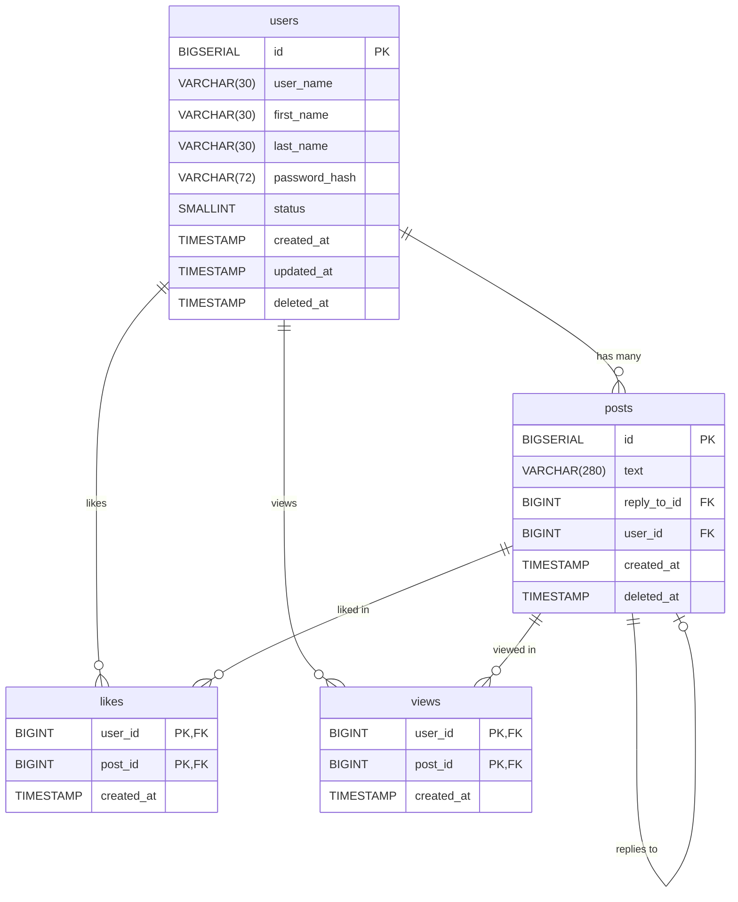
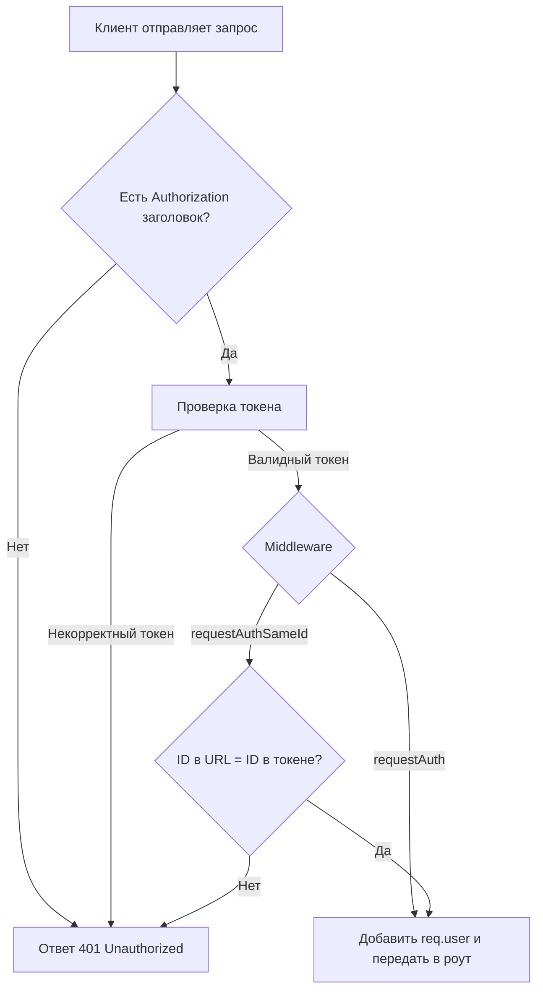
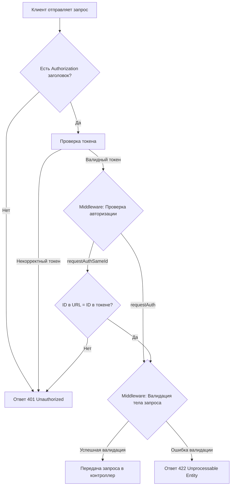
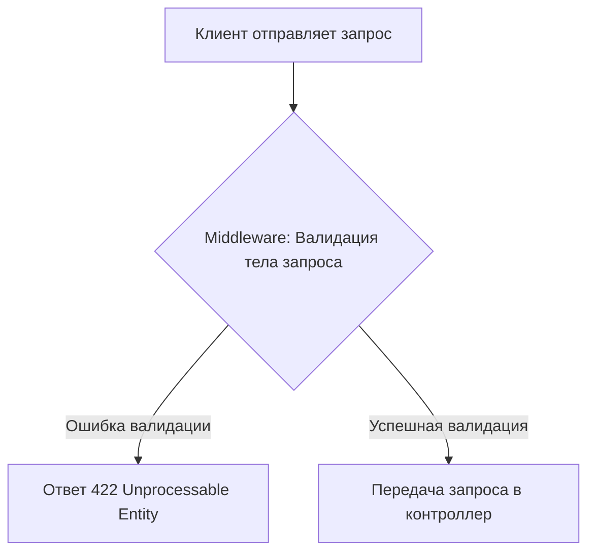
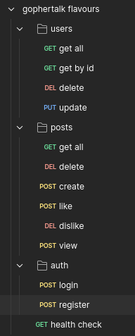
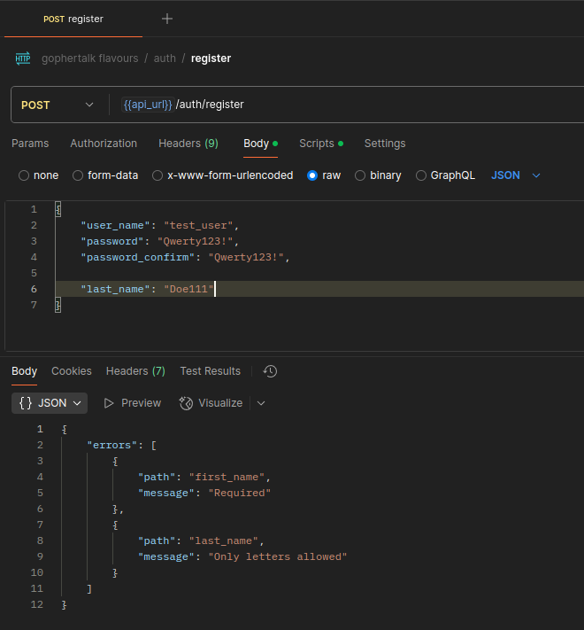
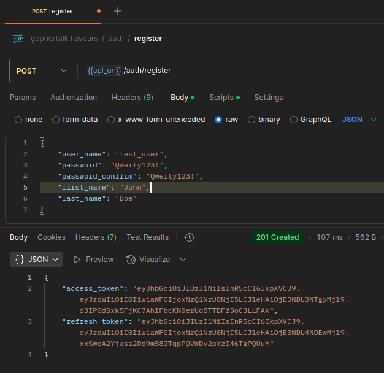
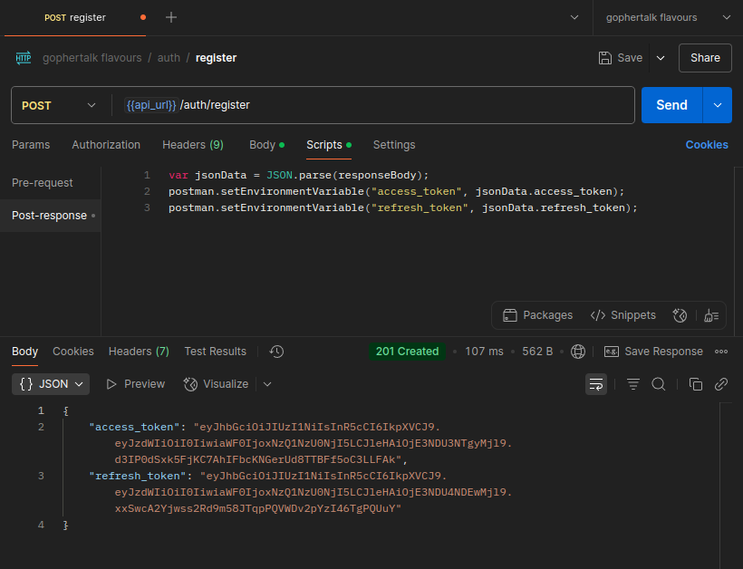
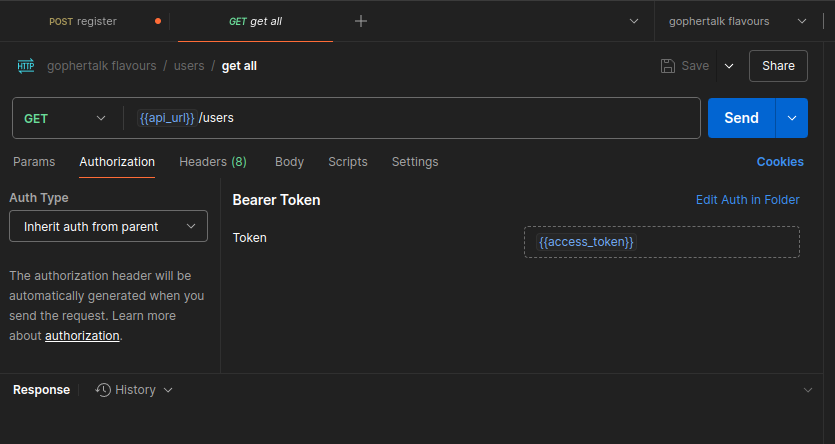

## Разработка слоя репозиториев web-приложения

Вам необходимо вручную создать SQL-таблицы, отражающие структуру социальной сети GopherTalk. Ниже описаны таблицы, их поля и связи между ними.

1. **Таблица `users`** — хранит данные пользователей.
2. **Таблица `posts`** — хранит публикации пользователей. Поле `reply_to_id` указывает на другой пост, если это ответ.
3. **Таблица `likes`** — отображает лайки пользователей к постам.
4. **Таблица `views`** — отображает просмотры постов пользователями.



### Требования:

- Используйте типы данных и ограничения согласно описанию.
- Настройте первичные и внешние ключи.
- Создайте уникальный индекс по `user_name`, но только для не удалённых пользователей (`deleted_at IS NULL`).
- Убедитесь, что `status` может быть только `0` или `1`.

> Подсказка: после создания таблиц, проверьте схему с помощью ER-диаграммы, чтобы убедиться в корректности связей.

## Архитектура приложения: контроллеры, сервисы и репозитории

Когда приложение начинает расти, добавляется всё больше бизнес-логики, валидации, работы с базой данных — и код быстро превращается в нечитаемую "кашу". Чтобы этого избежать, используется **разделение ответственности** — принцип, при котором каждый компонент отвечает только за свою задачу.

В небольших веб-приложениях удобно придерживаться следующей архитектуры:

### 1. Контроллеры (controllers)

Контроллер — это слой, который принимает HTTP-запрос, обрабатывает его и возвращает ответ. Здесь происходит:

- чтение параметров из `req`,
- вызов нужного метода сервиса,
- формирование ответа (`res.status().json(...)`).

Контроллер не содержит бизнес-логики и не обращается напрямую к базе данных — он просто **управляет потоком данных**. Кроме того, на уровне контроллера решаются вопросы по разграничению доступа к ресурсам и фильтрации запросов.

### 2. Сервисы (services)

Сервис — это слой, где находится основная **бизнес-логика приложения**. Он:

- обрабатывает данные,
- проверяет условия (например, "пользователь уже существует"),
- вызывает репозиторий для доступа к базе.

Сервис ничего не знает про `req` и `res` — он универсален и может использоваться как в HTTP-приложении, так и, например, в CLI-утилите или фоновом скрипте.

### 3. Репозитории (repositories)

Репозиторий — это слой, отвечающий за **доступ к данным**. Обычно здесь хранятся SQL-запросы.  
Сервис говорит: "дай мне пользователя по id", а репозиторий выполняет конкретный SQL-запрос и возвращает результат.

Такой подход позволяет:

- изолировать работу с базой,
- легче писать и запускать юнит-тесты,
- менять способ хранения данных (например, заменить PostgreSQL на MongoDB) с минимальными изменениями.

### Преимущества архитектуры:

- Код становится **чище, понятнее и масштабируемее**;
- Каждый слой можно **тестировать отдельно**;
- Упрощается командная разработка — каждый работает в своей зоне ответственности;
- Легче поддерживать и расширять приложение в будущем.

В соответсвии с архитектурой мы построим разработку следующим образом: сначала разработаем слой репозитория, затем слой сервисов и в конце слой контроллеров. Для каждого слоя напишем Вам будут предоставлены unit-тесты для проверки корректности разработки конкретного слоя.

## Разработка репозитория пользователей

На этом этапе мы реализуем слой работы с базой данных — **репозиторий пользователей**.  
Задача этого слоя — обеспечивать сохранение, получение, обновление и удаление данных пользователей без участия бизнес-логики или HTTP-контроллеров.

Репозиторий будет включать методы:

- добавления нового пользователя,
- получения всех пользователей с пагинацией,
- поиска пользователя по `id` и по `user_name`,
- обновления данных пользователя,
- мягкого удаления пользователя.

Мы начнем с самого простого метода — `createUser`, который сохраняет нового пользователя в таблице `users`.  
Затем реализуем остальные методы и подключим unit-тесты для проверки корректности.

В папке `src` проекта создайте папку `repositories`, а в ней файл `userRepository.js`. Поместите в него следующий код:

```js
import { pool } from "../db/index.js";

export const UserRepository = {
  async createUser(dto) {
    const query = `
      INSERT INTO users (user_name, first_name, last_name, password_hash)
      VALUES ($1, $2, $3, $4)
      RETURNING id, user_name, password_hash, status;
    `;
    const values = [
      dto.user_name,
      dto.first_name,
      dto.last_name,
      dto.password_hash,
    ];
    const res = await pool.query(query, values);
    return res.rows[0];
  },
};
```

Этот код реализует метод `createUser` в объекте `UserRepository`, который отвечает за добавление нового пользователя в базу данных.

### Пошаговый разбор

- Импорт подключения к базе данных:

  ```js
  import { pool } from "../db/index.js";
  ```

  Здесь импортируется объект `pool`, который представляет пул подключений к базе данных PostgreSQL. Он уже настроен в другом модуле (`db/index.js`) и позволяет выполнять SQL-запросы.

- Экспорт объекта `UserRepository`:

  ```js
  export const UserRepository = { ... }
  ```

- Определение метода `createUser`:

  ```js
  async createUser(dto) { ... }
  ```

  Метод `createUser` — асинхронная функция, которая принимает объект `dto` (data transfer object) с полями нового пользователя. В нашем случае это `user_name`, `first_name`, `last_name`, `password_hash`.

- SQL-запрос на вставку

  ```js
  const query = `
  INSERT INTO users (user_name, first_name, last_name, password_hash)
  VALUES ($1, $2, $3, $4)
  RETURNING id, user_name, password_hash, status;
  `;
  ```

  Это SQL-запрос, который вставляет нового пользователя в таблицу `users`. Используются подстановки `$1`, `$2`, `$3`, `$4` — это позиционные параметры (предотвращают SQL-инъекции). После вставки сразу возвращаются данные нового пользователя: его `id`, `user_name`, `password_hash` и `status`.

  ::: details SQL-инъекции
  SQL-инъекция — это один из самых распространённых видов атак на базу данных.
  Она возникает, когда ввод пользователя напрямую вставляется в SQL-запрос без проверки и экранирования, что позволяет злоумышленнику изменить логику запроса.

  **Пример уязвимого кода:**

  ```js
  const userInput = "' OR 1=1 --";
  const query = `SELECT * FROM users WHERE user_name = '${userInput}'`;
  ```

  Вместо ожидаемого безопасного значения, пользователь ввёл строку `' OR 1=1 --`.

  В результате итоговый SQL-запрос будет выглядеть так:

  ```sql
  SELECT * FROM users WHERE user_name = '' OR 1=1 --';
  ```

  Что здесь происходит:

  - `user_name = ''` — первое условие, оно просто проверяет, что имя пользователя пустое;

  - `OR 1=1` — логическое выражение, которое всегда истинно, то есть условие выполняется для всех пользователей;

  - `--` — начало SQL-комментария, всё, что идёт после него, игнорируется СУБД;

  - `';` — эта часть уже не исполняется, так как закомментирована.

  Этот запрос вернёт всех пользователей из базы, потому что `1=1` всегда истинно. Если такой запрос используется при входе в систему, злоумышленник может войти без пароля, просто потому что запрос "обманывает" проверку логина.

  Используя позиционные параметры, мы избегаем этой проблемы:

  ```js
  const query = "SELECT * FROM users WHERE user_name = $1";
  const values = [userInput];
  await pool.query(query, values);
  ```

  В случае использования позиционных параметров, даже если пользователь введёт `' OR 1=1 --`, это не приведёт к SQL-инъекции, потому что ввод не вставляется напрямую в текст SQL-запроса. Вместо этого он передаётся отдельно в виде значения, а не как часть кода, а на уровне драйвера PostgreSQL (`pg`) реализован механизм, который:

  - экранирует специальные символы,

  - оборачивает значение в кавычки при необходимости,

  - и гарантирует, что ввод будет интерпретироваться именно как строка, а не как SQL-операторы.

  Проще говоря, драйвер сам "разделяет" SQL-код и пользовательские данные, не давая последним повлиять на логику выполнения запроса.

  Поэтому даже вредоносная строка будет просто передана как обычное значение поля `user_name`, а не как часть SQL-запроса.

  :::

- Подготовка значений для запроса:

  ```js
  const values = [
    dto.user_name,
    dto.first_name,
    dto.last_name,
    dto.password_hash,
  ];
  ```

  Значения берутся из входного объекта `dto` и передаются в том порядке, в котором указаны в SQL-запросе.

- Выполнение запроса

  ```js
  const res = await pool.query(query, values);
  ```

  Запрос выполняется с помощью метода `pool.query(...)`. Он асинхронный, поэтому используется `await`. Результат сохраняется в переменной `res`.

- Возврат результата:

  ```js
  return res.rows[0];
  ```

  После выполнения запроса возвращается первая (и единственная) строка результата — то есть данные только что созданного пользователя.

Мы сделали создание пользователя. Также необходимо реализовать методы:

- `getAllUsers` - получение списка всех пользователей с пагинацией,

- `getUserById` - получение пользователя по его id,

- `getUserByUserName` - получение пользователя по его имени пользователя,

- `updateUser` - обновление данных пользователя,

- `deleteUser` - удаление пользователя

Реализуем метод `getAllUsers`.

```js
import { pool } from "../db/index.js";

export const UserRepository = {
  async createUser(dto) {
    const query = `
      INSERT INTO users (user_name, first_name, last_name, password_hash)
      VALUES ($1, $2, $3, $4)
      RETURNING id, user_name, password_hash, status;
    `;
    const values = [
      dto.user_name,
      dto.first_name,
      dto.last_name,
      dto.password_hash,
    ];
    const res = await pool.query(query, values);
    return res.rows[0];
  },

  async getAllUsers(limit, offset) {
    const query = `
      SELECT id, user_name, first_name, last_name, status, created_at, updated_at
      FROM users
      WHERE deleted_at IS NULL
      OFFSET $1 LIMIT $2;
    `;
    const res = await pool.query(query, [offset, limit]);
    return res.rows;
  },
};
```

Обратите внимание, что метод принимает два параметра - `offset` и `limit`. Они необходимы для того, чтобы сделать пагинацию, то есть отдавать не всех пользователей сразу, а частями в рамках скользящего окна.

Перейдем к методам `getUserById` и `getUserByUserName`.

```js
import { pool } from "../db/index.js";

export const UserRepository = {
  async createUser(dto) {
    const query = `
      INSERT INTO users (user_name, first_name, last_name, password_hash)
      VALUES ($1, $2, $3, $4)
      RETURNING id, user_name, password_hash, status;
    `;
    const values = [
      dto.user_name,
      dto.first_name,
      dto.last_name,
      dto.password_hash,
    ];
    const res = await pool.query(query, values);
    return res.rows[0];
  },

  async getAllUsers(limit, offset) {
    const query = `
      SELECT id, user_name, first_name, last_name, status, created_at, updated_at
      FROM users
      WHERE deleted_at IS NULL
      OFFSET $1 LIMIT $2;
    `;
    const res = await pool.query(query, [offset, limit]);
    return res.rows;
  },

  async getUserById(id) {
    const query = `...`;
    const res = await pool.query(query, [id]);
    if (res.rowCount === 0) {
      throw new Error("User not found");
    }
    return res.rows[0];
  },

  async getUserByUserName(user_name) {
    const query = `... `;
    const res = await pool.query(query, [user_name]);
    if (res.rowCount === 0) {
      throw new Error("User not found");
    }
    return res.rows[0];
  },
};
```

> [!IMPORTANT] Задание
> Напишите самостоятельно SQL запросы для методов `getUserById` и `getUserByUserName`. Для метода `getUserById` необходимо вернуть поля `user_name`, `first_name`, `last_name`, `status`, `created_at`, `updated_at`, а для метода `getUserByUserName` - `user_name`, `password_hash`, `status`.

Рассмотрим метод `updateUser`

```js
async updateUser(id, dto) {
    const fields = [];
    const args = [];
    let index = 1;

    if (dto.password_hash) {
      fields.push(`password_hash = $${index++}`);
      args.push(dto.password_hash);
    }
    if (dto.user_name) {
      fields.push(`user_name = $${index++}`);
      args.push(dto.user_name);
    }
    if (dto.first_name) {
      fields.push(`first_name = $${index++}`);
      args.push(dto.first_name);
    }
    if (dto.last_name) {
      fields.push(`last_name = $${index++}`);
      args.push(dto.last_name);
    }

    if (fields.length === 0) {
      throw new Error("No fields to update");
    }

    fields.push(`updated_at = NOW()`);
    const query = `
      UPDATE users SET ${fields.join(", ")}
      WHERE id = $${index} AND deleted_at IS NULL
      RETURNING id, user_name, first_name, last_name, status, created_at, updated_at;
    `;
    args.push(id);

    const res = await pool.query(query, args);
    if (res.rowCount === 0) {
      throw new Error("User not found");
    }
    return res.rows[0];
  }
```

Этот асинхронный метод предназначен для обновления данных пользователя в базе данных. Он принимает два аргумента:

- `id`: Идентификатор пользователя, которого необходимо обновить.
- `dto`: Объект, содержащий данные для обновления.

### Логика работы:

1.  **Инициализация**:

    - Создаются два массива: `fields` для хранения строк с обновлениями полей (`field = $index`) и `args` для хранения значений, которые будут подставлены в запрос.
    - `index` инициализируется значением `1`. Эта переменная используется для генерации плейсхолдеров `$1`, `$2` и т.д. в SQL-запросе.

2.  **Проверка полей для обновления**:

    - Выполняется последовательная проверка наличия полей в объекте `dto` и добавление соответствующих данных в массивы `fields` и `args`:
      - `password_hash`: Если присутствует, добавляется `password_hash = $index` в `fields` и значение `dto.password_hash` в `args`.
      - `user_name`: Аналогично для имени пользователя.
      - `first_name`: Аналогично для имени.
      - `last_name`: Аналогично для фамилии.
    - При каждом добавлении поля `index` увеличивается.

3.  **Проверка наличия полей для обновления**:

    - Если массив `fields` пуст (то есть в `dto` не было полей для обновления), выбрасывается исключение `Error("No fields to update")`.

4.  **Добавление поля `updated_at`**:

    - В массив `fields` добавляется строка `updated_at = NOW()`, которая обновит поле `updated_at` текущим временем.

5.  **Формирование SQL-запроса**:

    - Формируется SQL-запрос для обновления данных пользователя.
    - Используется конструкция `UPDATE users SET ${fields.join(", ")}`, где `fields.join(", ")` объединяет строки с обновлениями полей в одну строку, разделенную запятыми.
    - Условие `WHERE id = $index AND deleted_at IS NULL` указывает, что обновлять нужно пользователя с заданным `id`, который не помечен как удаленный (`deleted_at IS NULL`).
    - Конструкция `RETURNING id, user_name, first_name, last_name, status, created_at, updated_at` возвращает данные обновленного пользователя.

6.  **Добавление `id` пользователя в аргументы запроса**:

    - В массив `args` добавляется `id` пользователя, который будет использоваться в условии `WHERE id = $index`.

7.  **Выполнение запроса**:

    - Выполняется SQL-запрос с использованием `pool.query(query, args)`. Результат запроса сохраняется в переменной `res`.

8.  **Обработка результата запроса**:
    - Если `res.rowCount === 0`, то есть не было найдено ни одного пользователя для обновления, выбрасывается исключение `Error("User not found")`.
    - В противном случае возвращается первая строка результата запроса (`res.rows[0]`), содержащая данные обновленного пользователя.

Последний метод, который мы реализуем в этом репозитории - это метод удаления пользователя `deleteUser`.

```js
async deleteUser(id) {
    const query = `...`;
    const res = await pool.query(query, [id]);
    if (res.rowCount === 0) {
      throw new Error("User not found");
    }
  }
```

Этот асинхронный метод предназначен для "удаления" пользователя из базы данных. Фактически, это может быть мягкое удаление (soft delete), когда запись не удаляется физически, а лишь помечается как удалённая. Либо это может быть полное удаление записи из таблицы.

### Логика работы:

1.  **Формирование SQL-запроса**

2.  **Выполнение запроса**:

    - Выполняется SQL-запрос с использованием `pool.query(query, [id])`. Результат запроса сохраняется в переменной `res`.

3.  **Обработка результата запроса**:
    - Если `res.rowCount === 0`, это значит, что не было найдено пользователя с указанным `id` для удаления. В этом случае выбрасывается исключение `Error("User not found")`.

> [!IMPORTANT] Задание
> Напишите SQL-запрос, который выполняет мягкое удаление пользователя, устанавливая значение `deleted_at` в текущее время для пользователя с указанным `id`. Также напишите SQL-запрос, который полностью удаляет пользователя с указанным `id` из таблицы.

## Тестирование репозитория пользователей

В корне проекта создайте папку `__tests__`, а в ней папку `repositories`. В папке `repositories` создайте файл `userRepository.test.js` и поместите в него код с unit-тестами:

::: details Unit-тесты userRepository

```js
import { expect, jest } from "@jest/globals";
import { pool } from "../../src/config/db.js";
import { UserRepository } from "../../src/repositories/userRepository.js";

function normalizeSQL(sql) {
  return sql.toLowerCase().replace(/\s+/g, " ").trim();
}

describe("UserRepository", () => {
  afterEach(() => {
    jest.clearAllMocks();
  });

  describe("createUser", () => {
    it("successfully creates new user", async () => {
      const mock = jest.spyOn(pool, "query");

      const dto = {
        user_name: "john",
        first_name: "John",
        last_name: "Doe",
        password_hash: "password",
      };

      const expected = {
        id: 1,
        user_name: "john",
        password_hash: "password",
        status: 1,
      };

      mock.mockResolvedValueOnce({ rows: [expected], rowCount: 1 });

      const result = await UserRepository.createUser(dto);

      expect(result).toEqual(expected);
      const [sql, params] = mock.mock.calls[0];
      const normalizedSQL = normalizeSQL(sql);
      expect(normalizedSQL).toContain(
        "insert into users (user_name, first_name, last_name, password_hash)"
      );
      expect(normalizedSQL).toContain(
        "returning id, user_name, password_hash, status"
      );
      expect(params).toEqual([
        dto.user_name,
        dto.first_name,
        dto.last_name,
        dto.password_hash,
      ]);
    });

    it("error on user insert", async () => {
      const mock = jest.spyOn(pool, "query");

      const dto = {
        user_name: "john",
        first_name: "John",
        last_name: "Doe",
        password_hash: "password",
      };

      const fakeError = new Error("insert failed");
      mock.mockRejectedValueOnce(fakeError);

      await expect(UserRepository.createUser(dto)).rejects.toThrow(
        "insert failed"
      );

      const [sql, params] = mock.mock.calls[0];
      const normalizedSQL = normalizeSQL(sql);
      expect(normalizedSQL).toContain(
        "insert into users (user_name, first_name, last_name, password_hash)"
      );
      expect(params).toEqual([
        dto.user_name,
        dto.first_name,
        dto.last_name,
        dto.password_hash,
      ]);
    });
  });

  describe("getAllUsers", () => {
    it("successfully gets all users", async () => {
      const mock = jest.spyOn(pool, "query");

      const now = new Date();

      const expectedUsers = [
        {
          id: 1,
          user_name: "john",
          first_name: "John",
          last_name: "Doe",
          status: 1,
          created_at: now,
          updated_at: now,
        },
        {
          id: 2,
          user_name: "jane",
          first_name: "Jane",
          last_name: "Smith",
          status: 1,
          created_at: now,
          updated_at: now,
        },
      ];

      mock.mockResolvedValueOnce({
        rows: expectedUsers,
        rowCount: expectedUsers.length,
      });

      const result = await UserRepository.getAllUsers(100, 0);

      expect(result).toEqual(expectedUsers);

      const [sql, params] = mock.mock.calls[0];
      const normalizedSQL = normalizeSQL(sql);
      expect(normalizedSQL).toContain(
        "select id, user_name, first_name, last_name, status, created_at, updated_at from users where deleted_at is null"
      );
      expect(params).toEqual([0, 100]);
    });

    it("returns error", async () => {
      const mock = jest.spyOn(pool, "query");
      mock.mockRejectedValueOnce(new Error("SQL error"));

      await expect(UserRepository.getAllUsers(100, 0)).rejects.toThrow(
        "SQL error"
      );

      const [sql, params] = mock.mock.calls[0];
      const normalizedSQL = normalizeSQL(sql);
      expect(normalizedSQL).toContain("from users where deleted_at is null");
      expect(params).toEqual([0, 100]);
    });
  });

  describe("getUserById", () => {
    it("successfully gets user by id", async () => {
      const mock = jest.spyOn(pool, "query");
      const now = new Date();

      const expected = {
        id: 1,
        user_name: "john",
        first_name: "John",
        last_name: "Doe",
        status: 1,
        created_at: now,
        updated_at: now,
      };

      mock.mockResolvedValueOnce({ rows: [expected], rowCount: 1 });

      const result = await UserRepository.getUserById(1);

      expect(result).toEqual(expected);

      const [sql, params] = mock.mock.calls[0];
      const normalizedSQL = normalizeSQL(sql);
      expect(normalizedSQL).toContain(
        "from users where id = $1 and deleted_at is null"
      );
      expect(params).toEqual([1]);
    });

    it("returns error if user not found", async () => {
      const mock = jest.spyOn(pool, "query");
      mock.mockResolvedValueOnce({ rows: [], rowCount: 0 });

      await expect(UserRepository.getUserById(2)).rejects.toThrow(
        "User not found"
      );

      const [sql, params] = mock.mock.calls[0];
      const normalizedSQL = normalizeSQL(sql);
      expect(normalizedSQL).toContain(
        "from users where id = $1 and deleted_at is null"
      );
      expect(params).toEqual([2]);
    });
  });

  describe("getUserByUserName", () => {
    it("successfully gets user by username", async () => {
      const mock = jest.spyOn(pool, "query");

      const expected = {
        id: 1,
        user_name: "john",
        password_hash: "password",
        status: 1,
      };

      mock.mockResolvedValueOnce({ rows: [expected], rowCount: 1 });

      const result = await UserRepository.getUserByUserName("john");

      expect(result).toEqual(expected);

      const [sql, params] = mock.mock.calls[0];
      const normalizedSQL = normalizeSQL(sql);
      expect(normalizedSQL).toContain(
        "from users where user_name = $1 and deleted_at is null"
      );
      expect(params).toEqual(["john"]);
    });

    it("returns error if user not found", async () => {
      const mock = jest.spyOn(pool, "query");
      mock.mockResolvedValueOnce({ rows: [], rowCount: 0 });

      await expect(
        UserRepository.getUserByUserName("notfound")
      ).rejects.toThrow("User not found");

      const [sql, params] = mock.mock.calls[0];
      const normalizedSQL = normalizeSQL(sql);
      expect(normalizedSQL).toContain(
        "from users where user_name = $1 and deleted_at is null"
      );
      expect(params).toEqual(["notfound"]);
    });
  });

  describe("updateUser", () => {
    it("successfully updates user", async () => {
      const mock = jest.spyOn(pool, "query");
      const now = new Date();
      const oneHourAgo = new Date(now.getTime() - 60 * 60 * 1000);

      const id = 1;
      const dto = {
        user_name: "john_updated",
        first_name: "John",
        last_name: "Doe",
        password_hash: "password",
      };

      const expected = {
        id,
        user_name: dto.user_name,
        first_name: dto.first_name,
        last_name: dto.last_name,
        status: 1,
        created_at: oneHourAgo,
        updated_at: now,
      };

      mock.mockResolvedValueOnce({ rows: [expected], rowCount: 1 });

      const result = await UserRepository.updateUser(id, dto);

      expect(result).toEqual(expected);

      const [sql, params] = mock.mock.calls[0];
      const normalizedSQL = normalizeSQL(sql);
      expect(normalizedSQL).toContain("update users set");
      expect(normalizedSQL).toContain("where id = $");
      expect(normalizedSQL).toContain(
        "returning id, user_name, first_name, last_name, status"
      );
      expect(params).toContain(dto.user_name);
      expect(params).toContain(dto.password_hash);
      expect(params).toContain(dto.first_name);
      expect(params).toContain(dto.last_name);
      expect(params).toContain(id);
    });

    it("returns error if no fields to update", async () => {
      await expect(UserRepository.updateUser(1, {})).rejects.toThrow(
        "No fields to update"
      );
    });

    it("returns error if user not found", async () => {
      const mock = jest.spyOn(pool, "query");

      const dto = {
        user_name: "ghost",
      };

      mock.mockResolvedValueOnce({ rows: [], rowCount: 0 });

      await expect(UserRepository.updateUser(999, dto)).rejects.toThrow(
        "User not found"
      );

      const [sql, params] = mock.mock.calls[0];
      const normalizedSQL = normalizeSQL(sql);
      expect(normalizedSQL).toContain("update users set");
      expect(normalizedSQL).toContain("where id = $");
      expect(params).toEqual(["ghost", 999]);
    });
  });

  describe("deleteUser", () => {
    it("successfully deletes user", async () => {
      const mock = jest.spyOn(pool, "query");

      mock.mockResolvedValueOnce({ rowCount: 1 });

      await expect(UserRepository.deleteUser(1)).resolves.toBeUndefined();

      const [sql, params] = mock.mock.calls[0];
      const normalizedSQL = normalizeSQL(sql);
      expect(normalizedSQL).toContain("update users set deleted_at = now()");
      expect(normalizedSQL).toContain("where id = $1 and deleted_at is null");
      expect(params).toEqual([1]);
    });

    it("returns error if user not found", async () => {
      const mock = jest.spyOn(pool, "query");

      mock.mockResolvedValueOnce({ rowCount: 0 });

      await expect(UserRepository.deleteUser(2)).rejects.toThrow(
        "User not found"
      );

      const [sql, params] = mock.mock.calls[0];
      const normalizedSQL = normalizeSQL(sql);
      expect(normalizedSQL).toContain("update users set deleted_at = now()");
      expect(params).toEqual([2]);
    });
  });
});
```

:::

После этого выполните команду

```bash
npm run test
```

Если вы все сделали правильно, все тесты пройдены.

```bash
> gophertalk-backend-express@0.1.0 test
> node --experimental-vm-modules node_modules/jest/bin/jest.js

(node:50607) ExperimentalWarning: VM Modules is an experimental feature and might change at any time
(Use `node --trace-warnings ...` to show where the warning was created)
 PASS  __tests__/repositories/userRepository.test.js
  UserRepository
    createUser
      ✓ successfully creates new user (2 ms)
      ✓ error on user insert (2 ms)
    getAllUsers
      ✓ successfully gets all users (1 ms)
      ✓ returns error
    getUserById
      ✓ successfully gets user by id (1 ms)
      ✓ returns error if user not found
    getUserByUserName
      ✓ successfully gets user by username
      ✓ returns error if user not found (1 ms)
    updateUser
      ✓ successfully updates user
      ✓ returns error if no fields to update (1 ms)
      ✓ returns error if user not found
    deleteUser
      ✓ successfully deletes user
      ✓ returns error if user not found

Test Suites: 1 passed, 1 total
Tests:       13 passed, 13 total
Snapshots:   0 total
Time:        0.138 s
Ran all test suites.
```

## Разработка репозитория постов

На этом этапе мы реализуем **репозиторий постов** — слой, отвечающий за взаимодействие с таблицей `posts`, а также связанными с ней таблицами `likes`, `views` и вложенными ответами (реплаями).

Репозиторий постов будет включать следующие методы:

- создание нового поста (`createPost`);
- получение списка постов с фильтрацией и пагинацией (`getAllPosts`);
- получение одного поста по `id`, включая автора, количество лайков, просмотров и ответов (`getPostByID`);
- удаление поста владельцем (`deletePost`);
- отметка, что пользователь просмотрел пост (`viewPost`);
- лайк/дизлайк поста (`likePost`, `dislikePost`).

Мы начнем с реализации метода `createPost`, затем последовательно опишем остальные. Все методы взаимодействуют с базой через SQL-запросы, используют подстановки для защиты от SQL-инъекций и возвращают данные в формате DTO.

Создайте файл `src/repositories/postRepository.js`, в него поместите следующий код:

```js
import { pool } from "../db/index.js";

export const PostRepository = {
  async createPost(dto) {
    const query = `...`;
    const values = [dto.text, dto.user_id, dto.reply_to_id];
    const res = await pool.query(query, values);
    return res.rows[0];
  },
};
```

Пояснение:

- `dto` — объект, содержащий данные нового поста (`text`, `user_id`, `reply_to_id`);

- SQL-запрос вставляет данные в таблицу posts;

- После вставки сразу возвращаются поля нового поста: `id`, `text`, `created_at`, `reply_to_id`.

> [!IMPORTANT] Задание
> В соответствии с пояснением напишите SQL запрос для добавления нового поста. Не забудьте использовать позиционные параметры `$1`, `$2`, `$3` — для предотвращения SQL-инъекций

Метод `getAllPosts` возвращает список постов с расширенной информацией: количество лайков, просмотров, ответов, а также информацию о пользователе и отметках "нравится" и "просмотрено" от текущего пользователя.

```js
async getAllPosts(dto) {
    const params = [dto.user_id];
    let query = `
      WITH likes_count AS (
        SELECT post_id, COUNT(*) AS likes_count
        FROM likes GROUP BY post_id
      ),
      views_count AS (
        SELECT post_id, COUNT(*) AS views_count
        FROM views GROUP BY post_id
      ),
      replies_count AS (
        SELECT reply_to_id, COUNT(*) AS replies_count
        FROM posts WHERE reply_to_id IS NOT NULL GROUP BY reply_to_id
      )
      SELECT
        p.id, p.text, p.reply_to_id, p.created_at,
        u.id AS user_id, u.user_name, u.first_name, u.last_name,
        COALESCE(lc.likes_count, 0) AS likes_count,
        COALESCE(vc.views_count, 0) AS views_count,
        COALESCE(rc.replies_count, 0) AS replies_count,
        CASE WHEN l.user_id IS NOT NULL THEN true ELSE false END AS user_liked,
        CASE WHEN v.user_id IS NOT NULL THEN true ELSE false END AS user_viewed
      FROM posts p
      JOIN users u ON p.user_id = u.id
      LEFT JOIN likes_count lc ON p.id = lc.post_id
      LEFT JOIN views_count vc ON p.id = vc.post_id
      LEFT JOIN replies_count rc ON p.id = rc.reply_to_id
      LEFT JOIN likes l ON l.post_id = p.id AND l.user_id = $1
      LEFT JOIN views v ON v.post_id = p.id AND v.user_id = $1
      WHERE p.deleted_at IS NULL
    `;

    if (dto.search) {
      query += ` AND p.text ILIKE $${params.length + 1}`;
      params.push(`%${dto.search}%`);
    }

    if (dto.owner_id) {
      query += ` AND p.user_id = $${params.length + 1}`;
      params.push(dto.owner_id);
    }

    if (dto.reply_to_id) {
      query += ` AND p.reply_to_id = $${params.length + 1} ORDER BY p.created_at ASC`;
      params.push(dto.reply_to_id);
    } else {
      query += ` AND p.reply_to_id IS NULL ORDER BY p.created_at DESC`;
    }

    query += ` OFFSET $${params.length + 1} LIMIT $${params.length + 2}`;
    params.push(dto.offset, dto.limit);

    const res = await pool.query(query, params);

    return res.rows.map((row) => ({
      id: row.id,
      text: row.text,
      reply_to_id: row.reply_to_id,
      created_at: row.created_at,
      likes_count: row.likes_count,
      views_count: row.views_count,
      replies_count: row.replies_count,
      user_liked: row.user_liked,
      user_viewed: row.user_viewed,
      user: {
        id: row.user_id,
        user_name: row.user_name,
        first_name: row.first_name,
        last_name: row.last_name,
      },
    }));
  }
```

Метод `getAllPosts` предназначен для получения списка публикаций с расширенной информацией:

- автор поста;

- количество лайков, просмотров, ответов;

- флаги, лайкнул и/или просматривал ли текущий пользователь этот пост.

#### Структура SQL-запроса

Запрос построен с использованием CTE (Common Table Expressions) и выглядит следующим образом:

```sql
WITH likes_count AS (...),
     views_count AS (...),
     replies_count AS (...)
SELECT ...
FROM posts ...
```

Рассмотрим все части по порядку.

#### 1. Подсчёт количества лайков к каждому посту

```sql
likes_count AS (
  SELECT post_id, COUNT(*) AS likes_count
  FROM likes
  GROUP BY post_id
)
```

Здесь из таблицы `likes` собирается информация о количестве лайков для каждого поста. Используется `GROUP BY post_id`, чтобы сгруппировать лайки по постам.

#### 2. Подсчёт количества просмотров

```sql
views_count AS (
  SELECT post_id, COUNT(*) AS views_count
  FROM views
  GROUP BY post_id
)
```

Аналогично первой CTE, но теперь считаются просмотры из таблицы `views`.

#### 3. Подсчёт количества ответов на каждый пост

```sql
replies_count AS (
  SELECT reply_to_id, COUNT(*) AS replies_count
  FROM posts
  WHERE reply_to_id IS NOT NULL
  GROUP BY reply_to_id
)
```

Здесь из самой таблицы `posts` выбираются те строки, где `reply_to_id IS NOT NULL`, то есть это ответы на другие посты. Считается, сколько таких ответов у каждого родительского поста.

#### 4. Основной запрос

```sql
SELECT
  p.id, p.text, p.reply_to_id, p.created_at,
  u.id AS user_id, u.user_name, u.first_name, u.last_name,
  COALESCE(lc.likes_count, 0) AS likes_count,
  COALESCE(vc.views_count, 0) AS views_count,
  COALESCE(rc.replies_count, 0) AS replies_count,
  CASE WHEN l.user_id IS NOT NULL THEN true ELSE false END AS user_liked,
  CASE WHEN v.user_id IS NOT NULL THEN true ELSE false END AS user_viewed
FROM posts p
JOIN users u ON p.user_id = u.id
LEFT JOIN likes_count lc ON p.id = lc.post_id
LEFT JOIN views_count vc ON p.id = vc.post_id
LEFT JOIN replies_count rc ON p.id = rc.reply_to_id
LEFT JOIN likes l ON l.post_id = p.id AND l.user_id = $1
LEFT JOIN views v ON v.post_id = p.id AND v.user_id = $1
WHERE p.deleted_at IS NULL
...
```

Что здесь происходит:

- `JOIN users` — соединение поста с его автором по `user_id`;

- `LEFT JOIN` с `likes_count`, `views_count`, `replies_count` — добавляются данные из CTE о количестве лайков, просмотров и ответов;

- `LEFT JOIN likes l` и `views v` — проверяется, поставил ли лайк или просмотр текущий пользователь (`$1` — его id). Эти поля используются в логических выражениях ниже;

- `CASE WHEN ... THEN true ELSE false` — определяет `user_liked` и `user_viewed`;

- `COALESCE(..., 0)` — если данных о лайках/просмотрах/ответах нет (например, никто не лайкал), подставляется `0`;

- `WHERE p.deleted_at IS NULL` — фильтрация: берутся только не удалённые посты.

#### 5. Дополнительные фильтры

**По тексту:**

```sql
if (dto.search) {
  query += ` AND p.text ILIKE $${params.length + 1}`;
  params.push(`%${dto.search}%`);
}
```

Если передана строка `search`, ищутся посты, в тексте которых есть соответствие.

**По пользователю (автору):**

```sql
if (dto.owner_id) {
  query += ` AND p.user_id = $${params.length + 1}`;
  params.push(dto.owner_id);
}
```

Если передан `owner_id`, отбираются посты конкретного пользователя.

**По ответам:**

```sql
if (dto.reply_to_id) {
  query += ` AND p.reply_to_id = $${params.length + 1} ORDER BY p.created_at ASC`;
} else {
  query += ` AND p.reply_to_id IS NULL ORDER BY p.created_at DESC`;
}
```

Проверяется, являются ли посты ответами на другой пост (`reply_to_id`) или это корневые посты.

#### 6. Пагинация

```js
query += ` OFFSET $${params.length + 1} LIMIT $${params.length + 2}`;
params.push(dto.offset, dto.limit);
```

Реализуется механика "скользящего окна" — выбирается определённый диапазон постов.

#### 7. Возвращаемый результат

Результат собирается в виде массива постов. Каждый пост содержит:

- данные самого поста,

- данные автора (`user`),

- количество лайков, просмотров, ответов,

- флаги `user_liked`, `user_viewed`.

Далее рассмотрим реализацию метода `getPostById`.

```js
import { pool } from "../db/index.js";

export const PostRepository = {
  async getPostById(postId, userId) {
    const query = `
      WITH likes_count AS (
        SELECT post_id, COUNT(*) AS likes_count
        FROM likes
        GROUP BY post_id
      ),
      views_count AS (
        SELECT post_id, COUNT(*) AS views_count
        FROM views
        GROUP BY post_id
      ),
      replies_count AS (
        SELECT reply_to_id, COUNT(*) AS replies_count
        FROM posts
        WHERE reply_to_id IS NOT NULL
        GROUP BY reply_to_id
      )
      SELECT 
        p.id AS post_id,
        p.text,
        p.reply_to_id,
        p.created_at,
        u.id AS user_id,
        u.user_name,
        u.first_name,
        u.last_name,
        COALESCE(lc.likes_count, 0) AS likes_count,
        COALESCE(vc.views_count, 0) AS views_count,
        COALESCE(rc.replies_count, 0) AS replies_count,
        CASE WHEN l.user_id IS NOT NULL THEN true ELSE false END AS user_liked,
        CASE WHEN v.user_id IS NOT NULL THEN true ELSE false END AS user_viewed
      FROM posts p
      JOIN users u ON p.user_id = u.id
      LEFT JOIN likes_count lc ON p.id = lc.post_id
      LEFT JOIN views_count vc ON p.id = vc.post_id
      LEFT JOIN replies_count rc ON p.id = rc.reply_to_id
      LEFT JOIN likes l ON l.post_id = p.id AND l.user_id = $1
      LEFT JOIN views v ON v.post_id = p.id AND v.user_id = $1
      WHERE p.id = $2 AND p.deleted_at IS NULL;
    `;

    const res = await pool.query(query, [userId, postId]);
    if (res.rowCount === 0) {
      throw new Error("Post not found");
    }

    const row = res.rows[0];
    return {
      id: row.post_id,
      text: row.text,
      reply_to_id: row.reply_to_id,
      created_at: row.created_at,
      likes_count: row.likes_count,
      views_count: row.views_count,
      replies_count: row.replies_count,
      user_liked: row.user_liked,
      user_viewed: row.user_viewed,
      user: {
        id: row.user_id,
        user_name: row.user_name,
        first_name: row.first_name,
        last_name: row.last_name,
      },
    };
  },
};
```

Метод `getPostById` используется для получения одного конкретного поста по его идентификатору. Он возвращает расширенную информацию по посту, включая лайки, просмотры, количество ответов и данные об авторе. Метод похож на `getAllPosts`, за исключением некоторых отличий.

**Фильтрация по ID поста**

Вместо выборки множества записей, запрос ограничивается одним постом:

```sql
WHERE p.id = $2 AND p.deleted_at IS NULL
```

Первый параметр (`$1`) — это `user_id` (нужен для определения, лайкнул ли/просматривал ли пользователь пост),
второй (`$2`) — это ID самого поста, который ищется.

**Отсутствует пагинация**

Метод возвращает только один пост, поэтому нет `OFFSET` и `LIMIT`.

**Возвращаемое значение**

`getPostById` возвращает один объект поста, а `getAllPosts` - массив.

**Обработка крайних случаев**

Если пост не найден, `getPostById` выбрасывает исключение "Post not found", а `getAllPosts` возвращает пустой массив.

Перейдем к реализации метода `deletePost` в репозитории `PostRepository`

```js
async deletePost(id, ownerId) {
  const query = `...`;
  const res = await pool.query(query, [id, ownerId]);
  if (res.rowCount === 0) {
    throw new Error("Post not found or already deleted");
  }
}
```

> [!IMPORTANT] Задание
> Реализуйте метод `deletePost`, который помечает пост как удалённый. SQL-запрос должен обновлять поле `deleted_at` текущим временем, работать только с постами, принадлежащими автору и исключать уже удалённые посты.

Теперь реализуем метод, который регистрирует факт просмотра поста пользователем. Каждый пользователь может просмотреть пост только один раз — повторные просмотры не записываются.

```js
async function viewPost(postId, userId) {
  const query = `...`;

  try {
    const res = await pool.query(query, [postId, userId]);
    if (res.rowCount === 0) {
      throw new Error("Post not found");
    }
  } catch (err) {
    if (err.message.includes("pk__views")) {
      throw new Error("Post already viewed");
    }
    throw err;
  }
}
```

> [!CAUTION] Внимание
> Обратите внимание на строку `err.message.includes("pk__views")`. Здесь `pk__views` - это имя первичного ключа у таблицы `views`. Подставьте свое, если у вас отличается.

> [!IMPORTANT] Задание
> Реализуйте метод `viewPost`, который добавляет новую запись в таблицу `views`.

Теперь реализуем метод, который позволяет пользователю поставить лайк посту. Один пользователь может поставить лайк одному посту только один раз — повторные попытки должны вызывать ошибку.

```js
async function likePost(postId, userId) {
  const query = `...`;

  try {
    const res = await pool.query(query, [postId, userId]);
    if (res.rowCount === 0) {
      throw new Error("Post not found");
    }
  } catch (err) {
    if (err.message.includes("pk__likes")) {
      throw new Error("Post already liked");
    }
    throw err;
  }
}
```

> [!CAUTION] Внимание
> Обратите внимание на строку `err.message.includes("pk__likes")`. Здесь `pk__likes` - это имя первичного ключа у таблицы `likes`. Подставьте свое, если у вас отличается.

> [!IMPORTANT] Задание
> Реализуйте метод `likePost`, который добавляет новую запись в таблицу `likes`.

Метод `dislikePost` позволяет пользователю убрать лайк с поста, если он его ранее поставил.

```js
async function dislikePost(postId, userId) {
  const query = `...`;

  const res = await pool.query(query, [postId, userId]);

  if (res.rowCount === 0) {
    throw new Error("Post not found");
  }
}
```

> [!IMPORTANT] Задание
> Реализуйте метод `dislikePost`, который удаляет запись из таблицы `likes`.

## Тестирование репозитория постов

В папке `__tests__/repositories` создайте файл `postRepository.test.js` и поместите в него код с unit-тестами:

::: details Unit-тесты postRepository

```js
import { describe, expect, jest } from "@jest/globals";
import { pool } from "../../src/config/db.js";
import { PostRepository } from "../../src/repositories/postRepository.js";

function normalizeSQL(sql) {
  return sql.toLowerCase().replace(/\s+/g, " ").trim();
}

describe("PostRepository", () => {
  afterEach(() => {
    jest.clearAllMocks();
  });

  describe("createPost", () => {
    it("should successfully create a post", async () => {
      const mock = jest.spyOn(pool, "query");

      const dto = {
        text: "Lorem ipsum dolor sit amet, consectetur adipiscing",
        user_id: 1,
        reply_to_id: null,
      };

      const expected = {
        id: 1,
        text: dto.text,
        created_at: new Date(),
        reply_to_id: null,
      };

      mock.mockResolvedValueOnce({ rows: [expected], rowCount: 1 });

      const result = await PostRepository.createPost(dto);

      expect(result).toEqual(expected);

      const [sql, params] = mock.mock.calls[0];
      const normalizedSQL = normalizeSQL(sql);
      expect(normalizedSQL).toContain("insert into posts");
      expect(params).toEqual([dto.text, dto.user_id, dto.reply_to_id]);
    });

    it("should return error on insert failure", async () => {
      const mock = jest.spyOn(pool, "query");

      const dto = {
        text: "Lorem ipsum dolor sit amet, consectetur adipiscing",
        user_id: 1,
        reply_to_id: null,
      };

      const fakeError = new Error("insert failed");
      mock.mockRejectedValueOnce(fakeError);

      await expect(PostRepository.createPost(dto)).rejects.toThrow(
        "insert failed"
      );

      const [sql, params] = mock.mock.calls[0];
      const normalizedSQL = normalizeSQL(sql);
      expect(normalizedSQL).toContain("insert into posts");
      expect(params).toEqual([dto.text, dto.user_id, dto.reply_to_id]);
    });
  });

  describe("getAllPosts", () => {
    it("should successfully return all posts", async () => {
      const mock = jest.spyOn(pool, "query");

      const now = new Date("2025-04-24T20:55:53.021Z");

      const dto = {
        user_id: 1,
        owner_id: 0,
        limit: 100,
        offset: 0,
        reply_to_id: 1,
        search: "test",
      };

      const rows = [
        {
          id: 1,
          text: "Post 1",
          reply_to_id: null,
          created_at: now,
          likes_count: 10,
          views_count: 100,
          replies_count: 0,
          user_liked: true,
          user_viewed: true,
          user_id: 1,
          user_name: "username",
          first_name: "first",
          last_name: "last",
        },
        {
          id: 2,
          text: "Post 2",
          reply_to_id: null,
          created_at: now,
          likes_count: 5,
          views_count: 50,
          replies_count: 2,
          user_liked: false,
          user_viewed: true,
          user_id: 1,
          user_name: "username",
          first_name: "first",
          last_name: "last",
        },
      ];

      mock.mockResolvedValueOnce({ rows, rowCount: rows.length });

      const result = await PostRepository.getAllPosts(dto);

      expect(result).toHaveLength(2);
      expect(result[0].id).toBe(1);
      expect(result[1].likes_count).toBe(5);

      const [sql, params] = mock.mock.calls[0];
      const normalized = normalizeSQL(sql);
      expect(normalized).toContain("select");
      expect(params[0]).toBe(dto.user_id);
    });

    it("should return error on SQL failure", async () => {
      const mock = jest.spyOn(pool, "query");

      const dto = {
        user_id: 1,
        owner_id: 0,
        limit: 100,
        offset: 0,
        reply_to_id: 1,
        search: "test",
      };

      mock.mockRejectedValueOnce(new Error("query failed"));

      await expect(PostRepository.getAllPosts(dto)).rejects.toThrow(
        "query failed"
      );

      const [sql, params] = mock.mock.calls[0];
      const normalized = normalizeSQL(sql);
      expect(normalized).toContain("select");
      expect(params[0]).toBe(dto.user_id);
    });
  });

  describe("getPostById", () => {
    it("should successfully get post by ID", async () => {
      const userId = 1;
      const postId = 1;
      const now = new Date();

      const row = {
        post_id: postId,
        text: "Lorem ipsum dolor sit amet, consectetur adipiscing",
        reply_to_id: null,
        created_at: now,
        user_id: userId,
        user_name: "username",
        first_name: "first_name",
        last_name: "last_name",
        likes_count: 10,
        views_count: 100,
        replies_count: 0,
        user_liked: true,
        user_viewed: true,
      };

      const mock = jest.spyOn(pool, "query");
      mock.mockResolvedValueOnce({ rows: [row], rowCount: 1 });

      const result = await PostRepository.getPostById(postId, userId);

      expect(result).toEqual({
        id: row.post_id,
        text: row.text,
        reply_to_id: row.reply_to_id,
        created_at: row.created_at,
        likes_count: row.likes_count,
        views_count: row.views_count,
        replies_count: row.replies_count,
        user_liked: row.user_liked,
        user_viewed: row.user_viewed,
        user: {
          id: row.user_id,
          user_name: row.user_name,
          first_name: row.first_name,
          last_name: row.last_name,
        },
      });

      const [sql, params] = mock.mock.calls[0];
      expect(normalizeSQL(sql)).toContain("select");
      expect(params).toEqual([userId, postId]);
    });

    it("should throw error if post not found", async () => {
      const mock = jest.spyOn(pool, "query");
      mock.mockResolvedValueOnce({ rows: [], rowCount: 0 });

      await expect(PostRepository.getPostById(999, 1)).rejects.toThrow(
        "Post not found"
      );

      const [sql, params] = mock.mock.calls[0];
      expect(normalizeSQL(sql)).toContain("select");
      expect(params).toEqual([1, 999]);
    });
  });

  describe("deletePost", () => {
    it("should successfully delete post", async () => {
      const postId = 1;
      const ownerId = 1;

      const mock = jest.spyOn(pool, "query");
      mock.mockResolvedValueOnce({ rowCount: 1 });

      await expect(
        PostRepository.deletePost(postId, ownerId)
      ).resolves.toBeUndefined();

      const [sql, params] = mock.mock.calls[0];
      const normalizedSQL = normalizeSQL(sql);
      expect(normalizedSQL).toContain("update posts set deleted_at = now()");
      expect(normalizedSQL).toContain("where id = $1 and user_id = $2");
      expect(params).toEqual([postId, ownerId]);
    });

    it("should return error if post not found", async () => {
      const postId = 2;
      const ownerId = 1;

      const mock = jest.spyOn(pool, "query");
      mock.mockResolvedValueOnce({ rowCount: 0 });

      await expect(PostRepository.deletePost(postId, ownerId)).rejects.toThrow(
        "Post not found or already deleted"
      );

      const [sql, params] = mock.mock.calls[0];
      const normalizedSQL = normalizeSQL(sql);
      expect(normalizedSQL).toContain("update posts set deleted_at = now()");
      expect(params).toEqual([postId, ownerId]);
    });
  });

  describe("viewPost", () => {
    it("should successfully register a view", async () => {
      const postId = 1;
      const userId = 1;

      const mock = jest.spyOn(pool, "query");
      mock.mockResolvedValueOnce({ rowCount: 1 });

      await expect(
        PostRepository.viewPost(postId, userId)
      ).resolves.toBeUndefined();

      const [sql, params] = mock.mock.calls[0];
      const normalizedSQL = normalizeSQL(sql);
      expect(normalizedSQL).toContain("insert into views (post_id, user_id)");
      expect(params).toEqual([postId, userId]);
    });

    it("should throw error on SQL failure", async () => {
      const postId = 2;
      const userId = 1;

      const mock = jest.spyOn(pool, "query");
      mock.mockRejectedValueOnce(new Error("insert failed"));

      await expect(PostRepository.viewPost(postId, userId)).rejects.toThrow(
        "insert failed"
      );

      const [sql, params] = mock.mock.calls[0];
      const normalizedSQL = normalizeSQL(sql);
      expect(normalizedSQL).toContain("insert into views (post_id, user_id)");
      expect(params).toEqual([postId, userId]);
    });

    it("should throw already viewed error on unique constraint", async () => {
      const postId = 3;
      const userId = 1;

      const mock = jest.spyOn(pool, "query");
      mock.mockRejectedValueOnce(
        new Error('duplicate key value violates unique constraint "pk__views"')
      );

      await expect(PostRepository.viewPost(postId, userId)).rejects.toThrow(
        "Post already viewed"
      );
    });
  });

  describe("likePost", () => {
    it("should successfully like a post", async () => {
      const postId = 1;
      const userId = 1;

      const mock = jest.spyOn(pool, "query");
      mock.mockResolvedValueOnce({ rowCount: 1 });

      await expect(
        PostRepository.likePost(postId, userId)
      ).resolves.toBeUndefined();

      const [sql, params] = mock.mock.calls[0];
      const normalizedSQL = normalizeSQL(sql);
      expect(normalizedSQL).toContain("insert into likes (post_id, user_id)");
      expect(params).toEqual([postId, userId]);
    });

    it("should return error if like fails", async () => {
      const postId = 2;
      const userId = 1;

      const mock = jest.spyOn(pool, "query");
      mock.mockRejectedValueOnce(new Error("insert failed"));

      await expect(PostRepository.likePost(postId, userId)).rejects.toThrow(
        "insert failed"
      );

      const [sql, params] = mock.mock.calls[0];
      const normalizedSQL = normalizeSQL(sql);
      expect(normalizedSQL).toContain("insert into likes (post_id, user_id)");
      expect(params).toEqual([postId, userId]);
    });

    it("should return 'already liked' error if constraint is violated", async () => {
      const postId = 3;
      const userId = 1;

      const mock = jest.spyOn(pool, "query");
      mock.mockRejectedValueOnce(
        new Error('duplicate key value violates unique constraint "pk__likes"')
      );

      await expect(PostRepository.likePost(postId, userId)).rejects.toThrow(
        "Post already liked"
      );
    });
  });

  describe("dislikePost", () => {
    it("should successfully remove a like from a post", async () => {
      const postId = 1;
      const userId = 1;

      const mock = jest.spyOn(pool, "query");
      mock.mockResolvedValueOnce({ rowCount: 1 });

      await expect(
        PostRepository.dislikePost(postId, userId)
      ).resolves.toBeUndefined();

      const [sql, params] = mock.mock.calls[0];
      const normalizedSQL = normalizeSQL(sql);
      expect(normalizedSQL).toContain(
        "delete from likes where post_id = $1 and user_id = $2"
      );
      expect(params).toEqual([postId, userId]);
    });

    it("should return error if dislike fails", async () => {
      const postId = 2;
      const userId = 1;

      const mock = jest.spyOn(pool, "query");
      mock.mockRejectedValueOnce(new Error("delete failed"));

      await expect(PostRepository.dislikePost(postId, userId)).rejects.toThrow(
        "delete failed"
      );

      const [sql, params] = mock.mock.calls[0];
      const normalizedSQL = normalizeSQL(sql);
      expect(normalizedSQL).toContain(
        "delete from likes where post_id = $1 and user_id = $2"
      );
      expect(params).toEqual([postId, userId]);
    });

    it("should return error if like does not exist", async () => {
      const postId = 3;
      const userId = 1;

      const mock = jest.spyOn(pool, "query");
      mock.mockResolvedValueOnce({ rowCount: 0 });

      await expect(PostRepository.dislikePost(postId, userId)).rejects.toThrow(
        "Post not found"
      );

      const [sql, params] = mock.mock.calls[0];
      const normalizedSQL = normalizeSQL(sql);
      expect(normalizedSQL).toContain(
        "delete from likes where post_id = $1 and user_id = $2"
      );
      expect(params).toEqual([postId, userId]);
    });
  });
});
```

:::

Запустите тесты. Если вы все сделали правильно, все тесты пройдены.

```bash
npm run test

> gophertalk-backend-express@0.1.0 test
> node --experimental-vm-modules node_modules/jest/bin/jest.js

(node:26001) ExperimentalWarning: VM Modules is an experimental feature and might change at any time
(Use `node --trace-warnings ...` to show where the warning was created)
 PASS  __tests__/repositories/postRepository.test.js
 PASS  __tests__/repositories/userRepository.test.js

Test Suites: 2 passed, 2 total
Tests:       30 passed, 30 total
Snapshots:   0 total
Time:        0.196 s, estimated 1 s
Ran all test suites.
```

## Итоги учебного вопроса

Мы последовательно разработали два слоя доступа к данным — репозиторий пользователей и репозиторий постов, следуя архитектурному принципу разделения ответственности. Мы:

- Создали функции для основных операций с базой данных (создание, чтение, обновление, удаление).

- Реализовали SQL-запросы с использованием позиционных параметров, обеспечивающих защиту от SQL-инъекций.

- Поддержали гибкие фильтры, пагинацию и условия отбора данных (например, по `user_id`, `reply_to_id`, `text`).

- Обработали все возможные ошибки, включая ситуации "не найдено" и конфликты при повторных действиях (например, повторный лайк).

- Написали юнит-тесты, чтобы убедиться в корректности реализации всех функций.

Такой подход делает код читаемым, легко поддерживаемым и расширяемым. Теперь мы готовы перейти к разработке следующего слоя — функционального (сервисов), где будет реализована логика обработки данных и проверок перед их отправкой в репозитории.

## Разработка функционального слоя web-приложения

На предыдущем этапе мы реализовали слой репозиториев — прямой доступ к данным. Теперь переходим к следующему этапу архитектуры — функциональному слою, или слою логики приложения. Его часто называют сервисным, так как он содержит "сервисы" — модули, реализующие ключевые действия с данными.

**Зачем нужен функциональный слой?**

Функциональный слой изолирует логику работы приложения от деталей хранения данных (репозитории) и от деталей транспортного уровня (например, HTTP-запросов). Такой подход помогает:

- Повысить переиспользуемость логики — сервис можно вызывать не только из контроллера, но и, например, из фоновой задачи;

- Упростить тестирование — сервисы можно протестировать отдельно от HTTP и базы данных;

- Улучшить читаемость кода — каждый модуль занимается своей задачей;

У- простить совместную разработку — разные разработчики могут работать над контроллерами и сервисами независимо.

**Какие сервисы мы реализуем?**

- В нашем приложении GopherTalk мы реализуем три ключевых сервиса:

- `AuthService` — регистрация, вход в систему, генерация токенов.

- `UserService` — управление пользователями (поиск, обновление, удаление).

- `PostService` — работа с постами (создание, получение, лайки, просмотры и удаление).

Каждый из этих сервисов будет использовать соответствующий репозиторий и, при необходимости, вспомогательные функции (например, для работы с паролями или токенами).

## Разработка сервиса авторизации

Этот сервис отвечает за регистрацию, вход пользователя и генерацию пары токенов. Он взаимодействует с репозиторием пользователей и вспомогательными утилитами для работы с паролями и JWT.

::: details Что такое JWT?

JSON Web Token (JWT) — это открытый стандарт (RFC 7519), представляющий собой компактный и автономный способ безопасной передачи информации между участниками в виде JSON-объекта. Токен подписывается цифровой подписью, что позволяет проверить подлинность и целостность данных. JWT состоит из трёх частей: заголовка (header), полезной нагрузки (payload) и подписи (signature), каждая из которых кодируется в Base64Url и разделяется точками.

JWT — это строка, которая содержит закодированную информацию о пользователе и других данных, подписанную с помощью секретного ключа или пары публичного/приватного ключей. Это позволяет удостовериться, что токен не был подделан и что отправитель — тот, за кого себя выдает.

**Преимущества JWT**

- **Самодостаточность**: JWT содержит всю необходимую информацию внутри себя, что позволяет проверять токен локально без обращения к базе данных или централизованному хранилищу сессий, улучшая производительность и масштабируемость.
- **Кросс-платформенность**: JWT можно использовать в разных языках программирования и средах, что удобно для распределённых систем.
- **Гибкость**: в токене можно хранить дополнительную информацию, например, роли пользователя, время действия токена и другие пользовательские данные.
- **Удобство для Single Sign-On (SSO)**: благодаря компактности и возможности использования между разными доменами JWT широко применяется для единого входа в системы.
- **Безопасность подписи**: цифровая подпись обеспечивает целостность и аутентичность данных, что предотвращает подделку токена.

**Недостатки JWT**

- **Отсутствие встроенного механизма отзыва**: JWT не поддерживает отзыв токенов по умолчанию, что может быть проблемой при необходимости немедленно аннулировать доступ.
- **Риск при утечке**: если секретный ключ или приватный ключ подписи скомпрометированы, злоумышленник может создавать поддельные токены.
- **Сложность управления сессиями**: в отличие от классических сессионных куки, JWT требует дополнительной логики для управления жизненным циклом сессии и безопасным хранением на клиенте.
- **Не всегда проще в использовании**: несмотря на популярность, JWT не всегда проще в реализации и эксплуатации, особенно для начинающих разработчиков.

**Использования JWT**

- **Авторизация**: самый распространённый сценарий — после входа пользователя сервер выдаёт JWT, который клиент отправляет с каждым запросом для доступа к защищённым ресурсам.
- **Обмен информацией между сервисами**: JWT используется для безопасной передачи информации между различными системами, где важно удостовериться в подлинности отправителя и целостности данных.
- **Single Sign-On (SSO)**: благодаря компактности и независимости от конкретного сервера JWT подходит для реализации единого входа в несколько приложений или доменов.
- **Микросервисная архитектура**: в распределённых системах JWT позволяет каждому сервису самостоятельно проверять права пользователя без централизованного хранилища сессий.

**JWT состоит из трёх частей, разделённых точками (`.`):**

- **Header (Заголовок)**  
  Содержит метаданные о токене: тип токена (обычно "JWT") и используемый алгоритм подписи (например, HS256, RS256). Это JSON-объект, закодированный в Base64Url.

- **Payload (Полезная нагрузка)**  
  Содержит утверждения (claims) — данные, которые передаются в токене, например, идентификатор пользователя, роли, время жизни токена и другие пользовательские данные. Также JSON-объект, закодированный в Base64Url.

- **Signature (Подпись)**  
  Криптографическая подпись, которая создаётся на основе заголовка и полезной нагрузки с использованием секретного ключа или пары ключей. Позволяет проверить целостность и подлинность токена.

:::

В папке `src` проекта создайте папку `services`, а в ней файл `authService.js`, и поместите туда следующий код:

```js
import bcrypt from "bcrypt";
import jwt from "jsonwebtoken";
import { UserRepository } from "../repositories/userRepository.js";

export const AuthService = {
  async login(dto) {
    const user = await UserRepository.getUserByUserName(dto.user_name);
    if (!user) {
      throw new Error("User not found");
    }
    const valid = await bcrypt.compare(dto.password, user.password_hash);
    if (!valid) {
      throw new Error("Wrong password");
    }
    return this.generateTokenPair(user);
  },

  async register(dto) {
    const hashedPassword = await bcrypt.hash(dto.password, 10);
    const newUserDTO = {
      user_name: dto.user_name,
      password_hash: hashedPassword,
      first_name: dto.first_name,
      last_name: dto.last_name,
    };
    const user = await UserRepository.createUser(newUserDTO);
    return this.generateTokenPair(user);
  },

  generateTokenPair(user) {
    const id = user.id.toString();
    const accessToken = jwt.sign({ sub: id }, process.env.ACCESS_TOKEN_SECRET, {
      expiresIn: process.env.ACCESS_TOKEN_EXPIRES,
    });
    const refreshToken = jwt.sign(
      { sub: id },
      process.env.REFRESH_TOKEN_SECRET,
      {
        expiresIn: process.env.REFRESH_TOKEN_EXPIRES,
      }
    );
    return {
      access_token: accessToken,
      refresh_token: refreshToken,
    };
  },
};
```

#### Описание методов

**`login(dto)`**

- Ищет пользователя по имени.

- Проверяет правильность пароля.

- Возвращает токены, если всё корректно.

**`register(dto)`**

- Хеширует пароль.

- Создаёт нового пользователя.

- Возвращает токены для нового пользователя.

**`generateTokenPair(user)`**

- Генерирует два токена:

  - access token — для быстрой аутентификации;

  - refresh token — для обновления access token без повторного входа.

- Использует секреты и время жизни токенов из конфигурации.

В сервисе авторизации (`AuthService`) для создания JWT-токенов используются переменные окружения. Они позволяют гибко настраивать параметры безопасности без изменения кода приложения.

| Переменная              | Текущее значение                 | Пример другого значения     | Описание                                                                                                      |
| :---------------------- | :------------------------------- | :-------------------------- | :------------------------------------------------------------------------------------------------------------ |
| `ACCESS_TOKEN_EXPIRES`  | `1h`                             | `15m`, `2h`, `7d`           | Срок действия access-токена (время жизни). Указывается в формате времени: минуты (`m`), часы (`h`), дни (`d`) |
| `REFRESH_TOKEN_EXPIRES` | `24h`                            | `7d`, `30d`                 | Срок действия refresh-токена. Обычно длиннее, чем у access-токена                                             |
| `ACCESS_TOKEN_SECRET`   | `super_secret_access_token_key`  | `any_random_secure_key`     | Секретная строка для подписания access-токенов                                                                |
| `REFRESH_TOKEN_SECRET`  | `super_secret_refresh_token_key` | `another_random_secure_key` | Секретная строка для подписания refresh-токенов                                                               |

По умолчанию библиотека jsonwebtoken использует алгоритм HS256 (HMAC + SHA-256).
Это симметричный алгоритм: для подписи и проверки токена используется один и тот же секретный ключ.

Требования к секретному ключу (`ACCESS_TOKEN_SECRET`, `REFRESH_TOKEN_SECRET`):

- Секрет должен быть достаточно длинным и случайным, чтобы обеспечить безопасность.

- Рекомендуемая длина — не менее 32 символов.

- Нельзя использовать простые слова вроде password или 12345.

- Хорошая практика: генерировать секрет через специальные генераторы (например, openssl rand -hex 32).

## Тестирование сервиса авторизации

Сразу напишем тесты для `authService`, чтобы проверить его работу. Для этого в папке `__tests__` создайте папку `services`, а в ней файл `authService.test.js`. Поместите в него код ниже.

::: details Unit-тесты authService

```js
import { describe, expect, jest } from "@jest/globals";
import bcrypt from "bcrypt";
import jwt from "jsonwebtoken";
import { UserRepository } from "../../src/repositories/userRepository.js";
import { AuthService } from "../../src/services/authService.js";

describe("AuthService", () => {
  afterEach(() => {
    jest.clearAllMocks();
  });

  describe("login", () => {
    it("successfully logs in a user", async () => {
      const password = "password123";
      const hashedPassword = await bcrypt.hash(password, 10);

      const user = {
        id: 1,
        user_name: "testuser",
        password_hash: hashedPassword,
      };

      const dto = {
        user_name: "testuser",
        password: "password123",
      };

      jest.spyOn(UserRepository, "getUserByUserName").mockResolvedValue(user);
      jest.spyOn(bcrypt, "compare").mockResolvedValue(true);
      jest.spyOn(jwt, "sign").mockReturnValue("mocked_token");

      const result = await AuthService.login(dto);

      expect(result).toEqual({
        access_token: "mocked_token",
        refresh_token: "mocked_token",
      });

      expect(bcrypt.compare).toHaveBeenCalledWith(
        dto.password,
        user.password_hash
      );
    });

    it("throws error if user not found", async () => {
      const dto = {
        user_name: "nonexistent",
        password: "password123",
      };

      jest.spyOn(UserRepository, "getUserByUserName").mockResolvedValue(null);

      await expect(AuthService.login(dto, {})).rejects.toThrow(
        "User not found"
      );
    });

    it("throws error if password is wrong", async () => {
      const user = {
        id: 1,
        user_name: "testuser",
        password_hash: await bcrypt.hash("password123", 10),
      };

      const dto = {
        user_name: "testuser",
        password: "wrongpassword",
      };

      jest.spyOn(UserRepository, "getUserByUserName").mockResolvedValue(user);
      jest.spyOn(bcrypt, "compare").mockResolvedValue(false);

      await expect(AuthService.login(dto, {})).rejects.toThrow(
        "Wrong password"
      );
    });
  });

  describe("register", () => {
    it("successfully registers a user", async () => {
      const dto = {
        user_name: "newuser",
        password: "password123",
        first_name: "New",
        last_name: "User",
      };

      const user = {
        id: 1,
        user_name: "newuser",
        password_hash: "hashed_password",
        first_name: "New",
        last_name: "User",
      };

      jest.spyOn(bcrypt, "hash").mockResolvedValue("hashed_password");
      jest.spyOn(UserRepository, "createUser").mockResolvedValue(user);
      jest.spyOn(jwt, "sign").mockReturnValue("mocked_token");

      const result = await AuthService.register(dto);

      expect(result).toEqual({
        access_token: "mocked_token",
        refresh_token: "mocked_token",
      });

      expect(bcrypt.hash).toHaveBeenCalledWith(dto.password, 10);
      expect(UserRepository.createUser).toHaveBeenCalled();
    });
  });
});
```

:::

Запустите тесты. Если все сделано правильно, ошибок в тестах не будет.

```bash
npm run test

> gophertalk-backend-express@0.1.0 test
> node --experimental-vm-modules node_modules/jest/bin/jest.js

(node:82199) ExperimentalWarning: VM Modules is an experimental feature and might change at any time
(Use `node --trace-warnings ...` to show where the warning was created)
 PASS  __tests__/services/authService.test.js
 PASS  __tests__/repositories/postRepository.test.js
 PASS  __tests__/repositories/userRepository.test.js

Test Suites: 3 passed, 3 total
Tests:       34 passed, 34 total
Snapshots:   0 total
Time:        0.405 s, estimated 1 s
Ran all test suites.
```

## Разработка сервиса пользователей

Сервис пользователей (`UserService`) отвечает за работу с данными пользователей через репозиторий. В его задачи входят получение списка пользователей, поиск конкретного пользователя по ID, обновление информации пользователя (включая шифрование пароля) и удаление пользователя.

Для его реализации в каталоге `services` создайте файл `src/userService.js` и поместите туда код:

```js
import { UserRepository } from "../repositories/userRepository.js";
import bcrypt from "bcrypt";

export const UserService = {
  async getAllUsers(limit, offset) {
    return await UserRepository.getAllUsers(limit, offset);
  },

  async getUserById(id) {
    return await UserRepository.getUserById(id);
  },

  async updateUser(id, userDto) {
    const updateFields = { ...userDto };
    if (updateFields.password) {
      const saltRounds = 10;
      updateFields.password_hash = await bcrypt.hash(
        updateFields.password,
        saltRounds
      );
      delete updateFields.password;
    }
    return await UserRepository.updateUser(id, updateFields);
  },

  async deleteUser(id) {
    return await UserRepository.deleteUser(id);
  },
};
```

**`getAllUsers(limit, offset)`**

- Получает всех пользователей с пагинацией.

- Делает запрос в репозиторий с параметрами смещения (`offset`) и лимита (`limit`).

**`getUserById(id)`**

- Находит пользователя по его уникальному идентификатору.

**`updateUser(id, userDto)`**

- Обновляет данные пользователя.

- Если передан новый пароль, он хэшируется через `bcrypt` перед сохранением.

- Оригинальный пароль удаляется из объекта перед обновлением.

**`deleteUser(id)`**

- Удаляет пользователя по его ID. На уровне репозитория обычно реализовано мягкое удаление через установку поля `deleted_at`.

## Тестирование сервиса пользователей

Также сразу напишем тесты для `userService`, чтобы проверить его работу. Для этого в папке `__tests__/services` создайте файл `userService.test.js`. Поместите в него код ниже.

::: details Unit-тесты userService

```js
import { expect, jest } from "@jest/globals";
import { UserRepository } from "../../src/repositories/userRepository.js";
import { UserService } from "../../src/services/userService.js";

describe("UserService", () => {
  afterEach(() => {
    jest.clearAllMocks();
  });

  describe("getAllUsers", () => {
    it("successfully gets all users", async () => {
      const mock = jest.spyOn(UserRepository, "getAllUsers");
      const now = new Date();

      const expectedUsers = [
        {
          id: 1,
          user_name: "john",
          first_name: "John",
          last_name: "Doe",
          status: 1,
          created_at: now,
          updated_at: now,
        },
        {
          id: 2,
          user_name: "jane",
          first_name: "Jane",
          last_name: "Smith",
          status: 1,
          created_at: now,
          updated_at: now,
        },
      ];

      mock.mockResolvedValueOnce(expectedUsers);

      const result = await UserService.getAllUsers(100, 0);

      expect(result).toEqual(expectedUsers);
      expect(mock).toHaveBeenCalledWith(100, 0);
    });

    it("returns error on getAllUsers failure", async () => {
      const mock = jest.spyOn(UserRepository, "getAllUsers");

      mock.mockRejectedValueOnce(new Error("SQL error"));

      await expect(UserService.getAllUsers(100, 0)).rejects.toThrow(
        "SQL error"
      );
      expect(mock).toHaveBeenCalledWith(100, 0);
    });
  });

  describe("getUserById", () => {
    it("successfully gets user by id", async () => {
      const mock = jest.spyOn(UserRepository, "getUserById");
      const now = new Date();

      const expectedUser = {
        id: 1,
        user_name: "john",
        first_name: "John",
        last_name: "Doe",
        status: 1,
        created_at: now,
        updated_at: now,
      };

      mock.mockResolvedValueOnce(expectedUser);

      const result = await UserService.getUserById(1);

      expect(result).toEqual(expectedUser);
      expect(mock).toHaveBeenCalledWith(1);
    });

    it("returns error if user not found", async () => {
      const mock = jest.spyOn(UserRepository, "getUserById");

      mock.mockRejectedValueOnce(new Error("User not found"));

      await expect(UserService.getUserById(2)).rejects.toThrow(
        "User not found"
      );
      expect(mock).toHaveBeenCalledWith(2);
    });
  });

  describe("updateUser", () => {
    it("successfully updates user", async () => {
      const mockUpdate = jest.spyOn(UserRepository, "updateUser");
      const now = new Date();

      const updateDTO = {
        user_name: "john_updated",
        first_name: "John",
        last_name: "Doe",
        password: "newpassword",
      };

      const expectedUpdatedUser = {
        id: 1,
        user_name: "john_updated",
        first_name: "John",
        last_name: "Doe",
        status: 1,
        created_at: new Date(now.getTime() - 3600000),
        updated_at: now,
      };

      mockUpdate.mockResolvedValueOnce(expectedUpdatedUser);

      const result = await UserService.updateUser(1, { ...updateDTO });

      expect(result).toEqual(expectedUpdatedUser);
      expect(mockUpdate).toHaveBeenCalled();
      expect(mockUpdate.mock.calls[0][1].password_hash).toBeDefined();
    });

    it("returns error if update fails", async () => {
      const mockUpdate = jest.spyOn(UserRepository, "updateUser");

      mockUpdate.mockRejectedValueOnce(new Error("Update failed"));

      await expect(
        UserService.updateUser(2, { user_name: "ghost" })
      ).rejects.toThrow("Update failed");
    });
  });

  describe("deleteUser", () => {
    it("successfully deletes user", async () => {
      const mockDelete = jest.spyOn(UserRepository, "deleteUser");

      mockDelete.mockResolvedValueOnce(undefined);

      await expect(UserService.deleteUser(1)).resolves.toBeUndefined();
      expect(mockDelete).toHaveBeenCalledWith(1);
    });

    it("returns error if delete fails", async () => {
      const mockDelete = jest.spyOn(UserRepository, "deleteUser");

      mockDelete.mockRejectedValueOnce(new Error("Delete error"));

      await expect(UserService.deleteUser(2)).rejects.toThrow("Delete error");
      expect(mockDelete).toHaveBeenCalledWith(2);
    });
  });
});
```

:::

Запустите тесты. Если все сделано правильно, ошибок в тестах не будет.

```bash
npm run test

> gophertalk-backend-express@0.1.0 test
> node --experimental-vm-modules node_modules/jest/bin/jest.js

(node:89149) ExperimentalWarning: VM Modules is an experimental feature and might change at any time
(Use `node --trace-warnings ...` to show where the warning was created)
 PASS  __tests__/services/authService.test.js
 PASS  __tests__/repositories/postRepository.test.js
 PASS  __tests__/repositories/userRepository.test.js
 PASS  __tests__/services/userService.test.js

Test Suites: 4 passed, 4 total
Tests:       42 passed, 42 total
Snapshots:   0 total
Time:        0.525 s, estimated 1 s
Ran all test suites.
```

## Разработка сервиса постов

В этом сервисе реализуется бизнес-логика для работы с постами в социальной сети GopherTalk. Сервис служит промежуточным слоем между контроллерами и репозиторием, обеспечивая удобный интерфейс для работы с публикациями.

```js
import { PostRepository } from "../repositories/postRepository.js";

export const PostService = {
  async getAllPosts(filterDTO) {
    return await PostRepository.getAllPosts(filterDTO);
  },

  async createPost(createDTO) {
    return await PostRepository.createPost(createDTO);
  },

  async deletePost(postId, ownerId) {
    return await PostRepository.deletePost(postId, ownerId);
  },

  async viewPost(postId, userId) {
    return await PostRepository.viewPost(postId, userId);
  },

  async likePost(postId, userId) {
    return await PostRepository.likePost(postId, userId);
  },

  async dislikePost(postId, userId) {
    return await PostRepository.dislikePost(postId, userId);
  },
};
```

**`getAllPosts(filterDTO)`**

- Получает список постов с поддержкой фильтрации по автору, тексту поста или родительскому посту (`reply_to_id`). Делегирует выполнение запроса в `PostRepository.getAllPosts`.

**`createPost(createDTO)`**

- Создаёт новый пост в системе. Получает DTO с данными поста и вызывает `PostRepository.createPost`, чтобы сохранить запись в базе данных.

**`deletePost(postId, ownerId)`**

- Удаляет пост пользователя. Передаёт идентификатор поста и владельца в `PostRepository.deletePost`, где происходит мягкое удаление (установка `deleted_at`).

**`viewPost(postId, userId)`**

- Фиксирует факт просмотра поста пользователем. Вызывает `PostRepository.viewPost`, чтобы добавить новую запись в таблицу просмотров (`views`).

**`likePost(postId, userId)`**

- Позволяет пользователю поставить лайк на пост. Обращается к `PostRepository.likePost`, чтобы сохранить лайк в базе данных.

**`dislikePost(postId, userId)`**

- Позволяет пользователю убрать свой лайк с поста. Вызывает `PostRepository.dislikePost` для удаления записи о лайке.

## Тестирование сервиса постов

Аналогично и здесь сразу напишем тесты для `userService`, чтобы проверить его работу. Для этого в папке `__tests__/services` создайте файл `userService.test.js`. Поместите в него код ниже.

::: details Unit-тесты userService

```js
import { describe, expect, jest } from "@jest/globals";
import { PostRepository } from "../../src/repositories/postRepository.js";
import { PostService } from "../../src/services/postService.js";

describe("PostService", () => {
  afterEach(() => {
    jest.clearAllMocks();
  });

  describe("getAllPosts", () => {
    it("successfully gets all posts", async () => {
      const posts = [
        { id: 1, text: "post1" },
        { id: 2, text: "post2" },
      ];
      const mock = jest
        .spyOn(PostRepository, "getAllPosts")
        .mockResolvedValue(posts);

      const result = await PostService.getAllPosts({
        user_id: 1,
        limit: 100,
        offset: 0,
      });
      expect(result).toEqual(posts);
      expect(mock).toHaveBeenCalledTimes(1);
    });

    it("throws error on failure", async () => {
      const mock = jest
        .spyOn(PostRepository, "getAllPosts")
        .mockRejectedValue(new Error("DB error"));

      await expect(
        PostService.getAllPosts({ user_id: 1, limit: 100, offset: 0 })
      ).rejects.toThrow("DB error");
      expect(mock).toHaveBeenCalledTimes(1);
    });
  });

  describe("createPost", () => {
    it("successfully creates a post", async () => {
      const post = { id: 1, text: "new post" };
      const mock = jest
        .spyOn(PostRepository, "createPost")
        .mockResolvedValue(post);

      const result = await PostService.createPost({
        text: "new post",
        user_id: 1,
      });
      expect(result).toEqual(post);
      expect(mock).toHaveBeenCalledTimes(1);
    });

    it("throws error on insert failure", async () => {
      const mock = jest
        .spyOn(PostRepository, "createPost")
        .mockRejectedValue(new Error("Insert error"));

      await expect(
        PostService.createPost({ text: "new post", user_id: 1 })
      ).rejects.toThrow("Insert error");
      expect(mock).toHaveBeenCalledTimes(1);
    });
  });

  describe("deletePost", () => {
    it("successfully deletes a post", async () => {
      const mock = jest.spyOn(PostRepository, "deletePost").mockResolvedValue();

      await expect(PostService.deletePost(1, 0)).resolves.toBeUndefined();
      expect(mock).toHaveBeenCalledWith(1, 0);
    });

    it("throws error on delete failure", async () => {
      const mock = jest
        .spyOn(PostRepository, "deletePost")
        .mockRejectedValue(new Error("Delete error"));

      await expect(PostService.deletePost(2, 0)).rejects.toThrow(
        "Delete error"
      );
      expect(mock).toHaveBeenCalledWith(2, 0);
    });
  });

  describe("viewPost", () => {
    it("successfully views a post", async () => {
      const mock = jest.spyOn(PostRepository, "viewPost").mockResolvedValue();

      await expect(PostService.viewPost(1, 0)).resolves.toBeUndefined();
      expect(mock).toHaveBeenCalledWith(1, 0);
    });

    it("throws error on view failure", async () => {
      const mock = jest
        .spyOn(PostRepository, "viewPost")
        .mockRejectedValue(new Error("View error"));

      await expect(PostService.viewPost(2, 0)).rejects.toThrow("View error");
      expect(mock).toHaveBeenCalledWith(2, 0);
    });
  });

  describe("likePost", () => {
    it("successfully likes a post", async () => {
      const mock = jest.spyOn(PostRepository, "likePost").mockResolvedValue();

      await expect(PostService.likePost(1, 0)).resolves.toBeUndefined();
      expect(mock).toHaveBeenCalledWith(1, 0);
    });

    it("throws error on like failure", async () => {
      const mock = jest
        .spyOn(PostRepository, "likePost")
        .mockRejectedValue(new Error("Like error"));

      await expect(PostService.likePost(2, 0)).rejects.toThrow("Like error");
      expect(mock).toHaveBeenCalledWith(2, 0);
    });
  });

  describe("dislikePost", () => {
    it("successfully dislikes a post", async () => {
      const mock = jest
        .spyOn(PostRepository, "dislikePost")
        .mockResolvedValue();

      await expect(PostService.dislikePost(1, 0)).resolves.toBeUndefined();
      expect(mock).toHaveBeenCalledWith(1, 0);
    });

    it("throws error on dislike failure", async () => {
      const mock = jest
        .spyOn(PostRepository, "dislikePost")
        .mockRejectedValue(new Error("Dislike error"));

      await expect(PostService.dislikePost(2, 0)).rejects.toThrow(
        "Dislike error"
      );
      expect(mock).toHaveBeenCalledWith(2, 0);
    });
  });
});
```

:::

Запустите тесты. Если все сделано правильно, ошибок в тестах не будет.

```bash
npm run test

> gophertalk-backend-express@0.1.0 test
> node --experimental-vm-modules node_modules/jest/bin/jest.js

(node:95533) ExperimentalWarning: VM Modules is an experimental feature and might change at any time
(Use `node --trace-warnings ...` to show where the warning was created)
 PASS  __tests__/services/postService.test.js
 PASS  __tests__/services/authService.test.js
 PASS  __tests__/services/userService.test.js
 PASS  __tests__/repositories/userRepository.test.js
 PASS  __tests__/repositories/postRepository.test.js

Test Suites: 5 passed, 5 total
Tests:       54 passed, 54 total
Snapshots:   0 total
Time:        0.568 s, estimated 1 s
Ran all test suites.
```

## Итоги учебного вопроса

В рамках данного учебного вопроса мы разработали уровень бизнес-логики для трёх основных сущностей: пользователей, постов и аутентификации.
Каждый сервис был реализован через соответствующий репозиторий и обеспечивал выполнение своих задач без прямого взаимодействия с базой данных.

- `AuthService` отвечает за регистрацию и аутентификацию пользователей, создание пары токенов (access и refresh), а также проверку пароля.

- `UserService` обеспечивает работу с пользователями: получение списка всех пользователей, получение пользователя по ID, обновление данных и удаление пользователей.

- `PostService` управляет созданием, удалением, просмотром постов и действиями пользователей (лайк, дизлайк).

Была соблюдена чистая архитектура:

- Репозитории инкапсулируют работу с базой данных.

- Сервисы выполняют бизнес-логику и валидируют данные.

- Взаимодействие между слоями происходит через интерфейсы и DTO-структуры.

Также для каждого сервиса были разработаны и адаптированы тесты на Jest, которые проверяют как положительные, так и отрицательные сценарии выполнения методов. Это позволило убедиться в корректности бизнес-логики до этапа интеграции с реальной базой данных.

Таким образом, реализованная структура закладывает надёжную основу для дальнейшего масштабирования и расширения проекта.

## Разработка слоя контроллеров web-приложения

Перед тем как переходить к определению маршрутов в Express-приложении, нам нужно подготовить middleware для обработки авторизации пользователей.
Middleware в Express — это функции, которые обрабатывают запросы до передачи их в конечные маршруты.

Создайте в папке `src` папку `middleware`, а в ней файл `auth.js`, и поместите в него следующий код:

```js
import jwt from "jsonwebtoken";

export function requestAuth(secret) {
  return function (req, res, next) {
    const authHeader = req.headers["authorization"];
    if (!authHeader || !authHeader.startsWith("Bearer ")) {
      return res.sendStatus(401);
    }

    const token = authHeader.substring(7);
    try {
      const claims = jwt.verify(token, secret);
      req.user = claims;
      next();
    } catch (err) {
      return res.sendStatus(401);
    }
  };
}

export function requestAuthSameId(secret) {
  return function (req, res, next) {
    const authHeader = req.headers["authorization"];
    if (!authHeader || !authHeader.startsWith("Bearer ")) {
      return res.sendStatus(401);
    }

    const token = authHeader.substring(7);
    try {
      const claims = jwt.verify(token, secret);
      const paramId = req.params.id;

      if (!paramId || isNaN(paramId)) {
        return next();
      }

      if (paramId !== claims.sub) {
        return res.sendStatus(401);
      }

      req.user = claims;
      next();
    } catch (err) {
      return res.sendStatus(401);
    }
  };
}
```

Наше middleware выполняет проверку JWT-токена в заголовке запроса:

- `requestAuth` — проверяет, что пользователь аутентифицирован и подписан корректным токеном. Если проверка проходит успешно, в объект запроса (`req.user`) добавляются данные о пользователе.

- `requestAuthSameId` — дополнительно проверяет, что ID в параметрах запроса совпадает с ID, зашитым в токене, для защиты от изменения чужих данных.



Эти middleware помогут централизованно и безопасно проверять права доступа пользователей к защищённым маршрутам.

## Разаботка контроллера авторизации

Контроллер авторизации отвечает за обработку запросов пользователей, связанных с входом в систему (`Login`) и регистрацией новых пользователей (`Register`).
На этом этапе контроллер принимает HTTP-запросы, проводит валидацию входных данных и делегирует бизнес-логику в сервис аутентификации.

Этот подход помогает соблюдать разделение ответственности между уровнями приложения: контроллеры отвечают только за прием и возврат данных, а логика обработки сосредоточена в сервисах.

В папке `src` создайте папку `controllers`, а в ней файл `authController.js`, и поместите туда следующий код:

```js
import { AuthService } from "../services/authService.js";

export class AuthController {
  static async login(req, res) {
    try {
      const dto = req.body;
      const tokens = await AuthService.login(dto);
      res.status(200).json(tokens);
    } catch (err) {
      res.status(401).json({ message: err.message });
    }
  }

  static async register(req, res) {
    try {
      const dto = req.body;
      const tokens = await AuthService.register(dto);
      res.status(201).json(tokens);
    } catch (err) {
      res.status(401).json({ message: err.message });
    }
  }
}
```

**`login(req, res)`**

- Принимает данные пользователя: `user_name` и `password`.

- Если данные валидны, вызывает метод `login` в сервисе аутентификации.

- При успешной аутентификации возвращает пользователю пару токенов (`access_token` и `refresh_token`).

- В случае ошибки возвращает соответствующий HTTP-статус и сообщение об ошибке.

**`register(req, res)`**

- Принимает регистрационные данные: `user_name`, `password`, `password_confirm`, `first_name`, `last_name`.

- Если данные валидны, вызывает метод `register` в сервисе аутентификации.

- При успешной регистрации возвращает пару токенов для нового пользователя.

- Если регистрация не удалась, отправляет сообщение об ошибке и соответствующий HTTP-статус.

Сейчас входные данные никаки не валидируются. Чтобы это исправить, необходимо добавить валидаторы - специальные объекты, которые будут следить за правильностью тех данных, которые приходят на сервер.

Создайте в каталоге `src` папку `validators`, а в ней файл `authValidators.js`. Поместите в него следующий код:

```js
import { z } from "zod";

const usernameSchema = z
  .string()
  .min(5)
  .max(30)
  .regex(/^[a-zA-Z0-9_]+$/, "Must be alphanumeric or underscore")
  .regex(/^[^0-9]/, "Must start with a letter");

const passwordSchema = z
  .string()
  .min(5)
  .max(30)
  .regex(
    /^(?=.*[a-zA-Z])(?=.*\d)(?=.*[@$!%*?&])/,
    "Must contain letter, number and special character"
  );

export const loginValidator = z.object({
  user_name: usernameSchema,
  password: passwordSchema,
});

export const registerValidator = z
  .object({
    user_name: usernameSchema,
    password: passwordSchema,
    password_confirm: passwordSchema,
    first_name: z
      .string()
      .min(1)
      .max(30)
      .regex(/^[\p{L}]+$/u, "Only letters allowed"),
    last_name: z
      .string()
      .min(1)
      .max(30)
      .regex(/^[\p{L}]+$/u, "Only letters allowed"),
  })
  .refine((data) => data.password === data.password_confirm, {
    message: "Passwords must match",
    path: ["password_confirm"],
  });
```

Этот файл содержит схемы валидации для тела запроса (`req.body`) при авторизации пользователей.

Всё построено на библиотеке `zod` — это современный и мощный инструмент для валидации данных в JavaScript и TypeScript.

```js
const usernameSchema = z
  .string()
  .min(5)
  .max(30)
  .regex(/^[a-zA-Z0-9_]+$/, "Must be alphanumeric or underscore")
  .regex(/^[^0-9]/, "Must start with a letter");
```

- Строка длиной от `5` до `30` символов.

- Только буквы, цифры и подчёркивание (`_`).

- Первая буква должна быть символом, не цифрой.

```js
const passwordSchema = z
  .string()
  .min(5)
  .max(30)
  .regex(
    /^(?=.*[a-zA-Z])(?=.*\d)(?=.*[@$!%*?&])/,
    "Must contain letter, number and special character"
  );
```

- Строка длиной от `5` до `30` символов.

- Обязательно должна содержать:

  - хотя бы одну букву,

  - хотя бы одну цифру,

  - хотя бы один спецсимвол (`@`, `$`, `!`, `%`, `*`, `?`, `&`).

```js
export const loginValidator = z.object({
  user_name: usernameSchema,
  password: passwordSchema,
});
```

- Проверяет `user_name` и `password` при логине.

```js
export const registerValidator = z
  .object({
    user_name: usernameSchema,
    password: passwordSchema,
    password_confirm: passwordSchema,
    first_name: z
      .string()
      .min(1)
      .max(30)
      .regex(/^[\p{L}]+$/u, "Only letters allowed"),
    last_name: z
      .string()
      .min(1)
      .max(30)
      .regex(/^[\p{L}]+$/u, "Only letters allowed"),
  })
  .refine((data) => data.password === data.password_confirm, {
    message: "Passwords must match",
    path: ["password_confirm"],
  });
```

Проверяет:

- `user_name`, `password`, `password_confirm` (по тем же схемам).

- `first_name` и `last_name` — строки длиной от 1 до 30 символов, только буквы, поддерживает любые алфавиты (`\p{L}` — буквенные символы Unicode).

Дополнительная проверка через `.refine()`:

- `password` и `password_confirm` должны совпадать, иначе выдаётся ошибка "Passwords must match".

Этот валидатор будет запускаться через middleware. В папке `src/middleware` создайте файл `validate.js` и поместите в него код:

```js
export const validate = (schema) => (req, res, next) => {
  try {
    schema.parse(req.body);
    next();
  } catch (err) {
    return res.status(422).json({
      errors: err.errors.map((e) => ({
        path: e.path.join("."),
        message: e.message,
      })),
    });
  }
};
```

Мы добавили второй middleware. Посмотрим, как теперь будет обрабатываться входящий HTTP-запрос:



Если же для запроса не требуется авторизация (например при авторизации или регистрации), то схема обработки запроса будет выглядеть так:



Как же все это соединить? Как сервер express поймет, что клиент хочет авторизоваться и нужно провалидировать входные данные? В прошлом уроке в файле `app.js` мы указали наш первый эндпоинт для проверки соединения с БД:

```js
...
app.get("/api/health-check", async (req, res) => {
  try {
    await pool.query("SELECT 1");
    res.status(200).send("OK");
  } catch (err) {
    res.status(500).send("DB connection failed");
  }
});
...
```

Можно пойти тем же путем и в `app.js` прописать остальные маршруты. Однако, если приложение разрастется, будет бардак. ПОэтому хорошей практикой считается выносить определение маршрутов в отдельный файл, что мы и сделаем.

В каталоге `src` создайте папку `routes`, а в ней файл `authRoutes.js`, и поместите туда следующий код:

```js
import express from "express";
import { AuthController } from "../controllers/authController.js";
import { validate } from "../middleware/validate.js";
import {
  loginValidator,
  registerValidator,
} from "../validators/authValidators.js";

const router = express.Router();

router.post("/login", validate(loginValidator), AuthController.login);
router.post("/register", validate(registerValidator), AuthController.register);

export default router;
```

Далее необходимо обновить `app.js`, добавив две строки (выделены зеленым цветом):

```js
import dotenv from "dotenv";
import express from "express";
import { pool } from "./config/db.js";
import authRoutes from "./routes/authRoutes.js"; // [!code ++]

dotenv.config();

const app = express();
const PORT = process.env.PORT || 3000;

app.use(express.json());

app.use("/api/auth", authRoutes); // [!code ++]

app.get("/api/health-check", async (req, res) => {
  try {
    await pool.query("SELECT 1");
    res.status(200).send("OK");
  } catch (err) {
    res.status(500).send("DB connection failed");
  }
});

app.listen(PORT, () => {
  console.log(`Server is running on port ${PORT}`);
});
```

После этого нужно запустить сервер. Если все сделано правильно, он запустится без ошибок:

```bash
npm run dev

> gophertalk-backend-express@0.1.0 dev
> nodemon src/app.js

[nodemon] 3.1.9
[nodemon] to restart at any time, enter `rs`
[nodemon] watching path(s): *.*
[nodemon] watching extensions: js,mjs,cjs,json
[nodemon] starting `node src/app.js`
Server is running on port 3000
```

Чтобы убедится, что все работает, давайте попробуем зарегистрировать пользователя и затем авторизоваться.



В Postman откройте запрос `register` в каталоге `auth`. Для начала можно проверить валидацию. Давайте удалим поле `first_name` и добавим в поле `last_name` цифры.



Если же мы отправим корректный запрос, то в ответ получим пару `access_token` и `refresh_token`.



Откройте вкладку `Scripts` на панели запроса в Postman.



Этот скрипт читает ответ от сервера и устанавливает переменные из окружения Postman. То есть Postman "запоминает" токены, и может их использовать в других запросах.
Это можно увидеть, еслди открыть любой запрос, требующий авторизации, и перейти на вкладку `Authorizaton`.



Тут указано, что Postman будет подставлять в заголовок `Authorization` строку с нашим `Bearer <access_token>`. Обратите внимание, что в файле `src/middleware/auth` как раз проверяется наличие заголовка `Authorization` со значением `Bearer <access_token>`.

Попробуйте самостоятельно авторизоваться в системе - через Postman выполнить запрос `/login`.

## Тестирование контроллера авторизации

В каталоге `__tests__` создайте каталог `controllers`, а в нем файл `authController.test.js`, и поместите туда код:

::: details Unit тесты authController

```js
import { expect, jest } from "@jest/globals";
import express from "express";
import request from "supertest";
import { AuthController } from "../../src/controllers/authController.js";
import { AuthService } from "../../src/services/authService.js";

const app = express();
app.use(express.json());
app.post("/api/auth/login", AuthController.login);
app.post("/api/auth/register", AuthController.register);

describe("AuthController", () => {
  afterEach(() => {
    jest.clearAllMocks();
  });

  describe("POST /api/auth/login", () => {
    it("should successfully login", async () => {
      const tokens = { access_token: "access", refresh_token: "refresh" };
      const loginDTO = { user_name: "test_user", password: "test123!" };

      jest.spyOn(AuthService, "login").mockResolvedValueOnce(tokens);

      const res = await request(app).post("/api/auth/login").send(loginDTO);

      expect(res.status).toBe(200);
      expect(res.body).toEqual(tokens);
      expect(AuthService.login).toHaveBeenCalledWith(loginDTO);
    });

    it("should return 401 if login fails", async () => {
      const loginDTO = { user_name: "test_user", password: "wrongpassword" };

      jest
        .spyOn(AuthService, "login")
        .mockRejectedValueOnce(new Error("Wrong password"));

      const res = await request(app).post("/api/auth/login").send(loginDTO);

      expect(res.status).toBe(401);
      expect(res.body.message).toBe("Wrong password");
      expect(AuthService.login).toHaveBeenCalledWith(loginDTO);
    });
  });

  describe("POST /api/auth/register", () => {
    it("should successfully register", async () => {
      const tokens = { access_token: "access", refresh_token: "refresh" };
      const registerDTO = {
        user_name: "test_user",
        password: "test123!",
        password_confirm: "test123!",
        first_name: "John",
        last_name: "Doe",
      };

      jest.spyOn(AuthService, "register").mockResolvedValueOnce(tokens);

      const res = await request(app)
        .post("/api/auth/register")
        .send(registerDTO);

      expect(res.status).toBe(201);
      expect(res.body).toEqual(tokens);
      expect(AuthService.register).toHaveBeenCalledWith(registerDTO);
    });

    it("should return 401 if registration fails", async () => {
      const registerDTO = {
        user_name: "test_user",
        password: "test123!",
        password_confirm: "test123!",
        first_name: "John",
        last_name: "Doe",
      };

      jest
        .spyOn(AuthService, "register")
        .mockRejectedValueOnce(new Error("User already exists"));

      const res = await request(app)
        .post("/api/auth/register")
        .send(registerDTO);

      expect(res.status).toBe(401);
      expect(res.body.message).toBe("User already exists");
      expect(AuthService.register).toHaveBeenCalledWith(registerDTO);
    });
  });
});
```

:::

Если все сделано правильно, тесты выполнятся успешно:

```bash
npm run test

> gophertalk-backend-express@0.1.0 test
> node --experimental-vm-modules node_modules/jest/bin/jest.js

(node:90459) ExperimentalWarning: VM Modules is an experimental feature and might change at any time
(Use `node --trace-warnings ...` to show where the warning was created)
 PASS  __tests__/services/authService.test.js
 PASS  __tests__/controllers/authController.test.js
 PASS  __tests__/services/userService.test.js
 PASS  __tests__/repositories/postRepository.test.js
 PASS  __tests__/repositories/userRepository.test.js
 PASS  __tests__/services/postService.test.js

Test Suites: 6 passed, 6 total
Tests:       58 passed, 58 total
Snapshots:   0 total
Time:        1.141 s
Ran all test suites.
```
