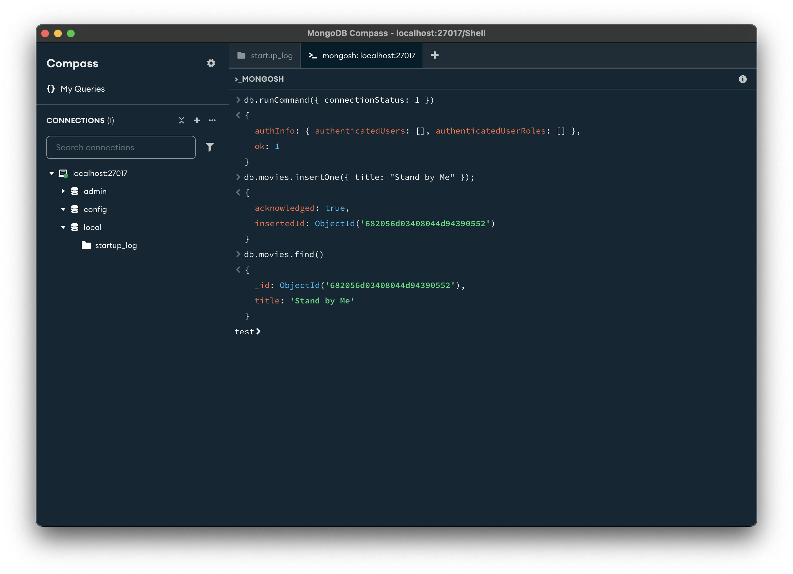
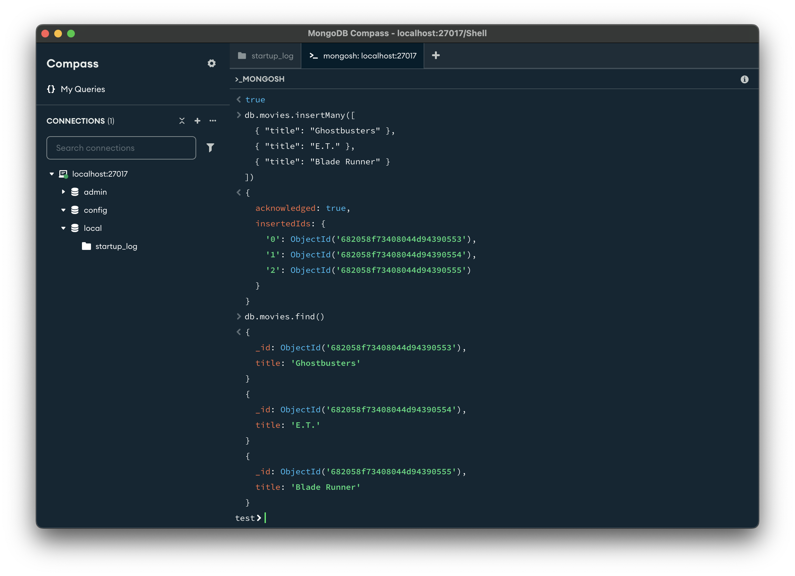
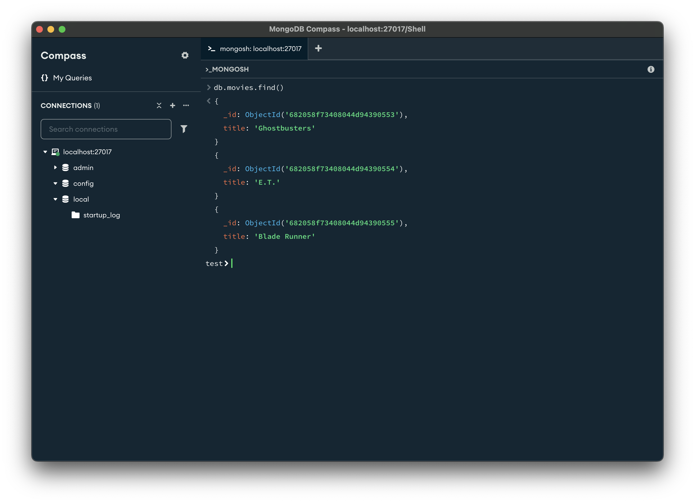
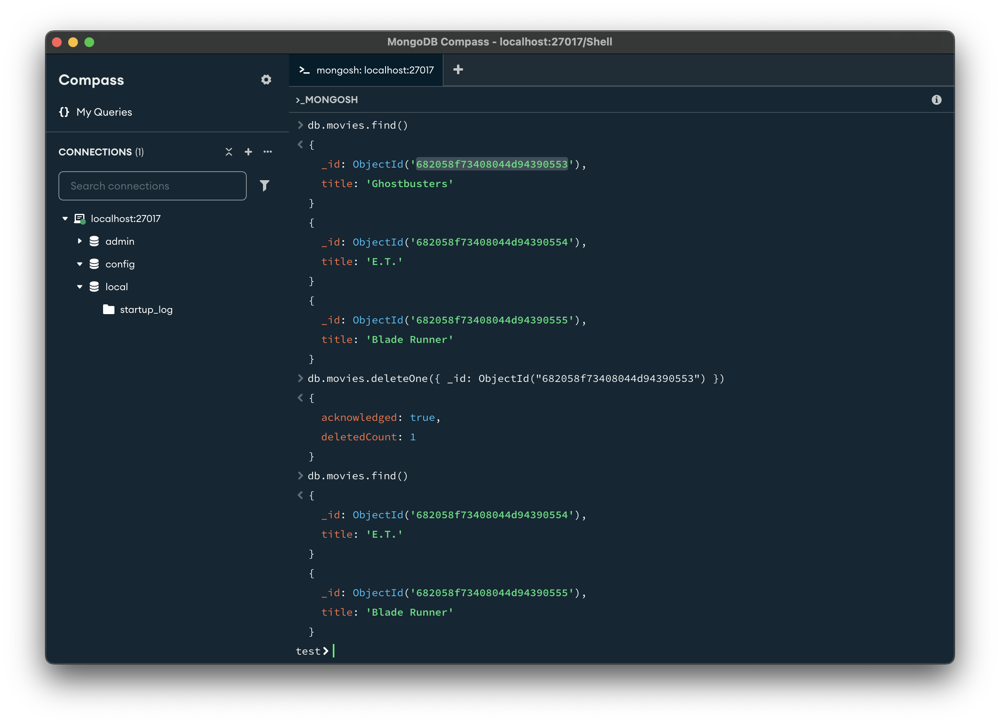

# Создание, редактирование и удаление данных. Индексы

## Создание документов в MongoDB

Работа с базой данных начинается с вставки (insert). В MongoDB для этого используются методы `insertOne` и `insertMany`.

### `insertOne` — вставка одного документа

Чтобы добавить один документ в коллекцию, используйте insertOne. Если вы не укажете \_id, MongoDB сгенерирует его автоматически:

```js
db.movies.insertOne({ title: "Stand by Me" });
```



В результате документ попадёт в коллекцию movies, а поле `_id` будет создано автоматически.

После выполнения можно проверить:

```js
db.movies.find();
```

### `insertMany` — массовая вставка

Если нужно вставить несколько документов сразу, используйте `insertMany`. Это быстрее и эффективнее, чем вставлять документы по одному:

```js
db.movies.drop(); // Очистим коллекцию перед вставкой

db.movies.insertMany([{ title: "Ghostbusters" }, { title: "E.T." }, { title: "Blade Runner" }]);
```

После выполнения можно проверить:

```js
db.movies.find();
```



> [!CAUTION] Внимание
> В MongoDB максимальный размер одного запроса — 48 МБ. Если массив слишком большой, драйвер может разделить его на части.

### Проверка вставки документов

MongoDB выполняет минимальную проверку данных при вставке. Она гарантирует, что:

- документ имеет корректную BSON-структуру,
- его размер не превышает 16 мегабайт,
- поле `_id` будет добавлено, если отсутствует.

Это означает, что база данных доверяет тому, что вы вставляете, — и именно поэтому важно ограничивать доступ к MongoDB только надежным клиентам, таким как сервер вашего приложения.

### Ограничение по размеру: 16 МБ

Один документ в MongoDB не может превышать 16 мегабайт. Это ограничение введено для предотвращения неэффективного проектирования (например, когда вы пытаетесь засунуть слишком много связанных данных в один документ).
Для сравнения: весь текст «Войны и мира» занимает примерно 3.14 МБ — это менее четверти допустимого размера одного документа.

### Возможность вставить «неправильные» данные

Так как проверка минимальна, MongoDB позволяет вставить логически некорректные данные (например, странные поля, несовместимые структуры и т.д.). Поэтому всегда следует:

- проверять данные на уровне приложения;
- не давать прямой доступ к БД сторонним клиентам;
- использовать валидацию схем JSON при необходимости.

## Удаление документов

MongoDB предлагает два метода:

- `deleteOne()` — удаляет только один документ, соответствующий фильтру;
- `deleteMany()` — удаляет все документы, соответствующие фильтру.

Оба метода принимают фильтр в виде JSON-объекта, аналогично `find()`.

### `deleteOne`

Удалим один документ по `_id`:

```js
db.movies.find();
```



Удалим по `_id` и сразу проверим результата.

> [!CAUTION] Внимание
> Идентификатор документа не будет совпадать с указанным здесь!

```js
db.movies.deleteOne({ _id: ObjectId("682058f73408044d94390553") });

db.movies.find();
```



> [!CAUTION] Внимание
> Если фильтр соответствует нескольким документам, `deleteOne()` удалит первый попавшийся. Этот выбор зависит от порядка вставки, индексов и других факторов.

### `deleteMany`

В отличии от `deleteOne()`, который удаляет первый попавшийся документ, `deleteMany` удаляет все документы, соответствующие фильтру.

Чтобы удалить все документы, используйте `deleteMany()` с пустым фильтром:

```js
db.movies.deleteMany({});
```

## Обновление документов

После того как документ сохранён в базе данных, его можно изменить с помощью одного из нескольких методов: `updateOne`, `updateMany` и `replaceOne`.

Методы `updateOne` и `updateMany` принимают в качестве первого параметра фильтр — документ, задающий критерии поиска, и в качестве второго параметра — модификатор, описывающий, какие изменения нужно внести в найденные документы.

Метод `replaceOne` также принимает фильтр как первый параметр, но в отличие от других методов, в качестве второго параметра ожидает полный документ, который заменит существующий.

Обновление документа в MongoDB происходит атомарно: если два обновления выполняются одновременно, сначала будет применено то, которое первым дошло до сервера, затем второе. Это означает, что можно безопасно отправлять конфликтующие обновления подряд, не опасаясь повреждения данных — последнее обновление «победит».

Если вам не подходит поведение «последнее изменение перезаписывает всё», стоит рассмотреть использование шаблона версионности документов.

### Замена документа

Метод `replaceOne` используется в MongoDB для полной замены одного документа новым. Это особенно полезно при существенных изменениях структуры, например, при миграции схемы. Вместо поэтапного обновления отдельных полей можно просто заменить старый документ новым, сохранив при этом `_id`.

Рассмотрим такой пример. Допустим, у нас есть коллекция `profiles`, в которой документы выглядят так:

```js
db.profiles.insertMany([
  {
    _id: 1001,
    name: "alex",
    age: 30,
    city: "Moscow",
    hobbies_count: 5,
    followers_count: 200,
  },
  {
    _id: 1002,
    name: "kate",
    age: 25,
    city: "Berlin",
    hobbies_count: 3,
    followers_count: 120,
  },
]);
```

Теперь допустим, мы хотим изменить структуру: убрать поля `name`, `hobbies_count`, `followers_count` и вместо них добавить `username` и вложенный поддокумент `stats`. Это делается одной командой `replaceOne`:

```js
db.profiles.replaceOne(
  { _id: 1001 },
  {
    age: 30,
    city: "Moscow",
    username: "alex",
    stats: {
      hobbies: 5,
      followers: 200,
    },
  }
);
```
