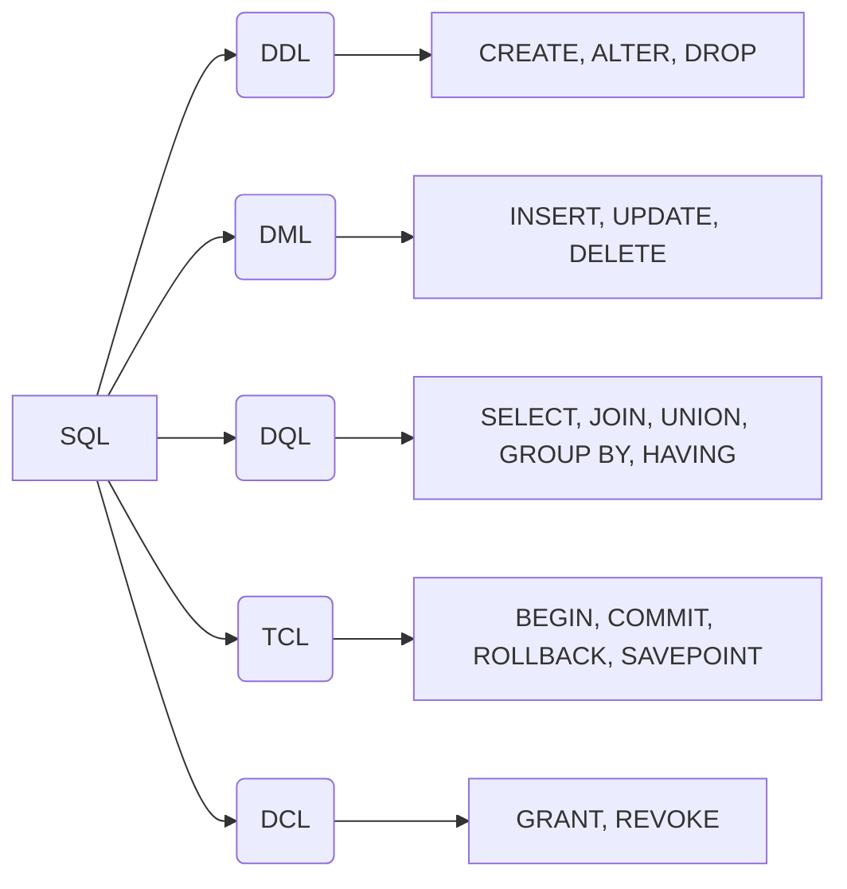

<script setup>
import Conversation from "../../../../components/Conversation.vue";
import alexey from "../../../assets/databases/heroes/clerk_alexey.png";
import ivan from "../../../assets/databases/heroes/clerk_ivan.png";
import petr from "../../../assets/databases/heroes/petr.png";
import { defineAsyncComponent } from "vue";

const Repl = defineAsyncComponent(() => import("../../../../components/Repl.vue"))

</script>

# Простой запрос. Использование выражений в запросе

## Введение

1682 год. В России скончался царь Фёдор III Алексеевич, старший сын царя Алексея Михайловича. Его смерть вызвала серьёзный политический кризис и борьбу за власть между двумя влиятельными родами — Милославскими и Нарышкиными.

Милославские поддерживали старшего брата Фёдора — Ивана Алексеевича, а Нарышкины — младшего, Петра Алексеевича. В Москве вспыхнул Стрелецкий бунт, в ходе которого стрельцы открыто поддержали Ивана, выступая против усиления влияния Петра и Нарышкиных.

В итоге была достигнута политическая компромиссная договорённость: власть была разделена между двумя царями — Иваном V и Петром I, при этом фактически сосредоточилась в руках их сестры Софьи Алексеевны, которая стала регентшей при малолетних царях.

В это время молодой Пётр жил в царской резиденции в селе Преображенском под Москвой. Там он начал формировать свои первые воинские части — Потешные полки, появившиеся примерно в 1683 году. Эти полки стали основой будущих реформ в армии и военной организации России.

Пётр увлекался европейскими военными новшествами и, вместе с друзьями, проводил военные учения, закладывая фундамент военной мощи будущей России.

1686 год. В нашей истории рядом с Петром находятся два дьяка (герои вымышленные).


- Дьяк Алексей — опытный государственный служащий, помощник Петра в административных делах.
- Дьяк Иван — молодой помощник Алексея, которому поручают вести учёт и составлять отчёты.
  Они оба работают в царской администрации, где ведётся учёт воинских подразделений и других данных.

<Conversation :phrases="[
    {
        name: 'Петр',
        position: 'left',
        text: 'Алексей, надобно мне ведомость полков Потешных — кто командует, где стоят, сколь воинов в каждом. Пусть Иван составит полную таблицу',
        photo: petr
    },
    {
        name: 'Алексей',
        position: 'right',
        text: 'Будет исполнено, государь. Иван, приготовь список полков с полной информацией.',
        photo: alexey
    },
    {
        name: 'Иван',
        position: 'left',
        text: 'Господин мой, как выбрать все данные из таблицы?',
        photo: ivan
    }
]"/>

## Немного про SQL

**SQL (Structured Query Language)** — это язык программирования, предназначенный для управления и работы с реляционными базами данных. Он позволяет создавать, изменять и получать данные из таблиц, которые хранят информацию в виде строк и столбцов.

SQL, являясь языком для управления базами данных, позволяет создавать настоящие программы, состоящие из последовательности SQL-команд (запросов), разделённых точкой с запятой. Эти команды определяют, какие данные необходимо извлечь или какие действия следует выполнить с информацией: добавить, изменить или удалить.

SQL — это декларативный язык. Используя SQL-запросы, пользователь указывает базе данных, что именно он хочет получить. Запрос направляется в СУБД, которая отвечает за его выполнение.

Запросы могут быть разными: создание или изменение структуры данных, модификация данных, выборка информации и многое другое. В зависимости от цели, каждый запрос относится к определенному разделу языка.

Все SQL-запросы делятся на категории по типу взаимодействия с данными. Понимание этой классификации полезно при разработке и администрировании баз данных. Классификация помогает структурировать знания об SQL, а общая терминология упрощает взаимодействие между разработчиками и другими специалистами.

SQL широко используется в бизнесе, науке, веб-разработке, аналитике и многих других областях, где необходима работа с большими объёмами данных.

## Подмножества SQL



### DDL — Data Definition Language (Язык определения данных)

DDL — язык описания данных. Команды DDL позволяют создавать, изменять и удалять объекты баз данных.

Основные операторы DDL:

- `CREATE` — создаёт новые базы данных, схемы, таблицы и другие объекты базы данных.
- `ALTER` — изменяет объекты БД. Например, в таблицах этот оператор может добавлять и удалять столбцы, а также изменять их тип.
- `DROP` — удаляет любые объекты БД, в том числе саму базу. **Осторожнее с этим оператором:** если у вас нет резервной копии, восстановить данные после удаления не получится.

### DML — Data Manipulation Language (Язык манипулирования данными)

DML — язык манипулирования данными. Команды DML позволяют изменять данные, хранящиеся в таблицах.

Основные операторы DML:

- `INSERT` — вставляет новые строки данных в таблицу.
- `UPDATE` — обновляет существующие данные в таблице.
- `DELETE` — удаляет строки данных из таблицы.

### DQL — Data Query Language (Язык запроса данных)

DQL — язык запроса данных. Команды DQL позволяют извлекать данные из базы. В некоторых версиях классификации SQL этот раздел объединяют с DML, но мы выделим его в отдельную категорию. Потому что команды DQL лишь извлекают данные и позволяют по-разному их отображать, но не изменяют данные.

Основные операторы DQL:

- `SELECT` — извлекает данные из базы.
- `JOIN`, `UNION`, `GROUP BY`, `HAVING` и другие — выполняют сложные запросы.

### TCL — Transaction Control Language (Язык управления транзакциями)

TCL — язык управления транзакциями.

Основные операторы TCL:

- `COMMIT` — подтверждает текущую транзакцию и сохраняет изменения в базе данных.
- `ROLLBACK` — откатывает текущую транзакцию и отменяет все несохранённые изменения.
- `SAVEPOINT` — создаёт точку сохранения в текущей транзакции для возможности частичного отката.

### DCL — Data Control Language (Язык управления доступом к данным)

DCL — язык управления доступа к данным.

Основные операторы DCL:

- `GRANT` — предоставляет права доступа к БД и её объектам.
- `REVOKE` — отзывает права доступа.

## Структура и стиль SQL-запросов

SQL-запрос состоит из нескольких ключевых элементов:

- **Ключевые слова**: Зарезервированные слова с определенным функционалом (например, `SELECT`, `WHERE`, `UPDATE`, `SET`). Разные диалекты SQL могут иметь свои уникальные ключевые слова.
- **Идентификаторы**: Имена объектов базы данных, таких как таблицы и столбцы (например, `name`, `surname`, `birth_date`).
- **Константы**: Числовые или строковые значения (например, оценка `5`, фамилия `Исаев`).
- **Специальные символы**: Символы, используемые в запросах, такие как `*`, `(`, `)`, `,`, `;`.

Ключевые слова иногда называют операторами (например, `SELECT`, `UPDATE`), в то время как `SET` чаще называют инструкцией или выражением. Операторы также включают символы или слова, определяющие действия над выражениями (например, `>`, `<`, `=`, `OR`, `AND`).

В данном курсе мы будем преимущественно использовать термин "ключевое слово" для большей ясности.

Состав необходимой структуры запроса определяется его синтаксисом. Например, запрос `UPDATE` требует наличия инструкции `SET`, а для `INSERT` существует несколько вариантов написания.

Регистр символов в большинстве диалектов SQL, включая PostgreSQL, обычно не имеет значения (например, `uPDaTE sOme_TaBle SeT coluMN = 2;` будет работать). Однако, рекомендуется писать ключевые слова заглавными буквами, а идентификаторы - строчными, для улучшения читаемости кода.

::: details Когда важен регистр символов в SQL

В общем случае, SQL не чувствителен к регистру символов. Однако, существуют ситуации, когда регистр необходимо учитывать. Если в базе данных имена столбцов или таблиц содержат заглавные буквы (что не рекомендуется), то в SQL-запросе эти имена необходимо заключать в двойные кавычки и строго соблюдать регистр.

Например, в PostgreSQL `Name` и `name` — это два разных идентификатора. Можно создать таблицу с двумя такими столбцами и хранить в них разные данные. В этом случае запрос `SELECT Name FROM table;` вернёт данные из столбца `name`, так как по умолчанию SQL не учитывает регистр. Чтобы обратиться к столбцу `Name`, необходимо указать его имя в двойных кавычках: `SELECT "Name" FROM table;`.
:::

## Комментарии в SQL

Программисты часто комментируют свой код для пояснения логики или временного исключения участков кода (хотя и не все!). SQL также предоставляет такую возможность.

### Однострочные комментарии

Для добавления однострочного комментария в SQL используются два минуса (`--`). Всё, что следует после `--` в той же строке, будет проигнорировано при выполнении запроса. Например:

```sql
SELECT * FROM users; -- Получить всех пользователей
```

### Многострочные комментарии

Для добавления многострочного комментария используются символы `/*` в начале комментария и символы `*/` в конце. Всё, что находится между `/*` и `*/`, будет проигнорировано. Например:

```sql
/*
Этот запрос выбирает все данные из таблицы users.
Он используется для получения списка всех зарегистрированных пользователей.
*/
SELECT * FROM users;
```

## Команда `SELECT`

<Conversation :phrases="[
      {
          name: 'Иван',
          position: 'left',
          text: 'Алексей, как же выбрать все данные из таблицы?',
          photo: ivan
      },
      {
          name: 'Алексей',
          position: 'right',
          text: 'Просто, Иван! Сейчас расскажу',
          photo: alexey
      }
  ]"/>

В рамках текущего занятия мы будем работать с таблицей, содержащей информацию о Потешных полках — воинских формированиях эпохи Петра I. Эта таблица поможет нам освоить основные приемы выборки данных с помощью SQL.

| id  | name      | surname    | birth_date | location        | soldiers_count | is_historical |
| --- | --------- | ---------- | ---------- | --------------- | -------------- | ------------- |
| 1   | Сергей    | Бухвостов  | 1659-01-01 | Преображенское  | 1200           | true          |
| 2   | Александр | Меншиков   | 1673-11-16 | Семёновское     | 1100           | true          |
| 3   | Патрик    | Гордон     | 1635-03-31 | Измайлово       | 900            | true          |
| 4   | Фёдор     | Матвеевич  | 1661-12-07 | Москва          | 800            | true          |
| 5   | Иван      | Кантемир   | 1668-01-05 | Новгород        | 700            | false         |
| 6   | Иван      | Шереметев  | 1670-07-22 | Санкт-Петербург | 650            | false         |
| 7   | Михаил    | Голицын    | 1675-04-30 | Москва          | 600            | false         |
| 8   | Василий   | Долгорукий | 1662-12-12 | Тула            | 550            | false         |
| 9   | Дмитрий   | Трубецкой  | 1678-05-18 | Ярославль       | 500            | false         |
| 10  | Андрей    | Воронцов   | 1672-10-25 | Санкт-Петербург | 450            | false         |
| 11  | Николай   | Репнин     | 1676-08-14 | Москва          | 400            | false         |
| 12  | Иван      | Романов    | 1669-03-03 | Санкт-Петербург | 380            | false         |
| 13  | Алексей   | Орлов      | 1674-11-21 | Новгород        | 360            | false         |
| 14  | Дмитрий   | Волконский | 1667-06-11 | Тверь           | 340            | false         |
| 15  | Сергей    | Романов    | 1671-02-28 | Москва          | 320            | false         |
| 16  | Пётр      | Козлов     | 1679-09-07 | Санкт-Петербург | 300            | false         |
| 17  | Иван      | Ширинский  | 1673-05-15 | Ярославль       | 280            | false         |
| 18  | Михаил    | Кутузов    | 1670-12-01 | Москва          | 260            | false         |
| 19  | Алексей   | Лопухин    | 1666-07-19 | Новгород        | 240            | false         |
| 20  | Василий   | Трубецкой  | 1677-04-22 | Санкт-Петербург | 220            | false         |

Таблица состоит из 20 строк и следующих столбцов:

- `id` — уникальный идентификатор записи (первичный ключ).

- `name` — имя командира полка.

- `surname` — фамилия командира полка.

- `birth_date` — дата рождения командира в формате ГГГГ-ММ-ДД.

- `location` — место расположения соответствующего Потешного полка.

- `soldiers_count` — численность солдат в полку.

- `is_historical` — признак, указывающий, является ли полк реальным историческим подразделением («Да») или вымышленным для учебных целей («Вымышленный»).

Используя эту таблицу, мы будем практиковаться в составлении SQL-запросов для выборки и преобразования данных.

<Repl :initial-queries="[
`CREATE TABLE poteshnye_polki (
    id SERIAL PRIMARY KEY,
    name VARCHAR(255),
    surname VARCHAR(255),
    birth_date DATE,
    location VARCHAR(255),
    soldiers_count INTEGER,
    is_historical BOOLEAN
);`,
`INSERT INTO poteshnye_polki (name, surname, birth_date, location, soldiers_count, is_historical) VALUES
('Сергей', 'Бухвостов', '1659-01-01', 'Преображенское', 1200, TRUE),
('Александр', 'Меншиков', '1673-11-16', 'Семёновское', 1100, TRUE),
('Патрик', 'Гордон', '1635-03-31', 'Измайлово', 900, TRUE),
('Фёдор', 'Матвеевич', '1661-12-07', 'Москва', 800, TRUE),
('Иван', 'Кантемир', '1668-01-05', 'Новгород', 700, FALSE),
('Иван', 'Шереметев', '1670-07-22', 'Санкт-Петербург', 650, FALSE),
('Михаил', 'Голицын', '1675-04-30', 'Москва', 600, FALSE),
('Василий', 'Долгорукий', '1662-12-12', 'Тула', 550, FALSE),
('Дмитрий', 'Трубецкой', '1678-05-18', 'Ярославль', 500, FALSE),
('Андрей', 'Воронцов', '1672-10-25', 'Санкт-Петербург', 450, FALSE),
('Николай', 'Репнин', '1676-08-14', 'Москва', 400, FALSE),
('Иван', 'Романов', '1669-03-03', 'Санкт-Петербург', 380, FALSE),
('Алексей', 'Орлов', '1674-11-21', 'Новгород', 360, FALSE),
('Дмитрий', 'Волконский', '1667-06-11', 'Тверь', 340, FALSE),
('Сергей', 'Романов', '1671-02-28', 'Москва', 320, FALSE),
('Пётр', 'Козлов', '1679-09-07', 'Санкт-Петербург', 300, FALSE),
('Иван', 'Ширинский', '1673-05-15', 'Ярославль', 280, FALSE),
('Михаил', 'Кутузов', '1670-12-01', 'Москва', 260, FALSE),
('Алексей', 'Лопухин', '1666-07-19', 'Новгород', 240, FALSE),
('Василий', 'Трубецкой', '1677-04-22', 'Санкт-Петербург', 220, FALSE);`
]"/>

Начнем с базового синтаксиса.

```sql
SELECT <столбцы или *> FROM <таблица>;
```

После ключевого слова `SELECT` нужно указать либо столбцы, либо символ `*`. Например:

```sql
SELECT * FROM poteshnye_polki;
```

Этот запрос выбирает все строки и все столбцы из таблицы. Это удобно, когда нужно быстро получить полную информацию.
Однако при больших таблицах это может привести к избыточному объёму данных и нагрузке на систему.

::: details Важность указания столбцов в запросах (Best Practices)
При работе с SQL, особенно в составе программ, рекомендуется придерживаться хорошей практики — явно указывать список столбцов в запросах `SELECT`.

```sql
SELECT column1, column2, column3 FROM table_name;
```

Почему это важно?

- Производительность: Запрос `SELECT *` возвращает все столбцы таблицы, даже если вам нужны только некоторые из них. Это увеличивает объем передаваемых данных, что может замедлить работу приложения, особенно при работе с большими таблицами или по сети. Явное указание нужных столбцов снижает нагрузку на сервер базы данных и сеть.

- Явность и читаемость: Запрос с перечислением столбцов более понятен. Читая код, сразу видно, какие именно данные запрашиваются.

- Устойчивость к изменениям схемы: Если в таблицу добавят новые столбцы, запрос `SELECT *` начнет возвращать и их. Это может нарушить логику приложения, если оно не рассчитано на новые данные. Явное указание столбцов гарантирует, что будут получены только ожидаемые данные.

Однако, в некоторых ситуациях использование `SELECT *` оправдано:

- Быстрые прототипы и эксперименты: При разработке или анализе данных может быть удобно быстро просмотреть все столбцы таблицы, чтобы понять ее структуру и содержимое.

- Одноразовые запросы: Если запрос выполняется вручную для получения какой-то информации, нет смысла тратить время на перечисление столбцов.

- Инструменты для анализа данных: Некоторые инструменты для работы с данными автоматически обрабатывают все столбцы таблицы, и в этом случае `SELECT *` может быть оптимальным решением.

Выбор между `SELECT *` и явным перечислением столбцов зависит от конкретной ситуации. В программном коде, который должен быть производительным и устойчивым к изменениям, лучше указывать столбцы явно. При быстрых исследованиях и одноразовых запросах `SELECT *` может быть удобнее.

:::

```sql
SELECT name, surname FROM poteshnye_polki;
```

Так мы выберем все строки из таблицы `poteshnye_polki`, но только столбцы `name` и `surname`.

<Conversation :phrases="[
    {
        name: 'Петр',
        position: 'left',
        text: 'Иван, мне достаточно знать имя и фамилию командира в одном столбце и сколько воинов в полку, но с прибавкой 100 новых рекрутов.',
        photo: petr
    },
    {
        name: 'Иван',
        position: 'right',
        text: 'Значит, нужно выбрать имя и фамилию вместе и прибавить 100 к числу солдат?',
        photo: ivan
    },
    {
        name: 'Алексей',
        position: 'left',
        text: 'Верно, Иван. SQL умеет делать арифметику и объединять строки.',
        photo: alexey
    }
]"/>

В SQL можно создавать вычисляемые столбцы, используя арифметические операции: `+`, `-`, `*`, `/` и пр.

```sql
SELECT name, surname, soldiers_count, soldiers_count + 100
FROM poteshnye_polki;
```

Здесь прибавляем 100 рекрутов к числу солдат.

В PostgreSQL строки объединяются оператором ||:

```sql
SELECT name || ' ' || surname, location FROM poteshnye_polki;
```

Можно также и комбинировать:

```sql
SELECT name || ' ' || surname, soldiers_count + 100 FROM poteshnye_polki;
```

<Conversation :phrases="[
    {
        name: 'Иван',
        position: 'right',
        text: 'Алексей, а если в таблице несколько одинаковых записей, как убрать повторы?',
        photo: ivan
    },
    {
        name: 'Алексей',
        position: 'left',
        text: 'Для этого есть ключевое слово DISTINCT. Оно удаляет дубликаты.',
        photo: alexey
    }
]"/>

`DISTINCT` — оператор, который возвращает только уникальные строки по выбранным столбцам.

В теории реляционной алгебры операция, аналогичная `SELECT`, называется проекцией. Она выбирает из таблицы только указанные столбцы и удаляет дубликаты — то есть в результате остаются только уникальные строки.

В SQL по умолчанию дубликаты не удаляются. Чтобы получить уникальные строки, нужно использовать ключевое слово `DISTINCT`.

Так можно выбрать все уникальные имена из таблицы:

```sql
SELECT DISTINCT name, location FROM poteshnye_polki;
```

А вот пример выбора уникальных сочетаний имени и места:

```sql
SELECT DISTINCT name, location FROM poteshnye_polki;
```

PostgreSQL расширяет стандарт SQL и позволяет выбирать уникальные строки по одному или нескольким столбцам с помощью `DISTINCT ON`. Это полезно, когда нужно получить по одной записи на каждое уникальное значение, сохраняя остальные столбцы.

Допустим, нужно получить по одной записи для каждого уникального значения в столбце `is_historical` (то есть выбрать по одному полку для исторических и вымышленных):

```sql
SELECT DISTINCT ON (is_historical) id, name, surname, location, is_historical
FROM poteshnye_polki;
```

Здесь мы берем по одной записи для каждого значения колонки is_historical. Поскольку сортировка не задана, выборка может быть произвольной записи для каждой группы. Запросы с `DISTINCT ON` чаще делают совместно с сортировкой.

## Оператор `CASE WHEN`

В SQL часто требуется не просто получить данные, но и представить их в удобном для анализа виде. Для этого используют условный оператор `CASE WHEN`.

С помощью `CASE WHEN` можно создавать вычисляемые столбцы, значения которых зависят от заданных условий. Это позволяет категоризировать данные, преобразовывать значения и делать выборки более информативными.

```sql
CASE
    WHEN <условие 1> THEN <результат в случае, если условие 1 верно>
    WHEN <условие 2> THEN <результат в случае, если условие 2 верно>
--  ...
    WHEN <условие n> THEN <результат в случае, если условие n верно>
--  опционально
    ELSE <результат в случае, если ни одно из условий не верно>
END;
```

В операторе `CASE WHEN` условия проверяются последовательно, в том порядке, в котором они указаны. Как только одно из условий оказывается истинным, оператор возвращает соответствующее этому условию значение, и дальнейшие условия уже не проверяются.

Использование ключевого слова `ELSE` в операторе `CASE WHEN` необязательно. Если ни одно из условий `WHEN` не выполнено и при этом отсутствует блок `ELSE`, то результатом оператора будет значение `NULL`.

<Conversation :phrases="[
    {
        name: 'Иван',
        position: 'left',
        text: 'Алексей, а можно в запросе добавить условие, чтобы, например, если солдат больше 1000, писать «Большой полк», а иначе — «Малый»?',
        photo: ivan
    },
    {
        name: 'Алексей',
        position: 'right',
        text: 'Конечно! Для этого есть конструкция CASE WHEN.',
        photo: alexey
    }
]"/>

```sql
SELECT name || ' ' || surname,
       soldiers_count,
       CASE
         WHEN soldiers_count > 1000 THEN 'Большой полк'
         ELSE 'Малый полк'
       END
FROM poteshnye_polki;
```

В этом примере создаётся столбец, который принимает значение `Большой полк`, если численность солдат превышает `1000`, и `Малый полк` в противном случае.

## Псевдонимы

Псевдоним — это альтернативное имя, которое можно присвоить столбцу данных, выбранному из таблицы или сформированному в результате вычисления. Для назначения псевдонима используется ключевое слово `AS` либо просто указывается новое имя после названия столбца или выражения через пробел. Это помогает сделать вывод более понятным и удобочитаемым.

<Conversation :phrases="[
    {
        name: 'Петр',
        position: 'left',
        text: 'Алексей, ведомость давайте с названиями столбцов на русском, чтобы легче было читать.',
        photo: petr
    }
]"/>

```sql
SELECT name || ' ' || surname AS "ФИО командира", soldiers_count + 100 AS "Число воинов"
FROM poteshnye_polki;
```

В этом примере колонка, которая получилась путем конкатенации `name` и `surname` получила название `"ФИО командира"`, а колонка арифметической операцией - `"Число воинов"`.

В SQL псевдонимы можно присваивать не только столбцам, но и таблицам. Синтаксис остается тем же: используется ключевое слово `AS` или просто добавляется псевдоним после названия таблицы через пробел.

```sql
SELECT name, location FROM poteshnye_polki pp;

-- псевдоним таблицы можно использовать как префикс к имени столбца
SELECT pp.name, pp.location FROM poteshnye_polki pp;
```

Псевдонимы для таблиц часто используются для сокращения длинных имен, но особенно полезны в сложных запросах, которые обращаются к нескольким таблицам. Такие запросы будут рассмотрены в следующих уроках.

В приведенном примере `pp` — это псевдоним для таблицы `poteshnye_polki`. После присвоения псевдонима, можно использовать `pp.name` вместо `poteshnye_polki.name` для обращения к столбцу name.

## Использование SELECT для вычислений

Как вы уже знаете, команда `SELECT ... FROM ...;` позволяет извлекать данные из таблиц. Но возможности `SELECT` этим не ограничиваются.

В PostgreSQL (и некоторых других СУБД) команду `SELECT` можно использовать как простой калькулятор. Ключевое слово `FROM` при этом не является обязательным. Это не самый эффективный способ использования базы данных, но полезно знать о такой возможности. Также с помощью `SELECT` вызываются функции.

```sql
SELECT 2 + 2; -- Вычисляет 2 + 2
SELECT sqrt(16); -- Вычисляет квадратный корень из 16
SELECT now(); -- Возвращает текущую дату и время
SELECT upper('hello'); -- Преобразует строку в верхний регистр
```

## Преобразование типов данных (`CAST`)


При использовании команды `SELECT` ранее, возможно, вы не задумывались о типах данных в столбцах результирующей выборки. Если внутри запроса `SELECT` не выполнять никаких преобразований, то тип данных в результирующем наборе совпадет с типом данных столбца, из которого были выбраны данные. Это естественно, и чаще всего это именно то, что нам и нужно.

Однако, иногда возникает необходимость изменить тип выгружаемых данных, используя числовые выражения.

<Conversation :phrases="[
  {
    name: 'Петр',
    position: 'left',
    text: 'Алексей, хочу знать, насколько хорошо укомплектован каждый полк! Сделай мне ведомость.',
    photo: petr,
  },
  {
    name: 'Алексей',
    position: 'right',
    text: 'Будет исполнено, государь! Но как быть, если максимальная численность полка нам известна, а количество солдат — целое число?',
    photo: alexey,
  },
  {
    name: 'Иван',
    position: 'left',
    text: 'Я знаю! Надо что-то с типами данных сделать, чтобы доля получилась!',
    photo: ivan,
  },
]"/>

Рассмотрим пример с нашими потешными полками. У нас есть столбец `soldiers_count` — количество солдат в полку. Допустим, мы хотим вычислить коэффициент, показывающий, насколько заполнен полк, зная, что максимальная численность полка — `1500` человек. Мы могли бы попытаться сделать это следующим образом:

```sql
SELECT
    name,
    soldiers_count,
    (soldiers_count / 1500) AS fill_rate
FROM
    poteshnye_polki;
```

Но результат может быть не совсем тем, как ожидалось: `fill_rate` будет равен `0`.

Почему так получилось? Дело в том, что столбец `soldiers_count` имеет тип `integer` (целое число). Когда PostgreSQL выполняет деление двух целых чисел, результат автоматически округляется до целого числа. В нашем случае, если количество солдат меньше `1500`, то доля будет меньше `1`, и результат округлится до `0`.

Чтобы получить более точный результат, необходимо привести хотя бы одно из чисел к типу `real` (число с плавающей точкой, либо любому другому типу чисел с плавающей точкой).

### Приведение типов с помощью `CAST`

Для преобразования значений одного типа в другой в PostgreSQL есть функция `CAST`. Её синтаксис:

```sql
CAST(<значение> AS <новый тип>)
```

Чтобы получить долю солдат в виде числа с плавающей точкой, мы можем изменить запрос следующим образом:

```sql
SELECT
    name,
    soldiers_count,
    (CAST(soldiers_count AS real) / 1500) AS fill_rate
FROM
    poteshnye_polki;
```

Приведение типов с помощью оператора `::` (двойное двоеточие):

В PostgreSQL вместо `CAST` можно использовать более короткий оператор `::`. Его синтаксис:

```sql
<значение>::<новый тип>
```

Запрос на вычисление коэффициента заполненности полка с использованием этого оператора будет выглядеть так:

```sql
SELECT
    name,
    soldiers_count,
    (soldiers_count::real / 1500) AS fill_rate
FROM
    poteshnye_polki;
```

Оба этих запроса возвращают результат в виде длинной дроби. Чтобы получить округленный результат, можно преобразовать данные к типу `numeric` — числу с заданной точностью. Например, `numeric(3, 2)` означает три цифры, две из которых находятся после десятичной точки:

```sql
SELECT
    name,
    soldiers_count,
    ((soldiers_count::real / 1500)::numeric(3, 2)) AS fill_rate
FROM
    poteshnye_polki;
```

Преобразование типов данных — важный инструмент в SQL, который позволяет получать более точные и удобные для анализа результаты. Используйте `CAST` или оператор `::`, когда необходимо изменить тип данных в запросе.

# Фильтрация данных. Поиск по шаблону

# Сортировка и группировка данных
